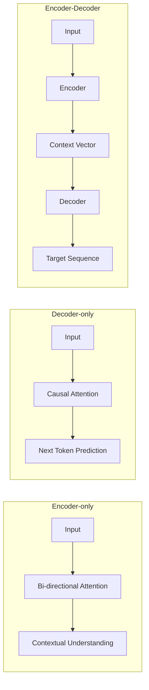

# Assignment 1: Transformer Architecture Analysis

## Objective
Apply your knowledge of Transformer architectures (Encoder-only, Decoder-only, and Encoder-Decoder) to solve real-world AI architecture problems.

---

## Prerequisites
Before starting this assignment, ensure you have:
- Completed **Lab 1: Transformer Architecture Mapping**.
- Read **Chapter 1: Transformer Architectures** in the textbook.
- Basic understanding of NLP tasks (Classification, Generation, Translation).

---

## 1. Conceptual Refresher
As a reminder, here is a brief summary of the architectures:

- **Encoder-only (e.g., BERT):** The "Understander". Uses bi-directional attention to see the whole sequence. Best for tasks where the context of the entire input is needed.
- **Decoder-only (e.g., GPT):** The "Generator". Uses causal (masked) attention to predict the next token. Best for generating coherent text.
- **Encoder-Decoder (e.g., T5):** The "Translator". Uses an encoder to understand the source and a decoder to generate the target. Best for sequence-to-sequence transformation.

### Visual Aid: The Flow of Information

---

## 2. Tasks

### Task 1: The AI Architect's Dilemma
You are the Lead AI Architect for a new startup. You have been presented with the following project requirements. For each, select the most appropriate architecture and provide a **detailed justification** (at least 3 sentences).

1. **Medical Entity Extraction:** The system must read a doctor's note and extract all medication names, dosages, and patient symptoms.
   - **Architecture:** 
   - **Justification:** 

2. **Automated Code Documentation:** The system takes a function written in Python and generates a human-readable docstring explaining what the function does.
   - **Architecture:** 
   - **Justification:** 

3. **Story Continuation Engine:** A creative writing tool where a user writes a paragraph, and the AI continues the story in the same style.
   - **Architecture:** 
   - **Justification:** 

4. **Legal Contract Summarization:** The system takes a 50-page contract and produces a 1-page executive summary.
   - **Architecture:** 
   - **Justification:** 

### Task 2: Comparative Analysis Table
Fill in the following table to compare the three architectures.

| Feature | Encoder-only | Decoder-only | Encoder-Decoder |
| :--- | :--- | :--- | :--- |
| **Attention Type** | | | |
| **Primary Goal** | | | |
| **Input/Output Ratio** | (e.g., 1:1, 1:Many) | | |
| **Best Use Case** | | | |

---

## 3. Submission Guidelines
- Submit your answers in a Markdown file.
- Include the mermaid diagrams if you modify them to better illustrate your justifications.
- Ensure your justifications reference the "Bi-directional" vs "Causal" nature of the attention mechanisms.