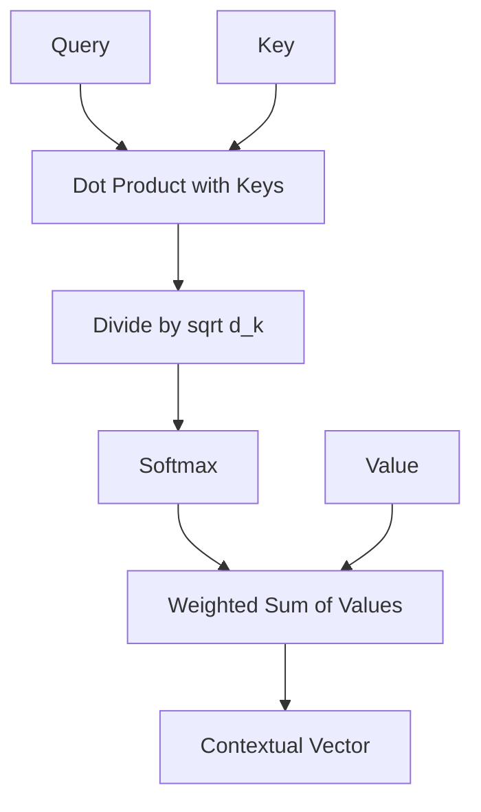

# Assignment 2: The Mechanics of Attention

## Objective
Demonstrate a deep mathematical and conceptual understanding of the Attention mechanism, specifically the Query-Key-Value (QKV) framework and the normalization process.

---

## Prerequisites
Before starting this assignment, ensure you have:
- Completed **Lab 2: Deconstructing the Attention Engine**.
- Read **Chapter 2: Attention Mechanisms** in the textbook.
- Basic knowledge of linear algebra (specifically dot products and vectors).

---

## 1. Conceptual Refresher
In a Transformer, **Attention** allows the model to weigh the importance of different tokens in a sequence.

### The QKV Framework
- **Query (Q):** "What I am looking for." (The current token's search criteria).
- **Key (K):** "What I contain." (The labels used to match against the query).
- **Value (V):** "The information I provide." (The actual content).

### The Attention Equation
The core calculation is:
$$\text{Attention}(Q, K, V) = \text{softmax}\left(\frac{QK^T}{\sqrt{d_k}}\right)V$$

**Why the $\sqrt{d_k}$?** 
As the dimensionality ($d_k$) of the keys increases, the dot product $QK^T$ can grow very large. This pushes the softmax function into regions where gradients are extremely small (the "vanishing gradient" problem), making the model hard to train. Dividing by $\sqrt{d_k}$ keeps the variance of the dot product near 1.

### Visual Flow

---

## 2. Tasks

### Task 1: Manual Attention Trace
You are given a simplified scenario with two tokens: **"Cloud"** and **"Compute"**. Calculate the attention vector for the token **"Cloud"**.

**Given Data:**
- **Query (Q) for "Cloud":** $[1, 2]$
- **Key (K) for "Cloud":** $[1, 2]$
- **Key (K) for "Compute":** $[2, 1]$
- **Value (V) for "Cloud":** $[10, 0]$
- **Value (V) for "Compute":** $[0, 20]$
- **Scaling Factor ($\sqrt{d_k}$):** Assume $\sqrt{d_k} = 2$.

**Required Steps:**
1. **Compute Raw Scores:** Calculate $Q \cdot K$ for both "Cloud" and "Compute".
2. **Scale the Scores:** Divide the raw scores by $\sqrt{d_k}$.
3. **Apply Softmax:** Convert the scaled scores into weights. (Use the formula: $\text{softmax}(x_i) = \frac{e^{x_i}}{\sum e^{x_j}}$).
4. **Calculate Final Vector:** Compute the weighted sum of the Values (V).

*Show all your work. Use a table to present the final weights.*

### Task 2: Analytical Reflection
Answer the following questions in detail:
1. What happens to the attention weights if the Query (Q) and a specific Key (K) are mathematically orthogonal (perpendicular)? Explain in terms of the dot product.
2. In a real-world LLM, we use **Multi-Head Attention** instead of a single attention head. Why is this beneficial? How does it relate to the "Specialist" analogy used in MoE?

---

## 3. Submission Guidelines
- Provide a step-by-step derivation for the manual trace.
- Use LaTeX for mathematical notation.
- Ensure your reflection answers are technically sound and reference the concepts of "dot product similarity" and "feature subspaces."