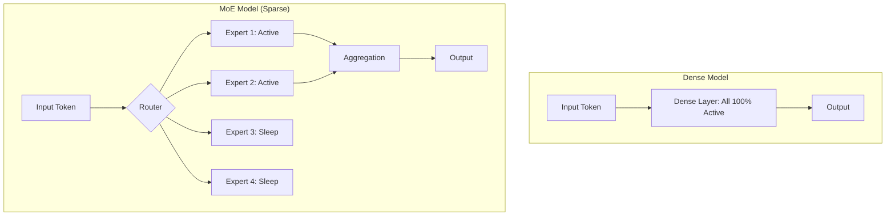

# Assignment 3: Scaling and Sparse Activation

## Objective
Analyze the relationship between model scale and performance, and design a sparse activation strategy using the Mixture of Experts (MoE) framework.

---

## Prerequisites
Before starting this assignment, ensure you have:
- Completed **Lab 3: Scaling and the Mixture of Experts (MoE)**.
- Read **Chapter 3: Scaling Laws and MoE** in the textbook.
- Basic understanding of computational complexity (Big O) and inference costs.

---

## 1. Conceptual Refresher
Modern LLMs are governed by **Scaling Laws**, which suggest that performance improves predictably as we increase Compute ($C$), Data ($D$), and Parameters ($N$).

### The Compute Wall
In a **Dense Model**, every parameter is used for every token. This creates a linear relationship between model size and the cost of inference. As models grow to trillions of parameters, the cost of running them (latency and energy) becomes unsustainable.

### The MoE Solution: Sparsity
**Mixture of Experts (MoE)** introduces **Sparsity**. Instead of one monolithic block, the model contains many "Experts." A **Router** decides which subset of experts to activate for a given token.

**Key Benefit:** We can increase the model's total capacity (total parameters) without increasing the "active" parameters per token, effectively bypassing the Compute Wall.

### Visual Aid: Dense vs. Sparse Activation

---

## 2. Tasks

### Task 1: Dense vs. Sparse Comparative Analysis
Analyze the following scenario:
You have two models, **Model A (Dense)** and **Model B (MoE)**. Both have a total of 1 Trillion parameters. However, Model B only activates 10% of its parameters per token.

Answer the following:
1. **Inference Cost:** Compare the FLOPs (Floating Point Operations) required per token for Model A vs. Model B. Which is more efficient, and by how much?
2. **Capacity vs. Compute:** If you wanted to increase the knowledge capacity of Model B without increasing the inference cost, how would you do it?
3. **Training Stability:** Why might a Sparse model be harder to train than a Dense model? (Hint: Think about "Expert Collapse" where the router only uses one expert).

### Task 2: Design a Specialized MoE Router
You are designing a **Medical-LLM**. To maximize accuracy, you decide to implement an MoE architecture with 8 experts.

**Your Task:**
1. **Define your Experts:** List 8 specific "Medical Specializations" for your experts (e.g., "Radiology Expert").
2. **Routing Logic:** Describe how the router should handle a token like *"The patient's MRI shows a lesion in the frontal lobe."* Which 2 experts should be activated, and why?
3. **Conflict Resolution:** If a token is ambiguous (e.g., *"Patient has a headache"*), how should the router distribute the weights between a "Neurology Expert" and a "General Practitioner Expert"?

---

## 3. Submission Guidelines
- Provide a technical report in Markdown.
- For Task 1, use mathematical notation to compare the compute costs.
- For Task 2, provide a clear mapping of token $\rightarrow$ expert $\rightarrow$ justification.