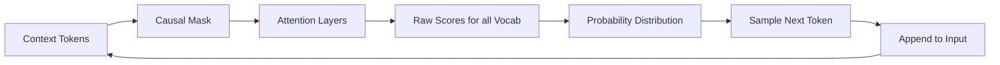

# Assignment 4: Causal Modeling and Prediction

## Objective
Analyze the mechanisms of Causal Language Modeling (CLM) and evaluate the impact of constraints (like the Causal Mask) on the learning process of a Base LLM.

---

## Prerequisites
Before starting this assignment, ensure you have:
- Completed **Lab 4: The Next-Token Prediction Game**.
- Read **Chapter 4: Causal Modeling** in the textbook.
- Basic understanding of probability distributions and sampling.

---

## 1. Conceptual Refresher
A **Base LLM** is essentially a high-dimensional probability engine. Its only goal is to predict the most likely next token given a preceding sequence.

### The Causal Mask
To ensure the model learns to predict based on *past* context and not by "cheating" (looking at the future tokens provided in the training data), we use a **Causal Mask**.

**The Masking Rule:**
At index $i$, the model can only attend to tokens at indices $j \le i$. Any token at $j > i$ is mathematically blocked (set to $-\infty$ before softmax).

### Base vs. Instruct Models
- **Base Model:** Predicts the next token. It is a "document completer."
- **Instruct Model:** A base model fine-tuned using Supervised Fine-Tuning (SFT) and Reinforcement Learning from Human Feedback (RLHF) to follow specific instructions.

### Visual Aid: The Prediction Loop

---

## 2. Tasks

### Task 1: Dataset Design for a Base Model
Imagine you are creating a training dataset for a Base LLM. You want the model to learn how to complete technical documentation for a new programming language called **"SvelteScript"**.

**Your Task:**
Create 5 "Completion Pairs" (Prompt $\rightarrow$ Target Token). For each pair, provide:
1. **The Prompt:** A snippet of text that logically leads to a specific next token.
2. **The Target Token:** The most likely next token.
3. **The "Distractor" Tokens:** Two other tokens that might be likely but are less accurate, and why the model might be confused between them.

*Example: Prompt: "To initialize a variable in SvelteScript, use the keyword..." $\rightarrow$ Target: "let" $\rightarrow$ Distractors: "var", "const".*

### Task 2: The "Mask-Off" Analysis
Suppose a developer accidentally removes the **Causal Mask** from the training process of a decoder-only model.

**Analyze the following:**
1. **Training Performance:** What would happen to the training loss (error rate) in the first few epochs? Would it drop faster or slower? Why?
2. **Inference Failure:** When you try to use this model for actual text generation (where future tokens don't exist yet), how would it perform? Why would the model fail to generate coherent text despite having a low training loss?
3. **The "Cheating" Effect:** Explain the mathematical difference between "learning to predict" and "learning to copy" in the context of the Causal Mask.

---

## 3. Submission Guidelines
- Provide your answers in a Markdown document.
- For Task 1, use a table format for the Completion Pairs.
- For Task 2, provide detailed technical explanations referencing "Information Leakage" and "Training-Inference Mismatch."