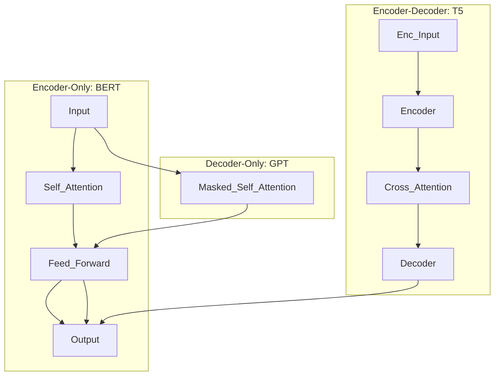
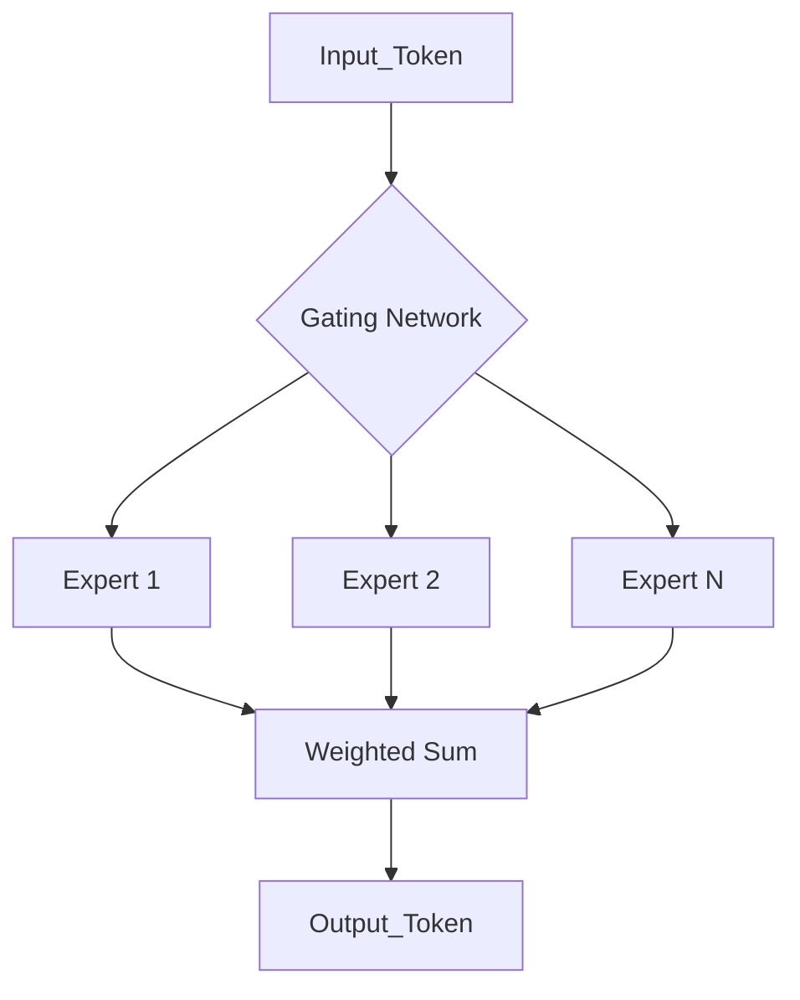

# Test 1: Foundations of Modern LLMs (Module 1, Part 1)

**Course:** CS601 - Advanced LLM Adaptation & Deployment  
**Topic:** Transformer Architectures, Attention, MoE, and Base Training  
**Total Marks:** 100  
**Duration:** 120 Minutes

---

## Section A: Architecture & Design (40 Marks)

### Question 1: Comparative Analysis of Transformers (20 Marks)
Compare and contrast Encoder-only, Decoder-only, and Encoder-Decoder architectures. 

**Requirements:**
- Describe the primary objective of each architecture.
- Explain the masking mechanism used in Decoder-only models.
- Provide a scenario where an Encoder-Decoder model would be superior to a Decoder-only model.
- Include a conceptual diagram illustrating the data flow of each.

**Conceptual Diagram Guide:**

### Question 2: The Mechanics of Attention (20 Marks)
Explain the mathematical and conceptual flow of Multi-Head Attention (MHA).

**Requirements:**
- Define the Query (Q), Key (K), and Value (V) vectors.
- Explain why "multi-head" attention is used instead of a single attention head.
- Derive the scaled dot-product attention formula and explain the purpose of the scaling factor ($\sqrt{d_k}$).
- Describe the complexity of attention relative to sequence length $N$.

---

## Section B: Scaling Laws & Mixture of Experts (30 Marks)

### Question 3: Scaling Laws & Model Capacity (15 Marks)
Discuss the relationship between compute, data, and model parameters as defined by LLM Scaling Laws.

**Requirements:**
- Explain the concept of "Compute-Optimal" training.
- Discuss the trade-off between increasing model size versus increasing training data.
- Describe how scaling laws help in predicting the loss of a model before training.

### Question 4: Mixture of Experts (MoE) & Routing (15 Marks)
Analyze the architecture of Sparse MoE models (e.g., Mixtral).

**Requirements:**
- Explain the difference between "Dense" and "Sparse" activations.
- Describe the role of the **Gating Network (Router)**.
- Provide a diagram illustrating how a token is routed to specific experts.

**Conceptual Diagram Guide:**

---

## Section C: Base Model Training (30 Marks)

### Question 5: Next-Token Prediction Objective (15 Marks)
Explain the training objective of a base LLM.

**Requirements:**
- Describe the Causal Language Modeling (CLM) objective.
- Explain the difference between "Pre-training" and "Fine-tuning" in terms of the objective function.
- Discuss the impact of the vocabulary size on the final softmax layer and computational cost.

### Question 6: Compute and Infrastructure (15 Marks)
Analyze the resource requirements for pre-training a large-scale base model.

**Requirements:**
- Explain the concept of VRAM limits and how they dictate batch size.
- Compare the memory usage of weights, gradients, and optimizer states.
- Discuss the role of parallelism (Data Parallelism vs. Model Parallelism) in scaling training.
