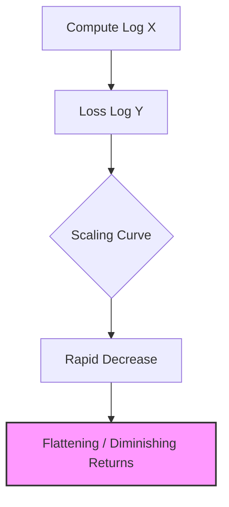
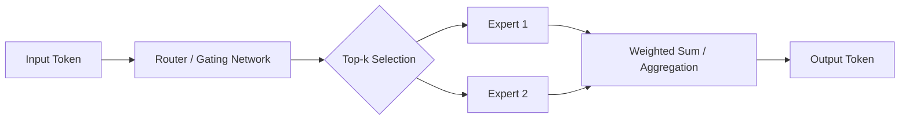
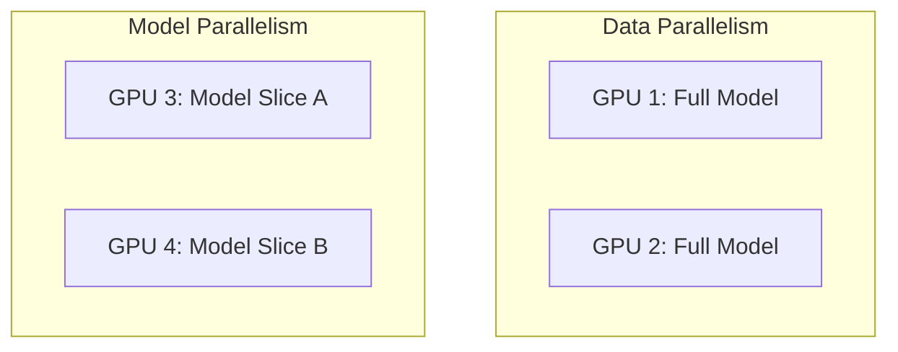

# Answer Sheet: Module 1, Part 2

This document provides the correct answers and detailed explanations for Test 1 and Quiz 1 of Module 1, Part 2.

---

## Part 1: Test 1 Answers

### Section 1: Scaling Laws & Compute

**Q1. Chinchilla Scaling Rule**
- **Answer:** The core intuition is that for a given compute budget, there is an optimal balance between the number of parameters ($N$) and the number of training tokens ($D$). 
- **Reasoning:** Training a larger model on fewer tokens often leads to under-training (the model hasn't seen enough data to utilize its capacity). Conversely, training a very small model on massive data leads to a "capacity bottleneck" where the model can no longer effectively compress the information. Chinchilla found that $D \approx 20N$ is the optimal point. Therefore, if compute is fixed, increasing $D$ while decreasing $N$ (within the $20 \times$ ratio) often results in a lower final loss.

**Q2. Compute Calculation**
1. **Token Calculation:**
   $C = 6ND$
   $5 \times 10^{23} = 6 \times (2 \times 10^9) \times D$
   $5 \times 10^{23} = 1.2 \times 10^{10} \times D$
   $D = (5 \times 10^{23}) / (1.2 \times 10^{10}) \approx 4.16 \times 10^{13}$ tokens.
2. **Optimality Check:**
   Chinchilla Optimal: $D_{opt} = 20 \times N = 20 \times (2 \times 10^9) = 4 \times 10^{10}$ tokens.
   Our $D$ ($4.16 \times 10^{13}$) is significantly higher than $D_{opt}$ ($4 \times 10^{10}$).
   **Conclusion:** The model is over-trained (compute-heavy). While this often leads to better performance, it is not "optimal" in terms of compute efficiency.

**Q3. Visualizing Scaling**
- **Axes:** X-axis = Compute (Log scale), Y-axis = Loss (Log scale).
- **Shape:** A power-law decay curve. Loss drops sharply at first and then flattens.
- **Diminishing Returns:** Occurs at the "knee" of the curve where additional compute leads to smaller and smaller reductions in loss.

---

### Section 2: Mixture of Experts (MoE)

**Q4. Sparse vs. Dense Architectures**
- **Dense:** Every token activates every parameter. High compute per token, but total model capacity is limited by the compute budget.
- **Sparse MoE:** Only a subset of parameters (experts) are activated per token. This allows for a massive **Total Model Capacity** (billions of parameters) while keeping the **Compute per Token** constant (equivalent to a much smaller dense model).

**Q5. MoE Parameter Analysis**
1. **Total Parameters:** $(32 \text{ experts} \times 200\text{M}) + 100\text{M shared} = 6.4\text{B} + 100\text{M} = 6.5\text{ Billion}$.
2. **Active Parameters:** $(2 \text{ experts} \times 200\text{M}) + 100\text{M shared} = 400\text{M} + 100\text{M} = 500\text{ Million}$.
3. **Sparsity Ratio:** $500\text{M} / 6.5\text{B} \approx 7.69\%$.

**Q6. Routing Dynamics**
- **Top-k Routing:** The router produces a score for all $E$ experts. Only the $k$ highest scores are selected. The token's representation is then passed only to those $k$ experts.
- **Equal Scores:** If scores are nearly equal, the router may struggle to select the "best" expert, and the distribution of tokens across experts may become unstable.
- **Expert Load:** If certain experts are "preferred" by the router, they become bottlenecks (overloaded), while others remain idle. This is solved using "Load Balancing Loss."

---

### Section 3: Training Infrastructure & VRAM

**Q7. Memory Footprint Estimation**
1. **Weights:** $10\text{B} \times 2\text{ bytes} = 20\text{ GB}$
2. **Gradients:** $10\text{B} \times 2\text{ bytes} = 20\text{ GB}$
3. **Optimizer States:** $10\text{B} \times 2 \text{ states} \times 4\text{ bytes} = 80\text{ GB}$
4. **Total Static VRAM:** $20 + 20 + 80 = 120\text{ GB}$.

**Q8. Distributed Training Strategies**
- **Model Parallelism (MP):** Used when the model is too large to fit on a single GPU. It splits the model across multiple GPUs.
- **Data Parallelism (DP):** Used to increase throughput. It replicates the model on every GPU and processes different data batches in parallel.

**Q9. VRAM Bottlenecks**
- **Other Factors:** Activations (intermediate layer outputs), KV Cache (during inference), and temporary buffers.
- **Activation Checkpointing:** Instead of storing all activations for the backward pass, it stores only a few "checkpoints" and re-computes the intermediate activations on-the-fly during the backward pass. This trades compute for memory.

---

## Part 2: Quiz 1 Answers

**Q1. Chinchilla Rule:** $7\text{B} \times 20 = 140\text{ Billion tokens}$.
**Q2. MoE Parameters:** $2 \times 100\text{M} = 200\text{ Million parameters}$.
**Q3. VRAM Calculation:** $1\text{B} \text{ params} \times 2 \text{ states} \times 4 \text{ bytes} = 8\text{ GB}$.
**Q4. Distributed Training:** B) Model Parallelism (MP).