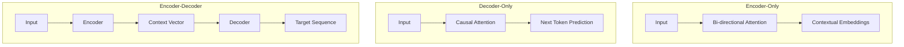

# Lab 1: Transformer Architecture Mapping

## Objective
Understand the three primary flavors of Transformer architectures and identify which one is best suited for specific Natural Language Processing (NLP) tasks.

---

## 1. Conceptual Foundation

### What is a Transformer?
The Transformer is a neural network architecture that uses **Attention** to process sequences of data (like text). Unlike older models that read text word-by-word (left-to-right), Transformers can look at the entire sequence at once.

### The Three Architectures

#### A. Encoder-Only (The "Understander")
Imagine someone reading a whole page and highlighting the most important parts.
- **How it works:** It uses **Bi-directional Attention**. Every token can look at every other token in the sequence, regardless of whether it comes before or after.
- **Strength:** Deep understanding of context.
- **Example:** BERT.

#### B. Decoder-Only (The "Generator")
Imagine someone writing a story. They can only see what they have already written; they cannot see the future.
- **How it works:** It uses **Causal (Masked) Attention**. A token can only look at tokens that appeared *before* it.
- **Strength:** Efficient and natural text generation.
- **Example:** GPT-4, Llama-3.

#### C. Encoder-Decoder (The "Translator")
Imagine a translator who first reads a sentence in English (Encoder) and then writes the translation in French (Decoder).
- **How it works:** The Encoder creates a rich "summary" of the input, and the Decoder uses that summary to generate a new sequence.
- **Strength:** Transforming one sequence into another.
- **Example:** T5.

### Visual Comparison

---

## 2. Lab Exercise: Architecture Matching

**Scenario:** You are an AI Architect. You need to choose the right model architecture for the following tasks. 

### The Tasks:
1. **Sentiment Analysis:** Given a movie review, determine if it is positive or negative.
2. **Creative Writing:** Write a short story about a robot learning to paint.
3. **Language Translation:** Translate a technical manual from English to Japanese.
4. **Named Entity Recognition (NER):** Identify all the people, places, and organizations mentioned in a news article.
5. **Chatbot Assistant:** Build a helpful AI that answers user queries.

### Instructions:
For each task, identify the best architecture (**Encoder-only**, **Decoder-only**, or **Encoder-Decoder**) and justify your choice.

| Task | Architecture | Justification |
| :--- | :--- | :--- |
| Sentiment Analysis | | |
| Creative Writing | | |
| Translation | | |
| NER | | |
| Chatbot | | |

---

## 3. Summary & Review
- **Encoder-only** $\rightarrow$ Understanding (NLU).
- **Decoder-only** $\rightarrow$ Generation (NLG).
- **Encoder-Decoder** $\rightarrow$ Transformation (Seq2Seq).