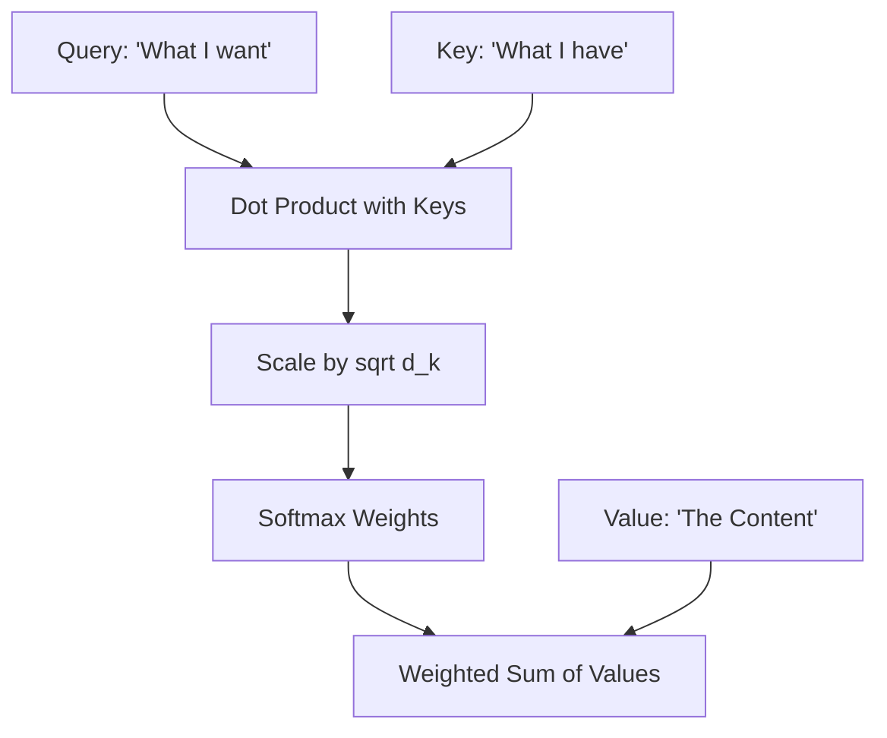

# Lab 2: Deconstructing the Attention Engine

## Objective
Understand how the "Attention" mechanism works by breaking down the Query-Key-Value (QKV) framework and calculating a simplified attention score.

---

## 1. Conceptual Foundation

### The "Library" Analogy
Imagine you are in a massive library looking for information on "Quantum Computing."

1. **The Query (Q):** This is your search term. You walk into the library and say, *"I am looking for information on Quantum Computing."*
2. **The Key (K):** These are the labels on the spines of the books. You look at the books on the shelves. One says *"Physics"*, another says *"Cooking"*, and another says *"Quantum Mechanics"*.
3. **The Value (V):** This is the actual content inside the book. Once you find a book with a matching label (Key), you open it and read the information (Value).

In a Transformer, the model does this mathematically for every single word in a sentence.

### Technical Refresher (For Beginners)

#### A. The Dot Product
The dot product is a way to measure how similar two vectors are. 
- If two vectors point in the same direction, the dot product is **high**.
- If they are perpendicular, the dot product is **zero**.
- If they point in opposite directions, the dot product is **negative**.

**Formula:** $A \cdot B = (a_1 \times b_1) + (a_2 \times b_2) + \dots + (a_n \times b_n)$

#### B. The Softmax Function
Softmax takes a list of raw scores and turns them into probabilities that sum to 1 (100%). It "squashes" the largest value to be very close to 1 and the smallest to be very close to 0.

---

## 2. The Attention Process

The model calculates attention using the following steps:

1. **Score:** Calculate the dot product of the **Query (Q)** and the **Key (K)**.
2. **Scale:** Divide the score by a constant (usually $\sqrt{d_k}$) to keep the numbers manageable.
3. **Normalize:** Apply the **Softmax** function to get a weight (probability).
4. **Aggregate:** Multiply the weight by the **Value (V)**.

### Visual Process

---

## 3. Lab Exercise: Manual Attention Trace

**Scenario:** We have a tiny vocabulary of two words. Let's calculate the attention for the word "Apple" relative to itself and "Orange".

**Given Data:**
- **Query (Q) for "Apple":** $[1, 0]$
- **Key (K) for "Apple":** $[1, 0]$
- **Key (K) for "Orange":** $[0, 1]$
- **Value (V) for "Apple":** $[10, 20]$
- **Value (V) for "Orange":** $[30, 40]$

### Step 1: Compute Raw Scores (Dot Product)
Calculate $Q \cdot K$ for both words.

- **Score(Apple, Apple):** $[1, 0] \cdot [1, 0] = (1\times 1) + (0\times 0) =$ **1**
- **Score(Apple, Orange):** $[1, 0] \cdot [0, 1] = (1\times 0) + (0\times 1) =$ **0**

### Step 2: Apply Softmax (Simplified)
Assume the Softmax of $[1, 0]$ results in weights of **0.73** for "Apple" and **0.27** for "Orange".

### Step 3: Compute Final Weighted Value
Multiply the weights by the Values (V).

- **Weighted Apple:** $0.73 \times [10, 20] = [7.3, 14.6]$
- **Weighted Orange:** $0.27 \times [30, 40] = [8.1, 10.8]$

**Final Attention Vector:** $[7.3 + 8.1, 14.6 + 10.8] = [15.4, 25.4]$

---

## 4. Summary & Review
- **Query (Q):** The search vector.
- **Key (K):** The index vector.
- **Value (V):** The content vector.
- **Self-Attention** allows a model to focus on the most relevant parts of the input regardless of distance.