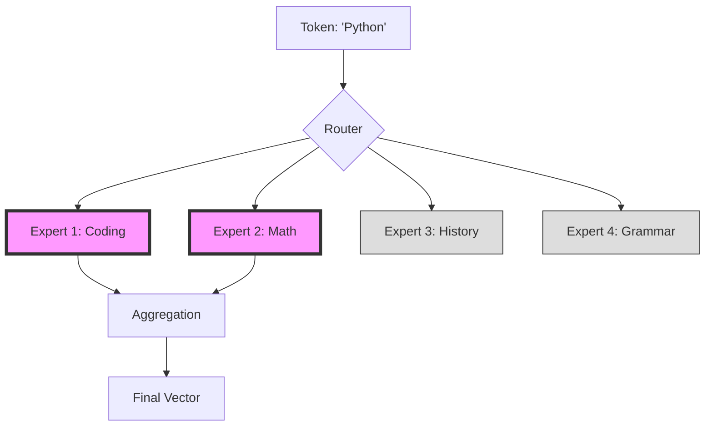

# Lab 3: Scaling and the Mixture of Experts (MoE)

## Objective
Understand the relationship between model size and performance (Scaling Laws) and how Mixture of Experts (MoE) allows models to grow in capacity without linearly increasing the computational cost.

---

## 1. Conceptual Foundation

### Scaling Laws: The "Bigger is Better" Rule
Research has shown that the performance of an LLM follows a predictable pattern. If you increase these three things in tandem, the model's error drops:
1. **Compute (C):** The total amount of processing power (FLOPs) used during training.
2. **Data (D):** The number of tokens (words/characters) the model is trained on.
3. **Parameters (N):** The number of "knobs" (weights) the model can adjust.

**The Catch:** If you only increase the number of parameters without increasing the data or compute, you hit "diminishing returns." The model becomes a giant that hasn't read enough books to be useful.

### The Compute Wall
In a **Dense Model**, every single parameter is activated for every single token. 
- If a model has 1 Trillion parameters, it must perform 1 Trillion calculations for every word it generates.
- This creates a "Compute Wall": the cost of inference (running the model) becomes too expensive and too slow.

### The Solution: Mixture of Experts (MoE)
Instead of one giant block of parameters, MoE breaks the model's "brain" into several smaller **Experts**.

#### The "Specialist" Analogy
Imagine a company with one general manager who tries to do everything. As the company grows, the manager becomes a bottleneck. 
Instead, the company hires **Specialists**:
- A **Math Expert**
- A **Coding Expert**
- A **History Expert**
- A **Grammar Expert**

Now, when a task comes in, a **Router** (the receptionist) decides which 1 or 2 specialists are best suited for that specific task. The other experts stay "asleep," saving energy and time.

---

## 2. The MoE Process

1. **Input:** A token (e.g., "Python") enters the model.
2. **Routing:** A small, learned network (the Router) looks at the token and calculates which experts are the best match.
3. **Sparse Activation:** Only the top-K (usually 1 or 2) experts are activated.
4. **Aggregation:** The outputs from the chosen experts are combined to produce the final result.

### Visual Process

*(In the diagram above, only the Coding and Math experts were activated for the token 'Python'.)*

---

## 3. Lab Exercise: Routing Simulation

**Scenario:** You are the Router for an MoE model. You have four experts:
- **Expert A:** Mathematical Reasoning
- **Expert B:** Creative Writing/Poetry
- **Expert C:** Programming Languages
- **Expert D:** General World Knowledge

**Task:** For each input token, decide which **two** experts you would route the token to.

| Input Token | Expert 1 | Expert 2 | Justification |
| :--- | :--- | :--- | :--- |
| "$\sum_{i=1}^n i$" | | | |
| "def main():" | | | |
| "sonnet" | | | |
| "Paris" | | | |
| "binary search" | | | |

---

## 4. Summary & Review
- **Scaling Laws:** Performance increases as Compute, Data, and Parameters increase.
- **Dense Models:** All parameters activate $\rightarrow$ High compute cost.
- **MoE Models:** Only a few experts activate $\rightarrow$ High capacity, lower compute cost.
- **Sparsity:** The concept of activating only a subset of the model's parameters.