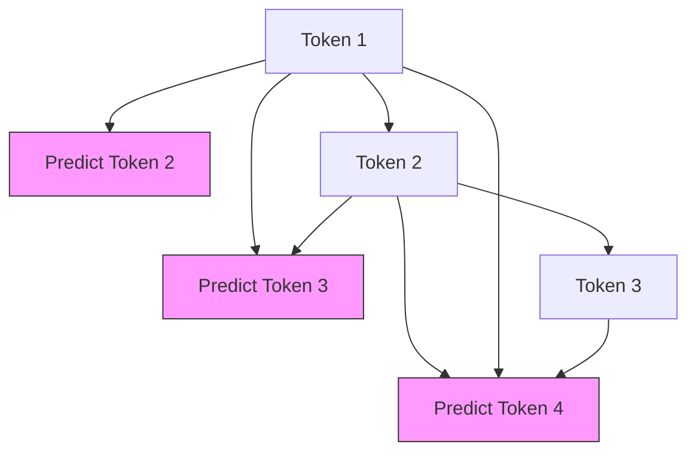

# Lab 4: The Next-Token Prediction Game

## Objective
Understand the fundamental goal of a Base LLM: **Causal Language Modeling (CLM)**. You will learn how a model predicts the next token and how the "Causal Mask" prevents it from cheating.

---

## 1. Conceptual Foundation

### Base Models vs. Chatbots
It is a common misconception that LLMs are "designed to chat." In reality, the **Base Model** is simply a **Document Completer**.

- **Base Model:** Trained on trillions of tokens to predict the next word. If you ask it *"What is the capital of France?"*, a base model might respond with *"What is the capital of Germany?"* because it thinks it is completing a list of geography questions.
- **Instruct/Chat Model:** A base model that has undergone additional training (SFT/RLHF) to understand that it should follow instructions and engage in dialogue.

### The objective: Next-Token Prediction
The goal of a base model is simple: 
Given a sequence of tokens $t_1, t_2, \dots, t_n$, predict the most likely token $t_{n+1}$.

### The Causal Mask (No Peeking!)
During training, the model is given the full sentence. To prevent the model from simply "reading the answer" (the next word), we use a **Causal Mask**.

**How it works:** The mask blocks the model's view of any token that comes after the current position.
- At position 1, it can only see token 1.
- At position 2, it can see tokens 1 and 2.
- At position $n$, it can see tokens $1 \dots n$.

### Visualizing the Causal Mask

---

## 2. The "Probability Distribution" (Softmax)

When a model predicts the next token, it doesn't just pick one word. It generates a score for **every single token** in its vocabulary. The **Softmax** function then converts these scores into probabilities.

**Example:**
Input: *"The cat sat on the..."*

| Token | Raw Score | Softmax Probability |
| :--- | :--- | :--- |
| mat | 12.5 | **0.85 (85%)** |
| floor | 8.2 | **0.10 (10%)** |
| ceiling | -2.1 | **0.01 (1%)** |
| pizza | -5.0 | **0.00 (0%)** |

The model then samples from this distribution to pick the final token.

---

## 3. Lab Exercise: The Completion Game

**Scenario:** You are a Base LLM. Your goal is to complete the following prompts. 

**Task:** For each prompt, provide the **Top 3** most likely tokens that would come next, and assign a hypothetical probability to each.

| Prompt | Token 1 (Prob) | Token 2 (Prob) | Token 3 (Prob) | Justification |
| :--- | :--- | :--- | :--- | :--- |
| "The capital of France is..." | | | | |
| "To build a house, you first need a..." | | | | |
| "In a binary search, the list must be..." | | | | |
| "Once upon a time, in a land far..." | | | | |

---

## 4. Summary & Review
- **Causal Language Modeling (CLM):** Predicting the next token based on previous tokens.
- **Base Model:** A document completer, not a chatbot.
- **Causal Mask:** Ensures the model only attends to past tokens, preventing "cheating" during training.
- **Softmax:** Turns raw scores into a probability distribution over the vocabulary.