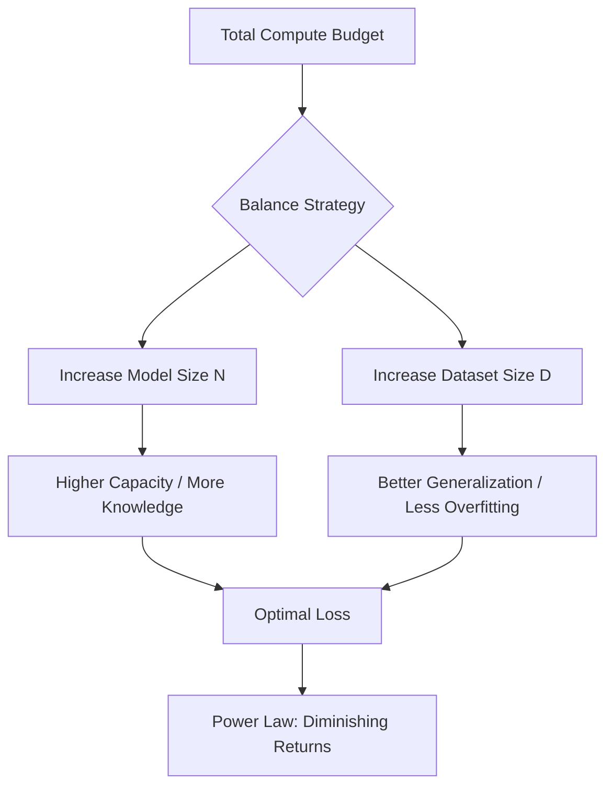

# Lab 1: Scaling Law Analysis & Compute Budgeting

## Objective
Understand the relationship between model size, dataset size, and compute budget. You will learn how to apply the Chinchilla Scaling Laws to determine if a model is under-trained or over-trained and how to budget compute resources.

---

## 1. Background: The Power Law and Scaling
Before we dive in, we need to understand **Scaling Laws**. In deep learning, performance (measured as "Loss") doesn't improve linearly. If you double the amount of data, you don't simply halve the error. Instead, it follows a **Power Law**.

**What is a Power Law?**
A power law is a functional relationship where one quantity varies as a power of another. In LLMs, this means that to achieve a constant improvement in performance, you need an exponential increase in compute, data, or parameters.

### The Chinchilla Scaling Law
For a long time, it was thought that making models bigger (more parameters) was the most important factor. However, DeepMind's "Chinchilla" research found that for a fixed compute budget, the model size ($N$) and the number of training tokens ($D$) should be scaled equally.

**The Rule of Thumb:**
An optimally trained model should have approximately **20 tokens per parameter**.
$$\text{Tokens} \approx 20 \times \text{Parameters}$$

---

## 2. Exercise: Compute Budgeting

### Scenario
You are an AI Engineer at a startup. You have a fixed compute budget of **$10^{23}$ FLOPs**. You need to decide whether to build a larger model with less data, or a smaller model with more data.

### Task 1: Identifying Under-training
Given a model with **7 Billion parameters** trained on **100 Billion tokens**, is this model optimally trained according to Chinchilla scaling?

**Step-by-Step Calculation:**
1. Calculate the optimal token count for a 7B parameter model:
   $$\text{Optimal Tokens} = 20 \times 7,000,000,000 = 140 \text{ Billion tokens}$$
2. Compare the actual tokens (100B) to the optimal tokens (140B).
3. **Conclusion:** The model is under-trained. It would benefit from more data.

### Task 2: Budgeting for a New Model
You want to train a model with **1.1 Billion parameters**. How many tokens do you need to ensure it is "Chinchilla-optimal"?

**Calculation:**
- $\text{Tokens} = 20 \times 1.1 \times 10^9 = 22 \text{ Billion tokens}$

---

## 3. Visualizing the Trade-off

The following diagram illustrates the decision process when budgeting compute.

## 4. Summary Checklist
- [ ] I can explain the difference between a Linear and Power Law relationship.
- [ ] I can calculate the optimal training tokens for a given model size.
- [ ] I understand why increasing model size without increasing data leads to under-training.