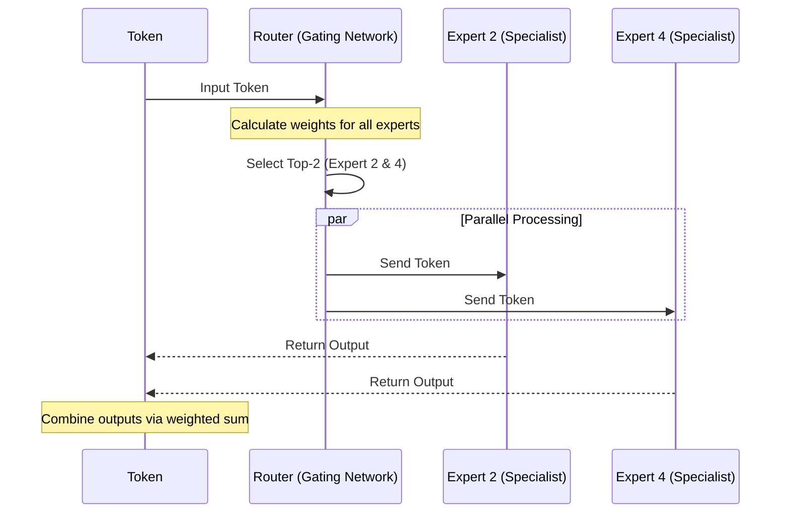

# Lab 2: Designing a Sparse Router

## Objective
Understand the architectural difference between Dense and Sparse models. You will learn how the Mixture of Experts (MoE) routing mechanism works and how it allows models to scale their knowledge capacity without proportionally increasing compute cost.

---

## 1. Background: Dense vs. Sparse Models
In a traditional **Dense Model**, every single parameter is used for every single input. If a model has 7 billion parameters, every token must be processed by all 7 billion weights. This is like having a hospital where every single doctor (surgeon, pediatrician, cardiologist) must examine every single patient, regardless of the patient's symptoms.

**Sparsity** is the opposite. A **Sparse Model** (like MoE) contains many specialized sub-networks called **Experts**. For any given input, only a small subset of these experts are activated. This is like a hospital where a triage nurse (the Router) sends the patient to only the relevant specialist.

### Key Concepts:
- **Total Parameters:** The sum of all weights in the model.
- **Active Parameters:** The weights used to process a single token.
- **Router (Gating Network):** A small neural network that decides which experts should handle the current token.
- **Top-k Routing:** A strategy where the router selects the $k$ most relevant experts. Usually, $k=1$ or $k=2$.

---

## 2. Exercise: The MoE Routing Logic

### Scenario
You are designing a small MoE layer with **8 Experts**, each having **100 Million parameters**. The Router uses **Top-2 Routing**.

### Task 1: Calculating Parameter Counts
1. What is the **Total Parameter Count** of the expert layer?
   $$\text{Total} = 8 \text{ experts} \times 100\text{M} = 800\text{ Million parameters}$$
2. What is the **Active Parameter Count** per token?
   $$\text{Active} = 2 \text{ active experts} \times 100\text{M} = 200\text{ Million parameters}$$
3. What is the **Sparsity Ratio**?
   $$\text{Ratio} = \frac{\text{Active}}{\text{Total}} = \frac{200\text{M}}{800\text{M}} = 25\%$$

### Task 2: Simulating the Router
Imagine the Router produces the following "relevance scores" for a token:
- Expert 1: 0.1
- Expert 2: 0.4
- Expert 3: 0.05
- Expert 4: 0.2
- Expert 5: 0.15
- Expert 6: 0.02
- Expert 7: 0.03
- Expert 8: 0.05

**Question:** Using Top-2 Routing, which experts will process this token?
**Answer:** Expert 2 (0.4) and Expert 4 (0.2).

---

## 3. Visualizing the Flow

The following sequence diagram illustrates how a token moves through an MoE layer.

## 4. Summary Checklist
- [ ] I can explain the difference between a Dense and a Sparse model.
- [ ] I can calculate the Active vs. Total parameter counts in an MoE architecture.
- [ ] I understand how the Router uses Top-k routing to optimize compute.