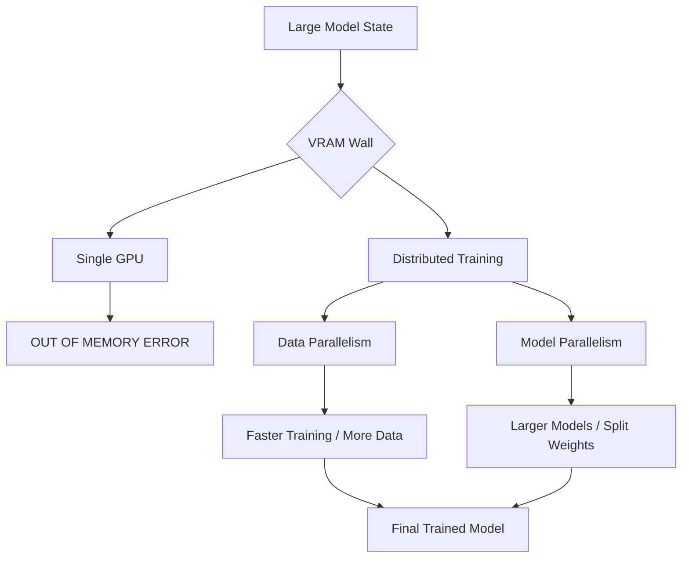

# Lab 3: Pre-training Resource Estimation

## Objective
Understand the memory constraints associated with training Large Language Models. You will learn how to estimate the VRAM requirements for training and how to plan for distributed training when a model exceeds the memory of a single GPU.

---

## 1. Background: The VRAM Wall
When training a model, the GPU doesn't just store the model itself; it must store several other large tensors. This is known as the **VRAM Wall**—the point where the model and its training state are too large to fit into the GPU's available memory.

### What takes up VRAM during training?
1. **Model Weights:** The actual parameters of the network.
2. **Gradients:** Tensors that store the direction and magnitude of the update for every weight. (Usually the same size as the weights).
3. **Optimizer States:** Metadata used by the optimizer (e.g., Adam) to track momentum and variance for every weight. (This is often the largest part of the memory footprint).
4. **Activations:** The intermediate outputs of each layer, stored during the forward pass to be used during the backward pass (backpropagation).

**Prerequisite: Floating Point Precision**
Most models are trained in **FP32** (4 bytes per value) or **BF16/FP16** (2 bytes per value). For this lab, we will assume **BF16 (2 bytes)** for weights and gradients.

---

## 2. Exercise: Calculating Memory Requirements

### Scenario
You are planning to pre-train a model with **1 Billion parameters** using the **Adam Optimizer**.

### Task 1: Calculating Static Memory
Calculate the memory required for the basic components (assuming BF16):

1. **Model Weights:**
   $$1\text{B parameters} \times 2\text{ bytes} = 2\text{ GB}$$
2. **Gradients:**
   $$1\text{B parameters} \times 2\text{ bytes} = 2\text{ GB}$$
3. **Optimizer States (Adam):** 
   Adam tracks two values per parameter (momentum and variance) usually in FP32.
   $$1\text{B parameters} \times 2\text{ values} \times 4\text{ bytes} = 8\text{ GB}$$

**Total Static Memory:** $2 + 2 + 8 = 12\text{ GB}$

### Task 2: Planning for Distributed Training
Your GPU has **16 GB of VRAM**. After adding **Activations** and **CUDA kernels**, you find that you need **20 GB** to train this model. Since 20 GB > 16 GB, you cannot train on one GPU.

**Which strategy should you use?**
- **Data Parallelism:** Replicating the model across multiple GPUs. (This won't help if the model itself is too big for one GPU).
- **Model Parallelism:** Splitting the model's layers across multiple GPUs. (This solves the VRAM wall by dividing the weights and optimizer states).

**Conclusion:** You should use Model Parallelism.

---

## 3. Visualizing Distributed Training

The following diagram shows how distributed training solves the VRAM wall.

## 4. Summary Checklist
- [ ] I can list the four primary components that consume VRAM during training.
- [ ] I can calculate the memory footprint of model weights and gradients based on precision (BF16 vs FP32).
- [ ] I can distinguish between Data Parallelism and Model Parallelism.