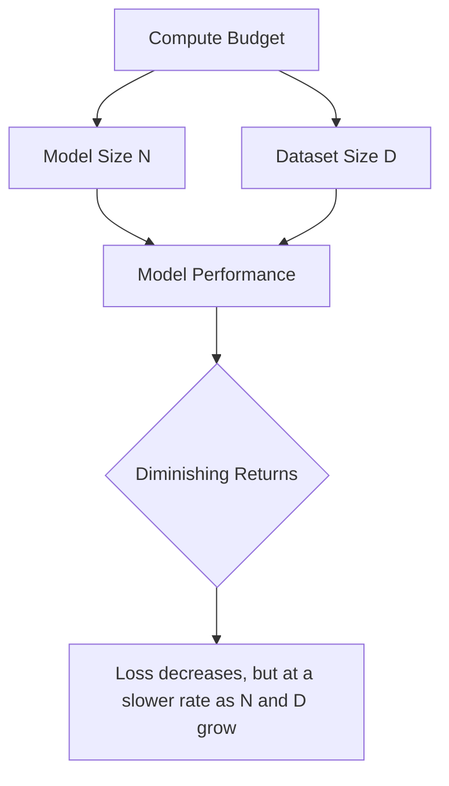
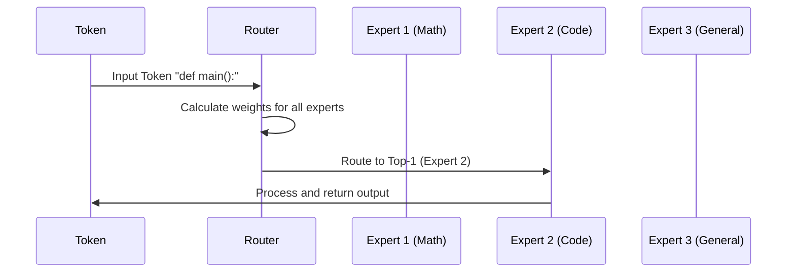

# Module 1, Part 2: Scaling Laws, MoE, and Base Model Training - Lecture Notes

## Introduction
In Part 1, we explored the architecture of the Transformer and how Attention allows models to focus on relevant information. Now, we move from the *how* it works to the *how it scales* and *how it is trained*. 

The core theme of this part is **Efficiency vs. Performance**. As we increase the size of our models, we encounter a diminishing return on compute and a massive increase in cost. This has led to the development of "Sparse" models and the discovery of "Scaling Laws" that guide how we build the next generation of LLMs.

---

## Topic 1: Scaling Laws
### 1.1 What are Scaling Laws?
Scaling laws are empirical observations that describe the relationship between a model's performance (usually measured as "Loss" or "Cross-Entropy Loss") and the resources used to train it.

**Key Concept: The Power Law**
In the context of LLMs, performance does not improve linearly. Instead, it follows a **Power Law**. This means that to get a linear improvement in performance, you often need an exponential increase in resources.

**The Three Pillars of Scaling:**
1. **Parameter Count ($N$):** The number of weights (connections) in the neural network. More parameters generally mean more capacity to store knowledge.
2. **Dataset Size ($D$):** The number of tokens (words/sub-words) the model sees during training. More data prevents overfitting and improves generalization.
3. **Compute ($C$):** The total amount of floating-point operations (FLOPs) performed. This is a function of $N$ and $D$.

### 1.2 From Kaplan to Chinchilla
For a while, the industry followed the "Kaplan Scaling Laws" (OpenAI, 2020), which suggested that increasing model size ($N$) was the most efficient way to decrease loss. This led to the "Bigger is Better" era (e.g., GPT-3).

However, DeepMind later introduced the **Chinchilla Scaling Laws**, which corrected this view. They discovered that most models were "under-trained"—they had too many parameters and not enough data.

**The Chinchilla Insight:**
For an optimally trained model, the model size ($N$) and the number of training tokens ($D$) should be scaled **equally**. 

$$\text{Optimal Ratio: } N \approx 20 \times D$$

(Simplified: If you double your budget, you should double both the model size and the amount of data, rather than just making the model bigger.)

### 1.3 Visualizing Scaling

---

## Topic 2: Mixture of Experts (MoE)
### 2.1 The Problem with Dense Models
A "Dense" model is one where every single parameter is activated for every single token. 
- **The Issue:** If you have a 1-trillion parameter model, every token must pass through 1 trillion weights. This is computationally expensive and slow.

### 2.2 The MoE Solution: Sparsity
**Mixture of Experts (MoE)** introduces **Sparsity**. Instead of one giant layer, the model has several specialized "experts" (smaller feed-forward networks).

**The Core Components:**
1. **Experts:** A collection of independent neural networks. Each expert can potentially specialize in different types of information (e.g., one for Python code, one for French grammar, one for logic).
2. **The Router (Gating Network):** This is the "traffic cop." For every token, the router calculates which experts are most relevant.
3. **Top-k Routing:** To keep it efficient, the router only sends the token to the "Top-k" experts (usually $k=1$ or $k=2$).

### 2.3 MoE Workflow

**Key Advantage:**
An MoE model can have a massive **Total Parameter Count** (allowing it to store vast knowledge) but a small **Active Parameter Count** per token (allowing it to run fast).

**Example: Mixtral 8x7B**
Mixtral is not 56B parameters in the traditional sense. It has 8 experts of 7B each. For any given token, only 2 experts are active. This gives it the "brains" of a huge model with the "speed" of a much smaller one.

---

## Topic 3: Base Model Training
### 3.1 The Objective: Next-Token Prediction
Base models are trained via **Self-Supervised Learning**. This means they do not need humans to label the data (e.g., "This is a cat"). Instead, the data *is* the label.

**The Process:**
1. Take a sequence: "The capital of France is..."
2. The target is: "Paris"
3. The model predicts a probability distribution over the entire vocabulary.
4. The error (loss) is calculated between the prediction and the actual next token.
5. The weights are updated via backpropagation.

### 3.2 The Pre-training Lifecycle
Pre-training is the most resource-intensive phase.

**Prerequisite Refresher: VRAM (Video RAM)**
To train a model, the GPU must store:
- **Model Weights:** The actual parameters.
- **Gradients:** The direction the weights need to move to reduce error.
- **Optimizer States:** Metadata used by the optimizer (like Adam) to adjust the learning rate.

**The VRAM Wall:**
If a model is too large to fit into the VRAM of a single GPU, we use **Distributed Training**:
- **Data Parallelism:** Same model on different GPUs, each processing different data.
- **Model Parallelism:** Different parts of the model are split across different GPUs.

### 3.3 The Cost of Pre-training
Pre-training is a massive engineering feat.
- **Compute:** Measured in FLOPs (Floating Point Operations). Training a Llama-3 class model requires millions of GPU hours.
- **Data Curation:** Not all internet data is good. Base models require trillions of "high-quality" tokens. This involves deduplication (removing repeats) and filtering (removing gibberish).
- **Stability:** Training can "crash" (loss spikes). Engineers must monitor the training 24/7 to ensure the model doesn't diverge.

### 3.4 Summary Comparison: Dense vs. Sparse
| Feature | Dense Model | MoE (Sparse) Model |
| :--- | :--- | :--- |
| **Activation** | All parameters used per token | Subset of parameters used per token |
| **Inference Speed** | Slower as model grows | Faster (per active parameter) |
| **Memory Footprint** | High (Weights = Active) | Very High (Weights $\gg$ Active) |
| **Training Stability**| Generally more stable | Can be harder to balance (Expert collapse) |