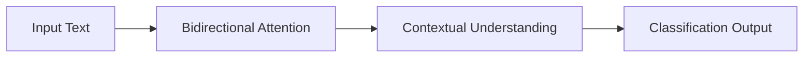
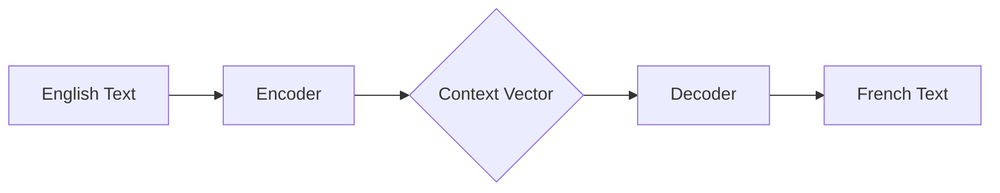

# Module 1, Part 1: Foundations of the Modern LLM - Lecture Slides

---

## Slide 1: Title Slide
**Content:**
# Foundations of the Modern LLM
## Module 1, Part 1: The Transformer & Base Model Training
**CS601: Advanced LLM Engineering**

**Speaker Notes:**
Welcome everyone to CS601. Today we are starting from the absolute beginning. Whether you've used ChatGPT for a year or have never touched an AI, today is about understanding the "engine" that makes these tools work. We're moving from "prompting" to "engineering."

---

## Slide 2: The Big Picture
**Content:**
- **What is an LLM?**
    - A massive mathematical function.
    - Input: Text $\to$ Output: Probability distribution of the next token.
- **The Secret Sauce: The Transformer**
    - A specific neural network architecture designed for sequences.
- **Core Goal today:**
    - Understand the three "flavors" of Transformers.
    - Learn how "Attention" works.
    - Explore Scaling and Training.

**Speaker Notes:**
Before we get into the weeds, think of an LLM not as a "brain," but as a sophisticated pattern matcher. It doesn't "know" things in the human sense; it calculates the most likely next piece of text based on billions of examples it has seen.

---

## Slide 3: Prerequisites Refresher
**Content:**
- **Neural Network:** Layers of math that learn patterns.
- **Tensors:** Multi-dimensional arrays (the "language" of LLMs).
- **Tokens:** Chunks of text (words or sub-words).
- **Probability:** Predicting the most likely outcome.

**Visual Aid:** 
A simple image showing a string of text being broken into tokens $\to$ converted into a vector (list of numbers) $\to$ passing through a layer of weights.

**Speaker Notes:**
If you're rusty on the math, don't panic. Just remember that everything in an LLM is eventually converted into numbers (Tensors). We don't process letters; we process vectors.

---

## Slide 4: Chapter 1: Transformer Architectures
**Content:**
# Chapter 1: The Three Flavors
One architecture, three primary uses:
1. **Encoder-only** (The Reader) $\to$ BERT
2. **Decoder-only** (The Writer) $\to$ GPT
3. **Encoder-Decoder** (The Translator) $\to$ T5

**Speaker Notes:**
The original Transformer paper introduced both an Encoder and a Decoder. Over time, researchers realized you could use just one part depending on what you wanted the model to do.

---

## Slide 5: Encoder-only (The Reader)
**Content:**
- **Example:** BERT
- **Key Feature:** Bidirectional Attention.
- **How it works:** Looks at the whole sentence at once.
- **Objective:** Masked Language Modeling (MLM).
    - `The [MASK] sat on the mat.` $\to$ `cat`
- **Best for:** Sentiment Analysis, NER, Classification.

**Visual Aid:**

**Speaker Notes:**
BERT is like a researcher. It doesn't write stories; it analyzes text. Because it can look at words to the left AND right of a token, it understands context perfectly.

---

## Slide 6: Decoder-only (The Writer)
**Content:**
- **Example:** GPT (Generative Pre-trained Transformer)
- **Key Feature:** Causal/Unidirectional Attention.
- **The Rule:** Can only see the past, never the future.
- **Objective:** Next-Token Prediction.
- **Best for:** Chatbots, Storytelling, Coding.

**Visual Aid:**
A diagram showing a sequence of tokens where Token 3 has arrows pointing back to Token 1 and 2, but Token 1 has NO arrows pointing forward.

**Speaker Notes:**
GPT is the engine behind the chatbots we use. It's "Causal," meaning it's strictly a forward-moving process. It's essentially playing a game of "guess the next word" over and over again.

---

## Slide 7: Encoder-Decoder (The Translator)
**Content:**
- **Example:** T5 (Text-to-Text Transfer Transformer)
- **Mechanism:** The "Bridge."
    - **Encoder:** Understands source text.
    - **Decoder:** Generates target text.
- **Key Feature:** Cross-Attention.
- **Best for:** Translation, Summarization.

**Visual Aid:**

**Speaker Notes:**
T5 treats every task as a "text-to-text" problem. It separates the "understanding" phase from the "generation" phase. This is the gold standard for translation.

---

## Slide 8: Chapter 2: Attention Mechanisms
**Content:**
# Chapter 2: The "Secret Sauce"
**What is Attention?**
The ability to focus on the most relevant parts of the input, regardless of distance.

**Example:**
"The **cat** sat on the mat because **it** was tired."
Attention links "**it**" $\to$ "**cat**".

**Speaker Notes:**
Attention solved the biggest problem in old AI: the "forgetting" problem. In long sentences, old models forgot the subject by the time they reached the end. Attention allows the model to "jump" back to any word that is relevant.

---

## Slide 9: The QKV Mechanism
**Content:**
How Attention is calculated:
- **Query (Q):** "What am I looking for?"
- **Key (K):** "What do I contain?"
- **Value (V):** "What information do I provide?"

**The Math:**
$$\text{Attention}(Q, K, V) = \text{softmax}\left(\frac{QK^T}{\sqrt{d_k}}\right)V$$

**Speaker Notes:**
Think of this like a library. The Query is your search term. The Keys are the labels on the spines of the books. The Values are the actual information inside the books. The model finds the best match between Q and K to decide how much of V to use.

---

## Slide 10: Scaling Attention: MHA & FlashAttention
**Content:**
- **Multi-Head Attention (MHA):**
    - Parallel attention processes.
    - One head for grammar, one for entities, one for sentiment.
- **FlashAttention:**
    - Problem: Attention is $O(n^2)$ (Expensive!).
    - Solution: Tiling data to reduce memory movement between HBM and SRAM.
    - Result: Massive context windows (128k+ tokens).

**Speaker Notes:**
Multi-head attention allows the model to "see" the text from different perspectives. FlashAttention is a hardware-level optimization. It doesn't change the math, but it makes the math run significantly faster on GPUs.

---

## Slide 11: Chapter 3: Scaling Laws & MoE
**Content:**
# Chapter 3: Efficiency & Scale
**Scaling Laws:**
Performance improves predictably as we increase:
1. Parameter Count
2. Dataset Size
3. Compute (FLOPs)

**The Problem:**
Bigger models = slower and more expensive.

**Speaker Notes:**
For a while, the industry just made models bigger. But we hit a wall: inference cost. We needed a way to get the power of a huge model without paying the "tax" of running every single parameter for every word.

---

## Slide 12: Mixture of Experts (MoE)
**Content:**
**The Solution: Sparsity**
- **Dense Model:** All parameters activate for every token.
- **Sparse Model (MoE):** Only a few "Expert" networks activate.
- **The Router:** Decides which expert is best for the token.

**Example: Mixtral**
- Huge total parameter count, but small "active" parameter count.

**Visual Aid:**
A diagram showing an input token $\to$ a Router $\to$ only 2 out of 8 Experts lighting up.

**Speaker Notes:**
MoE is like having a team of specialists. Instead of asking a generalist to do everything, the Router sends the "coding" token to the coding expert and the "legal" token to the legal expert. This is how we get GPT-4 level performance with higher efficiency.

---

## Slide 13: Chapter 4: Base Model Training
**Content:**
# Chapter 4: Creating the Base
**The Objective: Next-Token Prediction**
- **Self-Supervised Learning:** No manual labels needed.
- The internet is the label.
- Task: "Given the sequence, what is the next token?"

**The Result:**
The model learns world knowledge, logic, and grammar implicitly.

**Speaker Notes:**
Base models are the "raw" versions of LLMs. They aren't trained to be helpful assistants yet; they are just trained to be "completion machines." If you ask a base model "What is the capital of France?", it might respond with "What is the capital of Germany?" because it thinks it's looking at a quiz.

---

## Slide 14: The Cost of Pre-training
**Content:**
- **Compute:** Thousands of H100 GPUs for months.
- **Memory:** VRAM bottlenecks (Weights, Gradients, Optimizer states).
- **Energy:** Massive power and cooling requirements.
- **Why we use Base Models:**
    - Most researchers can't afford $10M+ in compute.
    - We start with Llama/Mistral and "Fine-tune" them.

**Speaker Notes:**
Pre-training is the laziest part of the process for the human (just feed it data), but the most expensive for the wallet. This is why open-weights models are so important for the community.

---

## Slide 15: Summary & Wrap-up
**Content:**
- **Transformer:** The architecture (Encoder, Decoder, or both).
- **Attention:** The mechanism (QKV, MHA, Flash).
- **Scaling:** The a-ha moment (Scaling Laws $\to$ MoE).
- **Training:** The foundation (Next-token prediction).

**Next Lesson:** 
Fine-tuning and RLHF: Turning a "Completion Machine" into a "Helpful Assistant."

**Speaker Notes:**
That's the foundation. We've gone from the high-level "flavors" to the low-level math of attention and the economics of training. Next time, we'll look at how to take these raw base models and make them actually useful for users.