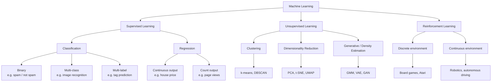
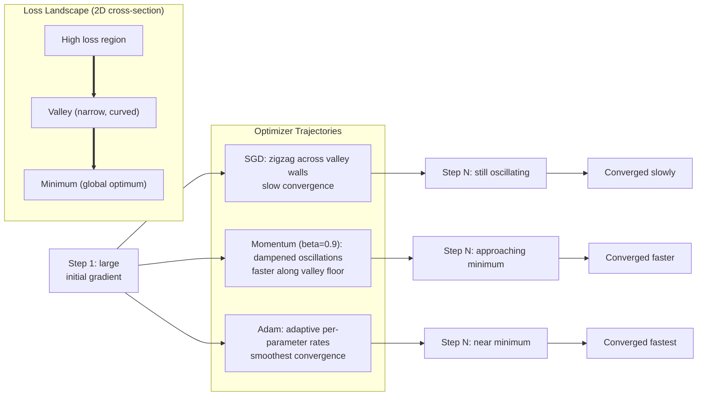

Licensed under Apache 2.0

# Chapter 1: Machine Learning Fundamentals

This chapter provides the mathematical and algorithmic foundation for the rest of the textbook. Even if you have taken a machine learning course before, reading through the worked example and exercises will ensure that you and the later chapters share a common notation and coding style.

## Learning Objectives

By the end of this chapter you will be able to:

1. Distinguish supervised, unsupervised, and reinforcement learning and place any ML task into the correct category.
2. Express core ML operations using vectors, matrices, and tensor notation.
3. Derive the maximum-likelihood estimate for Gaussian parameters and apply Bayes' theorem to a classification problem.
4. Implement SGD, Momentum, and Adam optimizers from scratch and explain why each improves upon its predecessor.
5. Diagnose overfitting and underfitting using learning curves, and apply k-fold cross-validation, regularization, and early stopping to improve generalization.

## Prerequisites

- Proficiency in at least one programming language (Python examples are used throughout).
- Familiarity with data structures (arrays, lists, hash maps) and basic algorithm analysis (Big-O).
- High-school level calculus (derivatives, partial derivatives) and algebra.

---

## 1.1 What Is Machine Learning?

Machine learning (ML) is the study of algorithms that improve their performance on a task through experience (data) rather than following explicitly programmed rules. Tom Mitchell's classic definition captures this precisely:

> A computer program is said to learn from experience E with respect to some task T and some performance measure P, if its performance at T, as measured by P, improves with experience E.

### Types of Learning

Machine learning is organized around three paradigms that differ in what signal the algorithm receives from its environment.

**Supervised learning** trains on labeled examples (input-output pairs) and learns a mapping from inputs to outputs. Classification and regression are the two canonical tasks.

**Unsupervised learning** receives only inputs with no labels. The algorithm must discover structure on its own — clusters, latent dimensions, or generative models.

**Reinforcement learning** trains an agent that takes actions in an environment and receives scalar reward signals. The goal is to learn a policy that maximizes cumulative reward.



### The Bias-Variance Tradeoff

Every predictive model faces a fundamental tension. A very simple model (high bias) will underfit the data — it cannot capture the true relationship. A very complex model (low bias, high variance) will overfit — it memorizes noise in the training set and fails on new data.

Let $f^*(x)$ be the true function, and $\hat{f}(x)$ be the learned function. The expected squared error on new data decomposes as:

$$\mathbb{E}[(y - \hat{f}(x))^2] = \underbrace{(\mathbb{E}[\hat{f}(x)] - f^*(x))^2}_{\text{bias}^2} + \underbrace{\mathbb{E}[(\hat{f}(x) - \mathbb{E}[\hat{f}(x)])^2]}_{\text{variance}} + \underbrace{\sigma^2}_{\text{irreducible noise}}$$

The bias-variance decomposition shows why neither the simplest nor the most complex model is optimal. Model selection — choosing regularization strength, network depth, or polynomial degree — is the art of finding the sweet spot.

### Generalization

The quantity we can measure during training is the **training error**. The quantity that matters is the **generalization error** — expected loss on unseen data drawn from the same distribution. Generalization error is bounded by:

$$\text{gen. error} \leq \text{training error} + \text{complexity penalty}$$

The complexity penalty depends on the model capacity (VC dimension, Rademacher complexity, or simply the number of parameters). Cross-validation, regularization, and early stopping are practical tools for controlling this gap — covered in Section 1.5.

### Linear Regression from Scratch

As a running example, we will fit a simple linear regression model to a toy dataset. Linear regression predicts a continuous target $y$ from input features $x$ using a linear function:

$$y = w^T x + b$$

where $w \in \mathbb{R}^d$ is the weight vector and $b \in \mathbb{R}$ is the bias. The standard loss is the mean squared error (MSE):

$$\mathcal{L}(w, b) = \frac{1}{n}\sum_{i=1}^{n}(y_i - w^T x_i - b)^2$$

```python
import numpy as np

# -------------------------------------------------------
# Zero-to-hero linear regression on a toy dataset
# -------------------------------------------------------
np.random.seed(42)

# Generate synthetic data: y = 3.0 * x + 1.5 + noise
n_samples = 100
X = np.random.randn(n_samples, 1)
true_w = 3.0
true_b = 1.5
y = true_w * X.flatten() + true_b + np.random.randn(n_samples) * 0.5

# Add bias column for matrix formulation
X_b = np.column_stack([np.ones(n_samples), X])  # shape (100, 2)

# Closed-form solution: theta = (X^T X)^{-1} X^T y
theta = np.linalg.inv(X_b.T @ X_b) @ X_b.T @ y
b_hat, w_hat = theta[0], theta[1]

print(f"True parameters:  w = {true_w}, b = {true_b}")
print(f"Fitted parameters: w = {w_hat:.4f}, b = {b_hat:.4f}")

# Evaluate on held-out data
X_test = np.random.randn(20, 1)
y_test = true_w * X_test.flatten() + true_b + np.random.randn(20) * 0.5
X_test_b = np.column_stack([np.ones(20), X_test])
y_pred = X_test_b @ theta
test_mse = np.mean((y_test - y_pred) ** 2)
print(f"Test MSE: {test_mse:.4f}")
```

---

## 1.2 Linear Algebra for Machine Learning

Deep learning models are, at their core, sequences of matrix multiplications with non-linearities interspersed between them. Fluency in linear algebra is not optional — it is the language in which models are specified, optimized, and debugged.

### Vectors, Matrices, and Tensors

A **vector** is a one-dimensional array of real numbers. We denote column vectors in bold lowercase: $\mathbf{x} \in \mathbb{R}^d$. A **matrix** is a two-dimensional array: $A \in \mathbb{R}^{m \times n}$. A **tensor** generalizes to higher dimensions — a rank-3 tensor has shape $(b, m, n)$ and is common in deep learning (batch $\times$ height $\times$ width for images, batch $\times$ sequence $\times$ embedding for text).

### Core Operations

**Dot product.** For vectors $\mathbf{a}, \mathbf{b} \in \mathbb{R}^d$:

$$\mathbf{a}^T \mathbf{b} = \sum_{i=1}^{d} a_i b_i$$

The dot product measures alignment: it is large when the vectors point in similar directions and zero when they are orthogonal.

**Matrix multiplication.** For $A \in \mathbb{R}^{m \times k}$ and $B \in \mathbb{R}^{k \times n}$, the product $C = AB$ has entries:

$$C_{ij} = \sum_{p=1}^{k} A_{ip} B_{pj}$$

Matrix multiplication is the workhorse of neural networks. A layer with weight matrix $W \in \mathbb{R}^{d_{\text{out}} \times d_{\text{in}}}$ transforms input $\mathbf{x} \in \mathbb{R}^{d_{\text{in}}}$ to $W\mathbf{x} \in \mathbb{R}^{d_{\text{out}}}$.

**Outer product.** The outer product of two vectors $\mathbf{a} \in \mathbb{R}^m$ and $\mathbf{b} \in \mathbb{R}^n$ is the matrix $\mathbf{a}\mathbf{b}^T \in \mathbb{R}^{m \times n}$.

### Norms

The most commonly used vector norms in ML are the $\ell_1$ and $\ell_2$ norms:

$$\|\mathbf{x}\|_1 = \sum_{i=1}^{d}|x_i| \quad \quad \|\mathbf{x}\|_2 = \sqrt{\sum_{i=1}^{d}x_i^2}$$

For matrices, the Frobenius norm generalizes the $\ell_2$ norm: $\|A\|_F = \sqrt{\sum_{ij}A_{ij}^2}$. These norms appear as regularization penalties — $\ell_2$ regularization (weight decay) and $\ell_1$ regularization (sparsity).

### Eigenvalues and Eigenvectors

For a square matrix $A \in \mathbb{R}^{d \times d}$, a non-zero vector $\mathbf{v}$ is an **eigenvector** if:

$$A\mathbf{v} = \lambda \mathbf{v}$$

The scalar $\lambda$ is the **eigenvalue**. Eigenvectors are directions that the matrix does not rotate — it only stretches or compresses them. Eigen-decomposition is the basis of Principal Component Analysis (PCA).

### Singular Value Decomposition

Every matrix $A \in \mathbb{R}^{m \times n}$ can be decomposed as:

$$A = U \Sigma V^T$$

where $U \in \mathbb{R}^{m \times m}$ and $V \in \mathbb{R}^{n \times n}$ are orthogonal matrices, and $\Sigma \in \mathbb{R}^{m \times n}$ is a diagonal matrix of singular values $\sigma_1 \geq \sigma_2 \geq \cdots \geq 0$.

SVD reveals the "importance" of each dimension: the largest singular values correspond to directions in which the matrix has the greatest effect. Low-rank approximation via truncated SVD is used in dimensionality reduction and in weight compression (see Chapter 10).

### Matrix Multiplication as Linear Transformation

Multiplying a set of 2D points by a matrix transforms the space. Below we visualize how a unit grid is warped by different transformation matrices.

```
Original grid (identity):          Scaled grid (2x in x, 0.5x in y):       Rotated grid (45 degrees):
                                    | 2  0 |                                  |  0.707  -0.707 |
y-axis                              | 0  0.5|                                 |  0.707   0.707  |
  ^                                  ^
  |      *    *    *    *            |    *     *     *     *                |       *     *     *
  |      *    *    *    *            |    *     *     *     *                |         *     *     *
  |      *    *    *    *            |      *   *   *   *                    |           *   *   *
--+----*----*----*----*----> x       +----*----*----*----*----> x            --+----------*----*----> x
  |      *    *    *    *            |      *   *   *   *                    |           *   *   *
  |      *    *    *    *            |    *     *     *     *                |         *     *     *
  |      *    *    *    *            |    *     *     *     *                |       *     *     *
                                        v                                          v
Points spread along x-axis.           Points stretched horizontally,            Points rotated 45 degrees
Points spread along y-axis.           compressed vertically.                    counter-clockwise.
```

### Code: Matrix Operations and SVD in NumPy

```python
import numpy as np

# -------------------------------------------------------
# Matrix multiplication and SVD decomposition
# -------------------------------------------------------
np.random.seed(42)

# Create a random matrix
A = np.random.randn(4, 3)
print("Matrix A (4x3):")
print(A)

# Matrix multiplication: A @ A.T gives a 4x4 symmetric matrix
AtA = A @ A.T
print("\nA @ A.T (4x4):")
print(AtA)

# SVD decomposition
U, s, Vt = np.linalg.svd(A, full_matrices=False)
print("\nSVD decomposition:")
print(f"U shape: {U.shape}")      # (4, 3)
print(f"Sigma (singular values): {s}")  # (3,)
print(f"Vt shape: {Vt.shape}")    # (3, 3)

# Reconstruct A from SVD to verify
A_reconstructed = U @ np.diag(s) @ Vt
print(f"\nReconstruction error (should be ~0): {np.max(np.abs(A - A_reconstructed)):.2e}")

# Low-rank approximation: keep only top-k singular values
k = 2
Sigma_k = np.zeros_like(np.diag(s))
Sigma_k[:k, :k] = np.diag(s[:k])
A_lowrank = U @ Sigma_k @ Vt
print(f"\nRank-{k} approximation error (Frobenius norm): {np.linalg.norm(A - A_lowrank, 'fro'):.4f}")
print(f"Discarded singular value: {s[k]:.4f}")
```

---

## 1.3 Probability and Statistics

Probability theory provides the language for reasoning about uncertainty — the central challenge of machine learning. Statistical inference provides the tools for learning from data.

### Random Variables and Distributions

A **random variable** $X$ maps outcomes to real numbers. A **probability distribution** assigns probabilities to these outcomes.

**Continuous distributions** have a probability density function (PDF) $p(x)$:

$$\int_{-\infty}^{\infty} p(x) \, dx = 1$$

**Discrete distributions** have a probability mass function (PMF) $p(x)$:

$$\sum_{x} p(x) = 1$$

### Gaussian (Normal) Distribution

The Gaussian distribution is the most important distribution in machine learning. A random variable $X \sim \mathcal{N}(\mu, \sigma^2)$ has PDF:

$$p(x) = \frac{1}{\sqrt{2\pi\sigma^2}} \exp\left(-\frac{(x - \mu)^2}{2\sigma^2}\right)$$

The multivariate Gaussian in $d$ dimensions:

$$\mathcal{N}(\mathbf{x} \mid \boldsymbol{\mu}, \Sigma) = \frac{1}{(2\pi)^{d/2}|\Sigma|^{1/2}} \exp\left(-\frac{1}{2}(\mathbf{x} - \boldsymbol{\mu})^T \Sigma^{-1} (\mathbf{x} - \boldsymbol{\mu})\right)$$

Key properties:
- Sum of independent Gaussians is Gaussian
- Marginals of a multivariate Gaussian are Gaussian
- Conditionals of a multivariate Gaussian are Gaussian

### Bernoulli Distribution

Models a single binary trial with success probability $p$:

$$p(x) = p^x (1-p)^{1-x}, \quad x \in \{0, 1\}$$

Mean: $\mathbb{E}[X] = p$, Variance: $\text{Var}[X] = p(1-p)$. Bernoulli is the foundation of binary cross-entropy loss in classification.

### Categorical Distribution

Generalizes Bernoulli to $K$ discrete classes. Let $\boldsymbol{\pi} = (\pi_1, \ldots, \pi_K)$ with $\sum \pi_k = 1$:

$$p(x = k) = \pi_k, \quad k \in \{1, \ldots, K\}$$

The categorical distribution is the output of the final softmax layer in multi-class classifiers.

### Common Distributions — Shapes and Parameters

```
Gaussian N(mu, sigma^2):            Bernoulli(p=0.7):              Categorical(pi = [0.2, 0.5, 0.3]):

     |      **                        PMF                           |     |
     |    *    *                      1.0 |*****                   1.0 |**
     |   *      *                     0.8 |                   |***** |  |
     |  *        *                    0.6 |                   |      |**|
     | *          *                   0.4 |                   |      |  |
     |*            *                  0.2 |*****              0.0 |*****|*****|*****|
  ---*--------------*------> x        0.0 +-----------------> x    ---+----+----+-----> x
    mu-sigma   mu+sigma              Mean = p                Mean = sum(k * pi_k)
    Var = sigma^2                    Var  = p(1-p)           Var  = sum(pi_k*(k-mu)^2)

Parameters: mu (mean), sigma (std)   Parameter: p (success prob.)   Parameters: pi_1..pi_K (probs, sum=1)
```

### Expectation, Variance, and Covariance

**Expectation** (mean) of a random variable:
- Discrete: $\mathbb{E}[X] = \sum_x x \cdot p(x)$
- Continuous: $\mathbb{E}[X] = \int x \cdot p(x) \, dx$

**Variance:** $\text{Var}[X] = \mathbb{E}[(X - \mathbb{E}[X])^2] = \mathbb{E}[X^2] - (\mathbb{E}[X])^2$

**Covariance:** $\text{Cov}[X, Y] = \mathbb{E}[(X - \mu_X)(Y - \mu_Y)]$. The covariance matrix $\Sigma$ for a random vector $\mathbf{X}$ has entries $\Sigma_{ij} = \text{Cov}[X_i, X_j]$.

### Bayes' Theorem

Bayes' theorem relates the conditional probability of causes given effects to the probability of effects given causes:

$$P(A \mid B) = \frac{P(B \mid A) P(A)}{P(B)}$$

In machine learning, we often write it for a hypothesis $H$ and observed data $D$:

$$P(H \mid D) = \frac{P(D \mid H) P(H)}{P(D)}$$

The **prior** $P(H)$ encodes our beliefs before seeing data, the **likelihood** $P(D \mid H)$ measures how well the hypothesis explains the data, and the **posterior** $P(H \mid D)$ is our updated belief.

### Maximum Likelihood Estimation (MLE)

Given i.i.d. observations $\mathbf{x}_1, \ldots, \mathbf{x}_n$ from a distribution with parameter $\theta$, the likelihood is:

$$\mathcal{L}(\theta) = \prod_{i=1}^{n} p(\mathbf{x}_i \mid \theta)$$

The log-likelihood is easier to optimize:

$$\ell(\theta) = \log \mathcal{L}(\theta) = \sum_{i=1}^{n} \log p(\mathbf{x}_i \mid \theta)$$

The MLE is $\hat{\theta}_{\text{MLE}} = \arg\max_\theta \ell(\theta)$.

### Maximum A Posteriori (MAP)

MAP estimation adds a prior over parameters:

$$\hat{\theta}_{\text{MAP}} = \arg\max_\theta \log P(\theta \mid \mathbf{X}) = \arg\max_\theta \left[\ell(\theta) + \log P(\theta)\right]$$

The $\log P(\theta)$ term acts as a regularizer. For example, a Gaussian prior on weights yields $\ell_2$ regularization.

### Code: MLE for Gaussian Parameters

```python
import numpy as np

# -------------------------------------------------------
# Maximum Likelihood Estimation for Gaussian parameters
# -------------------------------------------------------
np.random.seed(42)

# Generate samples from N(mu=5.0, sigma=2.0)
true_mu = 5.0
true_sigma = 2.0
n_samples = 1000
samples = np.random.normal(true_mu, true_sigma, n_samples)

# MLE for Gaussian:
#   mu_hat = mean of samples
#   sigma_hat^2 = variance of samples (biased estimator, divide by n)
mu_hat = np.mean(samples)
sigma_hat = np.sqrt(np.var(samples, ddof=0))  # ddof=0 for MLE (biased)

print(f"True parameters:  mu = {true_mu}, sigma = {true_sigma}")
print(f"MLE estimates:    mu = {mu_hat:.4f}, sigma = {sigma_hat:.4f}")

# Verify by maximizing log-likelihood numerically
def gaussian_log_likelihood(mu, sigma, data):
    log_ll = -len(data) * np.log(sigma) - len(data) * np.log(np.sqrt(2 * np.pi))
    log_ll -= np.sum((data - mu) ** 2) / (2 * sigma ** 2)
    return log_ll

# Grid search to verify our analytical solution
mus = np.linspace(4.0, 6.0, 41)
sigmas = np.linspace(1.5, 2.5, 41)
best_ll = -np.inf
best_mu, best_sigma = 0, 0
for m in mus:
    for s in sigmas:
        ll = gaussian_log_likelihood(m, s, samples)
        if ll > best_ll:
            best_ll = ll
            best_mu, best_sigma = m, s

print(f"Grid search:      mu = {best_mu:.2f}, sigma = {best_sigma:.2f}")
print(f"Log-likelihood at MLE: {gaussian_log_likelihood(mu_hat, sigma_hat, samples):.2f}")
```

---

## 1.4 Optimization

Training a machine learning model means finding parameters $\theta$ that minimize a loss function $\mathcal{L}(\theta)$. For most models this is a non-convex, high-dimensional optimization problem with no closed-form solution. We rely on iterative first-order methods.

### Loss Functions

A loss function measures the discrepancy between the model's prediction $\hat{y}$ and the true label $y$.

- **Mean Squared Error (MSE)** for regression: $\mathcal{L} = \frac{1}{n}\sum_{i=1}^{n}(y_i - \hat{y}_i)^2$
- **Binary Cross-Entropy** for binary classification: $\mathcal{L} = -\frac{1}{n}\sum_{i=1}^{n}[y_i \log(\hat{y}_i) + (1-y_i)\log(1-\hat{y}_i)]$
- **Categorical Cross-Entropy** for multi-class: $\mathcal{L} = -\frac{1}{n}\sum_{i=1}^{n}\sum_{k=1}^{K}y_{ik}\log(\hat{y}_{ik})$

### Gradient Descent

Gradient descent updates parameters in the direction of steepest descent of the loss:

$$\theta_{t+1} = \theta_t - \eta \nabla_\theta \mathcal{L}(\theta_t)$$

where $\eta > 0$ is the learning rate. The gradient $\nabla_\theta \mathcal{L}$ is computed via automatic differentiation (backpropagation).

**Convergence guarantee** (for convex, $L$-smooth functions): with constant learning rate $\eta \leq 1/L$, gradient descent converges to the minimum at a rate $O(1/t)$.

### Stochastic Gradient Descent (SGD)

Computing the full gradient over the entire dataset is expensive for large datasets. SGD approximates the gradient using a single sample or a small mini-batch:

$$\theta_{t+1} = \theta_t - \eta \nabla_\theta \mathcal{L}(\theta_t; \mathbf{x}_b, y_b)$$

where $b$ is a random mini-batch. The noisy gradient estimate introduces variance, which can help escape local minima in non-convex problems but requires a decaying learning rate for convergence.

### Momentum

Vanilla SGD can oscillate in narrow valleys. Momentum accumulates a running average of past gradients to smooth updates:

$$\mathbf{v}_t = \beta \mathbf{v}_{t-1} + \nabla_\theta \mathcal{L}(\theta_t)$$
$$\theta_{t+1} = \theta_t - \eta \mathbf{v}_t$$

where $\beta \in [0, 1)$ is the momentum coefficient (typically 0.9). Momentum accelerates convergence along consistent gradient directions and dampens oscillations in noisy directions.

### RMSProp

RMSProp adapts the learning rate per parameter by dividing by a running average of squared gradients:

$$\mathbf{s}_t = \beta \mathbf{s}_{t-1} + (1 - \beta)(\nabla_\theta \mathcal{L}(\theta_t))^2$$
$$\theta_{t+1} = \theta_t - \frac{\eta}{\sqrt{\mathbf{s}_t + \epsilon}} \nabla_\theta \mathcal{L}(\theta_t)$$

Parameters with large historical gradients get smaller effective learning rates; parameters with small gradients get larger rates. The $\epsilon$ term (typically $10^{-8}$) prevents division by zero.

### Adam (Adaptive Moment Estimation)

Adam combines momentum and RMSProp. It maintains both a first moment (mean) and second moment (variance) estimate:

$$\mathbf{m}_t = \beta_1 \mathbf{m}_{t-1} + (1 - \beta_1)\mathbf{g}_t$$
$$\mathbf{v}_t = \beta_2 \mathbf{v}_{t-1} + (1 - \beta_2)\mathbf{g}_t^2$$

Bias-corrected estimates (to compensate for initialization at zero):

$$\hat{\mathbf{m}}_t = \frac{\mathbf{m}_t}{1 - \beta_1^t}, \quad \hat{\mathbf{v}}_t = \frac{\mathbf{v}_t}{1 - \beta_2^t}$$

Update:

$$\theta_{t+1} = \theta_t - \frac{\eta}{\sqrt{\hat{\mathbf{v}}}_t + \epsilon} \hat{\mathbf{m}}_t$$

Default hyperparameters: $\beta_1 = 0.9$, $\beta_2 = 0.999$, $\epsilon = 10^{-8}$. Adam is the default optimizer for most deep learning applications.

### Learning Rate Schedules

The learning rate is often not constant. Common schedules:

- **Step decay:** reduce $\eta$ by a factor $\gamma$ every $k$ epochs: $\eta_t = \eta_0 \gamma^{\lfloor t/k \rfloor}$
- **Cosine annealing:** $\eta_t = \eta_{\min} + \frac{1}{2}(\eta_{\max} - \eta_{\min})(1 + \cos(\pi t / T_{\max}))$
- **Warmup:** linearly increase $\eta$ from 0 to $\eta_{\max}$ over the first $k$ steps, then follow another schedule

Warmup is critical for large-batch training and for Transformers — the early training steps have unstable gradients.

### Gradient Clipping

When gradients become very large (exploding gradients), training becomes unstable. Gradient clipping normalizes gradients that exceed a threshold $\tau$:

$$\mathbf{g} \leftarrow \mathbf{g} \cdot \min\left(1, \frac{\tau}{\|\mathbf{g}\|}\right)$$

This is essential for RNNs and LSTMs (Chapter 2) and is commonly used with Transformers as well.

### Vanishing and Exploding Gradients

In deep networks, backpropagation multiplies gradients across layers. If the weight matrices have eigenvalues $< 1$, gradients shrink exponentially (vanishing). If eigenvalues $> 1$, they grow exponentially (exploding).

- **Vanishing gradients** make early layers learn very slowly — solved by ReLU activations, residual connections, and LayerNorm.
- **Exploding gradients** cause training to diverge — solved by gradient clipping and weight initialization schemes (Xavier, He).

### Optimizer Trajectories on a Loss Landscape

The figure below illustrates how different optimizers traverse a 2D loss surface with a narrow, curved valley. SGD zigzags across the valley walls, Momentum reduces the oscillation, and Adam converges smoothly.



### Code: SGD, Momentum, and Adam from Scratch

```python
import numpy as np
import math

# -------------------------------------------------------
# Implement SGD, Momentum, and Adam from scratch
# Optimize a simple quadratic: f(x, y) = 0.5 * x^2 + 2.0 * y^2
# Minimum at (0, 0) — an elongated valley that tests optimizer behavior
# -------------------------------------------------------

def loss(theta):
    x, y = theta
    return 0.5 * x**2 + 2.0 * y**2

def grad(theta):
    x, y = theta
    return np.array([x, 4.0 * y])  # gradient of loss

def optimizer_name(name):
    return f"\n{'='*50}\n{name}\n{'='*50}"

# --- SGD ---
print(optimizer_name("Stochastic Gradient Descent"))
theta = np.array([10.0, 10.0])
eta = 0.1
history_sgd = []
for t in range(200):
    g = grad(theta)
    # Add small noise to simulate stochasticity
    g = g + np.random.randn(2) * 0.01
    theta = theta - eta * g
    history_sgd.append(loss(theta))
    if t % 50 == 0:
        print(f"  Step {t:3d}: loss = {loss(theta):.6f}, theta = [{theta[0]:.4f}, {theta[1]:.4f}]")
print(f"  Final loss: {loss(theta):.6f}")

# --- Momentum ---
print(optimizer_name("SGD with Momentum"))
theta = np.array([10.0, 10.0])
eta = 0.1
beta = 0.9
v = np.zeros(2)
history_mom = []
for t in range(200):
    g = grad(theta)
    g = g + np.random.randn(2) * 0.01
    v = beta * v + g
    theta = theta - eta * v
    history_mom.append(loss(theta))
    if t % 50 == 0:
        print(f"  Step {t:3d}: loss = {loss(theta):.6f}, theta = [{theta[0]:.4f}, {theta[1]:.4f}]")
print(f"  Final loss: {loss(theta):.6f}")

# --- Adam ---
print(optimizer_name("Adam"))
theta = np.array([10.0, 10.0])
eta = 0.01
beta1, beta2, eps = 0.9, 0.999, 1e-8
m = np.zeros(2)
v_adam = np.zeros(2)
history_adam = []
for t in range(1, 201):
    g = grad(theta)
    g = g + np.random.randn(2) * 0.01
    m = beta1 * m + (1 - beta1) * g
    v_adam = beta2 * v_adam + (1 - beta2) * g**2
    m_hat = m / (1 - beta1**t)
    v_hat = v_adam / (1 - beta2**t)
    theta = theta - eta * m_hat / (np.sqrt(v_hat) + eps)
    history_adam.append(loss(theta))
    if t % 50 == 0:
        print(f"  Step {t:3d}: loss = {loss(theta):.6f}, theta = [{theta[0]:.4f}, {theta[1]:.4f}]")
print(f"  Final loss: {loss(theta):.6f}")

# Comparison
print(f"\n{'='*50}")
print("CONVERGENCE COMPARISON")
print(f"{'='*50}")
print(f"{'Step':>6s}  {'SGD':>12s}  {'Momentum':>12s}  {'Adam':>12s}")
for i in [0, 49, 99, 149, 199]:
    print(f"{i+1:6d}  {history_sgd[i]:12.6f}  {history_mom[i]:12.6f}  {history_adam[i]:12.6f}")
```

---

## 1.5 Model Evaluation

Training a model is only half the job. Equally important is evaluating whether the model will perform well on new, unseen data. This section covers the tools for honest evaluation: data splits, cross-validation, diagnosing fitting behavior, and regularization.

### Train / Validation / Test Splits

The standard workflow partitions data into three disjoint sets:

1. **Training set** (~60-80%): used to fit model parameters.
2. **Validation set** (~10-20%): used to tune hyperparameters and select among models. Also called the "development set" or "dev set."
3. **Test set** (~10-20%): used exactly once, after all model selection is done, to estimate generalization error. Never use the test set to make decisions about the model.

### K-Fold Cross-Validation

When data is scarce, a single validation split wastes training data. K-fold cross-validation rotates the validation fold:

1. Split data into $K$ equal folds.
2. For each fold $k \in \{1, \ldots, K\}$:
   - Train on all folds except fold $k$.
   - Evaluate on fold $k$.
3. Average the $K$ validation scores.

K-fold CV uses all data for both training and validation across the full run, giving a more reliable estimate of generalization performance. Common choices: $K=5$ or $K=10$.

### Overfitting, Underfitting, and Diagnosis

A model **overfits** when it fits the training data too closely, capturing noise rather than signal. Symptoms: low training loss, high validation loss. The gap between train and validation performance grows with training time.

A model **underfits** when it is too simple to capture the underlying pattern. Symptoms: high training loss AND high validation loss. The model has not yet learned the data well.

**Learning curves** — plotting training and validation loss as a function of training iterations — are the primary diagnostic tool.

```
Learning curves for three regimes:

A) Underfitting (high bias)                      B) Good fit                         C) Overfitting (high variance)

Val loss |         ___                            Val loss |        ___               Val loss |      ___
         |        /   \\\                         |       /      \\\               |       /         \\
         |       /      \\\\                      |      /         \\\              |      /            \\
         |______/          \\\                    |_____/             \\\            |____/               \\
         |____________________> epochs            |____________________> epochs     |____________________> epochs

Train  |_______/                              Train |______/                          Train |__/
 loss   |     /                                 loss |    /                             loss |  /
         |____/                                      |___/                                  |_/

Train and val losses both high.              Train loss decreases,                     Train loss keeps decreasing.
Model too simple — add capacity.             val loss decreases then plateaus.         Val loss starts increasing —
                                             Model is well-calibrated.                 model is memorizing.
```

### Regularization

Regularization constrains the model to reduce variance. The main techniques:

**L2 regularization (weight decay):** adds a penalty proportional to the squared norm of the weights:

$$\mathcal{L}_{\text{reg}} = \mathcal{L}_{\text{data}} + \frac{\lambda}{2}\|w\|_2^2$$

In gradient descent, this is equivalent to multiplying weights by $(1 - \eta\lambda)$ at each step.

**L1 regularization (Lasso):** adds a penalty proportional to the absolute value of weights:

$$\mathcal{L}_{\text{reg}} = \mathcal{L}_{\text{data}} + \lambda\|w\|_1$$

L1 regularization produces sparse weight vectors (many zeros), performing implicit feature selection.

**Dropout:** randomly sets a fraction $p$ of hidden units to zero during training. This prevents units from co-adapting and acts as an ensemble of thinned networks.

**Early stopping:** monitor the validation loss during training. When the validation loss stops improving (or starts increasing) for $patience$ consecutive epochs, stop training. This is the simplest and most effective form of regularization in practice.

### Evaluation Metrics

Beyond raw loss, classification tasks use:

- **Accuracy:** fraction of correct predictions. Misleading for imbalanced data.
- **Precision:** $\text{Precision} = \frac{\text{TP}}{\text{TP} + \text{FP}}$ — of predicted positives, how many are correct?
- **Recall:** $\text{Recall} = \frac{\text{TP}}{\text{TP} + \text{FN}}$ — of actual positives, how many did we find?
- **F1 score:** harmonic mean of precision and recall: $F_1 = 2 \cdot \frac{\text{Precision} \cdot \text{Recall}}{\text{Precision} + \text{Recall}}$
- **Perplexity:** used for language models, defined as $\text{PP} = \exp(\text{cross-entropy})$. Lower is better.

### Code: K-Fold Cross-Validation

```python
import numpy as np

# -------------------------------------------------------
# K-Fold Cross-Validation from scratch
# -------------------------------------------------------
np.random.seed(42)

def k_fold_cv(X, y, k=5, model_fn=None, score_fn=None):
    """
    Perform k-fold cross-validation.

    Args:
        X: feature matrix (n_samples, n_features)
        y: labels (n_samples,)
        k: number of folds
        model_fn: function(train_X, train_y) -> model
        score_fn: function(model, val_X, val_y) -> score

    Returns:
        scores: list of k validation scores
    """
    n = len(X)
    indices = np.arange(n)
    np.random.shuffle(indices)
    fold_size = n // k

    scores = []
    for fold in range(k):
        # Split into train and validation
        val_start = fold * fold_size
        val_end = val_start + fold_size if fold < k - 1 else n

        val_idx = indices[val_start:val_end]
        train_idx = np.concatenate([indices[:val_start], indices[val_end:]])

        X_train, y_train = X[train_idx], y[train_idx]
        X_val, y_val = X[val_idx], y[val_idx]

        model = model_fn(X_train, y_train)
        score = score_fn(model, X_val, y_val)
        scores.append(score)

        print(f"  Fold {fold + 1}/{k}: val_accuracy = {score:.4f} "
              f"(train: {len(X_train)}, val: {len(X_val)})")

    return scores


# Generate a binary classification dataset
n_samples = 200
X = np.random.randn(n_samples, 4)
# True decision boundary: linear combination of features
logits = 1.0 * X[:, 0] - 0.5 * X[:, 1] + 0.8 * X[:, 2] + 0.0 * X[:, 3]
probs = 1.0 / (1.0 + np.exp(-logits))
y = (np.random.rand(n_samples) < probs).astype(float)


def train_logistic_regression(X_train, y_train, lr=0.1, epochs=200, reg_lambda=0.01):
    """Simple logistic regression with L2 regularization."""
    n, d = X_train.shape
    w = np.zeros(d)
    for _ in range(epochs):
        logits = X_train @ w
        preds = 1.0 / (1.0 + np.exp(-np.clip(logits, -500, 500)))
        error = preds - y_train
        grad = X_train.T @ error / n + reg_lambda * w
        w = w - lr * grad
    return w


def accuracy_fn(w, X_val, y_val):
    logits = X_val @ w
    preds = (logits > 0).astype(float)
    return np.mean(preds == y_val)


# Run 5-fold cross-validation
print("5-Fold Cross-Validation Results:")
scores = k_fold_cv(X, y, k=5, model_fn=train_logistic_regression, score_fn=accuracy_fn)
print(f"\nMean accuracy: {np.mean(scores):.4f} +/- {np.std(scores):.4f}")

# Compare to single train/test split
split = int(0.8 * n_samples)
w_single = train_logistic_regression(X[:split], y[:split])
single_acc = accuracy_fn(w_single, X[split:], y[split:])
print(f"Single split accuracy: {single_acc:.4f}")
```

---

## Worked Example: Regularized Logistic Regression with Cross-Validation and Early Stopping

This worked example ties together everything from this chapter. We will build a logistic regression classifier with L2 regularization, select the regularization strength via k-fold cross-validation, apply early stopping, and evaluate on a held-out test set.

```python
import numpy as np

# =======================================================
# Regularized Logistic Regression with CV and Early Stopping
# =======================================================
np.random.seed(42)

# -------------------------------------------------------
# 1. Generate a synthetic classification dataset
# -------------------------------------------------------
n_samples = 500
n_features = 10

X = np.random.randn(n_samples, n_features)

# True weights: only first 5 features are informative
true_w = np.array([1.5, -1.0, 0.8, -0.5, 0.3, 0.0, 0.0, 0.0, 0.0, 0.0])
logits = X @ true_w + np.random.randn(n_samples) * 0.3
y = (logits > 0).astype(float)

# Split into train (60%), validation (20%), test (20%)
np.random.shuffle(np.arange(n_samples))
train_end = int(0.6 * n_samples)
val_end = int(0.8 * n_samples)

X_train, y_train = X[:train_end], y[:train_end]
X_val, y_val = X[train_end:val_end], y[train_end:val_end]
X_test, y_test = X[val_end:], y[val_end:]

print(f"Dataset: {n_samples} samples, {n_features} features")
print(f"Train: {len(X_train)}, Val: {len(X_val)}, Test: {len(X_test)}")
print(f"Positive class ratio: {y.mean():.3f}")


def sigmoid(z):
    """Numerically stable sigmoid function."""
    z = np.clip(z, -500, 500)
    return np.where(z >= 0,
                    1.0 / (1.0 + np.exp(-z)),
                    np.exp(z) / (1.0 + np.exp(z)))


def binary_cross_entropy(y_true, y_pred):
    """Binary cross-entropy loss."""
    eps = 1e-12
    y_pred = np.clip(y_pred, eps, 1 - eps)
    return -np.mean(y_true * np.log(y_pred) + (1 - y_true) * np.log(1 - y_pred))


# -------------------------------------------------------
# 2. Training function with L2 regularization and early stopping
# -------------------------------------------------------
def train_with_early_stopping(X_train, y_train, X_val, y_val,
                               reg_lambda=0.01, lr=0.1, epochs=500, patience=30):
    """
    Train logistic regression with L2 regularization and early stopping.

    Returns weights, training history dict.
    """
    n, d = X_train.shape
    w = np.zeros(d)
    best_w = w.copy()
    best_val_loss = np.inf
    patience_counter = 0

    history = {
        'train_loss': [],
        'val_loss': [],
        'val_accuracy': []
    }

    for epoch in range(epochs):
        # Forward pass
        logits = X_train @ w
        preds = sigmoid(logits)

        # Compute losses
        train_loss = binary_cross_entropy(y_train, preds) + 0.5 * reg_lambda * np.sum(w**2)

        # Backward pass
        error = preds - y_train
        grad = X_train.T @ error / n + reg_lambda * w

        # Update
        w = w - lr * grad

        # Validation
        val_logits = X_val @ w
        val_preds = sigmoid(val_logits)
        val_loss = binary_cross_entropy(y_val, val_preds) + 0.5 * reg_lambda * np.sum(w**2)
        val_acc = np.mean((val_logits > 0).astype(float) == y_val)

        history['train_loss'].append(train_loss)
        history['val_loss'].append(val_loss)
        history['val_accuracy'].append(val_acc)

        # Early stopping check
        if val_loss < best_val_loss:
            best_val_loss = val_loss
            best_w = w.copy()
            patience_counter = 0
        else:
            patience_counter += 1
            if patience_counter >= patience:
                print(f"  Early stopping at epoch {epoch + 1} "
                      f"(best val loss: {best_val_loss:.4f})")
                break
    else:
        print(f"  Completed all {epochs} epochs")

    return best_w, history


# -------------------------------------------------------
# 3. K-fold cross-validation to select regularization strength
# -------------------------------------------------------
def k_fold_select_lambda(X, y, lambda_candidates, k=5, lr=0.1, epochs=500, patience=50):
    """Select best regularization lambda via k-fold CV."""
    n = len(X)
    indices = np.arange(n)
    np.random.shuffle(indices)
    fold_size = n // k

    lambda_scores = {}

    for lam in lambda_candidates:
        fold_scores = []
        for fold in range(k):
            val_start = fold * fold_size
            val_end = val_start + fold_size if fold < k - 1 else n
            val_idx = indices[val_start:val_end]
            train_idx = np.concatenate([indices[:val_start], indices[val_end:]])

            X_tr, y_tr = X[train_idx], y[train_idx]
            X_v, y_v = X[val_idx], y[val_idx]

            w, _ = train_with_early_stopping(X_tr, y_tr, X_v, y_v,
                                              reg_lambda=lam, lr=lr,
                                              epochs=epochs, patience=patience)

            val_logits = X_v @ w
            val_acc = np.mean((val_logits > 0).astype(float) == y_v)
            fold_scores.append(val_acc)

        mean_score = np.mean(fold_scores)
        lambda_scores[lam] = mean_score
        print(f"  lambda={lam:.6f} -> CV accuracy: {mean_score:.4f} "
              f"(std: {np.std(fold_scores):.4f})")

    best_lambda = max(lambda_scores, key=lambda_scores.get)
    return best_lambda, lambda_scores


print("\n--- Hyperparameter Selection via 5-Fold CV ---")
lambda_candidates = [0.0001, 0.001, 0.01, 0.1, 1.0, 10.0]
best_lambda, all_scores = k_fold_select_lambda(X_train, y_train,
                                                lambda_candidates, k=5)
print(f"\nBest lambda: {best_lambda}")

# -------------------------------------------------------
# 4. Final model: train on full training set with best lambda
# -------------------------------------------------------
print(f"\n--- Training Final Model (lambda={best_lambda}) ---")
final_w, final_history = train_with_early_stopping(
    X_train, y_train, X_val, y_val,
    reg_lambda=best_lambda, lr=0.1, epochs=500, patience=30
)

# -------------------------------------------------------
# 5. Evaluate on held-out test set
# -------------------------------------------------------
test_logits = X_test @ final_w
test_preds = sigmoid(test_logits)
test_loss = binary_cross_entropy(y_test, test_preds)
test_acc = np.mean((test_logits > 0).astype(float) == y_test)

# Compute precision, recall, F1
tp = np.sum((test_logits > 0) & (y_test == 1))
fp = np.sum((test_logits > 0) & (y_test == 0))
fn = np.sum((test_logits <= 0) & (y_test == 1))
tn = np.sum((test_logits <= 0) & (y_test == 0))

precision = tp / (tp + fp) if (tp + fp) > 0 else 0
recall = tp / (tp + fn) if (tp + fn) > 0 else 0
f1 = 2 * precision * recall / (precision + recall) if (precision + recall) > 0 else 0

print(f"\n{'='*50}")
print("TEST SET RESULTS")
print(f"{'='*50}")
print(f"Test accuracy:  {test_acc:.4f}")
print(f"Test loss:      {test_loss:.4f}")
print(f"Precision:      {precision:.4f}")
print(f"Recall:         {recall:.4f}")
print(f"F1 score:       {f1:.4f}")
print(f"\nConfusion Matrix:")
print(f"  TP={tp:3d}  FP={fp:3d}")
print(f"  FN={fn:3d}  TN={tn:3d}")

# Weight analysis: compare learned weights to true weights
print(f"\n{'='*50}")
print("WEIGHT ANALYSIS")
print(f"{'='*50}")
print(f"{'Feature':>8s}  {'True w':>8s}  {'Learned w':>10s}")
for i in range(n_features):
    print(f"{i:8d}  {true_w[i]:8.2f}  {final_w[i]:10.4f}")
```

---

## Exercises

### Section 1.1 Exercises: What Is Machine Learning?

**Exercise 1.1 (Easy) — Classify the Task**

For each scenario below, identify whether it is supervised learning, unsupervised learning, or reinforcement learning. If supervised, specify whether it is classification or regression.

a) A system predicts the price of a house given its square footage, number of bedrooms, and zip code.
b) A chess-playing program improves by playing millions of games against itself and receiving +1 for winning, -1 for losing.
c) An algorithm groups 10,000 news articles into topics without any labels.
d) A model assigns each customer to one of three churn risk categories (low, medium, high) based on their past behavior.

**Exercise 1.2 (Medium) — Bias-Variance Analysis**

You are training a polynomial regression model $f(x) = \sum_{k=0}^{d} w_k x^k$ on a dataset with 50 points. You observe the following:

| Polynomial degree $d$ | Training MSE | Validation MSE |
|---|---|---|
| 1 | 2.5 | 2.4 |
| 5 | 0.3 | 0.4 |
| 20 | 0.01 | 3.8 |

a) Which degree shows underfitting? Explain.
b) Which degree shows overfitting? Explain.
c) Which degree is best? Justify using the bias-variance tradeoff.

**Exercise 1.3 (Hard) — Derive the Closed-Form Solution**

Derive the closed-form solution (normal equations) for linear regression. Starting from the MSE loss:

$$\mathcal{L}(w) = \|y - Xw\|_2^2$$

Take the gradient with respect to $w$, set it to zero, and solve for $w$. Then show that adding L2 regularization $\frac{\lambda}{2}\|w\|_2^2$ leads to the ridge regression solution:

$$w = (X^TX + \lambda I)^{-1}X^Ty$$

Prove that $(X^TX + \lambda I)$ is invertible for any $\lambda > 0$ even when $X^TX$ is singular.

### Section 1.2 Exercises: Linear Algebra for Machine Learning

**Exercise 1.4 (Easy) — Matrix Dimensions**

Given matrices $A \in \mathbb{R}^{3 \times 4}$, $B \in \mathbb{R}^{4 \times 2}$, $C \in \mathbb{R}^{2 \times 3}$, and vector $x \in \mathbb{R}^{3}$:

a) What are the dimensions of $AB$?
b) What are the dimensions of $ABC$?
c) Is $ABCx$ defined? If so, what are its dimensions?
d) What are the dimensions of $x x^T$ (outer product)?

**Exercise 1.5 (Medium) — Eigenvalues of a Covariance Matrix**

Given the data matrix (each row is a sample):

$$X = \begin{bmatrix} 1 & 2 & 3 \\ 4 & 5 & 6 \\ 7 & 8 & 9 \end{bmatrix}$$

a) Compute the mean of each column and center the data.
b) Compute the covariance matrix $\frac{1}{n-1} X_{\text{centered}}^T X_{\text{centered}}$.
c) Find the eigenvalues and eigenvectors.
d) What does the smallest eigenvalue tell you about the data?

**Exercise 1.6 (Hard) — SVD and Rank Deficiency**

Consider the matrix $A = \begin{bmatrix} 1 & 2 & 3 \\ 2 & 4 & 6 \\ 1 & 1 & 1 \end{bmatrix}$.

a) Compute the SVD of $A$ (use NumPy).
b) What is the rank of $A$? Justify using the singular values.
c) Compute the Moore-Penrose pseudoinverse $A^+ = V \Sigma^+ U^T$ where $\Sigma^+$ has reciprocals of non-zero singular values.
d) Verify that $A A^+ A = A$.

### Section 1.3 Exercises: Probability and Statistics

**Exercise 1.7 (Easy) — Bayes' Theorem for Spam**

An email spam filter has the following statistics:
- 20% of emails are spam.
- If an email is spam, the probability it contains the word "free" is 0.4.
- If an email is not spam, the probability it contains the word "free" is 0.05.

a) What is the probability that an email is spam given it contains the word "free"?
b) What is the probability that an email is not spam given it contains the word "free"?
c) If the word "free" does NOT appear, what is the probability the email is spam?

**Exercise 1.8 (Medium) — Gaussian Mixture Log-Likelihood**

Suppose data comes from a two-component Gaussian mixture:

$$p(x) = \pi_1 \mathcal{N}(x \mid \mu_1, \sigma_1^2) + \pi_2 \mathcal{N}(x \mid \mu_2, \sigma_2^2)$$

where $\pi_1 + \pi_2 = 1$. Write a Python function that computes the log-likelihood of a dataset given the mixture parameters. Then generate 500 samples from a mixture with $\pi_1=0.4, \mu_1=0, \sigma_1=1, \pi_2=0.6, \mu_2=5, \sigma_2=1.5$, and evaluate the log-likelihood.

**Exercise 1.9 (Hard) — MAP Estimation with Gaussian Prior**

Derive the MAP estimate for the mean $\mu$ of a Gaussian distribution $X_1, \ldots, X_n \sim \mathcal{N}(\mu, \sigma^2)$ with known $\sigma^2$, under a Gaussian prior $\mu \sim \mathcal{N}(\mu_0, \tau^2)$.

a) Write the log-posterior $\log p(\mu \mid x_1, \ldots, x_n)$.
b) Take the derivative with respect to $\mu$ and set to zero.
c) Show that the MAP estimate is:

$$\hat{\mu}_{\text{MAP}} = \frac{\frac{n}{\sigma^2}\bar{x} + \frac{1}{\tau^2}\mu_0}{\frac{n}{\sigma^2} + \frac{1}{\tau^2}}$$

d) Interpret this as a weighted average of the sample mean and the prior mean. What happens as $n \to \infty$?

### Section 1.4 Exercises: Optimization

**Exercise 1.10 (Easy) — Gradient Computation**

Compute the gradient $\nabla_\theta \mathcal{L}$ for each of the following loss functions:

a) $\mathcal{L}(\theta) = \frac{1}{2}\|\theta\|_2^2$
b) $\mathcal{L}(\theta) = \log(1 + \exp(-y \theta^T x))$ (logistic loss, where $y \in \{-1, 1\}$)
c) $\mathcal{L}(\theta) = \frac{1}{2}(y - \theta^T x)^2 + \frac{\lambda}{2}\|\theta\|_2^2$ (regularized squared error)

**Exercise 1.11 (Medium) — Learning Rate Sensitivity**

Implement gradient descent to minimize $f(x) = \frac{1}{2}x^2 - 2x$ (minimum at $x = 2$). Starting from $x_0 = 10$, run gradient descent for 50 iterations with learning rates $\eta \in \{0.01, 0.1, 0.5, 0.99, 1.01, 2.1\}$. For each learning rate, report the final value of $f(x)$ and describe the behavior (converged, oscillating, diverging). Explain what the theory predicts for each case.

**Exercise 1.12 (Hard) — Adam Convergence on Non-Convex Loss**

Implement Adam and vanilla SGD to optimize a simple 2-layer neural network (1 hidden layer with tanh activation) on the XOR dataset:

$$\{(0,0) \to 0, (0,1) \to 1, (1,0) \to 1, (1,1) \to 0\}$$

Train with Adam ($\eta=0.01, \beta_1=0.9, \beta_2=0.999$) and SGD ($\eta=0.1$) for 1000 epochs each. Plot training loss vs epoch for both optimizers. Discuss:
a) Which converges faster?
b) Does SGD get stuck in a poor local minimum?
c) How do the final training accuracies compare?

### Section 1.5 Exercises: Model Evaluation

**Exercise 1.13 (Easy) — Metric Computation**

A binary classifier makes the following predictions on 10 samples:

| Sample | True Label | Predicted Label |
|---|---|---|
| 1 | 1 | 1 |
| 2 | 1 | 1 |
| 3 | 1 | 0 |
| 4 | 0 | 0 |
| 5 | 0 | 1 |
| 6 | 1 | 1 |
| 7 | 0 | 0 |
| 8 | 1 | 0 |
| 9 | 0 | 0 |
| 10 | 1 | 1 |

Compute: accuracy, precision, recall, and F1 score. Show all work.

**Exercise 1.14 (Medium) — Leave-One-Out Cross-Validation**

Implement leave-one-out cross-validation (LOOCV) for a 1-nearest-neighbor classifier on a dataset of 30 2D points with binary labels. Compare the LOOCV accuracy to 5-fold CV accuracy. Discuss: why might LOOCV have higher variance than 5-fold CV?

**Exercise 1.15 (Hard) — Regularization Path**

Train a logistic regression model on the dataset from the Worked Example with regularization strengths $\lambda \in \{10^{-4}, 10^{-3}, 10^{-2}, 10^{-1}, 1, 10, 100\}$. For each $\lambda$:

a) Record the training accuracy, validation accuracy, and the $\ell_2$ norm of the weight vector.
b) Plot validation accuracy and $\|w\|_2$ as a function of $\log_{10}(\lambda)$.
c) Identify the "elbow" where increasing $\lambda$ further causes accuracy to drop sharply.
d) Explain the relationship between the weight norm and model complexity in terms of the bias-variance tradeoff.

---

## Summary

This chapter established the mathematical and algorithmic foundations for all of machine learning:

1. **What is ML** — We distinguished three learning paradigms (supervised, unsupervised, reinforcement) and introduced the bias-variance tradeoff and generalization as the central challenges.

2. **Linear algebra** — Vectors, matrices, norms, eigenvalues, and SVD provide the notation for expressing models compactly and the tools for dimensionality reduction and low-rank approximation.

3. **Probability and statistics** — The Gaussian, Bernoulli, and categorical distributions underlie loss functions and priors. Bayes' theorem connects prior beliefs to posterior inference. MLE and MAP are the two principled frameworks for parameter estimation.

4. **Optimization** — Gradient descent and its variants (SGD, Momentum, Adam) are the engine that trains models. Learning rate schedules and gradient clipping make training stable. The vanishing/exploding gradient problem explains why deep networks need careful initialization and normalization.

5. **Model evaluation** — Honest evaluation requires held-out validation and test sets. K-fold cross-validation makes efficient use of limited data. Learning curves diagnose overfitting and underfitting. Regularization (L1, L2, dropout, early stopping) is the primary defense against overfitting.

The worked example demonstrated how these pieces fit together: we generated data, trained a regularized logistic regression model, selected the regularization strength via cross-validation, applied early stopping, and reported comprehensive evaluation metrics on a held-out test set.

---

## Further Reading

**Foundational Texts**
- Bishop, C.M. *Pattern Recognition and Machine Learning* (2006) — Chapters 1, 12 for a rigorous treatment of the material in this chapter.
- Murphy, K.P. *Machine Learning: A Probabilistic Perspective* (2012) — Chapters 1-4 for probability, linear algebra, and parameter estimation.
- Goodfellow, I., Bengio, Y., Courville, A. *Deep Learning* (2016) — Chapters 5-7 for linear algebra, probability, and numerical computation. Available free online at https://www.deeplearningbook.org.

**Optimization**
- Ruder, S. "An overview of gradient descent optimization algorithms" (2016) — The definitive guide to SGD, Momentum, RMSProp, and Adam. https://ruder.io/optimizing-gradient-descent.
- Kingma, D.P., Ba, J. "Adam: A Method for Stochastic Optimization" (ICLR 2015) — The original Adam paper.

**Statistical Learning Theory**
- Vapnik, V. *The Nature of Statistical Learning Theory* (1995) — The theoretical foundation connecting model complexity, training error, and generalization bounds.
- Hastie, T., Tibshirani, R., Friedman, J. *The Elements of Statistical Learning* (2009) — Chapters 1-7 for regularization, cross-validation, and model assessment. Available free at https://hastie.su.domains/Papers/ESLII.pdf.

**Practical Guides**
- Ng, A. "Machine Learning Yearning" (2018) — Practical guide to diagnosing bias vs variance issues. Free at https://www.deeplearning.ai/machine-learning-yearning/.
- Sculley, D. et al. "Hidden Technical Debt in Machine Learning Systems" (NeurIPS 2015) — Bridges the gap between model development and the engineering reality of ML systems.
