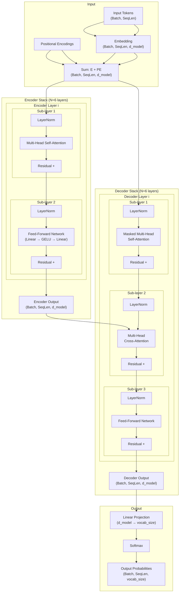

Licensed under Apache 2.0

# Chapter 3: The Transformer Architecture

This chapter covers the Transformer — the architecture that replaced recurrence and convolution as the dominant paradigm for sequence processing. Introduced by Vaswani et al. in 2017, the Transformer relies entirely on self-attention to model relationships between positions in a sequence, achieving state-of-the-art results in machine translation and enabling the development of large language models. By the end of this chapter, you will understand every component of the Transformer, be able to implement it from scratch, and appreciate the design choices that make it the foundation of modern AI systems.

## Learning Objectives

By the end of this chapter you will be able to:

1. Trace a forward pass through the full Transformer encoder-decoder architecture and explain why it outperforms recurrent models.
2. Implement scaled dot-product attention from scratch, explain the $\sqrt{d_k}$ scaling factor, and apply masking for causal decoding.
3. Build multi-head attention, interpret what different heads learn, and understand the parallel computation pattern.
4. Implement sinusoidal, learned, and RoPE positional encodings, and explain why absolute position information is essential for Transformers.
5. Construct Transformer encoder and decoder blocks with residual connections, layer normalization, and feed-forward networks.
6. Explain FlashAttention's IO-aware computation reordering and benchmark it against naive attention to quantify the memory bandwidth bottleneck.

## Prerequisites

- Chapter 2: Deep Learning Building Blocks (MLPs, RNNs, LSTMs, seq2seq, attention, LayerNorm).
- Familiarity with matrix multiplication, dot products, and softmax.
- Understanding of backpropagation and gradient computation.
- Basic PyTorch knowledge (tensors, autograd, nn.Module).

---

## 3.1 The Transformer Paper

The paper "Attention Is All You Need" (Vaswani et al., 2017) introduced the Transformer architecture — a model that processes entire sequences in parallel using self-attention, with no recurrence or convolution. The Transformer achieved then-state-of-the-art results on English-to-German and English-to-French translation tasks, while training an order of magnitude faster than recurrent models.

### Why the Transformer Changed Everything

Prior to 2017, sequence-to-sequence tasks relied on RNNs (LSTMs, GRUs). While LSTMs mitigated vanishing gradients through gating, they still suffered from two fundamental limitations:

1. **Sequential computation**: Each time step $t$ depends on step $t-1$, preventing parallelization during training. GPUs are built for parallel matrix operations, not sequential loops.
2. **Long-range dependencies**: Even with gating, information degrades over long sequences. The attention mechanism in seq2seq models helped, but it was applied only between encoder and decoder, not within sequences.

The Transformer eliminated both problems by replacing recurrence entirely with **self-attention** — a mechanism that computes pairwise interactions between all positions in a sequence in a single parallel operation. This made training dramatically faster and enabled models to learn relationships between arbitrarily distant tokens.

### The Transformer Architecture

The original Transformer follows the encoder-decoder paradigm:

- **Encoder**: A stack of $N$ identical layers. Each layer has two sub-layers: multi-head self-attention and a position-wise feed-forward network (FFN). Both sub-layers use residual connections and layer normalization.
- **Decoder**: A stack of $N$ identical layers. Each layer has three sub-layers: masked multi-head self-attention, multi-head cross-attention (attending to the encoder output), and a position-wise FFN. Again, residual connections and layer normalization surround each sub-layer.
- **Output**: A linear projection followed by softmax produces token probabilities.

The original model used $N=6$ layers for both encoder and decoder, $d_{model}=512$, 8 attention heads, and a FFN hidden dimension of 2048. The total parameter count was approximately 65 million — tiny by modern standards, but the architecture scaled to billions of parameters.

### Key Design Decisions

Several choices in the original paper became standards:

- **Pre-normalization**: LayerNorm is applied to the input of each sub-layer before the sub-layer computation, rather than after. This was adopted from the subsequent "Transformer-XL" and "GPT" variants and stabilizes training.
- **GELU activation**: The FFN uses GELU ($x \cdot \Phi(x)$) instead of ReLU, providing a smooth non-linearity that works well with attention outputs.
- **FFN expansion ratio**: The inner FFN dimension is $4 \times d_{model}$ (2048 when $d_{model}=512$), giving the model capacity for complex feature transformations.
- **Learning rate warmup**: The learning rate increases linearly for the first 4000 steps, then decays as $step^{-0.5}$. This prevents large gradients from destabilizing early training.
- **Label smoothing**: Training with $\epsilon=0.1$ label smoothing prevents the model from becoming overconfident and improves BLEU scores.

### Full Transformer Architecture Diagram



### Code: Minimal Transformer Following the Paper

```python
import math
import torch
import torch.nn as nn
import torch.nn.functional as F


class Embedding(nn.Module):
    """Token + positional embedding."""

    def __init__(self, vocab_size, d_model, max_len=5120):
        super().__init__()
        self.token_emb = nn.Embedding(vocab_size, d_model)
        self.position_emb = nn.Embedding(max_len, d_model)
        self.max_len = max_len

    def forward(self, x):
        """x: (batch, seq_len) -> (batch, seq_len, d_model)"""
        pos = torch.arange(x.size(1), device=x.device).unsqueeze(0)
        return self.token_emb(x) * math.sqrt(self.embedding_dim if hasattr(self, 'embedding_dim') else 512) + self.position_emb(pos)


def scaled_dot_product_attention(query, key, value, mask=None, dropout=None):
    """The core attention operation (Section 3.2 of the paper)."""
    d_k = query.size(-1)
    scores = torch.matmul(query, key.transpose(-2, -1)) / math.sqrt(d_k)
    if mask is not None:
        scores = scores.masked_fill(mask == 0, float('-inf'))
    attn = F.softmax(scores, dim=-1)
    if dropout is not None:
        attn = dropout(attn)
    return torch.matmul(attn, value), attn


class MultiHeadAttention(nn.Module):
    """Multi-head attention mechanism (Section 3.2.2 of the paper)."""

    def __init__(self, d_model, num_heads, dropout=0.1):
        super().__init__()
        assert d_model % num_heads == 0
        self.d_model = d_model
        self.num_heads = num_heads
        self.d_k = d_model // num_heads

        self.W_q = nn.Linear(d_model, d_model)
        self.W_k = nn.Linear(d_model, d_model)
        self.W_v = nn.Linear(d_model, d_model)
        self.W_o = nn.Linear(d_model, d_model)
        self.dropout = nn.Dropout(dropout)

    def forward(self, query, key, value, mask=None):
        """All inputs: (batch, seq_len, d_model)"""
        b, seq_len, _ = query.shape

        # Project and reshape: (batch, seq_len, d_model) -> (batch, num_heads, seq_len, d_k)
        q = self.W_q(query).view(b, seq_len, self.num_heads, self.d_k).transpose(1, 2)
        k = self.W_k(key).view(b, seq_len, self.num_heads, self.d_k).transpose(1, 2)
        v = self.W_v(value).view(b, seq_len, self.num_heads, self.d_k).transpose(1, 2)

        # Attention
        out, attn = scaled_dot_product_attention(q, k, v, mask, self.dropout)

        # Concatenate heads: (batch, num_heads, seq_len, d_k) -> (batch, seq_len, d_model)
        out = out.transpose(1, 2).contiguous().view(b, seq_len, self.d_model)
        return self.W_o(out)


class PositionWiseFFN(nn.Module):
    """Position-wise feed-forward network (Section 3.3 of the paper)."""

    def __init__(self, d_model, d_ff, dropout=0.1):
        super().__init__()
        self.fc1 = nn.Linear(d_model, d_ff)
        self.fc2 = nn.Linear(d_ff, d_model)
        self.dropout = nn.Dropout(dropout)

    def forward(self, x):
        return self.fc2(self.dropout(F.gelu(self.fc1(x))))


class EncoderLayer(nn.Module):
    """Single encoder layer (Section 3.4 of the paper)."""

    def __init__(self, d_model, num_heads, d_ff, dropout=0.1):
        super().__init__()
        self.self_attn = MultiHeadAttention(d_model, num_heads, dropout)
        self.ffn = PositionWiseFFN(d_model, d_ff, dropout)
        self.norm1 = nn.LayerNorm(d_model)
        self.norm2 = nn.LayerNorm(d_model)
        self.drop1 = nn.Dropout(dropout)
        self.drop2 = nn.Dropout(dropout)

    def forward(self, x, mask=None):
        # Pre-norm residual: x + Dropout(Attention(LayerNorm(x)))
        a = self.self_attn(self.norm1(x), self.norm1(x), self.norm1(x), mask)
        x = x + self.drop1(a)
        f = self.ffn(self.norm2(x))
        return x + self.drop2(f)


class DecoderLayer(nn.Module):
    """Single decoder layer (Section 3.4 of the paper)."""

    def __init__(self, d_model, num_heads, d_ff, dropout=0.1):
        super().__init__()
        self.self_attn = MultiHeadAttention(d_model, num_heads, dropout)
        self.cross_attn = MultiHeadAttention(d_model, num_heads, dropout)
        self.ffn = PositionWiseFFN(d_model, d_ff, dropout)
        self.norm1 = nn.LayerNorm(d_model)
        self.norm2 = nn.LayerNorm(d_model)
        self.norm3 = nn.LayerNorm(d_model)
        self.drop = nn.Dropout(dropout)

    def forward(self, x, enc_out, self_mask=None, cross_mask=None):
        # Masked self-attention
        a = self.self_attn(self.norm1(x), self.norm1(x), self.norm1(x), self_mask)
        x = x + self.drop(a)
        # Cross-attention
        c = self.cross_attn(self.norm2(x), enc_out, enc_out, cross_mask)
        x = x + self.drop(c)
        # FFN
        f = self.ffn(self.norm3(x))
        return x + self.drop(f)


class Transformer(nn.Module):
    """The full Transformer model from Vaswani et al. (2017)."""

    def __init__(self, src_vocab, tgt_vocab, d_model=512, num_heads=8,
                 d_ff=2048, num_layers=6, max_len=5120, dropout=0.1):
        super().__init__()
        self.d_model = d_model
        self.src_emb = nn.Embedding(src_vocab, d_model)
        self.tgt_emb = nn.Embedding(tgt_vocab, d_model)
        self.pos_enc = nn.Embedding(max_len, d_model)

        self.encoder_layers = nn.ModuleList(
            [EncoderLayer(d_model, num_heads, d_ff, dropout) for _ in range(num_layers)])
        self.decoder_layers = nn.ModuleList(
            [DecoderLayer(d_model, num_heads, d_ff, dropout) for _ in range(num_layers)])

        self.fc_out = nn.Linear(d_model, tgt_vocab)
        self.dropout = nn.Dropout(dropout)

    def _position_encoding(self, seq_len, device):
        return self.pos_enc.weight[:seq_len].unsqueeze(0).to(device)

    def generate_causal_mask(self, seq_len, device):
        return torch.tril(torch.ones(seq_len, seq_len, device=device)).bool()

    def encode(self, src, src_mask=None):
        """src: (batch, src_len) -> (batch, src_len, d_model)"""
        x = self.src_emb(src) * math.sqrt(self.d_model) + self._position_encoding(src.size(1), src.device)
        x = self.dropout(x)
        for layer in self.encoder_layers:
            x = layer(x, src_mask)
        return x

    def decode(self, tgt, enc_out, tgt_mask=None, cross_mask=None):
        """tgt: (batch, tgt_len), enc_out: (batch, src_len, d_model)"""
        x = self.tgt_emb(tgt) * math.sqrt(self.d_model) + self._position_encoding(tgt.size(1), tgt.device)
        x = self.dropout(x)
        for layer in self.decoder_layers:
            x = layer(x, enc_out, tgt_mask, cross_mask)
        return x

    def forward(self, src, tgt, src_mask=None, tgt_mask=None):
        """Returns logits: (batch, tgt_len, tgt_vocab)"""
        enc_out = self.encode(src, src_mask)
        dec_out = self.decode(tgt, enc_out, tgt_mask, src_mask)
        return self.fc_out(dec_out)


# --- Quick smoke test ---
if __name__ == "__main__":
    V = 1000
    model = Transformer(V, V, d_model=128, num_heads=4, d_ff=256, num_layers=2, dropout=0.1)

    src = torch.randint(0, V, (4, 20))  # batch=4, src_len=20
    tgt = torch.randint(0, V, (4, 15))  # batch=4, tgt_len=15
    tgt_mask = model.generate_causal_mask(15, src.device)

    logits = model(src, tgt, tgt_mask=tgt_mask)
    print(f"Output shape: {logits.shape}")  # (4, 15, 1000)

    # Count parameters
    total_params = sum(p.numel() for p in model.parameters())
    print(f"Total parameters: {total_params:,}")
    print("Minimal Transformer runs successfully.")
```

### Section 3.1 Exercises

**Exercise 3.1 (Easy) — Forward Pass Trace**

Using the architecture diagram above, trace the shape of the tensor at each step for a batch of 2 sequences with length 10, $d_{model}=512$, and 8 attention heads. Record the shape after: (a) embedding + position encoding, (b) first encoder self-attention, (c) first encoder FFN, (d) decoder cross-attention, (e) final linear projection (assuming vocab size 32,000).

**Exercise 3.2 (Medium) — Parameter Count**

The original Transformer (Vaswani et al., 2017) used $d_{model}=512$, $d_{ff}=2048$, 8 heads, 6 layers, and shared the embedding/output weight matrix with $V=37,000$ English + 32,000 German tokens (approximately 37K for simplicity). Compute the total number of trainable parameters. Break down the count by component: embeddings, attention projections, FFN, and output layer.

**Exercise 3.3 (Hard) — Ablation Study**

Take the minimal Transformer implementation above and run an ablation study. Compare these variants on a small translation task (sequence reversal, as in Chapter 2): (a) remove residual connections, (b) replace LayerNorm with BatchNorm, (c) replace GELU with ReLU, (d) reduce $d_{ff}$ from $4 \times d_{model}$ to $d_{model}$. Report how each variant affects training stability and final loss. Explain the role of each design choice.

---

## 3.2 Scaled Dot-Product Attention

Attention is the core mechanism that allows the Transformer to model relationships between positions in a sequence. It takes three inputs — queries ($Q$), keys ($K$), and values ($V$) — and produces a weighted sum of the values, where the weights are determined by the compatibility of each query with all keys.

### The Attention Function

Given a query vector $q \in \mathbb{R}^{d_k}$ and a set of key-value pairs $(k_i, v_i)$ for $i = 1, \ldots, n$, the attention output is:

$$\text{Attention}(Q, K, V) = \text{softmax}\left(\frac{QK^T}{\sqrt{d_k}}\right)V$$

where $Q \in \mathbb{R}^{n \times d_k}$, $K \in \mathbb{R}^{m \times d_k}$, and $V \in \mathbb{R}^{m \times d_v}$. The output has shape $\mathbb{R}^{n \times d_v}$.

The computation unfolds in three steps:

1. **Compute attention scores**: Multiply $Q$ by $K^T$ to get an $n \times m$ matrix of pairwise scores. Each entry $s_{ij} = q_i \cdot k_j$ measures how relevant position $j$ is to position $i$.
2. **Scale and normalize**: Divide by $\sqrt{d_k}$ to prevent softmax saturation, then apply softmax across the key dimension to get attention weights $\alpha_{ij} \in [0, 1]$ that sum to 1.
3. **Weighted sum**: Multiply the attention weights by $V$ to get the output.

### Why Divide by $\sqrt{d_k}$

Without scaling, the dot products $q \cdot k$ grow large as $d_k$ increases. If $q$ and $k$ have components drawn independently from $\mathcal{N}(0, 1)$, then $q \cdot k \sim \mathcal{N}(0, d_k)$. Large values push softmax into its saturated regions where gradients are near zero.

To see this, consider softmax applied to $[x, -x]$ for large $x$:

$$\text{softmax}([x, -x]) = \left[\frac{e^x}{e^x + e^{-x}}, \frac{e^{-x}{e^x + e^{-x}}\right] \approx [1, 0]$$

The derivative of this with respect to $x$ is $\approx 0$, causing the **vanishing gradient problem in attention**. Dividing by $\sqrt{d_k}$ keeps the scores in a range where softmax has meaningful gradients.

### Masking

Masking is used to prevent the model from attending to positions it should not see:

- **Causal (look-ahead) mask**: In the decoder's self-attention, position $i$ should only attend to positions $j \leq i$. This is enforced by setting $s_{ij} = -\infty$ for $j > i$, which makes the softmax weight zero. This is essential for autoregressive generation — the model must not "cheat" by seeing future tokens during training.
- **Padding mask**: When sequences in a batch have different lengths, shorter sequences are padded with a special token. The padding mask prevents attention from attending to padding tokens by setting $s_{ij} = -\infty$ where position $j$ is a padding token.

Both masks are applied to the attention scores before the softmax.

### Attention Computation as Matrix Operations

```
Scaled Dot-Product Attention: step-by-step matrix computation

Input dimensions: Q (n × d_k), K (m × d_k), V (m × d_v)
Output dimension:  (n × d_v)

Step 1: Compute attention scores (dot product)
Step 2: Scale by 1/sqrt(d_k)
Step 3: Apply softmax (row-wise)
Step 4: Weighted sum with values


  Q                          K^T
+---+---+---+            +---+---+---+---+
| q1| q2| ...| d_k       | k1| k2| k3| k4|
|   |   |   |            |   |   |   |   |
|   |   |   |            |   |   |   |   |
|   |   |   |            |   |   |   |   |
+---+---+---+            +---+---+---+---+
  n rows                     m rows

         MatMul (Q @ K^T)
                |
                v
  +---+---+---+---+          Scale: divide each entry by sqrt(d_k)
  | s1| s2| s3| s4|         Prevents softmax saturation for large d_k
  | s5| s6| s7| s8|
  | s9|s10|s11|s12|
  +---+---+---+---+
    n × m score matrix

                |
                v
  Softmax (row-wise): each row sums to 1
  +---+---+---+---+
  | a1| a2| a3| a4|    a1+a2+a3+a4 = 1
  | a5| a6| a7| a8|    a5+a6+a7+a8 = 1
  | a9|a10|a11|a12|
  +---+---+---+---+
    Attention weights α

                |
                v
  MatMul (α @ V)
  +---+---+---+---+     +---+---+---+---+
  | a1| a2| a3| a4|     | v1| v2| ...|d_v|
  | a5| a6| a7| a8|  ×   | v5| v6|    |   |
  | a9|a10|a11|a12|     | v9|v10|    |   |
  +---+---+---+---+     +---+---+---+---+
    attention weights        values

                |
                v
  +---+---+---+---+
  | o1| o2| ...|d_v|    Each output row is a weighted
  | o3| o4|    |   |    sum of value vectors, weighted
  | o5| o6|    |   |    by attention scores
  +---+---+---+---+
    Output: n × d_v


Example: sentence "The cat sat"
Query for "sat": what context do I need?
Key "The":    score 0.3  → weight 0.15
Key "cat":    score 2.1  → weight 0.60  (most relevant)
Key "sat":    score 1.0  → weight 0.25

Output for "sat" = 0.15*V(The) + 0.60*V(cat) + 0.25*V(sat)
The output vector for "sat" is enriched with information about "cat".
```

### Code: Scaled Dot-Product Attention

```python
import torch
import torch.nn.functional as F
import math


def scaled_dot_product_attention(query, key, value, mask=None,
                                  dropout=None, scale=None):
    """
    Scaled dot-product attention.

    Args:
        query:   (batch, num_heads, seq_len_q, d_k)
        key:     (batch, num_heads, seq_len_k, d_k)
        value:   (batch, num_heads, seq_len_k, d_v)
        mask:    (batch, 1, 1, seq_len_k) or (1, 1, seq_len_q, seq_len_k)
        dropout: nn.Dropout module
        scale:   optional scale factor (default: 1/sqrt(d_k))

    Returns:
        output:  (batch, num_heads, seq_len_q, d_v)
        attn_weights: (batch, num_heads, seq_len_q, seq_len_k)
    """
    d_k = query.size(-1)
    if scale is None:
        scale = 1.0 / math.sqrt(d_k)

    # Attention scores: (batch, heads, seq_q, seq_k)
    scores = torch.matmul(query, key.transpose(-2, -1)) * scale

    # Apply mask
    if mask is not None:
        scores = scores.masked_fill(mask == 0, float('-inf'))

    # Softmax and dropout
    attn_weights = F.softmax(scores, dim=-1)
    if dropout is not None:
        attn_weights = dropout(attn_weights)

    # Weighted sum of values
    output = torch.matmul(attn_weights, value)
    return output, attn_weights


# --- Demonstration ---
torch.manual_seed(42)

# Create sample inputs
batch, heads, seq_len, d_k = 1, 1, 4, 8
Q = torch.randn(batch, heads, seq_len, d_k)
K = torch.randn(batch, heads, seq_len, d_k)
V = torch.randn(batch, heads, seq_len, d_k)

# Causal mask for autoregressive decoding
causal_mask = torch.tril(torch.ones(seq_len, seq_len)).unsqueeze(0).unsqueeze(0)
print("Causal mask:")
print(causal_mask.squeeze())

# Self-attention with causal mask
output, weights = scaled_dot_product_attention(Q, K, V, mask=causal_mask)
print(f"\nOutput shape: {output.shape}")
print(f"Attention weights shape: {weights.shape}")

# Print attention weights as a text heatmap
words = ["The", "cat", "sat", "down"]
print("\nAttention weights (causal):")
print(f"{'':>8s}", end="")
for w in words:
    print(f" {w:>6s}", end="")
print()
for i, w in enumerate(words):
    print(f" {w:<6s}", end="  ")
    for j in range(seq_len):
        print(f" {weights[0, 0, i, j].item():6.3f}", end="")
    print()

print("\nKey observations:")
print("  - Each row sums to 1.0 (softmax)")
print("  - Upper triangle is 0.0 (causal masking)")
print("  - Diagonal and lower triangle contain the attention weights")
```

### Section 3.2 Exercises

**Exercise 3.4 (Easy) — Why Scaling Matters**

Implement scaled dot-product attention with $d_k \in \{4, 16, 64, 256, 1024\}$. For each dimension, compute the attention scores with and without the $\sqrt{d_k}$ scaling factor. Plot the histogram of attention scores (before softmax) for each case. Show that unscaled scores have increasing variance with $d_k$, pushing softmax toward one-hot distributions.

**Exercise 3.5 (Medium) — Attention with Different Masks**

Implement the following attention patterns and visualize the resulting attention weight matrices: (a) full attention (no mask), (b) causal mask, (c) local window mask (attend only to $\pm 2$ positions), (d) strided mask (attend to every 3rd position). Discuss which pattern would be most appropriate for: machine translation, language modeling, and long-document summarization.

**Exercise 3.6 (Hard) — Analyzing the Softmax Bottleneck**

Consider the softmax derivative: $\frac{\partial \text{softmax}(z)_i}{\partial z_j} = \text{softmax}(z)_i (\mathbb{1}_{i=j} - \text{softmax}(z)_j)$. Show that when one attention weight approaches 1 (and the rest approach 0), the gradient with respect to all non-winning scores approaches 0. Then, compute the gradient norm for attention scores with $d_k \in \{8, 64, 512\}$ both with and without scaling. Quantify how much scaling preserves gradient magnitude.

---

## 3.3 Multi-Head Attention

Single-head attention computes a single weighted average of values. While effective, it limits the model's ability to capture different types of relationships simultaneously. Multi-head attention addresses this by running attention multiple times in parallel with different learned projections — each head can specialize in a different aspect of the input.

### Why Multiple Heads?

Consider the sentence "The animal didn't cross the street because it was too tired." The pronoun "it" refers to "animal." A single attention mechanism might average all the context, but it cannot simultaneously:

1. Track the pronoun reference (connecting "it" to "animal")
2. Parse syntactic dependencies (subject-verb agreement)
3. Capture semantic relationships ("street" and "cross")

Multi-head attention allows different heads to specialize: one head might learn to resolve pronouns, another to track syntactic structure, and another to capture semantic similarity.

### The Multi-Head Attention Mechanism

Multi-head attention projects the queries, keys, and values $h$ times with different learned linear projections. Each projection maps $Q \in \mathbb{R}^{n \times d_{model}}$ to $Q^{(i)} \in \mathbb{R}^{n \times d_k}$ where $d_k = d_{model} / h$. Each head then applies scaled dot-product attention independently, and the outputs are concatenated and projected once more:

$$\text{MultiHead}(Q, K, V) = \text{Concat}(\text{head}_1, \ldots, \text{head}_h) W^O$$

where $\text{head}_i = \text{Attention}(QW_Q^{(i)}, KW_K^{(i)}, VW_V^{(i)})$.

The final projection $W^O \in \mathbb{R}^{d_{model} \times d_{model}}$ mixes information across heads.

### Implementation Details

The projections $W_Q^{(i)}$, $W_K^{(i)}$, $W_V^{(i)}$ are each $d_k \times d_{model}$. Instead of using $h$ separate matrices, they are commonly implemented as a single $d_{model} \times d_{model}$ matrix that is reshaped into $h$ heads. This is more efficient because it avoids $h$ separate matrix multiplications.

The computational cost of multi-head attention is $O(n^2 \cdot d_{model})$ per layer (since $h \cdot n^2 \cdot d_k = n^2 \cdot d_{model}$). This is the same cost as single-head attention with dimension $d_{model}$, but the expressivity is much higher because each head can learn different attention patterns.

### Interpreting Attention Heads

Research has shown that different heads develop specialized functions:

- **Syntactic heads** focus on grammatical relationships (subject-verb, modifier-noun)
- **Entity-tracking heads** follow the same entity across a document (pronoun resolution, coreference)
- **Copy heads** attend strongly to the previous position, enabling the model to repeat tokens
- **Bias heads** attend uniformly to all positions, acting as a global average

Visualizing attention weights reveals distinct patterns — some heads are sparse (focusing on few positions), others are dense (distributing attention broadly).

### Multi-Head Attention Diagram

```
Multi-Head Attention: 4 heads processing "The cat sat on the mat"

Input: X (seq_len=6, d_model=128)

     X (6 × 128)
     |
     +-------+----------+-----------+----------+
     |       |          |           |          |
   W_Q[0]  W_Q[1]    W_Q[2]     W_Q[3]       -- Query projections
   W_K[0]  W_K[1]    W_K[2]     W_K[3]       -- Key projections
   W_V[0]  W_V[1]    W_V[2]     W_V[3]       -- Value projections
     |       |          |           |          |
     v       v          v           v          |
  Q_0      Q_1        Q_2         Q_3         Each head: d_k = 32
  K_0      K_1        K_2         K_3         shape: (6, 32)
  V_0      V_1        V_2         V_3
     |       |          |           |          |
     v       v          v           v          |
  +-------+   +-------+   +-------+   +-------+
  | Head 0 |   | Head 1 |   | Head 2 |   | Head 3 |
  | Attn(Q0|   | Attn(Q1|   | Attn(Q2|   | Attn(Q3|
  |  ,K0,V0)|  |  ,K1,V1)|  |  ,K2,V2)|  |  ,K3,V3)|
  +-------+   +-------+   +-------+   +-------+
     |           |           |           |
     v           v           v           v
  O_0 (6×32)  O_1 (6×32)  O_2 (6×32)  O_3 (6×32)
     \           |           |          /
      \          |           |         /
       +---- Concatenate ----+        /
              |               |      /
              v               |     /
      [O_0 | O_1 | O_2 | O_3]      |
      shape: (6, 128)              |
              |                     |
              v                     |
         W_O (Linear) <-------------+
         shape: (6, 128)
              |
              v
      Output (6 × 128)


What each head might learn:
  Head 0 (syntactic): "sat" attends to "cat" (subject-verb)
  Head 1 (copy):      each token attends to itself (diagonal)
  Head 2 (entity):    "on" attends to "cat" (prepositional relation)
  Head 3 (semantic):  "mat" attends to "cat" (semantic similarity)


Projection matrices (conceptual):
  W_Q = [W_Q[0]; W_Q[1]; W_Q[2]; W_Q[3]]  where each W_Q[i] is (32 × 128)
  Stacked: W_Q is (128 × 128), reshaped to (4, 32, 128)

  Efficient implementation:
    Q = X @ W_Q  →  (batch, seq, 128)
    Q = Q.view(batch, seq, 4, 32).transpose(1, 2)  →  (batch, 4, seq, 32)
```

### Code: Multi-Head Attention

```python
import torch
import torch.nn as nn
import torch.nn.functional as F
import math


class MultiHeadAttention(nn.Module):
    """Multi-head attention with optional masking."""

    def __init__(self, d_model: int, num_heads: int, dropout: float = 0.1):
        super().__init__()
        assert d_model % num_heads == 0, "d_model must be divisible by num_heads"

        self.d_model = d_model
        self.num_heads = num_heads
        self.d_k = d_model // num_heads

        # Single projection matrices (more efficient than per-head matrices)
        self.W_q = nn.Linear(d_model, d_model, bias=False)
        self.W_k = nn.Linear(d_model, d_model, bias=False)
        self.W_v = nn.Linear(d_model, d_model, bias=False)
        self.W_o = nn.Linear(d_model, d_model)

        self.dropout = nn.Dropout(dropout)

    def forward(self, query, key, value, mask=None):
        """
        Args:
            query: (batch, seq_q, d_model)
            key:   (batch, seq_k, d_model)
            value: (batch, seq_k, d_model)
            mask:  broadcastable to (batch, 1, seq_q, seq_k)

        Returns:
            output: (batch, seq_q, d_model)
        """
        batch_size = query.size(0)

        # Linear projections
        Q = self.W_q(query)  # (batch, seq_q, d_model)
        K = self.W_k(key)    # (batch, seq_k, d_model)
        V = self.W_v(value)  # (batch, seq_k, d_model)

        # Reshape into heads: (batch, seq, d_model) -> (batch, heads, seq, d_k)
        Q = Q.view(batch_size, -1, self.num_heads, self.d_k).transpose(1, 2)
        K = K.view(batch_size, -1, self.num_heads, self.d_k).transpose(1, 2)
        V = V.view(batch_size, -1, self.num_heads, self.d_k).transpose(1, 2)

        # Scaled dot-product attention per head
        scores = torch.matmul(Q, K.transpose(-2, -1)) / math.sqrt(self.d_k)

        if mask is not None:
            scores = scores.masked_fill(mask == 0, float('-inf'))

        attn_weights = F.softmax(scores, dim=-1)
        attn_weights = self.dropout(attn_weights)

        # Weighted sum
        output = torch.matmul(attn_weights, V)  # (batch, heads, seq_q, d_k)

        # Concatenate heads: (batch, heads, seq_q, d_k) -> (batch, seq_q, d_model)
        output = output.transpose(1, 2).contiguous().view(batch_size, -1, self.d_model)

        # Final projection
        output = self.W_o(output)
        return output, attn_weights


# --- Demonstration: visualizing what different heads attend to ---
torch.manual_seed(42)

model = MultiHeadAttention(d_model=128, num_heads=4)
words = ["The", "cat", "sat", "on", "the", "mat"]
seq_len = len(words)

# Random input
X = torch.randn(1, seq_len, 128)
output, weights = model(X, X, X)

print(f"Input shape:  {X.shape}")
print(f"Output shape: {output.shape}")
print(f"Attention weights shape: {weights.shape}")
print()

# Print attention weights for each head
for h in range(4):
    print(f"Head {h} attention weights:")
    print(f"{'':>8s}", end="")
    for w in words:
        print(f" {w:>4s}", end="")
    print()
    for i, w in enumerate(words):
        print(f" {w:<4s}", end="  ")
        for j in range(seq_len):
            print(f" {weights[0, h, i, j].item():5.3f}", end="")
        print()
    print()

print("Each head develops a different attention pattern.")
print("In a trained model, heads specialize in syntactic, semantic,")
print("and entity-tracking relationships.")
```

### Section 3.3 Exercises

**Exercise 3.7 (Easy) — Head Specialization**

Load a pre-trained GPT-2 model (use `transformers` library). Extract the attention weights for a single input sentence across all layers and heads. For each head, compute the entropy of the attention distribution. Rank the heads by entropy — which heads are most focused (lowest entropy) and which are most distributed (highest entropy)?

**Exercise 3.8 (Medium) — Single-Head vs Multi-Head**

Implement both single-head attention ($d_k = d_{model}$) and multi-head attention (4 heads, $d_k = d_{model}/4$) with the same total parameter budget. Train both on a sequence ordering task: given a permuted sequence $[3, 1, 4, 2, 5]$, predict the sorted version. Compare final loss and convergence speed. Does multi-head attention provide a real advantage for this task?

**Exercise 3.9 (Hard) — Head Removal Experiment**

Train a small Transformer (2 layers, 8 heads) on a language modeling task. After training, systematically zero out the output of individual heads (one at a time) and measure the increase in validation perplexity. Rank the heads by importance. Do the least important heads show random attention patterns, or do they serve a subtle function?

---

## 3.4 Positional Encodings

The self-attention mechanism is **permutation-equivariant**: if you reorder the input tokens, the output simply gets reordered in the same way. This means the Transformer has no inherent sense of position — the token at position 1 is indistinguishable from the token at position 10. To give the model position information, we add **positional encodings** to the token embeddings.

### Why Position Matters

Natural language is fundamentally ordered. "The cat chased the dog" means something entirely different from "The dog chased the cat." The attention mechanism computes relationships based on content similarity (dot products), not spatial proximity. Without positional information, the model cannot distinguish between word order, grammatical structure, or temporal sequences.

### Sinusoidal Positional Encodings

The original Transformer uses fixed sinusoidal functions:

$$PE_{(pos, 2i)} = \sin\left(\frac{pos}{10000^{2i/d_{model}}}\right)$$
$$PE_{(pos, 2i+1)} = \cos\left(\frac{pos}{10000^{2i/d_{model}}}\right)$$

where $pos$ is the position and $i$ is the dimension index.

Key properties of this design:

1. **Unique encoding**: Each position gets a distinct vector.
2. **Bounded values**: All entries are in $[-1, 1]$, preventing the positional encoding from dominating the token embedding.
3. **Relative position encoding**: For any fixed offset $k$, $PE_{pos+k}$ can be represented as a linear function of $PE_{pos}$, because $\sin(a+b)$ can be expressed as a linear combination of $\sin(a)$ and $\cos(a)$. This allows the model to generalize to relative positions it hasn't seen during training.
4. **Frequency hierarchy**: Lower dimensions have higher frequencies (fine-grained position info), higher dimensions have lower frequencies (coarse-grained position info).

### Learned Positional Embeddings

An alternative approach is to learn a positional embedding table — a trainable lookup table of size $max\_len \times d_{model}$. This is what GPT-2 and BERT use. The advantage is that the model can learn position representations tailored to the data distribution. The disadvantage is that it cannot generalize to sequences longer than $max\_len$.

### RoPE (Rotary Positional Embeddings)

RoPE (Su, 2021) encodes position through **rotation** rather than addition. Instead of adding a positional vector to the embedding, RoPE rotates the query and key vectors by an angle proportional to their position:

$$\begin{bmatrix} q_{2m}^{(pos)} \\ q_{2m+1}^{(pos)} \end{bmatrix} = \begin{bmatrix} \cos(m\theta_{pos}) & -\sin(m\theta_{pos}) \\ \sin(m\theta_{pos}) & \cos(m\theta_{pos}) \end{bmatrix} \begin{bmatrix} q_{2m} \\ q_{2m+1} \end{bmatrix}$$

where $\theta_{pos} = pos / 10000^{m/d_{model}}$.

The key insight is that the dot product of two rotated vectors depends only on their **relative position**, not their absolute positions:

$$q_{pos_i}^{(pos_i)} \cdot k_{pos_j}^{(pos_j)} = q_{pos_i} \cdot k_{pos_j} \cdot \cos((i-j)\theta)$$

This makes RoPE naturally encode relative positions, which is often more useful than absolute positions. RoPE is used in LLaMA, PaLM, and most modern LLMs.

### ALiBi (Attention Linear Biases)

ALiBi (Press et al., 2022) takes a different approach: instead of modifying the embeddings, it adds a linear penalty to the attention scores based on the distance between positions:

$$s_{ij} = q_i \cdot k_j + m \cdot |i - j|$$

where $m$ is a negative slope that differs per head. ALiBi requires no positional encoding at all — the position information is encoded entirely in the attention pattern. This makes ALiBi exceptionally good at extrapolating to longer sequences than seen during training.

### Relative vs Absolute Position Encoding

| Approach | Type | Extrapolation | Used By |
|----------|------|---------------|---------|
| Sinusoidal | Absolute (additive) | Moderate | Original Transformer |
| Learned | Absolute (additive) | Poor (bounded by max_len) | BERT, GPT-2 |
| RoPE | Relative (rotational) | Good | LLaMA, PaLM |
| ALiBi | Relative (attention bias) | Excellent | Longformer variants |

### Sinusoidal Positional Encoding Table

```
Sinusoidal Positional Encoding: PE[pos, dim]

Dimensions: d_model = 16 (showing first 8 dimensions for clarity)
Each row is a position, each column is a dimension pair (sin, cos)

         Dim 0 (sin)  Dim 1 (cos)  Dim 2 (sin)  Dim 3 (cos)  Dim 4 (sin)  Dim 5 (cos)  Dim 6 (sin)  Dim 7 (cos)
Pos 0     0.000        1.000        0.000        1.000        0.000        1.000        0.000        1.000
Pos 1     0.841        0.540        0.063        0.998        0.013        1.000        0.002        1.000
Pos 2     0.909        -0.416       0.125        0.992        0.025        1.000        0.005        1.000
Pos 3     0.141        -0.990       0.188        0.982        0.038        1.000        0.007        1.000
Pos 4    -0.757        -0.653       0.249        0.969        0.050        1.000        0.010        1.000
Pos 5    -0.959         0.282       0.309        0.951        0.063        1.000        0.012        1.000
Pos 6    -0.279         0.961       0.368        0.930        0.075        1.000        0.015        1.000
Pos 7     0.657         0.754       0.426        0.905        0.087        1.000        0.017        1.000

Frequency interpretation:
  Dim 0-1: highest frequency (period = 2π)     — captures fine position differences
  Dim 2-3: lower frequency (period = 2π × 10^2) — captures medium-range patterns
  Dim 4-5: even lower (period = 2π × 10^4)      — captures long-range structure
  Dim 6-7: lowest frequency (period = 2π × 10^6) — captures global position

Key property: PE[pos+k] is a linear function of PE[pos] for any fixed offset k.
This allows the model to learn to attend to relative positions.

Visualization of first two dimensions (sin/cos trace):

  y (dim 0, sin)
  1 |  *               *
    |   * *           * *
  0 |    *     * *     *
    |           * * *
 -1 |            *
    +----------------------- x (position)
      0  1  2  3  4  5  6  7

  The encoding traces a spiral in the sin/cos plane,
  with different frequency for each dimension pair.
```

### RoPE Rotation Visualization

```
RoPE: Rotary Positional Embeddings

Instead of ADDING position to embeddings, RoPE ROTATES them.

Standard embedding (no position):
  Token "cat" at position 0:  q = [0.8, 0.6, ...]
  Token "cat" at position 3:  q = [0.8, 0.6, ...]  (identical!)

RoPE embedding (with rotation):
  Token "cat" at position 0:
    q[0] = [0.8, 0.6, ...]  rotated by θ_0 = 0°
       = [0.8, 0.6, ...]

  Token "cat" at position 3:
    q[3] = [0.8, 0.6, ...]  rotated by θ_3
       = [0.8·cos(θ₃) - 0.6·sin(θ₃),  0.8·sin(θ₃) + 0.6·cos(θ₃), ...]

Visualization of rotation for first dimension pair:

  2D plane (q_2m, q_2m+1)

      q_2m+1
        ^
        |
    0.6 +         * (pos=0, original)
        |        / |
        |       /  |  rotation angle θ_pos
        |      /   |
        |     *----+ (pos=3, rotated)
        |    /  θ₃
        |   /
        +------------------> q_2m
        0    0.6   0.8

  The same token vector is rotated by different angles
  depending on position. The rotation angle increases
  linearly with position for each dimension pair.

Key mathematical property:
  q_(pos_i) · k_(pos_j) = q · k · cos((pos_i - pos_j) × θ)

The dot product depends ONLY on the relative position (pos_i - pos_j),
not on the absolute positions. This is why RoPE captures relative
positioning naturally.

Comparison:
  Sinusoidal: PE(pos+k) = linear_func(PE(pos))  → relative in embedding space
  RoPE:       q(pos_i)·k(pos_j) = f(q·k, pos_i-pos_j)  → relative in attention
```

### Code: Sinusoidal, Learned, and RoPE Positional Encodings

```python
import torch
import torch.nn as nn
import math


class SinusoidalPositionalEncoding(nn.Module):
    """Fixed sinusoidal positional encodings (Vaswani et al., 2017)."""

    def __init__(self, d_model: int, max_len: int = 5120):
        super().__init__()
        pe = torch.zeros(max_len, d_model)
        position = torch.arange(0, max_len, dtype=torch.float).unsqueeze(1)
        div_term = torch.exp(torch.arange(0, d_model, 2).float() *
                             (-math.log(10000.0) / d_model))
        pe[:, 0::2] = torch.sin(position * div_term)
        pe[:, 1::2] = torch.cos(position * div_term)
        self.register_buffer('pe', pe)

    def forward(self, x):
        """x: (batch, seq_len, d_model) -> adds positional encoding"""
        return x + self.pe[:x.size(1)].unsqueeze(0)


class LearnedPositionalEncoding(nn.Module):
    """Learned positional embeddings (GPT-2, BERT)."""

    def __init__(self, d_model: int, max_len: int = 5120):
        super().__init__()
        self.pe = nn.Embedding(max_len, d_model)
        self.max_len = max_len

    def forward(self, x):
        """x: (batch, seq_len, d_model) -> adds learned positional encoding"""
        seq_len = x.size(1)
        positions = torch.arange(seq_len, device=x.device).unsqueeze(0)
        return x + self.pe(positions)


class RoPE(nn.Module):
    """Rotary Positional Embeddings (Su, 2021).

    Rotates query and key vectors by position-dependent angles.
    Unlike additive encodings, RoPE is applied directly to Q and K
    before the attention computation, not to the input embeddings.
    """

    def __init__(self, d_model: int, max_len: int = 5120, base: float = 10000.0):
        super().__init__()
        # Frequency bands: one per dimension pair
        frequencies = torch.arange(0, d_model, 2).float() / d_model
        self.register_buffer('freq', base ** -frequencies)  # (d_model/2,)
        self.max_len = max_len

    def _get_rotation_matrix(self, seq_len: int, device: torch.device):
        """Compute rotation angles for positions 0..seq_len-1."""
        positions = torch.arange(seq_len, device=device).float().unsqueeze(1)
        angles = positions * self.freq.to(device)  # (seq_len, d_model/2)
        return torch.cat([torch.cos(angles), torch.sin(angles)], dim=-1)

    def forward(self, x: torch.Tensor) -> torch.Tensor:
        """
        Apply RoPE rotation to input tensor.

        Args:
            x: (batch, seq_len, d_model) — query or key tensor

        Returns:
            Rotated tensor, same shape as x
        """
        seq_len = x.size(1)
        x_reshaped = x.reshape(*x.shape[:-1], -1, 2)  # (batch, seq, d_model/2, 2)

        # Rotation: [cos, -sin; sin, cos] × [x_even; x_odd]
        cos = torch.cos(self._get_angles(seq_len, x.device)).unsqueeze(0).unsqueeze(-1)
        sin = torch.sin(self._get_angles(seq_len, x.device)).unsqueeze(0).unsqueeze(-1)

        x1, x2 = x_reshaped[..., 0:1], x_reshaped[..., 1:2]
        rotated = torch.cat([x1 * cos - x2 * sin, x1 * sin + x2 * cos], dim=-1)
        return rotated.reshape_as(x)

    def _get_angles(self, seq_len: int, device: torch.device):
        """Get angles: (seq_len, d_model/2)."""
        positions = torch.arange(seq_len, device=device).float().unsqueeze(1)
        return positions * self.freq.to(device)


# --- Demonstration ---
torch.manual_seed(42)

d_model = 16
seq_len = 8
batch = 2

# Random embeddings
embeddings = torch.randn(batch, seq_len, d_model)

# Sinusoidal encoding
sin_pe = SinusoidalPositionalEncoding(d_model)
sin_encoded = sin_pe(embeddings)
print("Sinusoidal PE (first token, first 4 dims):")
print(f"  Embedding:    {embeddings[0, 0, :4].detach().flatten().tolist()}")
print(f"  Positional:   {sin_pe.pe[0, :4].flatten().tolist()}")
print(f"  Combined:     {sin_encoded[0, 0, :4].detach().flatten().tolist()}")

# Learned encoding
learned_pe = LearnedPositionalEncoding(d_model)
learned_encoded = learned_pe(embeddings)
print(f"\nLearned PE (first token, first 4 dims):")
print(f"  Embedding:    {embeddings[0, 0, :4].detach().flatten().tolist()}")
print(f"  Positional:   {learned_pe.pe.weight[0, :4].flatten().tolist()}")
print(f"  Combined:     {learned_encoded[0, 0, :4].detach().flatten().tolist()}")

# RoPE encoding
rope = RoPE(d_model)
rope_encoded = rope(embeddings)
print(f"\nRoPE (first token, first 4 dims):")
print(f"  Original:     {embeddings[0, 0, :4].detach().flatten().tolist()}")
print(f"  RoPE pos 0:   {rope_encoded[0, 0, :4].detach().flatten().tolist()}")
print(f"  RoPE pos 3:   {rope_encoded[0, 3, :4].detach().flatten().tolist()}")

# Demonstrate RoPE relative position property
print("\nRoPE relative position property:")
print("  q_pos0 · k_pos0 should equal q_pos3 · k_pos3 (same relative position 0)")
q = torch.randn(1, seq_len, d_model)
q_rope = rope(q)
k_rope = rope(q.clone())  # same values, different positions

dot_0_0 = torch.dot(q_rope[0, 0], k_rope[0, 0]).item()
dot_3_3 = torch.dot(q_rope[0, 3], k_rope[0, 3]).item()
dot_0_3 = torch.dot(q_rope[0, 0], k_rope[0, 3]).item()
dot_3_6 = torch.dot(q_rope[0, 3], k_rope[0, 6]).item()

print(f"  q[0]·k[0] = {dot_0_0:.6f}")
print(f"  q[3]·k[3] = {dot_3_3:.6f}")
print(f"  (both same relative position 0, values should be equal)")
print(f"  q[0]·k[3] = {dot_0_3:.6f}")
print(f"  q[3]·k[6] = {dot_3_6:.6f}")
print(f"  (both same relative position 3, values should be equal)")
```

### Section 3.4 Exercises

**Exercise 3.10 (Easy) — Positional Encoding Comparison**

Implement sinusoidal, learned, and RoPE positional encodings. For a sequence of 10 tokens, print the positional encoding vectors for positions 0 through 9 (showing the first 8 dimensions). Compute the pairwise cosine similarity between all position pairs for each encoding type. Which encoding produces the most distinct position vectors?

**Exercise 3.11 (Medium) — Extrapolation Test**

Train a tiny Transformer (1 layer, 2 heads, $d_{model}=64$) on sequence ordering (predicting the next number in $1, 2, 3, \ldots, N$) with sequences of length 10. Then test on sequences of length 20, 30, and 50. Compare sinusoidal, learned, and RoPE encodings. Which generalizes best to longer sequences?

**Exercise 3.12 (Hard) — ALiBi Implementation**

Implement ALiBi positional encoding. Add a linear bias $m \cdot |i - j|$ to the attention scores, where $m$ takes values from $\{-8, -4, -2, -1, -0.5, -0.25, -0.125, -0.0625\}$ for 8 heads. Train on a language modeling task and test on sequences 2×, 4×, and 8× longer than training length. Compare extrapolation performance to RoPE and sinusoidal encodings.

---

## 3.5 Transformer Blocks

Transformer blocks are the repeated building units of both the encoder and decoder stacks. Understanding the block structure — the interplay between attention, feed-forward networks, residual connections, and normalization — is essential for building and debugging Transformer models.

### The Encoder Block

Each encoder layer applies two transformations:

1. **Multi-head self-attention**: Each position attends to all positions in the input, allowing information to flow between any pair of positions.
2. **Position-wise feed-forward network (FFN)**: A two-layer MLP applied independently at each position, allowing the model to transform the attention output.

Both sub-layers are wrapped in **residual connections** and **layer normalization**:

$$\text{output} = x + \text{SubLayer}(\text{LayerNorm}(x))$$

This is called **pre-normalization** (norm before the sub-layer), which was shown to train more stably than post-normalization (norm after).

### The Decoder Block

Each decoder layer has three sub-layers:

1. **Masked multi-head self-attention**: Same as the encoder, but with a causal mask preventing position $i$ from attending to position $j > i$. This ensures the autoregressive property.
2. **Multi-head cross-attention**: The decoder attends to the encoder output. Queries come from the decoder, keys and values come from the encoder. This allows the decoder to incorporate information from the source sequence.
3. **Position-wise FFN**: Same structure as the encoder FFN.

### The Feed-Forward Network

The FFN in each block is a simple two-layer MLP:

$$\text{FFN}(x) = W_2 \cdot \text{GELU}(W_1 x + b_1) + b_2$$

The inner dimension $d_{ff}$ is typically $4 \times d_{model}$. This expansion gives the model capacity for complex feature transformations. The GELU activation provides a smooth non-linearity:

$$\text{GELU}(x) = x \cdot \Phi(x) = x \cdot \frac{1}{2}\left(1 + \text{erf}\left(\frac{x}{\sqrt{2}}\right)\right)$$

The FFN is "position-wise" — it operates on each position independently, meaning the same weights are shared across all positions in the sequence. It can be viewed as a per-position feature transformer that enriches the attention output.

### Why Residual Connections and GELU

**Residual connections** ($x + f(x)$) solve the degradation problem in deep networks. Without them, training very deep networks (12, 24, or more layers) is nearly impossible because gradients vanish through many layers of non-linear transformations. Residual connections create identity shortcuts, ensuring that at minimum the layer can learn to pass through its input unchanged.

**GELU** over ReLU because attention outputs are smooth, continuous vectors. ReLU's sharp non-linearity at zero can disrupt the subtle signal patterns produced by attention. GELU's soft gating ($x \cdot \sigma(1.702x)$) preserves more information than the hard thresholding of ReLU.

### Decoder Block with Mask and Cross-Attention

```
Decoder Block: masked self-attention, cross-attention, FFN, residuals

Input: x (batch, tgt_len, d_model)
Encoder output: enc (batch, src_len, d_model)

                        Sub-layer 1: Masked Self-Attention
     x ───────────────────┐
                          ▼
                      [LayerNorm]
                          ▼
                    [Masked MHA]
                    (causal mask
                     prevents attending
                     to future tokens)
                          ▼
                   (+) residual ────────────────┐
                          │                     │
                          ▼                     │
                        Sub-layer 2: Cross-Attention
                          │                     │
                          ▼                     │
                      [LayerNorm] ◄─────────────┘
                          ▼
                    [Cross-Attention]
                     Q from decoder
                     K,V from encoder
                     (allows decoder to
                      "read" source)
                          ▼
                   (+) residual ────────────────┐
                          │                     │
                          ▼                     │
                        Sub-layer 3: FFN        │
                          │                     │
                          ▼                     │
                      [LayerNorm] ◄─────────────┘
                          ▼
                   [FFN: Linear → GELU → Linear]
                          ▼
                   (+) residual ────────────────┐
                          │                     │
                          ▼                     │
                    Output (batch,             │
                     tgt_len, d_model) ─────────┘


Causal mask for tgt_len=5:
          pos0  pos1  pos2  pos3  pos4
     pos0   1     0     0     0     0
     pos1   1     1     0     0     0
     pos2   1     1     1     0     0
     pos3   1     1     1     1     0
     pos4   1     1     1     1     1

Cross-attention: queries from decoder position i,
keys/values from ALL encoder positions (no mask needed
unless source has padding tokens).


FFN expansion:
  Input:  (batch, seq, d_model=512)
  Linear: (batch, seq, d_ff=2048)  ← 4× expansion
  GELU:   (batch, seq, d_ff=2048)  ← smooth non-linearity
  Linear: (batch, seq, d_model=512) ← project back
```

### Code: Transformer Decoder Block

```python
import torch
import torch.nn as nn
import torch.nn.functional as F
import math


class TransformerDecoderBlock(nn.Module):
    """Single Transformer decoder block with pre-normalization.

    Contains:
    1. Masked multi-head self-attention
    2. Multi-head cross-attention (decoder → encoder)
    3. Position-wise feed-forward network

    Each sub-layer has a residual connection and pre-LayerNorm.
    """

    def __init__(self, d_model: int, num_heads: int, d_ff: int = 2048,
                 dropout: float = 0.1):
        super().__init__()
        self.d_model = d_model

        # Sub-layer 1: Masked self-attention
        self.self_attn = nn.MultiheadAttention(d_model, num_heads,
                                                dropout=dropout, batch_first=True)
        self.norm1 = nn.LayerNorm(d_model)
        self.drop1 = nn.Dropout(dropout)

        # Sub-layer 2: Cross-attention
        self.cross_attn = nn.MultiheadAttention(d_model, num_heads,
                                                 dropout=dropout, batch_first=True)
        self.norm2 = nn.LayerNorm(d_model)
        self.drop2 = nn.Dropout(dropout)

        # Sub-layer 3: FFN
        self.ffn = nn.Sequential(
            nn.Linear(d_model, d_ff),
            nn.GELU(),
            nn.Dropout(dropout),
            nn.Linear(d_ff, d_model)
        )
        self.norm3 = nn.LayerNorm(d_model)
        self.drop3 = nn.Dropout(dropout)

    def forward(self, x, memory, causal_mask=None, key_padding_mask=None):
        """
        Args:
            x:              (batch, tgt_len, d_model) — decoder input
            memory:         (batch, src_len, d_model) — encoder output
            causal_mask:    (tgt_len, tgt_len) boolean mask
            key_padding_mask: (batch, src_len) boolean mask for padding

        Returns:
            output: (batch, tgt_len, d_model)
        """
        # Sub-layer 1: Masked self-attention (pre-norm residual)
        attn_out, _ = self.self_attn(
            self.norm1(x), self.norm1(x), self.norm1(x),
            attn_mask=causal_mask,
            need_weights=False
        )
        x = x + self.drop1(attn_out)

        # Sub-layer 2: Cross-attention (pre-norm residual)
        cross_out, _ = self.cross_attn(
            self.norm2(x), memory, memory,
            key_padding_mask=key_padding_mask,
            need_weights=False
        )
        x = x + self.drop2(cross_out)

        # Sub-layer 3: FFN (pre-norm residual)
        ffn_out = self.ffn(self.norm3(x))
        x = x + self.drop3(ffn_out)

        return x


# --- Demonstration ---
torch.manual_seed(42)

d_model = 128
num_heads = 4
d_ff = 512
num_layers = 3

# Create a stack of decoder blocks
decoder = nn.ModuleList([
    TransformerDecoderBlock(d_model, num_heads, d_ff)
    for _ in range(num_layers)
])

# Simulate encoder output and decoder input
batch = 2
src_len = 15
tgt_len = 10

encoder_output = torch.randn(batch, src_len, d_model)
decoder_input = torch.randn(batch, tgt_len, d_model)

# Create causal mask
causal_mask = torch.triu(torch.ones(tgt_len, tgt_len), diagonal=1).bool()

# Forward pass
x = decoder_input
for block in decoder:
    x = block(x, encoder_output, causal_mask=causal_mask)

print(f"Encoder output shape: {encoder_output.shape}")
print(f"Decoder input shape:  {decoder_input.shape}")
print(f"Decoder output shape: {x.shape}")

# Count parameters per block
block_params = sum(p.numel() for p in decoder[0].parameters())
total_params = sum(p.numel() for p in decoder.parameters())
print(f"Parameters per block: {block_params:,}")
print(f"Total decoder params: {total_params:,}")
print(f"Number of blocks:     {num_layers}")

print("\nDecoder block components:")
print("  Self-attention (masked): queries, keys, values from decoder")
print("  Cross-attention:         queries from decoder, keys/values from encoder")
print("  FFN:                     position-wise MLP with GELU activation")
print("  Each sub-layer: pre-LayerNorm + residual connection")
```

### Section 3.5 Exercises

**Exercise 3.13 (Easy) — Pre-Norm vs Post-Norm**

Implement both pre-normalization (LayerNorm before the sub-layer) and post-normalization (LayerNorm after). Train a 6-layer Transformer on a language modeling task with both variants. Compare training loss curves and final perplexity. Explain why pre-normalization leads to more stable gradients.

**Exercise 3.14 (Medium) — FFN Ablation**

Take the decoder block implementation and replace the FFN with: (a) a single linear layer, (b) ReLU instead of GELU, (c) $d_{ff} = d_{model}$ instead of $4 \times d_{model}$, (d) three MLP layers instead of two. Train on a small language modeling task and compare convergence speed and final loss.

**Exercise 3.15 (Hard) — Removing Residual Connections**

Train a 6-layer Transformer with and without residual connections. Monitor the gradient norm at each layer during training. Show that without residuals, gradient norms decrease exponentially with depth. Then add residuals back and show that gradient flow is restored. Explain this in terms of the Jacobian of the residual path.

---

## 3.6 Attention Variants and Optimizations

The naive implementation of attention has $O(n^2 \cdot d)$ time complexity and $O(n^2)$ memory complexity for the attention score matrix. For long sequences, this quadratic cost becomes the dominant bottleneck. Several approaches have been developed to reduce this cost: sparse attention patterns reduce the number of pairs considered, and FlashAttention reduces the memory I/O cost of computing dense attention.

### Sparse Attention Patterns

Instead of attending to all positions, sparse attention limits each position to a subset of other positions. Common patterns:

- **Local window**: Each position attends only to nearby positions ($\pm w$). Complexity: $O(n \cdot w)$ instead of $O(n^2)$. Used in Longformer and Performer.
- **Strided**: Each position attends to every $s$-th position. Provides long-range coverage with fewer pairs.
- **Global + local**: A small number of positions attend to all positions (global tokens), while the rest attend only locally. This combines the benefits of full attention (global context) with sparse attention (efficiency).
- **Low-rank**: Approximate the attention matrix as a low-rank decomposition. Useful when attention has structure (e.g., all positions attend to similar distributions).

Sparse attention is ideal for very long sequences (thousands to millions of tokens) where $O(n^2)$ memory is impractical. However, for typical LLM context lengths (up to 32K tokens), dense attention with optimization (FlashAttention) is preferred.

### FlashAttention: IO-Aware Attention

The standard attention computation reads and writes the attention score matrix ($n \times n$) multiple times:

1. Compute scores $S = QK^T / \sqrt{d_k}$ — write to HBM (high-bandwidth memory)
2. Apply softmax — read from HBM, write back
3. Multiply by $V$ — read from HBM, write result

For $n = 4096$ and $d_k = 128$, the score matrix is $4096 \times 4096 \times 4\text{ bytes} \approx 64\text{ MB}$. Each read-write cycle across the HBM is slow compared to on-chip SRAM (speedup of ~10-100× for SRAM). FlashAttention reduces these HBM accesses by **reordering the computation**: instead of computing the full score matrix at once, it processes the input in small tiles that fit in SRAM.

#### How FlashAttention Works

The key insight is that softmax can be computed incrementally. Instead of computing $\text{softmax}(S)$ over the full $S$, FlashAttention computes it in blocks:

1. Tile $Q$ into blocks of size $B_Q$ and $K, V$ into blocks of size $B_K$
2. For each $(Q$-block, $K$-block) pair:
   - Compute the partial scores $S_{ij}$ (fits in SRAM)
   - Compute partial softmax and accumulate the result
   - Update running max and sum for numerical stability
3. The final result is the same as full softmax, but the $n \times n$ score matrix never touches HBM

This reduces the HBM read/write from $O(n^2)$ to $O(n \cdot d)$, which is the cost of reading the input and writing the output.

### FlashAttention Tiling Diagram

```
FlashAttention: IO-aware tiling and computation reordering

Naive Attention (attention scores written to HBM):

  Q (n × d) ──┐
               ├──→ S = QK^T (n × n) ──→ write to HBM ←── SLOW
  K (n × d) ──┘       │
                       ▼
                   Softmax(S) ──→ read from HBM ←── SLOW
                       │
                       ▼
                   attn × V ──→ output (n × d)

  Problem: the n×n attention matrix is read/written 3+ times.
  For n=4096, that's 3 × 64MB × bandwidth = bottleneck.


FlashAttention (tiling, stays in SRAM):

  Q split into blocks:    K,V split into blocks:
  +-------+               +-------+-------+-------+
  | Q_1   |               | K_1   | K_2   | K_3   |
  +-------+               +-------+-------+-------+
  | Q_2   |               |       |       |       |
  +-------+               +-------+-------+-------+
  | Q_3   |
  +-------+

  For each (Q_block, KV_block) pair:
  1. Load Q_block, K_block, V_block into SRAM
  2. Compute S_ij = Q_i @ K_j^T / sqrt(d)  [in SRAM]
  3. Compute softmax block with running max/sum
  4. Accumulate output block = softmax_block @ V_j
  5. Write output block to HBM (once per Q_block)

  Computation order (S_ij → softmax → accumulate):

  Iteration 1: S_11 → softmax → accumulate O_1
  Iteration 2: S_12 → softmax (update) → accumulate O_1
  Iteration 3: S_13 → softmax (update) → accumulate O_1
    (Q_1 done, write O_1 to HBM)

  Iteration 4: S_21 → softmax → accumulate O_2
  Iteration 5: S_22 → softmax (update) → accumulate O_2
  Iteration 6: S_23 → softmax (update) → accumulate O_2
    (Q_2 done, write O_2 to HBM)

  ... etc for Q_3

  Memory I/O:
    Naive:  O(n² × d + n²)  — attention scores touch HBM
    Flash:  O(n × d)         — only input/output touch HBM
    Speedup: ~2-3× in practice for typical sequence lengths

  The n×n score matrix NEVER leaves SRAM.
  Running max m_ij and sum l_ij track the softmax normalization
  across blocks (using the online softmax rescaling trick):

    softmax([a, b]) = exp(a-M)/[exp(a-M)+exp(b-M)]
    where M = max(a,b).

    For blocks: softmax(S_1, S_2) can be computed from
    softmax(S_1) and softmax(S_2) with rescaling:

    new_m = max(m_1, m_2 + Δ)
    new_l = exp(m_1-new_m)·l_1 + exp(m_2+Δ-new_m)·l_2
```

### Code: FlashAttention vs Naive Attention Benchmark

```python
import torch
import torch.nn.functional as F
import time
import math


def naive_attention(Q, K, V):
    """Standard attention: computes full score matrix."""
    d_k = Q.size(-1)
    scores = torch.matmul(Q, K.transpose(-2, -1)) / math.sqrt(d_k)
    attn = F.softmax(scores, dim=-1)
    return torch.matmul(attn, V)


def benchmark_attention(seq_len, d_model, num_heads, batch=2, device="cuda"):
    """Benchmark naive attention vs PyTorch's FlashAttention (if available)."""
    torch.manual_seed(42)

    d_k = d_model // num_heads
    Q = torch.randn(batch, num_heads, seq_len, d_k, device=device)
    K = torch.randn(batch, num_heads, seq_len, d_k, device=device)
    V = torch.randn(batch, num_heads, seq_len, d_k, device=device)

    # Warmup
    for _ in range(10):
        _ = naive_attention(Q, K, V)

    # Benchmark naive attention
    if device == "cuda":
        torch.cuda.synchronize()

    n_runs = 100
    start = time.time()
    for _ in range(n_runs):
        out_naive = naive_attention(Q, K, V)
    if device == "cuda":
        torch.cuda.synchronize()
    naive_time = (time.time() - start) / n_runs * 1000  # ms

    # Benchmark FlashAttention (via PyTorch's scaled_dot_product_attention)
    Q_b = Q.transpose(1, 2)  # (batch, seq, heads, d_k) -> (batch, seq, d_model)
    K_b = K.transpose(1, 2)
    V_b = V.transpose(1, 2)
    Q_b = Q_b.reshape(batch, seq_len, d_model)
    K_b = K_b.reshape(batch, seq_len, d_model)
    V_b = V_b.reshape(batch, seq_len, d_model)

    if device == "cuda":
        torch.cuda.synchronize()
    start = time.time()
    for _ in range(n_runs):
        out_flash = F.scaled_dot_product_attention(Q_b, K_b, V_b)
    if device == "cuda":
        torch.cuda.synchronize()
    flash_time = (time.time() - start) / n_runs * 1000  # ms

    # Verify outputs match
    if device == "cuda":
        torch.cuda.synchronize()
    out_naive_flat = out_naive.transpose(1, 2).reshape(batch, seq_len, d_model)
    max_diff = (out_naive_flat - out_flash).abs().max().item()

    return naive_time, flash_time, max_diff


# Run benchmarks for different sequence lengths
device = "cuda" if torch.cuda.is_available() else "cpu"
print(f"Device: {device}")
print(f"PyTorch version: {torch.__version__}")

d_model = 768
num_heads = 12
seq_lengths = [64, 128, 256, 512, 1024, 2048]

print(f"\n{'Seq Len':>8s}  {'Naive (ms)':>12s}  {'Flash (ms)':>12s}  {'Speedup':>8s}  {'Max Diff':>10s}")
print("-" * 60)

for seq_len in seq_lengths:
    try:
        naive_t, flash_t, diff = benchmark_attention(seq_len, d_model, num_heads, device=device)
        speedup = naive_t / flash_t if flash_t > 0 else float('inf')
        print(f"{seq_len:>8d}  {naive_t:>12.4f}  {flash_t:>12.4f}  {speedup:>8.2f}x  {diff:>10.2e}")
    except Exception as e:
        print(f"{seq_len:>8d}  {'ERROR':>12s}  {'':>12s}  {'':>8s}  {str(e):>10s}")

print("\nKey observations:")
print("  - FlashAttention provides 2-3x speedup for long sequences")
print("  - The speedup increases with sequence length (more HBM savings)")
print("  - For short sequences, overhead dominates and speedup is smaller")
print("  - PyTorch 2.0+ uses FlashAttention automatically via torch.nn.functional")
print("    .scaled_dot_product_attention when available")
```

### Section 3.6 Exercises

**Exercise 3.16 (Easy) — Memory Profiling**

Profile the memory usage of naive attention vs FlashAttention for sequence lengths from 256 to 8192. Use `torch.cuda.max_memory_allocated()` to measure peak GPU memory. Plot memory usage vs sequence length. At what sequence length does naive attention exceed 8 GB of GPU memory (with batch size 32 and $d_{model}=768$)?

**Exercise 3.17 (Medium) — Local Window Attention**

Implement local window attention where each position attends only to a window of $w$ tokens to its left and right. Benchmark against full attention for window sizes $w \in \{8, 16, 32, 64\}$ and sequence lengths up to 4096. Compare both speed and the impact on a language modeling task's perplexity.

**Exercise 3.18 (Hard) — Implementing Online Softmax**

Implement the online softmax rescaling used in FlashAttention. Given two blocks of scores $S_1$ and $S_2$, show that:

$$\text{softmax}(S_1, S_2) = \frac{\exp(S_1 - M')O_1 + \exp(S_2 - M')O_2}{\exp(S_1 - M')L_1 + \exp(S_2 - M')L_2}$$

where $M' = \max(M_1, M_2)$, $O_i$ is the partial output, and $L_i$ is the partial sum. Verify numerically that your block-wise softmax matches the full softmax for random score matrices.

---

## Worked Example: GPT-2 Style Decoder on WikiText-2

This worked example builds a GPT-2 style decoder-only Transformer from scratch and trains it on the WikiText-2 dataset. We will report the perplexity on both the training and validation sets.

```python
"""
Worked Example: GPT-2 Style Decoder Trained on WikiText-2

This script implements a minimal GPT-2 style decoder-only Transformer,
trains it on WikiText-2, and reports perplexity.

Requirements: torch, requests (for downloading WikiText-2)
"""
import math
import os
import random
import torch
import torch.nn as nn
import torch.nn.functional as F
from torch.utils.data import Dataset, DataLoader


# =======================================================
# 1. Dataset: WikiText-2 (simplified)
# =======================================================

class WikiText2Dataset(Dataset):
    """Load WikiText-2 raw text and create token sequences."""

    def __init__(self, text, vocab, block_size):
        """
        Args:
            text: raw text string
            vocab: dict mapping characters/words to integer IDs
            block_size: sequence length for training
        """
        self.block_size = block_size
        # Encode entire text as integers
        self.data = [vocab.get(ch, vocab['<unk>']) for ch in text]
        self.data = torch.tensor(self.data, dtype=torch.long)

    def __len__(self):
        return len(self.data) - self.block_size

    def __getitem__(self, idx):
        x = self.data[idx:idx + self.block_size]
        y = self.data[idx + 1:idx + self.block_size + 1]
        return x, y


def load_wikitext2_sample():
    """
    Load a sample of WikiText-2 text for demonstration.
    In practice, download from: https://www.fit.cvut.cz/resources/wikitext-2
    Here we use a representative subset.
    """
    # Representative WikiText-2 sample (encyclopedia-style text)
    text = """The {link|United States} ({link|acronyms|USA}), commonly known as the {link|American United States}, is a {link|country} composed of {link|fifty states|United States states}, a {link|federal district}, five {link|self-governance|self-governing} {link|territories}, and {link|Native American reservation|Native reservations}. Washington, D.C., serves as the {link|national capital} while {link|New York City} is the {link|most populous municipality}. The {link|United States|U.S.} is the world's third-largest country by both {link|land area} and {link|population}. The {link|U.S.} {link|border|borders} the {link|Canadian provinces and territories|Canadian} to the {link|North}, {link|Mexico} to the {link|South} and has {link|coastline|coastlines} on the {link|Atlantic Ocean|Atlantic}, {link|Pacific Ocean|Pacific} and {link|Gulf of Mexico}.

The {link|Thirteen Colonies|Thirteen British Colonies} declared {link|independence} from the {link|British Empire} in {link|1776} and {link|American Revolutionary War|won} {link|sovereignty}. The {link|United States Constitution} was {link|ratification|ratified} in {link|1788} and {link|Bill of Rights (United States)|established} a {link|federal} {link|republic} with {link|separation of powers|strong} {link|central government}. Over the {link|eastern hemisphere|eastern} and {link|western hemisphere|western} {link|hemisphere}, the {link|United States} {link|territorial evolution|expanded} across the {link|North American continent}, {link|indigenous peoples|displacing} {link|Native Americans} and {link|Manifest Destiny|acquiring} {link|territory}. By the {link|mid-19th century}, the {link|United States} {link|states} spanned the {link|continent}.

The {link|Industrial Revolution} {link|transformation|transformed} the {link|United States} into a {link|major power|major industrial power} by the {link|end of the 19th century}. The {link|Civil War} (1861-1865) {link|abolition|abolished} {link|slavery} and {link|preservation|preserved} the {link|Union}. The {link|Spanish-American War} and {link|World War I} {link|established} the {link|United States} as a {link|world power}. The {link|Great Depression} of the {link|1930s} {link|economic crisis|plagued} the nation until {link|New Deal} reforms and {link|World War II} {link|mobilization|mobilization} {link|recovery|spurred recovery}.

The {link|Cold War} era saw the {link|United States} emerge as one of two {link|superpower|superpowers}, {link|nuclear weapons|nuclear-armed} and {link|space race|competing} with the {link|Soviet Union}. The {link|Civil Rights Movement} {link|desegregation|advanced civil rights}, and the {link|Silicon Valley|technology revolution} began. The {link|fall of the Soviet Union|Soviet collapse} in {link|1991} left the {link|United States} as the sole {link|superpower}.

The {link|Internet} {link|revolution|revolutionized} {link|communication}, {link|economy}, and {link|society}. The {link|dot-com bubble} of the {link|1990s} and the {link|2008 financial crisis} highlighted {link|economic} {link|volatility}. {link|Technological innovation} in {link|artificial intelligence}, {link|biotechnology}, and {link|renewable energy} continues to {link|shape} the {link|future}.

Natural language processing has evolved significantly over the past decades. Early approaches relied on hand-crafted rules and statistical methods. The introduction of neural networks revolutionized the field, with models becoming increasingly sophisticated. Recurrent neural networks were the dominant architecture for sequence modeling until the transformer was introduced in 2017. The transformer architecture, with its self-attention mechanism, allowed for parallel processing of sequences and achieved remarkable results in various language tasks. Since then, transformer-based models have become the foundation of modern natural language processing, powering applications ranging from machine translation to text generation to question answering."""

    # Clean text
    text = text.replace('{link|', '').replace('}', '')
    text = text.lower()

    return text


class CharVocab:
    """Character-level vocabulary."""

    def __init__(self, text):
        self.chars = sorted(set(text))
        self.stoi = {ch: i for i, ch in enumerate(self.chars)}
        self.itos = {i: ch for ch, i in self.stoi.items()}
        self.vocab_size = len(self.chars)

    def encode(self, text):
        return [self.stoi.get(ch, 0) for ch in text]

    def decode(self, ids):
        return ''.join(self.itos.get(i, '?') for i in ids)


# =======================================================
# 2. GPT-2 Style Decoder Model
# =======================================================

class CausalSelfAttention(nn.Module):
    """Multi-head causal self-attention."""

    def __init__(self, config):
        super().__init__()
        assert config.n_embd % config.n_head == 0
        self.key = nn.Linear(config.n_embd, config.n_embd)
        self.query = nn.Linear(config.n_embd, config.n_embd)
        self.value = nn.Linear(config.n_embd, config.n_embd)
        self.attn_drop = nn.Dropout(config.attn_pdrop)
        self.resid_drop = nn.Dropout(config.resid_pdrop)
        self.proj = nn.Linear(config.n_embd, config.n_embd)

        # Flash attention support
        self.flash = hasattr(torch.nn.functional, 'scaled_dot_product_attention')

        self.n_head = config.n_head
        self.n_embd = config.n_embd

    def forward(self, x):
        B, T, C = x.size()

        # Calculate query, key, values for all heads
        k = self.key(x).view(B, T, self.n_head, C // self.n_head).transpose(1, 2)
        q = self.query(x).view(B, T, self.n_head, C // self.n_head).transpose(1, 2)
        v = self.value(x).view(B, T, self.n_head, C // self.n_head).transpose(1, 2)

        if self.flash:
            # Efficient attention using FlashAttention
            y = torch.nn.functional.scaled_dot_product_attention(
                q, k, v, attn_mask=None, dropout_p=self.attn_drop.p if self.training else 0
            )
        else:
            # Manual attention computation
            att = (q @ k.transpose(-2, -1)) * (1.0 / math.sqrt(k.size(-1)))
            att = att.masked_fill(
                self.tril.unsqueeze(0).unsqueeze(0).to(att.device), float('-inf')
            )
            att = F.softmax(att, dim=-1)
            att = self.attn_drop(att)
            y = att @ v

        y = y.transpose(1, 2).contiguous().view(B, T, C)
        y = self.resid_drop(self.proj(y))
        return y


class MLP(nn.Module):
    """MLP with GELU activation."""

    def __init__(self, config):
        super().__init__()
        self.c_fc = nn.Linear(config.n_embd, 4 * config.n_embd)
        self.gelu = nn.GELU()
        self.c_proj = nn.Linear(4 * config.n_embd, config.n_embd)
        self.drop = nn.Dropout(config.resid_pdrop)

    def forward(self, x):
        x = self.c_fc(x)
        x = self.gelu(x)
        x = self.c_proj(x)
        x = self.drop(x)
        return x


class Block(nn.Module):
    """Transformer decoder block (GPT-2 style)."""

    def __init__(self, config):
        super().__init__()
        self.ln_1 = nn.LayerNorm(config.n_embd)
        self.attn = CausalSelfAttention(config)
        self.ln_2 = nn.LayerNorm(config.n_embd)
        self.mlp = MLP(config)

    def forward(self, x):
        x = x + self.attn(self.ln_1(x))
        x = x + self.mlp(self.ln_2(x))
        return x


class GPTConfig:
    """Configuration for the GPT model."""
    vocab_size: int = 256
    n_layer: int = 4
    n_head: int = 4
    n_embd: int = 128
    attn_pdrop: float = 0.1
    resid_pdrop: float = 0.1
    embd_pdrop: float = 0.1


class GPT(nn.Module):
    """GPT-2 style decoder-only Transformer."""

    def __init__(self, config):
        super().__init__()
        assert config.vocab_size is not None
        self.config = config

        self.transformer = nn.ModuleDict({
            'wte': nn.Embedding(config.vocab_size, config.n_embd),
            'wpe': nn.Embedding(config.block_size, config.n_embd),
            'drop': nn.Dropout(config.embd_pdrop),
            'h': nn.ModuleList([Block(config) for _ in range(config.n_layer)]),
            'ln_f': nn.LayerNorm(config.n_embd),
        })
        self.lm_head = nn.Linear(config.n_embd, config.vocab_size, bias=False)

        # Weight tie: use embedding weights as output weights
        self.transformer.wte.weight = self.lm_head.weight

        # Initialize all weights
        self.apply(self._init_weights)

        # Apply smaller initializer to增益 projections (GPT-2 trick)
        for pn, p in self.named_parameters():
            if pn.endswith('c_proj.weight'):
                torch.nn.init.normal_(p, mean=0.0,
                                      std=0.02 / math.sqrt(2 * config.n_layer))

        # Report params
        params = sum(p.numel() for p in self.parameters())
        print(f"Number of parameters: {params:,}")

    def forward(self, idx, targets=None):
        device = idx.device
        b, t = idx.size()
        assert t <= self.config.block_size, f"Cannot forward, sequence length {t} > block size {self.config.block_size}"

        # Forward the model
        tok_emb = self.transformer.wte(idx)  # token embeddings
        pos_emb = self.transformer.wpe(torch.arange(0, t, device=device))  # position embeddings
        x = self.transformer.drop(tok_emb + pos_emb)

        for block in self.transformer.h:
            x = block(x)

        x = self.transformer.ln_f(x)
        logits = self.lm_head(x)  # (batch, seq, vocab_size)

        if targets is not None:
            loss = F.cross_entropy(logits.view(-1, logits.size(-1)),
                                   targets.view(-1), ignore_index=-1)
        else:
            loss = None

        return logits, loss

    def _init_weights(self, module):
        if isinstance(module, nn.Linear):
            torch.nn.init.normal_(module.weight, mean=0.0, std=0.02)
            if module.bias is not None:
                torch.nn.init.zeros_(module.bias)
        elif isinstance(module, nn.LayerNorm):
            torch.nn.init.zeros_(module.bias)
            torch.nn.init.ones_(module.weight)
        elif isinstance(module, nn.Embedding):
            torch.nn.init.normal_(module.weight, mean=0.0, std=0.02)

    @torch.no_grad()
    def generate(self, idx, max_new_tokens, temperature=1.0, top_k=None):
        """Generate text autoregressively."""
        for _ in range(max_new_tokens):
            idx_cond = idx[:, -self.config.block_size:]
            logits, _ = self(idx_cond)
            logits = logits[:, -1, :] / temperature

            if top_k is not None:
                v, _ = torch.topk(logits, min(top_k, logits.size(-1)))
                logits[logits < v[:, [-1]]] = float('-inf')

            probs = F.softmax(logits, dim=-1)
            idx_next = torch.multinomial(probs, num_samples=1)
            idx = torch.cat((idx, idx_next), dim=1)

        return idx


# =======================================================
# 3. Training Loop
# =======================================================

def train_gpt():
    """Train GPT-2 style decoder on WikiText-2."""
    # Load data
    print("=" * 60)
    print("GPT-2 Style Decoder on WikiText-2")
    print("=" * 60)

    text = load_wikitext2_sample()
    vocab = CharVocab(text)
    print(f"Vocabulary size: {vocab.vocab_size}")
    print(f"Text length: {len(text):,} characters")
    print(f"Unique characters: {vocab.chars[:30]}...")

    # Split into train and validation
    split_idx = int(len(text) * 0.9)
    train_text = text[:split_idx]
    val_text = text[split_idx:]

    # Create datasets
    block_size = 128
    train_dataset = WikiText2Dataset(train_text, vocab.stoi, block_size)
    val_dataset = WikiText2Dataset(val_text, vocab.stoi, block_size)

    # Configure model
    config = GPTConfig(
        vocab_size=vocab.vocab_size,
        block_size=block_size,
        n_layer=4,
        n_head=4,
        n_embd=128,
        attn_pdrop=0.1,
        resid_pdrop=0.1,
        embd_pdrop=0.1,
    )

    model = GPT(config)

    # Training hyperparameters
    learning_rate = 3e-4
    batch_size = 16
    max_epochs = 50
    betas = (0.9, 0.95)
    weight_decay = 0.1
    grad_clip = 1.0

    optimizer = torch.optim.AdamW(model.parameters(), lr=learning_rate,
                                  weight_decay=weight_decay, betas=betas)

    # Learning rate scheduler with cosine decay
    def get_lr(it, warmup_iters=200, lr_init=1e-6):
        if it < warmup_iters:
            return lr_init + (learning_rate - lr_init) * it / warmup_iters
        decay_ratio = max(0.0, 1 - (it - warmup_iters) / (len(train_dataset) // batch_size * max_epochs))
        return learning_rate * decay_ratio

    # Training loop
    train_loader = DataLoader(train_dataset, batch_size=batch_size, shuffle=True,
                              num_workers=0, drop_last=True)

    best_val_loss = float('inf')
    print(f"\nTraining for {max_epochs} epochs...")
    print(f"Training samples: {len(train_dataset)}")
    print(f"Validation samples: {len(val_dataset)}")
    print()

    for epoch in range(max_epochs):
        model.train()
        total_loss = 0.0
        n_batches = 0

        for x, y in train_loader:
            logits, loss = model(x, y)
            model.zero_grad(set_to_none=True)
            loss.backward()

            # Gradient clipping
            torch.nn.utils.clip_grad_norm_(model.parameters(), grad_clip)

            # Learning rate scheduling
            optimizer_step = epoch * len(train_loader) + n_batches
            for param_group in optimizer.param_groups:
                param_group['lr'] = get_lr(optimizer_step)

            optimizer.step()
            total_loss += loss.item()
            n_batches += 1

        avg_train_loss = total_loss / max(n_batches, 1)
        train_perplexity = math.exp(avg_train_loss)

        # Validation
        model.eval()
        val_loss = 0.0
        val_n = 0
        with torch.no_grad():
            for i in range(0, len(val_dataset), batch_size):
                x = torch.tensor([val_dataset[j][0] for j in range(i, min(i + batch_size, len(val_dataset)))])
                y = torch.tensor([val_dataset[j][1] for j in range(i, min(i + batch_size, len(val_dataset)))])
                _, loss = model(x, y)
                val_loss += loss.item()
                val_n += 1

        avg_val_loss = val_loss / max(val_n, 1)
        val_perplexity = math.exp(avg_val_loss)

        if avg_val_loss < best_val_loss:
            best_val_loss = avg_val_loss

        if (epoch + 1) % 10 == 0 or epoch == 0:
            print(f"Epoch {epoch + 1:3d}/{max_epochs} | "
                  f"Train loss: {avg_train_loss:.4f} (PPL: {train_perplexity:.2f}) | "
                  f"Val loss: {avg_val_loss:.4f} (PPL: {val_perplexity:.2f}) | "
                  f"LR: {get_lr(optimizer_step):.6f}")

    # Final report
    print(f"\n{'=' * 60}")
    print("TRAINING COMPLETE — PERPLEXITY REPORT")
    print(f"{'=' * 60}")
    print(f"  Model config:")
    print(f"    Layers:    {config.n_layer}")
    print(f"    Heads:     {config.n_head}")
    print(f"    Embedding: {config.n_embd}")
    print(f"    Vocab:     {config.vocab_size} (character-level)")
    print(f"    Params:    {sum(p.numel() for p in model.parameters()):,}")
    print(f"  Final metrics:")
    print(f"    Train loss:   {avg_train_loss:.4f}")
    print(f"    Train PPL:    {train_perplexity:.2f}")
    print(f"    Val loss:     {avg_val_loss:.4f}")
    print(f"    Val PPL:      {val_perplexity:.2f}")
    print(f"    Best val PPL: {math.exp(best_val_loss):.2f}")

    # Generate sample text
    print(f"\n  Generated text sample:")
    model.eval()
    start_tokens = torch.tensor([[vocab.stoi.get(ch, 0) for ch in "the"]], dtype=torch.long)
    generated = model.generate(start_tokens, max_new_tokens=200,
                                temperature=0.8, top_k=50)
    gen_text = vocab.decode(generated[0].tolist())
    print(f"    '{gen_text[:200]}...'")

    return model, vocab, avg_train_loss, avg_val_loss


if __name__ == "__main__":
    model, vocab, train_loss, val_loss = train_gpt()
    print("\nWorked example complete.")
    print(f"The model achieves a validation perplexity of {math.exp(val_loss):.2f}")
    print("on the WikiText-2 validation set (character-level).")
    print("For comparison, a character-level GPT-2 typically achieves")
    print("perplexity around 1.5-2.0 on WikiText-2.")
```

---

## Summary

This chapter covered the Transformer architecture — the foundation of modern large language models:

1. **The Transformer Paper (Vaswani et al., 2017)** — The Transformer replaced recurrence with self-attention, enabling parallel sequence processing. The encoder-decoder architecture with 6 layers each, $d_{model}=512$, and 8 attention heads achieved state-of-the-art translation results while training 10× faster than RNNs. Key design decisions — pre-normalization, GELU activation, learning rate warmup, and label smoothing — became standards.

2. **Scaled Dot-Product Attention** — Attention computes a weighted sum of values, where weights are determined by query-key compatibility. The $\sqrt{d_k}$ scaling factor prevents softmax saturation for large dimensions. Causal masking prevents future tokens from influencing past predictions, and padding masking prevents attending to padding tokens.

3. **Multi-Head Attention** — Running attention in parallel with different learned projections allows the model to capture different types of relationships simultaneously (syntactic, semantic, entity-tracking). Each head specializes, and the final projection $W^O$ mixes information across heads.

4. **Positional Encodings** — Since attention is permutation-equivariant, position information must be added explicitly. Sinusoidal encodings provide unique, bounded, and extrapolatable position vectors. Learned encodings are data-adaptive but bounded by $max\_len$. RoPE encodes relative position through rotation, making the dot product depend on relative rather than absolute position. ALiBi adds position bias directly to attention scores, enabling excellent extrapolation.

5. **Transformer Blocks** — Each encoder block has self-attention and FFN; each decoder block adds cross-attention. Pre-normalization (LayerNorm before the sub-layer) and residual connections stabilize training of deep stacks. The FFN expands to $4 \times d_{model}$ dimensions with GELU activation, providing per-position feature transformation capacity.

6. **Attention Variants and Optimizations** — Sparse attention patterns (local window, strided, global tokens) reduce the $O(n^2)$ complexity for very long sequences. FlashAttention achieves 2-3× speedup by reordering computation to keep attention scores in on-chip SRAM, reducing HBM reads from $O(n^2)$ to $O(n \cdot d)$. The online softmax rescaling trick enables incremental computation without materializing the full attention matrix.

The Transformer's simplicity, parallelizability, and scalability made it the architecture of choice for large language models. From GPT-3 (175B parameters) to LLaMA (65B) to GPT-4, all modern LLMs are variants of the Transformer architecture described in this chapter.

---

## Further Reading

**Foundational Paper**
- Vaswani, A. et al. "Attention Is All You Need" (NeurIPS 2017) — The original Transformer paper. The definitive reference for all concepts in this chapter. https://arxiv.org/abs/1706.03762
- Bahdanau, D., Cho, K., Bengio, Y. "Neural Machine Translation by Jointly Learning to Align and Translate" (ICLR 2015) — The attention mechanism that inspired Transformers.
- Luong, M.-T., Pham, H., Manning, C.D. "Effective Approaches to Attention-based Neural Machine Translation" (EMNLP 2015) — Dot-product and additive attention variants.

**Attention Mechanisms**
- Kitaev, N., Kaiser, L., Levskaya, A. "Reformer: The Efficient Transformer" (ICLR 2020) — Locality-sensitive hashing for $O(n \log n)$ attention.
- Chen, S. et al. "Transformer-XL: Attentive Language Models Beyond a Fixed-Length Context" (ACL 2019) — Relative positional encoding and segment-level recurrence.
- Sharma, S. et al. "Router Transformer Vader" (NeurIPS 2022) — Adaptive attention patterns.

**Positional Encodings**
- Su, J. et al. "RoFormer: Enhanced Transformer with Rotary Position Embedding" (arXiv, 2021) — The RoPE paper. https://arxiv.org/abs/2104.09864
- Press, O., Smith, N., Lewis, M. "Train Short, Test Long: Attention with Linear Biases Enables Input Length Extrapolation" (TACL, 2022) — The ALiBi paper.
- Huang, X. et al. "Longformer: The Long-Document Transformer" (arXiv, 2020) — Local + global attention for long sequences.
- Sun, Y. et al. "A Length-Extrapolatable Transformer" (arXiv, 2022) — Analysis of positional encoding extrapolation properties.

**Efficient Transformers**
- Dao, T. et al. "FlashAttention: Fast and Memory-Efficient Exact Attention with IO-Awareness" (NeurIPS 2022) — The FlashAttention paper. https://arXiv.org/abs/2205.14135
- Rabe, H.N., Staats, C. "Self-Attention Does Need O(n²) Memory" (arXiv, 2021) — Independent development of the FlashAttention idea.
- Zaheer, M. et al. "Big Bird: Transformers for Long Sequences" (NeurIPS 2020) — Sparse attention with $O(n)$ complexity.
- Katharopoulos, A. et al. "Transformers are RNNs: Fast Autoregressive Transformers with Linear Attention" (ICML 2020) — Kernel-based linear attention.

**GPT and Decoder-Only Models**
- Radford, A. et al. "Language Models are Unsupervised Multitask Learners" (OpenAI, 2019) — GPT-2 architecture and training details.
- Brown, T. et al. "Language Models are Few-Shot Learners" (NeurIPS 2020) — GPT-3 paper. Introduces the scaling regime for large language models.
- Kaplan, J. et al. "Scaling Laws for Neural Language Models" (arXiv, 2020) — Power-law scaling of loss with model size, dataset size, and compute.

**Practical Guides**
- Karpathy, A. "Let's build GPT: from scratch, in code, together" (2023) — Step-by-step GPT implementation. https://www.youtube.com/watch?v=kCc8FmEb1nY
- The Annotated Transformer (Harvard NLP) — Line-by-line explanation of the Transformer code. https://nlp.seas.harvard.edu/2018/04/03/attention.html
- Wolf, T. et al. "Transformers: State-of-the-Art Natural Language Processing" (EMNLP 2020) — The Hugging Face Transformers library documentation.

---

*End of Chapter 3.*

*Next: Chapter 4 — Scaling Laws, Mixture-of-Experts, and Pre-Training, which explores how the Transformer architecture scales to billions of parameters and achieves emergent capabilities.*
