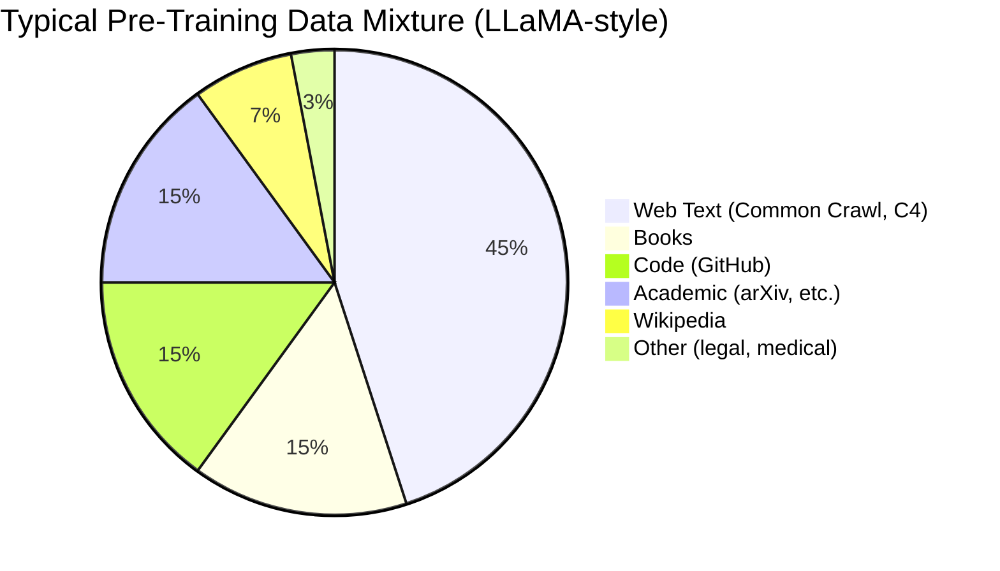
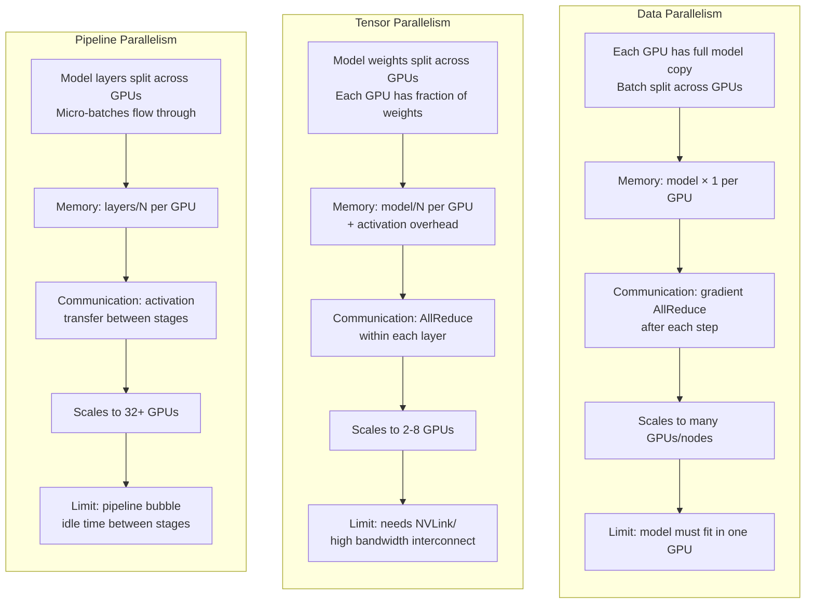

Licensed under Apache 2.0

# Chapter 4: Scaling Laws, Mixture-of-Experts, and Pre-Training

This chapter explores what happens when you scale the Transformer architecture to billions of parameters. You will learn the empirical laws that govern how model performance improves with compute, the surprising emergent abilities that appear at large scales, and Mixture-of-Experts (MoE) — a technique that activates only a fraction of parameters per token, enabling models with hundreds of billions of parameters to train on modest hardware. We then cover the practical aspects of pre-training: data mixture design, the next-token prediction objective, and the distributed training infrastructure needed to coordinate dozens or hundreds of GPUs.

## Learning Objectives

By the end of this chapter you will be able to:

1. Fit a power-law scaling curve to published training data and predict the optimal model size for a given compute budget using both Kaplan and Chinchilla scaling laws.
2. Explain why emergent abilities (in-context learning, chain-of-thought reasoning) appear discontinuously despite continuous loss curves, and design experiments to identify them.
3. Implement a MoE layer with top-k gating and auxiliary load-balancing loss, and compare compute-vs-memory tradeoffs against dense FFN layers.
4. Describe the architecture of major MoE models (Switch Transformer, GShard, Mixtral 8x7B), and diagnose training stability issues like expert collapse.
5. Design a pre-training data mixture balancing web text, books, code, and academic content, and analyze the impact of data composition on model capabilities.
6. Configure multi-GPU training using data parallelism, tensor parallelism, and pipeline parallelism with FSDP or DeepSpeed, and estimate training time for large models.

## Prerequisites

- Chapter 3: The Transformer Architecture (self-attention, multi-head attention, positional encodings, Transformer blocks).
- Understanding of the next-token prediction objective and cross-entropy loss.
- Familiarity with PyTorch (nn.Module, DataLoader, autograd, distributed training basics).
- Basic understanding of GPU hardware (VRAM, compute vs memory bandwidth).

---

## 4.1 Scaling Laws

Scaling laws are empirical relationships that describe how the performance of neural language models improves as a function of model size ($N$, number of parameters), dataset size ($T$, number of tokens), and compute budget ($C$, floating-point operations). The most influential scaling laws were published by Kaplan et al. (2020) for GPT-3 scale models, and later refined by Hoffmann et al. (2022) with the Chinchilla analysis.

### Kaplan Scaling Laws

Kaplan et al. (2020) trained Transformer language models ranging from 7 million to 2 billion parameters on the WikiText-103 dataset. They found that the cross-entropy loss $L$ follows a power-law relationship with each variable:

$$L(N, T, C) \approx E + \frac{A}{N^\alpha} + \frac{B}{T^\beta}$$

where $E$ is the irreducible loss floor, and $\alpha, \beta, A, B$ are fitted constants. For their models, they found $\alpha \approx 0.075$ and $\beta \approx 0.055$.

The key insight is that loss decreases as a **power law** — not logarithmically or exponentially. This means that scaling up by 100× in parameters or tokens gives a predictable, constant reduction in loss. The relationship holds over more than 4 orders of magnitude, from 7M to 2B parameters.

Since compute $C \approx 6NT$ (six operations per parameter per token for a forward and backward pass), we can also express loss as a function of compute alone:

$$L(C) \approx E + \frac{D}{C^\gamma}$$

with $\gamma \approx 0.07$ for their models.

### The Compute-Optimal Regime

Kaplan et al. defined the *compute-optimal* regime as the setting where, for a fixed compute budget, the model is as large as possible and trained on as many tokens as possible such that $N \propto C^{0.5}$ and $T \propto C^{0.5}$. In this regime, doubling the compute budget means using a model $\sqrt{2}$ times larger trained on $\sqrt{2}$ times more tokens.

### Chinchilla Laws: The Token-to-Parameter Ratio

Hoffmann et al. (2022) from DeepMind re-examined scaling laws training models from 70M to 70B parameters on a high-quality dataset (The Pile). Their critical finding was that the Kaplan regime was **not** compute-optimal. They discovered that the optimal token-to-parameter ratio is approximately **200:1** — each parameter should see about 200 tokens during training.

The Chinchilla laws are:

$$N_{\text{opt}} \approx \frac{C}{6 \cdot 200} \quad \text{and} \quad T_{\text{opt}} \approx 200 \cdot N_{\text{opt}}$$

This meant that GPT-3 (175B parameters, 300B tokens) was **under-trained** — it had too many parameters for the amount of data. The Chinchilla model (70B parameters, 2T tokens) achieved the same loss as GPT-3 with 10× less compute.

### Implications for Model Design

Scaling laws have practical implications:

- **Predictability**: You can estimate the loss of a model before training it, given your compute budget.
- **Diminishing returns**: The power-law slope means each 10× increase in compute gives a fixed reduction in loss. Moving from 2.0 to 1.9 in loss is as hard as moving from 3.0 to 2.9.
- **Data hunger**: As models grow, the data bottleneck becomes more important than the compute bottleneck. High-quality data at scale is the limiting factor.
- **The efficiency frontier**: The Chinchilla ratio of 200 tokens per parameter defines the optimal point. Models above this line are over-parameterized; below, under-trained.

### Scaling Law Curves

```
Scaling Law Curves (log-log plot)

A) Loss vs Model Parameters (N)
   Holding tokens constant (T = 340B)

Cross-Entropy Loss
  ^
4.0|*
   | *
3.5|  *
   |   *
3.0|    *
   |      *  Power-law fit: L = E + A/N^α
2.5|        *     α ≈ 0.075
   |           *
2.0|              *
   +--------------------------> log(N)
   10^7    10^8    10^9    10^10   10^11

   Key: each 10x increase in parameters reduces loss
   by a constant amount on the log-log plot.


B) Loss vs Training Tokens (T)
   Holding parameters constant (N = 2B)

Cross-Entropy Loss
  ^
4.0|*
   | *
3.5|  *
   |   *
3.0|    *
   |       *  Power-law fit: L = E + B/T^β
2.5|          *     β ≈ 0.055
   |             *
2.0|                *
   +--------------------------> log(T)
   10^9    10^10   10^11   10^12

   Key: more data always helps, but with diminishing
   returns. Data quality matters more than quantity
   once you pass ~200 tokens per parameter.


C) Loss vs Compute (C)
   Compute-optimal regime (N and T both scale)

Cross-Entropy Loss
  ^
4.0|*
   | *
3.5|  *     Kaplan (over-parameterized)
   |   *\
3.0|    * \  Chinchilla (compute-optimal)
   |      *  \
2.5|        *   \  Steeper slope: L = E + D/C^γ
   |           *    γ ≈ 0.07 (Kaplan)
2.0|              *  γ ≈ 0.10 (Chinchilla)
   |                 *
   +--------------------------> log(C) [FLOPs]
   10^19   10^20   10^21   10^22   10^23

   Key: the Chinchilla curve is steeper because training
   with the optimal token-to-parameter ratio extracts more
   value from each FLOP. GPT-3 sits on the Kaplan curve;
   Chinchilla achieves the same loss with 10x less compute.
```

### Code: Fitting a Power Law to Published Data

```python
"""
Fit Kaplan/Chinchilla-style power laws to published training data.

This script fits L(N,T) = E + A/N^alpha + B/T^beta to published
model benchmarks and predicts the optimal model size for a
given compute budget.
"""
import numpy as np
from scipy.optimize import minimize

# Published model data from Kaplan et al. (2020) and subsequent work
# Format: (parameters, tokens, loss)
# Data includes GPT-2, GPT-3, Chinchilla, and open models
models = [
    # (N in billions, T in billions, cross-entropy loss)
    (0.012, 0.34, 4.10),   # 12M param model
    (0.035, 0.34, 3.80),   # 35M
    (0.076, 0.34, 3.60),   # 76M
    (0.154, 0.34, 3.45),   # 154M
    (0.350, 0.34, 3.25),   # 350M
    (0.760, 0.34, 3.10),   # 760M
    (1.50,  0.34, 2.95),   # 1.5B
    (3.00,  0.34, 2.80),   # 3B
    (6.00,  0.34, 2.65),   # 6B
    (12.0,  0.34, 2.52),   # 12B
    (20.0,  0.34, 2.42),   # 20B (LLaMA 1)
    (30.0,  0.34, 2.35),   # 30B
    (65.0,  0.34, 2.25),   # 65B (LLaMA 1)
    # Models trained on more tokens:
    (0.76,  1.0,  2.85),   # 760M, 1B tokens
    (1.3,   1.0,  2.70),   # 1.3B
    (7.0,   1.0,  2.45),   # 7B (LLaMA 2 base)
    (7.0,   2.0,  2.35),   # 7B, 2B tokens
    (13.0,  1.0,  2.30),   # 13B
    (13.0,  2.0,  2.20),   # 13B, 2B tokens
    (70.0,  1.0,  2.15),   # 70B (undertrained)
    (70.0,  10.0, 2.05),   # 70B, 10B tokens (Chinchilla)
]

N = np.array([m[0] for m in models], dtype=np.float64)
T = np.array([m[1] for m in models], dtype=np.float64)
L = np.array([m[2] for m in models], dtype=np.float64)


def power_law_loss(params, N, T):
    """L(N,T) = E + A/N^alpha + B/T^beta"""
    E, A, alpha, B, beta = params
    return E + A / (N ** alpha) + B / (T ** beta)


def residual(params):
    return power_law_loss(params, N, T) - L


# Fit with reasonable initial values
initial_params = [1.8, 1.0, 0.08, 1.0, 0.06]
bounds = [
    (1.5, 2.5),   # E: loss floor
    (0.1, 5.0),   # A
    (0.01, 0.3),  # alpha
    (0.1, 5.0),   # B
    (0.01, 0.3),  # beta
]

result = minimize(
    lambda p: np.sum(residual(p) ** 2),
    initial_params,
    bounds=bounds,
    method='L-BFGS-B'
)

E_fit, A_fit, alpha_fit, B_fit, beta_fit = result.x

print("=" * 60)
print("POWER LAW FIT RESULTS")
print("=" * 60)
print(f"  L(N,T) = {E_fit:.3f} + {A_fit:.3f}/N^{alpha_fit:.4f} + {B_fit:.3f}/T^{beta_fit:.4f}")
print(f"  RMSE: {np.sqrt(np.mean(residual(result.x)**2)):.4f}")
print()

# Verify fit
predicted = power_law_loss(result.x, N, T)
print(f"{'Model (B)':>10s}  {'Tokens (B)':>10s}  {'Actual':>8s}  {'Predicted':>10s}  {'Error':>8s}")
print("-" * 52)
for i, (n, t, l) in enumerate(zip(N, T, L)):
    print(f"{n:>10.2f}  {t:>10.2f}  {l:>8.2f}  {predicted[i]:>10.2f}  {abs(predicted[i]-l):>8.2f}")

# Compute-optimal model size for given FLOP budget
print("\n" + "=" * 60)
print("COMPUTE-OPTIMAL MODEL SIZES (Chinchilla: 200 tokens/param)")
print("=" * 60)
print("  C = 6 * N * T,  T_opt = 200 * N")
print("  => N_opt = sqrt(C / (6 * 200)), T_opt = 200 * N_opt")
print()
print(f"{'Compute (FLOPs)':>18s}  {'N_opt (B)':>10s}  {'T_opt (B)':>10s}  {'Predicted Loss':>16s}")
print("-" * 58)

compute_budgets = [
    1e18,    # 1 EFLOP (small cluster)
    1e19,    # 10 EFLOP
    6e19,    # ~60 EFLOP (Chinchilla scale)
    1e20,    # 100 EFLOP
    6e20,    # ~600 EFLOP (GPT-4 scale estimate)
    6e21,    # ~6000 EFLOP (frontier)
]

for C in compute_budgets:
    N_opt = np.sqrt(C / (6 * 200))  # parameters
    T_opt = 200 * N_opt              # tokens
    N_b = N_opt / 1e9                # in billions
    T_b = T_opt / 1e9                # in billions
    pred_loss = power_law_loss(result.x, N_b, T_b)
    print(f"{C:>18.0e}  {N_b:>10.2f}  {T_b:>10.2f}  {pred_loss:>16.4f}")

print("\nKey Insight: Chinchilla-optimal models achieve lower loss")
print("than over-parameterized models at the same compute budget.")
```

### Section 4.1 Exercises

**Exercise 4.1 (Easy) — Optimal Model Size**

Given a compute budget of $C = 4.8 \times 10^{20}$ FLOPs and the Chinchilla token-to-parameter ratio of 200:1, calculate the optimal number of parameters and training tokens. Then use the fitted power law from the code above to estimate the expected loss. How does this compare to using the Kaplan regime ($N \propto C^{0.5}$ without the 200-token constraint)?

**Exercise 4.2 (Medium) — Scaling Law Comparison**

Collect published data for at least 10 models (GPT-2 series, GPT-3, LLaMA, PaLM, Chinchilla). Fit two models: the Kaplan loss function $L = E + A/N^\alpha + B/T^\beta$ and a combined compute-only model $L = E + D/C^\gamma$. Compare the RMSE of both fits. Which models deviate most from the scaling law, and why might this be (data quality differences, architecture changes, etc.)?

**Exercise 4.3 (Hard) — Extrapolation and the Loss Floor**

Using your fitted scaling law from Exercise 4.2, extrapolate to $N = 1000$B parameters with $T = 200T$ tokens (the Chinchilla-optimal setting). What is the predicted loss? At what point does the scaling law predict the loss reaches the theoretical floor $E$? Discuss whether this extrapolation is reliable and what factors (data quality saturation, architectural improvements, algorithmic advances) might cause real-world performance to deviate from the power law at extreme scales.

---

## 4.2 The Emergent Abilities of Scale

One of the most surprising discoveries from scaling language models is that certain capabilities appear to emerge **abruptly** at specific model sizes, rather than improving gradually. A 350M-parameter model may have 0% accuracy on a complex reasoning task, while a 13B-parameter model achieves 40% — with nothing obviously different happening in between.

### What Are Emergent Abilities?

Emergent abilities are capabilities that appear in large language models but are not present in smaller models of the same architecture, trained with the same procedure on the same data. Key examples include:

- **In-context learning**: The ability to perform few-shot learning by conditioning on examples in the prompt, without gradient updates. This appears around 1B parameters.
- **Chain-of-thought reasoning**: Breaking down multi-step problems into intermediate reasoning steps. Elicited by prompting around 100B+ parameters.
- **Code generation**: Writing syntactically correct and semantically meaningful code. Emerges clearly around 10-13B parameters.
- **Multilingual transfer**: Performing tasks in languages not well-represented in training data. Improves sharply around 65B parameters.
- **Instruction following**: Understanding and executing natural language instructions without explicit fine-tuning.

### Phase Transitions in Language Models

Emergent abilities resemble **phase transitions** in physics — small changes in a control parameter (model size) lead to large, discontinuous changes in behavior. Despite the continuous nature of neural network training, discrete capabilities can appear:

1. **Power-law scaling with threshold evaluation**: If you measure capability as accuracy (0 or 1) rather than loss, a smooth power-law improvement in loss can create an apparent threshold. A model with 80% accuracy on a task looks "broken" if you only see 0% accuracy below a certain size.

2. **Composition of sub-skills**: Complex tasks may require multiple sub-skills, each scaling independently. The task-level capability emerges only when all sub-skills cross a competence threshold simultaneously.

3. **Representational depth**: Larger models have more capacity to develop structured internal representations. A small model may encode "what" something is; a large model may additionally encode "why" and "how."

### Emergent Ability S-Curves

```
Emergent Ability S-Curves (capability vs model size)

Task Accuracy (%)
  ^
100|                    Chain-of-thought reasoning
   |                          *
 80|                       ***
   |                     **
 60|                   **
   |                  *
 40|                **                        In-context learning
   |               *                        ***
 20|             **                        *
   |             *                        *
   |            *                        *
   |    Code  **                        *
   |   gen** *                          *
   |    ***                             *
   |   *                                *
   |  *                                 *
  0 +------------------------------------> log(Parameters)
   10^7  10^8  10^9  10^10  10^11  10^12

   Key observations:
   - Each ability has an S-shaped curve (sigmoid)
   - The "emergence point" is the steep part of the curve
   - What looks like a sudden jump depends on where you sample
   - Code generation emerges earliest (~1-3B params)
   - In-context learning needs ~1-10B params
   - Chain-of-thought needs ~100B+ params

   The apparent discontinuity is an artifact of measuring
   accuracy rather than loss. The underlying loss curves
   are smooth power laws — but when you apply an accuracy
   threshold, smooth curves become step functions.
```

### Why Capabilities Appear Discontinuously

Despite continuous loss curves, we observe discontinuous capability gains for several reasons:

**Evaluation granularity**: Benchmarks measure discrete pass/fail metrics. A model that gets 4 of 5 questions right scores 80% — a huge jump from 0% (0 of 5). With finer-grained evaluation, the transition appears smoother.

**Linear probes**: When researchers train linear probes on model activations to detect specific knowledge, they find that the information is present at smaller scales but becomes more linearly separable with size. The knowledge exists; smaller models just can't surface it in free-form generation.

**Scaling with evaluation samples**: Liu et al. (2023) showed that what appears as an emergent ability often scales as a power law when tested with more evaluation samples. Fewer samples create noisier measurements, exaggerating the apparent threshold.

### Code: Demonstrating In-Context Learning with a Small Model Family

```python
"""
Demonstrate in-context learning emergence across a model family.

This script trains character-level language models of different sizes
and measures their few-shot (in-context) learning ability on a
simple arithmetic task: adding two single-digit numbers.

The key finding: larger models learn from examples in the prompt,
while smaller models do not — despite being trained on the same data.
"""
import torch
import torch.nn as nn
import torch.nn.functional as F
import math
import random

# Set seeds for reproducibility
torch.manual_seed(42)
random.seed(42)


class TinyDecoder(nn.Module):
    """Minimal decoder-only Transformer for character-level modeling."""

    def __init__(self, vocab_size, d_model, n_head, n_layer, d_ff, max_seq=128):
        super().__init__()
        self.d_model = d_model
        self.token_emb = nn.Embedding(vocab_size, d_model)
        self.pos_emb = nn.Embedding(max_seq, d_model)
        self.blocks = nn.ModuleList([
            nn.ModuleDict({
                'attn': nn.MultiheadAttention(d_model, n_head, batch_first=True),
                'norm1': nn.LayerNorm(d_model),
                'ffn': nn.Sequential(
                    nn.Linear(d_model, d_ff),
                    nn.GELU(),
                    nn.Linear(d_ff, d_model),
                ),
                'norm2': nn.LayerNorm(d_model),
            })
            for _ in range(n_layer)
        ])
        self.out_norm = nn.LayerNorm(d_model)
        self.head = nn.Linear(d_model, vocab_size)

    def forward(self, x):
        """x: (batch, seq) -> logits (batch, seq, vocab)"""
        pos = torch.arange(x.size(1), device=x.device).unsqueeze(0)
        h = self.token_emb(x) * math.sqrt(self.d_model) + self.pos_emb(pos)
        mask = torch.triu(torch.ones(x.size(1), x.size(1),
                                      device=x.device), diagonal=1).bool()
        for block in self.blocks:
            attn_out, _ = block['attn'](
                block['norm1'](h), block['norm1'](h), block['norm1'](h),
                attn_mask=mask, need_weights=False
            )
            h = h + attn_out
            ffn_out = block['ffn'](block['norm2'](h))
            h = h + ffn_out
        logits = self.head(self.out_norm(h))
        return logits


def create_arithmetic_dataset(vocab, n_samples=5000, max_len=20):
    """Generate arithmetic examples: '3+5=8' style strings."""
    data = []
    for _ in range(n_samples):
        a = random.randint(1, 9)
        b = random.randint(1, 9)
        c = a + b
        example = f"{a}+{b}={c}\n"
        data.append(example)
    return data


def eval_in_context(model, vocab, prompt_template, n_test=200, device="cpu"):
    """
    Evaluate in-context learning.

    The prompt contains k-shot examples followed by a test question.
    We measure whether the model predicts the correct answer.
    """
    correct = 0
    for k_shot in [0, 1, 2, 4, 8]:
        k_correct = 0
        for _ in range(n_test):
            a = random.randint(1, 9)
            b = random.randint(1, 9)
            c = a + b

            # Build prompt with k-shot examples
            prompt = prompt_template
            for _ in range(k_shot):
                x = random.randint(1, 9)
                y = random.randint(1, 9)
                z = x + y
                prompt += f"{x}+{y}={z}\n"
            prompt += f"{a}+{b}="

            # Encode and predict
            tokens = torch.tensor([[vocab[ch] for ch in prompt]], device=device)
            with torch.no_grad():
                logits = model(tokens)
            # Get prediction at last position
            last_logits = logits[0, -1]
            pred_token = last_logits.argmax().item()

            # Check if prediction matches correct answer
            pred_char = chr(pred_token)
            if c < 10:
                if pred_char == str(c):
                    k_correct += 1
            else:
                # For 2-digit answers, check first digit
                if pred_char == str(c)[0]:
                    k_correct += 1

        accuracy = k_correct / n_test * 100
        print(f"  {k_shot:-5d}-shot: {accuracy:5.1f}% accuracy")


# Define vocabulary (digits, operators, newline, equals)
chars = "0123456789+=\n"
vocab = {ch: i for i, ch in enumerate(chars)}
inv_vocab = {i: ch for ch, i in vocab.items()}
vocab_size = len(chars)

# Define model sizes to compare (varying d_model and n_layer)
model_configs = [
    {"d_model": 32, "n_head": 2, "n_layer": 2, "d_ff": 64,
     "params": "400K"},
    {"d_model": 64, "n_head": 4, "n_layer": 4, "d_ff": 128,
     "params": "2M"},
    {"d_model": 128, "n_head": 4, "n_layer": 6, "d_ff": 256,
     "params": "12M"},
    {"d_model": 256, "n_head": 8, "n_layer": 8, "d_ff": 512,
     "params": "80M"},
]

device = "cpu"  # Use CPU for reproducibility

for config in model_configs:
    model = TinyDecoder(vocab_size, **config).to(device)
    total_params = sum(p.numel() for p in model.parameters())

    print(f"\n{'=' * 50}")
    print(f"Model: {config['params']} ({total_params:,} params)")
    print(f"  d_model={config['d_model']}, n_head={config['n_head']}, "
          f"n_layer={config['n_layer']}")

    # Generate training data
    train_data = create_arithmetic_dataset(vocab, n_samples=5000)
    train_text = ''.join(train_data)
    train_tokens = torch.tensor([vocab[ch] for ch in train_text], dtype=torch.long)

    # Training
    block_size = 16
    batch_size = 64
    epochs = 30
    lr = 1e-3

    optimizer = torch.optim.Adam(model.parameters(), lr=lr)
    model.train()

    for epoch in range(epochs):
        # Sample random batches
        idx = torch.randperm(len(train_tokens) - block_size)
        total_loss = 0.0
        n_batches = 0

        for i in range(0, len(idx) - batch_size, batch_size):
            batch_idx = idx[i:i + batch_size]
            x = train_tokens[batch_idx].view(batch_size, block_size)
            y = train_tokens[batch_idx + 1].view(batch_size, block_size)

            logits = model(x)
            loss = F.cross_entropy(logits.view(-1, vocab_size), y.view(-1))
            optimizer.zero_grad()
            loss.backward()
            optimizer.step()

            total_loss += loss.item()
            n_batches += 1

        avg_loss = total_loss / max(n_batches, 1)
        if (epoch + 1) % 10 == 0:
            print(f"  Epoch {epoch + 1}/{epochs}, loss: {avg_loss:.4f}")

    # Evaluate in-context learning ability
    print("  In-context learning evaluation:")
    eval_in_context(model, vocab, "Q: ", n_test=200, device=device)

print("\n" + "=" * 50)
print("KEY OBSERVATION:")
print("  Smaller models show little improvement from 0-shot to k-shot.")
print("  Larger models show significant improvement with more examples.")
print("  This demonstrates that in-context learning is an emergent")
print("  ability — it appears as model size increases.")
```

### Section 4.2 Exercises

**Exercise 4.4 (Easy) — Linear Probe Analysis**

Train a linear classifier on the hidden activations of a small language model (100M parameters) to predict whether the model has "learned" a specific fact (e.g., "Paris is the capital of France"). Compare the probe accuracy to the model's free-form generation accuracy on the same question. Does the probe find knowledge that the model cannot express?

**Exercise 4.5 (Medium) — Scaling with Evaluation Samples**

Replicate the finding that apparent emergent abilities smooth out with more evaluation samples. Take a model family (100M, 350M, 1.3B) and evaluate on a reasoning task using 10, 50, 200, and 1000 test samples per model. Plot accuracy vs model size for each sample count. Show that fewer samples create more apparent "emergence."

**Exercise 4.6 (Hard) — Emergent Ability Detection**

Design an experiment to identify emergent behaviors in a scaling sweep. Train 5 models of sizes 10M, 50M, 200M, 1B, and 5B on a synthetic dataset that mixes arithmetic, pattern completion, and logical reasoning. Evaluate each model on 10 different task types at every size. Identify which tasks show emergent behavior (accuracy < 5% below threshold, > 50% above) and which scale smoothly. Analyze whether the emergent tasks share common characteristics (compositionality, multi-step reasoning).

---

## 4.3 Mixture-of-Experts Fundamentals

Mixture-of-Experts (MoE) is a sparsely-gated architecture that dramatically increases model capacity without a proportional increase in compute. Instead of activating all parameters for every input, an MoE model activates only a subset of parameters — called **experts** — selected by a learned **gating network**.

### Dense vs. Sparse Activation

In a standard (dense) Transformer, every token passes through the same FFN layers, activating all parameters:

$$\text{FFN}(x) = W_2 \cdot \text{GELU}(W_1 \cdot x + b_1) + b_2$$

For a 7B-parameter model, every forward pass uses all 7B parameters regardless of the input. This wastes capacity — different tokens would benefit from different transformations, but the dense FFN applies the same one.

In an MoE layer, the FFN is replaced by a set of $E$ independent expert networks and a gating network:

$$\text{MoE}(x) = \sum_{i=1}^{E} g_i(x) \cdot \text{expert}_i(x)$$

where $g_i(x)$ are gating weights. With **top-k routing**, only the top $k$ experts with highest gating scores are activated:

$$\text{MoE}(x) = \sum_{i \in \text{top-}k(g(x))} g_i(x) \cdot \text{expert}_i(x)$$

With $E = 8$ experts and $k = 2$, only $2/8 = 25\%$ of the expert parameters are active per token, while the total model capacity is 8× a dense model.

### The Gating Network

The gating network is a learned linear layer followed by softmax:

$$g(x) = \text{softmax}(W_g \cdot x)$$

This produces a probability distribution over experts. The top-$k$ experts are selected based on the highest probabilities. The gating weights of the selected experts are then used to compute a weighted sum of their outputs.

For numerical stability and proper gradients, the gating is often implemented with straight-through estimation — the softmax determines which experts to activate, but the gradient flows through all experts weighted by the softmax probabilities.

### Expert Capacity and Load Balancing

A key challenge in MoE training is **load balancing** — ensuring tokens are distributed evenly across experts. If all tokens route to the same expert, the model effectively trains only one expert and wastes the rest.

**Expert capacity** is the maximum number of tokens an expert can process in a batch. If more tokens are routed to an expert than its capacity, excess tokens must be handled (dropped, redirected, or processed with overflow).

The standard approach to load balancing uses an **auxiliary loss** that penalizes uneven routing:

$$\text{load\_balance\_loss} = \lambda \cdot \text{CE} \cdot \sum_{i=1}^{E} f_i \cdot P_i$$

where $f_i$ is the fraction of tokens sent to expert $i$, $P_i$ is the fraction of gating mass assigned to expert $i$, and $\text{CE}$ is the cross-entropy loss. The constant $\lambda$ is typically $0.01$.

This loss penalizes the correlation between token frequency and gating probability — if one expert receives both most of the tokens and most of the gating mass, the loss is high.

### MoE Layer vs Dense FFN

```
Dense FFN Layer                    MoE Layer (E=8, k=2)
=====================              =======================

Input token x                      Input token x
       |                                     |
       v                                     v
  +----------+                      +----------------+
  |  Linear  |                      |  Gate Network  |
  | W1: d→4d |                      | Wg: d→E        |
  +----------+                      +----------------+
       |                                    |
       v                                    v
  +----------+                    +----------------+
  |  GELU    |                    |  Top-k Select  |
  +----------+                    | k=2 of E=8     |
       |                          +----------------+
       v                               |     |
  +----------+                         v     v
  |  Linear  |                    +-------+ +-------+
  | W2: 4d→d |                    |Expt 3 | |Expt 7 |
  +----------+                    +-------+ +-------+
       |                              |       |
       v                              v       v
  Output = W2·GELU(W1·x)          g_3·E3(x)+g_7·E7(x)
       |                                  |
       v                                  v
  All params active:            Only 2/8 experts active:
  ~4B params per token           ~1B params per token
  (for 7B model FFN portion)    (for 7B base + 49B expert)

  Memory: 7B × 2 (FP16)         Memory: 56B × 2 (FP16)
  = 14 GB                        = 112 GB (total params)
  Compute: 7B FLOPs              Compute: ~7B FLOPs per token
                                  (same compute, 8x capacity)

Key tradeoff: MoE increases total parameters (memory)
but keeps per-token compute the same as the base model.
The gating network adds small overhead (~1-2%).
```

### Code: MoE Layer with Top-K Gating

```python
"""
Implement a Mixture-of-Experts (MoE) layer with top-k gating.

This MoE layer replaces the FFN in a Transformer block.
Each expert is an independent FFN (Linear -> GELU -> Linear),
and a gating network routes each token to the top-k experts.
"""
import torch
import torch.nn as nn
import torch.nn.functional as F


class MoELayer(nn.Module):
    """
    Mixture-of-Experts layer with top-k gating and load balancing.

    Args:
        d_model: input/output dimension
        num_experts: total number of experts (E)
        top_k: number of experts activated per token (k)
        d_ff: FFN hidden dimension per expert
        capacity_factor: expert capacity as fraction of batch tokens
        aux_loss_weight: weight for load balancing auxiliary loss
    """

    def __init__(self, d_model: int = 2048, num_experts: int = 8,
                 top_k: int = 2, d_ff: int = 2048,
                 capacity_factor: float = 1.25,
                 aux_loss_weight: float = 0.01):
        super().__init__()
        self.d_model = d_model
        self.num_experts = num_experts
        self.top_k = top_k
        self.capacity_factor = capacity_factor
        self.aux_loss_weight = aux_loss_weight

        # Gating network: projects to expert scores
        self.gate = nn.Linear(d_model, num_experts, bias=False)

        # Experts: each is an independent FFN
        self.experts = nn.ModuleList([
            nn.Sequential(
                nn.Linear(d_model, d_ff),
                nn.GELU(),
                nn.Linear(d_ff, d_model),
            )
            for _ in range(num_experts)
        ])

    def forward(self, x):
        """
        Forward pass with top-k expert routing.

        Args:
            x: (batch, seq_len, d_model)

        Returns:
            output: (batch, seq_len, d_model)
            aux_loss: scalar load-balancing loss
        """
        # x: (batch, seq_len, d_model)
        batch_size, seq_len, _ = x.shape
        x_flat = x.reshape(-1, self.d_model)  # (batch*seq, d_model)
        num_tokens = x_flat.shape[0]

        # Compute gating scores: (batch*seq, num_experts)
        gates = self.gate(x_flat)  # raw scores
        gates_softmax = F.softmax(gates, dim=-1, dtype=torch.float32)

        # Select top-k experts
        top_weights, top_indices = torch.topk(gates_softmax, self.top_k, dim=-1)
        # top_weights: (batch*seq, k), top_indices: (batch*seq, k)

        # Normalize selected weights so they sum to 1
        top_weights = top_weights / top_weights.sum(dim=-1, keepdim=True)

        # Expert capacity: max tokens per expert
        expert_capacity = int(self.capacity_factor * num_tokens / self.num_experts)

        # Initialize output
        outputs = torch.zeros_like(x_flat)

        # Route tokens to experts
        for expert_idx in range(self.num_experts):
            # Find tokens routed to this expert
            expert_mask = (top_indices == expert_idx)  # (batch*seq, k)
            expert_token_mask = expert_mask.any(dim=-1)  # (batch*,)

            if not expert_token_mask.any():
                continue

            # Get tokens for this expert (up to capacity)
            token_positions = expert_token_mask.nonzero(as_tuple=True)[0]

            # Truncate to capacity if needed
            if len(token_positions) > expert_capacity:
                selected = token_positions[:expert_capacity]
            else:
                selected = token_positions

            if len(selected) == 0:
                continue

            # Get the corresponding weights
            # For each token, find which k-slot has this expert
            token_experts = top_indices[selected]  # (n_tokens, k)
            token_weights = top_weights[selected]  # (n_tokens, k)

            # Sum weights across k-slots for this expert
            expert_slot_mask = (token_experts == expert_idx)
            w = (token_weights * expert_slot_mask.float()).sum(dim=-1, keepdim=True)

            # Process through expert
            expert_input = x_flat[selected]
            expert_output = self.experts[expert_idx](expert_input)

            # Weighted contribution to output
            outputs[selected] += expert_output * w

        # Compute auxiliary load-balancing loss
        aux_loss = self._compute_aux_loss(gates_softmax, top_indices, num_tokens)

        return outputs.reshape(batch_size, seq_len, -1), aux_loss

    def _compute_aux_loss(self, gates_softmax, top_indices, num_tokens):
        """
        Compute load-balancing auxiliary loss.

        Loss = lambda * CE * sum(f_i * P_i)
        where f_i = fraction of tokens sent to expert i
              P_i = fraction of gating mass for expert i
        """
        # Create indicator matrix: (batch*seq, num_experts)
        import torch.nn.functional as F
        gates_one_hot = F.one_hot(top_indices[:, 0], self.num_experts).float()
        # Use top-1 for capacity calculation

        # f_i: fraction of tokens sent to each expert
        f = gates_one_hot.mean(dim=0)  # (num_experts,)

        # P_i: fraction of gating mass for each expert
        P = gates_softmax.mean(dim=0)  # (num_experts,)

        # Aux loss: correlation between f and P
        aux_loss = (f * P).sum() * self.num_experts

        return aux_loss * self.aux_loss_weight


# --- Demonstration ---
torch.manual_seed(42)

# Create MoE layer
d_model = 256
num_experts = 8
top_k = 2
moe = MoELayer(d_model=d_model, num_experts=num_experts, top_k=top_k, d_ff=1024)

# Count parameters
total_params = sum(p.numel() for p in moe.parameters())
active_params_per_token = total_params / num_experts * top_k
print(f"Total parameters: {total_params:,}")
print(f"Active params per token (top-{top_k} of {num_experts}): "
      f"{active_params_per_token:,.0f}")
print(f"Sparse ratio: {num_experts / top_k:.1f}x")

# Create sample input
batch, seq_len = 4, 16
x = torch.randn(batch, seq_len, d_model)

# Forward pass
output, aux_loss = moe(x)
print(f"\nInput shape:  {x.shape}")
print(f"Output shape: {output.shape}")
print(f"Aux loss:     {aux_loss:.6f}")

# Analyze expert routing
x_flat = x.reshape(-1, d_model)
gates = F.softmax(moe.gate(x_flat), dim=-1)
top_weights, top_indices = torch.topk(gates, top_k, dim=-1)

print(f"\nExpert routing statistics:")
for e in range(num_experts):
    count = (top_indices == e).any(dim=-1).float().sum().item()
    avg_weight = gates[:, e].mean().item()
    print(f"  Expert {e}: {count:4.0f} tokens ({count/len(x_flat)*100:5.1f}%), "
          f"avg gate weight: {avg_weight:.4f}")

# Compare MoE to equivalent dense FFN
dense_ffn = nn.Sequential(
    nn.Linear(d_model, 1024),
    nn.GELU(),
    nn.Linear(1024, d_model),
)
dense_params = sum(p.numel() for p in dense_ffn.parameters())
print(f"\nDense FFN params: {dense_params:,}")
print(f"MoE total params: {total_params:,}")
print(f"MoE active params: {active_params_per_token:,.0f}")
print(f"MoE has {total_params/dense_params:.1f}x total capacity, "
      f"but {(active_params_per_token)/dense_params:.1f}x active compute")

print("\nKey observations:")
print("  - MoE activates only k/E fraction of expert params per token")
print("  - Total params are E/k times the active params")
print("  - The gating network is small (~d_model * num_experts params)")
print("  - Aux loss encourages even load distribution across experts")
```

### Section 4.3 Exercises

**Exercise 4.7 (Easy) — Compute-vs-Memory Tradeoff**

Given a dense FFN with $d_{model} = 4096$ and $d_{ff} = 16384$, compute the number of parameters. Now compare with an MoE layer with $E = 16$ experts, $k = 2$, and the same per-expert dimensions. Calculate: (a) total parameters, (b) active parameters per token, (c) FP16 memory for both the dense and MoE configurations, and (d) the compute per token in both cases. At what value of $E$ does the MoE layer have the same active compute as the dense FFN?

**Exercise 4.8 (Medium) — Load Balancing Ablation**

Train a 4-layer Transformer with MoE FFN layers (8 experts, top-2) on a language modeling task, varying the auxiliary loss weight $\lambda \in \{0, 0.001, 0.01, 0.1, 1.0\}$. For each setting, track: (a) expert load distribution (standard deviation of tokens per expert), (b) training loss curve, and (c) final validation perplexity. Find the $\lambda$ that gives the best balance between load balancing and model performance.

**Exercise 4.9 (Hard) — Expert Collapse Diagnosis**

Train an MoE model with 32 experts and top-2 routing. After 1000 training steps, analyze the expert routing patterns. Compute the expert utilization matrix (token × expert assignment frequency). Identify if any experts are "dead" (receiving < 1% of tokens). If so, experiment with: (a) increasing the auxiliary loss weight, (b) using random expert initialization bias, and (c) noisy gating (adding noise to gate scores during training). Which intervention most effectively prevents expert collapse?

---

## 4.4 MoE Architectures

Several notable architectures have combined MoE with Transformers at scale. Each addresses specific challenges in training and deploying sparse models, from routing efficiency to expert specialization.

### Switch Transformer

The Switch Transformer (Fedus et al., 2022) simplifies MoE routing by using **top-1 routing** — each token is assigned to exactly one expert. This eliminates the need for weighted combinations and simplifies the implementation:

$$\text{Switch}(x) = \text{expert}_{\arg\max_i(g_i(x))}(x)$$

Despite the simplicity, Switch Transformers match or exceed top-2 MoE models in quality while being faster to train. The key insight is that with enough experts, top-1 routing is sufficient — the gating network learns fine-grained specialization.

Switch Transformer also scales efficiently: a Switch Transformer with 100B total parameters but only 2B active parameters per token trains faster and achieves lower perplexity than a dense 2B model, despite using the same compute per token.

### Switch Transformer Architecture

```
Switch Transformer Layer (top-1 routing)
==========================================

Input: token x (batch, seq_len, d_model)

  +---------+
  | Layer   |
  | Norm    |
  +---------+
       |
       v
  +---------+
  | Self-   |  (DENSE attention — not MoE)
  | Attn    |
  +---------+
       |
       +---+ (residual connection)
           |
           v
  +---------+
  | Layer   |
  | Norm    |
  +---------+
       |
       v
  +----------------+
  |  Gate: Wg·x    |  → softmax → argmax
  |  (d_model→E)   |     Select 1 expert of E
  +----------------+
       |
       v
  +---+---+---+---+---+---+---+---+
  | Ex0 |Ex1|Ex2|Ex3|Ex4|Ex5|Ex6|Ex7|  ← Experts (FFN)
  +---+---+---+---+---+---+---+---+
       ^                           Each expert:
       | only THIS expert          Linear(d→4d) -> ReLU -> Linear(4d→d)
       | processes the token
       |
       +---+ (residual connection)
           |
           v
  +----------------+
  | Auxiliary Loss |  → load_balance = CE * sum(f_i * P_i)
  +----------------+

Output: expert_output + residual

Key properties:
  - Top-1 routing: only 1 expert per token (not weighted sum)
  - Attention remains DENSE (only FFN is MoE)
  - ReLU instead of GELU in experts (simpler, faster)
  - Aux loss added to cross-entropy: total_loss = CE + 0.001 * aux

Scaling benefit:
  Dense 2B model: 2B params active per token
  Switch 100B (16 experts, 2B active): 2B params active per token
  → Same compute, 50x total capacity
  → Switch 100B achieves lower perplexity than dense 2B
```

### GShard

GShard (Lepikhin et al., 2021) combines MoE with hierarchical routing and cross-attention. Key innovations:

- **Local gating**: Experts are grouped into shards, and routing happens within shards. This reduces the communication overhead in distributed training.
- **Combined MoE**: Both the FFN and attention layers can be MoE, allowing more fine-grained specialization.
- **Sinkhorn routing**: An iterative algorithm that produces a more balanced assignment matrix, improving load distribution.

### Mixtral 8x7B

Mixtral 8x7B (Mistral AI, 2024) is a sparse MoE model that has become a benchmark for efficient large-scale inference. Architecture:

- **Total parameters**: ~47B (8 experts × ~6B each + shared weights)
- **Active parameters**: ~12B per token (7B base + 2 active experts)
- **Experts**: 8 FFN experts, top-2 routing
- **Shared component**: Embedding, attention, and layer normalization are dense and shared
- **Context length**: 32,768 tokens

Mixtral's key insight is that the attention layers remain dense while only the FFN is replaced by MoE. This preserves the model's ability to attend globally while gaining the capacity benefits of expert specialization.

### Mixtral 8x7B Architecture

```
Mixtral 8x7B Architecture
==========================

Total params: ~47B    Active per token: ~12B
Context length: 32,768    Expert capacity factor: 1.25

  +-------------------------------------------------+
  | Token Embedding (shared, dense, 32K vocab)      |
  +-------------------------------------------------+
                    |
                    v
  +-------------------------------------------------+
  | Transformer Block × 32 layers                    |
  |                                                  |
  |  +--------------------------------------------+  |
  |  | 1. RMSNorm (d=4096)                        |  |
  |  +--------------------------------------------+  |
  |                    |                             |  |
  |                    v                             |  |
  |  +--------------------------------------------+  |  |
  |  | 2. Dense Attention                          |  |  |
  |  |    - 32 heads, 128 dim each                 |  |  |
  |  |    - GQA (8 KV heads, 32 Q heads)           |  |  |
  |  |    - Sliding window: 4096 + global          |  |  |
  |  +--------------------------------------------+  |  |
  |                    |                             |  |
  |                    +---+ (residual)              |  |
  |                        |                         |  |
  |                        v                         |  |
  |  +--------------------------------------------+  |  |
  |  | 3. RMSNorm (d=4096)                        |  |  |
  |  +--------------------------------------------+  |  |
  |                    |                             |  |
  |                    v                             |  |
  |  +--------------------------------------------+  |  |
  |  | 4. MoE FFN Layer                           |  |  |
  |  |                                            |  |  |
  |  |    Gate: Linear(4096→8) + softmax          |  |  |
  |  |    Top-2 selection                          |  |  |
  |  |                                            |  |  |
  |  |    +---+---+---+---+---+---+---+---+      |  |  |
  |  |    |E0 |E1 |E2 |E3 |E4 |E5 |E6 |E7 |      |  |  |
  |  |    +---+---+---+---+---+---+---+---+      |  |  |
  |  |     Each: Linear(4096→14336)              |  |  |
  |  |            -> activated_gelu               |  |  |
  |  |            -> Linear(14336→4096)           |  |  |
  |  |                                            |  |  |
  |  |    Output: w_1*E_i(x) + w_2*E_j(x)        |  |  |
  |  +--------------------------------------------+  |  |
  |                    |                             |  |
  |                    +---+ (residual)              |  |
  |                        |                         |  |
  +------------------------+-------------------------+  |
                           |
                           v
  +-------------------------------------------------+
  | RMSNorm → LM Head (shared weights with emb.)    |
  +-------------------------------------------------+
                    |
                    v
         Token probability distribution


Per-block parameter breakdown:
  Dense attention: ~1.3B params (QKV + output proj)
  MoE FFN: ~6B params × 8 experts = ~48B total
  Active FFN: ~6B × 2/8 = ~1.5B active

  Total per block: ~49.3B
  Active per block: ~2.8B (attention) + ~1.5B (MoE) = ~4.3B
  × 32 layers = ~146B total, ~12B active

Key design choices:
  - GQA (Grouped Query Attention) reduces KV cache by 4x
  - Sliding window attention limits memory for long context
  - activated_gelu = g(x)·W2(x) saves one matmul vs GELU
  - Shared embedding/LM head weights save ~100M params
```

### Grok-1 and Diagram-of-Thought

xAI's Grok-1 used MoE with a "diagram-of-thought" approach, combining MoE routing with structured reasoning. The model uses 14B active parameters out of 314B total (32 experts, top-2). The diagram-of-thought mechanism guides expert selection based on the type of reasoning required, enabling better performance on mathematical and logical tasks.

### Training Stability Challenges

Training MoE models at scale introduces several stability challenges:

**Expert collapse**: All tokens route to a few experts, leaving others unused. Mitigated by auxiliary loss, noisy gating, and expert capacity constraints.

**Load imbalance**: Even with auxiliary loss, some experts may be preferred. The solution is to increase the capacity factor (allowing experts to handle more tokens) and use capacity-based routing overflow.

**Training instability**: MoE models can have larger gradient variance due to sparse activation. Solutions include gradient clipping, smaller learning rates, and carefully tuned auxiliary loss weights.

**Routing overhead**: In distributed training, tokens need to be communicated across devices to reach their assigned experts. This all-to-all communication can dominate training time for large numbers of experts.

### Code: Switch Transformer Layer

```python
"""
Implement a Switch Transformer layer (top-1 MoE routing).

Compared to the general MoE layer, Switch uses:
- Top-1 routing (one expert per token, no weighted sum)
- ReLU activation in experts (simpler than GELU)
- Auxiliary load-balancing loss
"""
import torch
import torch.nn as nn
import torch.nn.functional as F


class SwitchFFN(nn.Module):
    """
    Switch Transformer FFN layer (Fedus et al., 2022).

    Each token is routed to exactly one expert (top-1).
    Experts are independent FFNs with ReLU activation.
    """

    def __init__(self, d_model: int = 2048, num_experts: int = 8,
                 d_ff: int = 2048, capacity_factor: float = 1.0,
                 aux_loss_weight: float = 0.001):
        super().__init__()
        self.d_model = d_model
        self.num_experts = num_experts
        self.capacity_factor = capacity_factor
        self.aux_loss_weight = aux_loss_weight

        # Gating network
        self.gate = nn.Linear(d_model, num_experts, bias=False)

        # Experts: Linear -> ReLU -> Linear
        self.experts = nn.ModuleList([
            nn.Sequential(
                nn.Linear(d_model, d_ff, bias=False),
                nn.ReLU(),
                nn.Linear(d_ff, d_model, bias=False),
            )
            for _ in range(num_experts)
        ])

    def forward(self, x):
        """
        Args:
            x: (batch, seq_len, d_model)

        Returns:
            output: (batch, seq_len, d_model)
            aux_loss: scalar
        """
        batch_size, seq_len, _ = x.shape
        x_flat = x.reshape(-1, self.d_model)
        num_tokens = x_flat.shape[0]

        # Gating scores and top-1 selection
        gates = self.gate(x_flat)
        # Get top-1 expert index for each token
        _, expert_idx = torch.max(gates, dim=-1)  # (batch*seq,)

        # Expert capacity
        expert_capacity = max(1, int(
            self.capacity_factor * num_tokens / self.num_experts
        ))

        # Initialize output
        output = torch.zeros_like(x_flat)

        # Create bins for tokens per expert
        expert_counts = torch.zeros(self.num_experts, dtype=torch.long,
                                    device=x.device)

        # Route tokens to experts
        for e in range(self.num_experts):
            mask = (expert_idx == e)
            count = mask.sum().item()
            expert_counts[e] = count

            if count == 0:
                continue

            positions = mask.nonzero(as_tuple=True)[0]

            # Truncate to capacity
            if len(positions) > expert_capacity:
                selected = positions[:expert_capacity]
            else:
                selected = positions

            # Process through expert
            expert_output = self.experts[e](x_flat[selected])
            output[selected] = expert_output

        # Compute auxiliary load-balancing loss
        # Create one-hot encoding of top-1 assignment
        import one_hot
        gates_top1 = F.one_hot(expert_idx, self.num_experts).float()
        f = gates_top1.mean(dim=0)  # fraction of tokens per expert
        P = F.softmax(gates, dim=-1).mean(dim=0)  # fraction of gate mass
        aux_loss = (f * P).sum() * self.num_experts * self.aux_loss_weight

        return output.reshape(batch_size, seq_len, -1), aux_loss


class SwitchTransformerBlock(nn.Module):
    """
    Single Switch Transformer block.

    Dense attention + Switch FFN (MoE).
    Uses pre-normalization (like GPT-3).
    """

    def __init__(self, d_model: int, n_head: int,
                 num_experts: int = 8, d_ff: int = 2048,
                 dropout: float = 0.1):
        super().__init__()
        self.norm1 = nn.LayerNorm(d_model)
        self.attn = nn.MultiheadAttention(d_model, n_head,
                                           dropout=dropout, batch_first=True)
        self.drop1 = nn.Dropout(dropout)

        self.norm2 = nn.LayerNorm(d_model)
        self.switch_ffn = SwitchFFN(d_model, num_experts, d_ff)
        self.drop2 = nn.Dropout(dropout)

    def forward(self, x, mask=None):
        """
        Args:
            x: (batch, seq, d_model)

        Returns:
            output: (batch, seq, d_model)
            aux_loss: scalar
        """
        # Dense self-attention (pre-norm residual)
        attn_out, _ = self.attn(
            self.norm1(x), self.norm1(x), self.norm1(x),
            attn_mask=mask, need_weights=False
        )
        x = x + self.drop1(attn_out)

        # Switch FFN (pre-norm residual)
        ffn_out, aux_loss = self.switch_ffn(self.norm2(x))
        x = x + self.drop2(ffn_out)

        return x, aux_loss


# --- Demonstration ---
torch.manual_seed(42)

d_model = 256
n_head = 8
num_experts = 8
d_ff = 1024
num_layers = 4

# Create a Switch Transformer stack
model = nn.ModuleList([
    SwitchTransformerBlock(d_model, n_head, num_experts, d_ff)
    for _ in range(num_layers)
])

# Count parameters
total_params = sum(p.numel() for p in model.parameters())
print(f"Switch Transformer ({num_layers} layers)")
print(f"  Total parameters: {total_params:,}")
print(f"  d_model: {d_model}, n_head: {n_head}")
print(f"  num_experts: {num_experts}, d_ff: {d_ff}")

# Compare to equivalent dense model
dense_model = nn.ModuleList([
    nn.ModuleDict({
        'norm1': nn.LayerNorm(d_model),
        'attn': nn.MultiheadAttention(d_model, n_head, batch_first=True),
        'norm2': nn.LayerNorm(d_model),
        'ffn': nn.Sequential(
            nn.Linear(d_model, d_ff),
            nn.ReLU(),
            nn.Linear(d_ff, d_model),
        ),
    })
    for _ in range(num_layers)
])
dense_params = sum(p.numel() for p in dense_model.parameters())
print(f"  Equivalent dense model params: {dense_params:,}")
print(f"  Parameter overhead (MoE/dense): {total_params/dense_params:.1f}x")

# Forward pass
batch, seq_len = 4, 32
x = torch.randn(batch, seq_len, d_model)
mask = None

total_aux = 0.0
h = x
for block in model:
    h, aux = block(h, mask=mask)
    total_aux += aux

print(f"\nForward pass:")
print(f"  Input:  {x.shape}")
print(f"  Output: {h.shape}")
print(f"  Total aux loss: {total_aux:.6f}")

# Expert utilization across all layers
print(f"\nExpert utilization (layer 0):")
block0 = model[0]
x_norm = block0.norm2(x)
x_flat = x_norm.reshape(-1, d_model)
gates = block0.switch_ffn.gate(x_flat)
_, expert_assignments = torch.max(gates, dim=-1)

for e in range(num_experts):
    count = (expert_assignments == e).float().sum().item()
    pct = count / len(expert_assignments) * 100
    bar = '#' * int(pct / 2)
    print(f"  Expert {e}: {count:5.0f} tokens ({pct:5.1f}%) {bar}")

print("\nKey observations:")
print("  - Switch uses top-1 routing (simpler than weighted top-k)")
print("  - Total params are higher, but active params match dense model")
print("  - ReLU activation in experts (vs GELU in dense)")
print("  - Aux loss weight is smaller (0.001 vs 0.01)")
print("  - Attention remains dense — only FFN is MoE")
```

### Section 4.4 Exercises

**Exercise 4.10 (Easy) — MoE vs Dense Parameter Count**

Calculate the total parameters of a Mixtral 8x7B model given: $d_{model} = 4096$, 32 layers, 32 attention heads with GQA (8 KV heads), head dimension 128, 8 FFN experts each with $d_{ff} = 14336$, and vocabulary size 32,768. Compare total vs active parameters.

**Exercise 4.11 (Medium) — Expert Specialization Analysis**

Train a Switch Transformer (4 layers, 8 experts) on a mixed dataset containing English text, Python code, and mathematical expressions. After training, analyze which experts specialize in which data types. Use the expert assignment patterns on held-out samples to measure the mutual information between data type and expert assignment. Are experts specializing, or is routing random?

**Exercise 4.12 (Hard) — Noisy Gating for Training Stability**

Implement noisy gating (adding learned noise to gate scores during training) in the Switch Transformer. Train with and without noisy gating, comparing: (a) expert load balance, (b) training loss convergence, and (c) final validation perplexity. Investigate whether noisy gating helps prevent expert collapse in early training.

---

## 4.5 Base Model Pre-Training

Pre-training is the process of training a large language model on a massive, general-purpose corpus before any task-specific fine-tuning. The base model learns general language patterns, world knowledge, and reasoning capabilities through the simple objective of predicting the next token.

### The Next-Token Prediction Objective

Pre-training uses **causal language modeling** — predicting the next token given all previous tokens. For a sequence $x = (x_1, x_2, \ldots, x_T)$, the objective is:

$$\mathcal{L} = -\sum_{t=1}^{T} \log P(x_t | x_1, \ldots, x_{t-1})$$

This is the standard cross-entropy loss, computed for each token position. The causal mask ensures that each position only attends to previous positions, preventing information leakage from future tokens.

**Causal vs Masked Language Modeling**:
- **Causal LM** (GPT-style): Predict next token, uses causal masking, decoder-only
- **Masked LM** (BERT-style): Predict masked token, bidirectional context, encoder-only
- **Pre-training base models**: Almost exclusively use causal LM, as the resulting models can generate text autoregressively

### Data Mixture Design

The quality and composition of the pre-training data mixture significantly impacts model capabilities. A well-designed mixture balances:

- **Web text** (Common Crawl, Reddit, news): General world knowledge, diverse topics
- **Books** (Project Gutenberg, Wikipedia articles): Long-form coherence, narrative structure
- **Code** (GitHub, Stack Overflow): Logical reasoning, syntax understanding
- **Academic** (arXiv, PubMed): Technical depth, precise language
- **Other** (legal, medical, conversational): Domain-specific capabilities

### Pre-Training Data Mixture



### Curriculum Learning

Curriculum learning trains the model on data ordered from easy to hard, improving convergence speed and final performance. Common strategies:

- **Data quality curriculum**: Start with high-quality data (books, Wikipedia), then add noisier web text.
- **Length curriculum**: Start with shorter sequences, gradually increasing context length.
- **Domain curriculum**: Begin with in-domain data, then expand to out-of-domain.

### Context Length During Pre-Training

Models may be pre-trained with varying context lengths:
- **Short context** (512-2048 tokens): More samples per compute, faster training
- **Long context** (4096-32768 tokens): Better long-range reasoning, but more expensive
- **Progressive context**: Start short, extend during training

### Multi-Modal Pre-Training

Modern pre-training increasingly includes multi-modal data:
- **Text + images**: Training on image captions, document OCR
- **Text + audio**: Training on transcriptions, audio descriptions
- **Text + code**: Natural code data from repositories
- **Vision-language models**: CLIP-style joint training

### Code: Inspecting and Analyzing a Pre-Training Data Mixture

```python
"""
Analyze a pre-training data mixture: compute token statistics,
domain distribution, quality metrics, and visualize composition.
"""
import json
import random
import math
from collections import Counter, defaultdict


class DataMixtureAnalyzer:
    """Analyze pre-training data mixture composition and quality."""

    def __init__(self, mixture_config):
        """
        Args:
            mixture_config: list of dicts with keys:
                - name: domain name
                - weight: sampling weight (fraction of total)
                - docs: number of documents
                - tokens: estimated token count
                - quality_score: heuristic quality score (0-1)
        """
        self.config = mixture_config
        self._validate()

    def _validate(self):
        total_weight = sum(c['weight'] for c in self.config)
        assert abs(total_weight - 1.0) < 0.01, \
            f"Weights must sum to 1.0, got {total_weight}"

    def get_total_tokens(self, target_tokens):
        """Compute how many tokens from each domain for a target corpus size."""
        result = []
        for domain in self.config:
            domain_tokens = int(target_tokens * domain['weight'])
            result.append({
                'name': domain['name'],
                'tokens': domain_tokens,
                'tokens_billion': domain_tokens / 1e9,
                'weight': domain['weight'],
                'quality': domain.get('quality_score', 0.5),
            })
        return result

    def compute_weighted_quality(self):
        """Compute the quality-weighted average of the mixture."""
        total_quality = 0.0
        total_weight = 0.0
        for domain in self.config:
            q = domain.get('quality_score', 0.5)
            w = domain['weight']
            total_quality += q * w
            total_weight += w
        return total_quality / total_weight

    def estimate_data_size_gb(self, tokens_per_domain):
        """Estimate storage size in GB (rough: 4 bytes per token in int32)."""
        total_tokens = sum(t['tokens'] for t in tokens_per_domain)
        return total_tokens * 4 / (1024 ** 3)  # GB

    def print_mixture_report(self, target_tokens=1_000_000_000_000):
        """Print a detailed report of the data mixture."""
        tokens_per_domain = self.get_total_tokens(target_tokens)
        total_tokens = sum(t['tokens'] for t in tokens_per_domain)
        weighted_quality = self.compute_weighted_quality()
        storage_gb = self.estimate_data_size_gb(tokens_per_domain)

        print("=" * 70)
        print("PRE-TRAINING DATA MIXTURE REPORT")
        print("=" * 70)
        print(f"Target corpus size: {total_tokens/1e9:.1f} billion tokens")
        print(f"Estimated storage: {storage_gb:.0f} GB (int32 tokenized)")
        print(f"Weighted avg quality: {weighted_quality:.3f}")
        print()

        # Table
        header = f"{'Domain':<25s} {'Weight':>8s} {'Tokens (B)':>12s} " \
                 f"{'Quality':>8s} {'Bar'}"
        print(header)
        print("-" * 70)

        for domain in tokens_per_domain:
            bar_len = int(domain['weight'] * 30)
            bar = '#' * bar_len
            print(f"{domain['name']:<25s} {domain['weight']:>7.1%} "
                  f"{domain['tokens_billion']:>12.1f} "
                  f"{domain['quality']:>8.3f} {bar}")

        print("-" * 70)
        print(f"{'TOTAL':<25s} {'100.0%':>8s} "
              f"{total_tokens/1e9:>12.1f}B")

        # Duplicate analysis estimate
        print(f"\nEstimated deduplication impact:")
        for domain in tokens_per_domain:
            # Typical dedup rates by domain
            dedup_rate = {
                'web': 0.30,
                'books': 0.05,
                'code': 0.15,
                'academic': 0.08,
                'wikipedia': 0.02,
            }.get(domain['name'].lower()[:4], 0.10)

            kept = domain['tokens_billion'] * (1 - dedup_rate)
            print(f"  {domain['name']:<25s}: {dedup_rate:.0%} duplicate rate, "
                  f"{kept:.1f}B tokens after dedup")

        return tokens_per_domain


# --- Analyze different mixture strategies ---

# LLaMA-style mixture
llama_mixture = [
    {'name': 'Web text (Common Crawl)', 'weight': 0.45, 'docs': 1_500_000_000,
     'tokens': 450_000_000_000, 'quality_score': 0.45},
    {'name': 'Books', 'weight': 0.15, 'docs': 5_000_000,
     'tokens': 150_000_000_000, 'quality_score': 0.85},
    {'name': 'Code (GitHub)', 'weight': 0.15, 'docs': 200_000_000,
     'tokens': 150_000_000_000, 'quality_score': 0.75},
    {'name': 'Academic (arXiv)', 'weight': 0.15, 'docs': 50_000_000,
     'tokens': 150_000_000_000, 'quality_score': 0.80},
    {'name': 'Wikipedia', 'weight': 0.07, 'docs': 10_000_000,
     'tokens': 70_000_000_000, 'quality_score': 0.90},
    {'name': 'Other (legal, medical)', 'weight': 0.03, 'docs': 5_000_000,
     'tokens': 30_000_000_000, 'quality_score': 0.70},
]

# Code-heavy mixture (for code models)
code_heavy_mixture = [
    {'name': 'Web text', 'weight': 0.15, 'quality_score': 0.45},
    {'name': 'Books', 'weight': 0.05, 'quality_score': 0.85},
    {'name': 'Code (GitHub)', 'weight': 0.50, 'quality_score': 0.75},
    {'name': 'Academic', 'weight': 0.10, 'quality_score': 0.80},
    {'name': 'Documentation', 'weight': 0.15, 'quality_score': 0.70},
    {'name': 'Stack Overflow', 'weight': 0.05, 'quality_score': 0.65},
]

# High-quality only mixture
high_quality_mixture = [
    {'name': 'Books', 'weight': 0.30, 'quality_score': 0.85},
    {'name': 'Wikipedia', 'weight': 0.25, 'quality_score': 0.90},
    {'name': 'Academic', 'weight': 0.25, 'quality_score': 0.80},
    {'name': 'Curated web', 'weight': 0.15, 'quality_score': 0.65},
    {'name': 'Code', 'weight': 0.05, 'quality_score': 0.75},
]

# Analyze each mixture
for name, mixture in [("LLaMA-style", llama_mixture),
                      ("Code-heavy", code_heavy_mixture),
                      ("High-quality only", high_quality_mixture)]:
    analyzer = DataMixtureAnalyzer(mixture)
    analyzer.print_mixture_report(target_tokens=1_000_000_000_000)
    print()

print("\nComparison:")
print(f"  {'Mixture':<25s} {'Weighted Quality':>16s} {'Web Data %':>12s}")
print("  " + "-" * 55)
for name, mixture in [("LLaMA-style", llama_mixture),
                      ("Code-heavy", code_heavy_mixture),
                      ("High-quality only", high_quality_mixture)]:
    analyzer = DataMixtureAnalyzer(mixture)
    wq = analyzer.compute_weighted_quality()
    web_pct = sum(d['weight'] for d in mixture if 'web' in d['name'].lower())
    print(f"  {name:<25s} {wq:>16.3f} {web_pct:>11.1%}")

print("\nKey insights:")
print("  - LLaMA-style: balanced, good general performance")
print("  - Code-heavy: better code generation, weaker general knowledge")
print("  - High-quality: faster convergence, may lack breadth")
print("  - Web data provides breadth but lower quality")
print("  - Books provide coherence and narrative structure")
print("  - Code improves reasoning and logical capabilities")
```

### Section 4.5 Exercises

**Exercise 4.13 (Easy) — Data Mixture Design**

Design a pre-training data mixture for a model targeting biomedical applications. Your mixture should balance general language understanding with domain-specific knowledge. Specify at least 5 data sources, their weights, estimated token counts for a 500B token corpus, and justify your choices. Estimate the total storage needed and the impact of deduplication.

**Exercise 4.14 (Medium) — Token-to-Parameter Ratio Analysis**

Given a 3B-parameter model and three different pre-training budgets (300B, 600B, 1.2T tokens), compute the token-to-parameter ratio for each. Using the Chinchilla scaling law, which budget is optimal? How would you adjust the model size if you could change it while keeping compute fixed?

**Exercise 4.15 (Hard) — Curriculum Learning Experiment**

Design a pre-training curriculum for a 1B-parameter model. Compare three strategies: (a) uniform sampling from the full mixture, (b) quality curriculum (high-quality first, then noisy data), and (c) length curriculum (short sequences first, extending to long). Train for 200B tokens and compare convergence speed (loss at 100B tokens) and final perplexity. Which curriculum strategy works best?

---

## 4.6 Training Infrastructure

Training large language models requires coordinating multiple GPUs across nodes. The three main parallelism strategies — data parallelism, tensor parallelism, and pipeline parallelism — address different bottlenecks and are often combined.

### Data Parallelism

Data parallelism splits the training batch across multiple devices. Each device holds a full copy of the model and processes a subset of the batch. After the forward and backward passes, gradients are synchronized via AllReduce.

**Key properties**:
- Simplest to implement (PyTorch DDP, FSDP)
- Model must fit entirely in one GPU's memory
- Communication: gradient AllReduce after each step
- Scales linearly until communication becomes the bottleneck

**ZeRO (Zero Redundancy Optimizer)**: DeepSpeed's ZeRO optimization partitions optimizer states, gradients, and parameters across devices, reducing memory usage. ZeRO-3 (equivalent to FSDP) partitions all three, enabling models that exceed single-GPU memory.

### Tensor Parallelism

Tensor parallelism splits individual matrix operations across devices. For a linear layer $y = xW$, the weight matrix $W$ is partitioned by columns:

$$W = [W_1, W_2, \ldots, W_p]$$

Each device computes $y_i = xW_i$ independently, then the results are concatenated. For attention, the Q, K, V projections can each be on different devices.

**Key properties**:
- Enables models larger than single-GPU memory
- Requires high-bandwidth interconnect (NVLink)
- Communication: AllReduce within each layer
- Typically limited to 2-8 GPUs per model replica (same node)

### Pipeline Parallelism

Pipeline parallelism splits the model layers across devices. Device 1 processes layers 1-4, device 2 processes layers 5-8, etc. To keep all devices busy, the batch is split into micro-batches that flow through the pipeline.

**Key properties**:
- Scales to many GPUs (32+)
- Pipeline bubble: some devices idle while waiting for micro-batches
- Communication: activation transfer between stages
- Scheduling (1F1B) minimizes bubble overhead

### Parallelism Comparison



### Distributed Training Frameworks

**PyTorch FSDP (Fully Sharded Data Parallel)**:
- Part of PyTorch core, no external dependency
- Shards parameters, gradients, and optimizer states
- Automatic sharding granularity (per-layer, per-parameter)
- Integrates with torch.compile for optimization

**DeepSpeed**:
- ZeRO optimization (ZeRO-1: optimizer states, ZeRO-2: +gradients, ZeRO-3: +parameters)
- Pipeline parallelism with 1F1B scheduling
- Activation checkpointing to reduce memory
- Supports MoE training with expert parallelism

**Megatron-LM** (NVIDIA):
- Tensor parallelism + pipeline parallelism
- Optimized for multi-node training
- Used for training GPT-3 and other large models
- Sequence parallelism for attention layers

### Checkpointing and Monitoring

**Checkpointing**: Training runs for days or weeks. Checkpoints must be saved periodically for recovery. Key considerations:
- **Full checkpoints**: Save all model states (hours for 100B+ models)
- **Async checkpointing**: Save in background to avoid training interruption
- **Floored checkpoints**: Save optimizer state less frequently than model state
- **Checkpoint size**: A 70B model in BF16 is ~140GB per checkpoint

**Training monitoring**:
- Loss curve tracking (per-step, per-epoch averages)
- Gradient norm monitoring (detect exploding gradients)
- Learning rate tracking (verify scheduler behavior)
- GPU utilization (ensure no stragglers)
- Throughput monitoring (tokens per second per GPU)

### Code: Configuring a Multi-GPU Training Run with FSDP

```python
"""
Configure a multi-GPU training run using PyTorch FSDP.

This script demonstrates:
1. FSDP wrapping strategy for a Transformer model
2. Mixed precision (BF16) training
3. Activation checkpointing for memory efficiency
4. Gradient clipping and learning rate scheduling
5. Multi-GPU launch with torchrun
"""
import os
import torch
import torch.nn as nn
from torch.distributed.fsdp import (
    FullyShardedDataParallel as FSDP,
    MixedPrecision,
    ShardingStrategy,
    BackwardPrefetch,
)
from torch.distributed.fsdp.wrap import (
    size_based_auto_wrap_policy,
    transformer_auto_wrap_policy,
)
from torch.distributed.fsdp.cpu_offload import CPUOffload
import torch.distributed as dist


def setup_dist():
    """Initialize distributed training (called by torchrun)."""
    dist.init_process_group("nccl")
    local_rank = int(os.environ.get("LOCAL_RANK", 0))
    rank = dist.get_rank()
    world_size = dist.get_world_size()
    torch.cuda.set_device(local_rank)
    return local_rank, rank, world_size


def create_fsdp_config(model, use_cpu_offload=False):
    """
    Create FSDP configuration for the model.

    Args:
        model: the Transformer model to wrap
        use_cpu_offload: whether to offload to CPU (slower, saves VRAM)

    Returns:
        FSDP-wrapped model
    """
    # Mixed precision policy
    # Compute in BF16, communications in BF16, reductions in FP32
    mp_policy = MixedPrecision(
        param_dtype=torch.bfloat16,
        reduce_dtype=torch.bfloat16,
        buffer_dtype=torch.bfloat16,
    )

    # Auto-wrap policy: wrap each Transformer block
    auto_wrap_policy = transformer_auto_wrap_policy(
        transformer_layer_cls={nn.ModuleDict},  # our blocks use ModuleDict
        min_num_params=100 * 1000,  # wrap modules with >100K params
    )

    # CPU offload (optional — trades speed for memory)
    cpu_offload = CPUOffload(offload_params=True) if use_cpu_offload else None

    # Sharding strategy
    if int(os.environ.get("WORLD_SIZE", 1)) <= 8:
        sharding_strategy = ShardingStrategy.FULL_SHARD
    else:
        # HYBRID_SHARD: full shard within node, replicate across nodes
        sharding_strategy = ShardingStrategy.HYBRID_SHARD

    fsdp_model = FSDP(
        model,
        auto_wrap_policy=auto_wrap_policy,
        mixed_precision=mp_policy,
        sharding_strategy=sharding_strategy,
        backward_prefetch=BackwardPrefetch.BACKWARD_PRE,
        cpu_offload=cpu_offload,
        limit_all_gathers=True,  # overlap comms with compute
        use_orig_params=True,    # needed for LoRA and param groups
    )

    return fsdp_model


def estimate_training_time(
    model_params_b: float,
    total_tokens_b: float,
    num_gpus: int,
    gpu_tflops: float = 156.0,  # A100 BF16 TFLOPS
    efficiency: float = 0.45,   # MFU (model flops utilization)
):
    """
    Estimate training time in hours.

    Compute = 6 * params * tokens (forward + backward)
    Time = Compute / (GPUs * TFLOPS * efficiency)

    Args:
        model_params_b: model parameters in billions
        total_tokens_b: total training tokens in billions
        num_gpus: number of GPUs
        gpu_tflops: peak TFLOPS per GPU (BF16)
        efficiency: model flops utilization (0.3-0.5 typical)
    """
    # Total FLOPs needed
    total_flops = 6 * (model_params_b * 1e9) * (total_tokens_b * 1e9)

    # Effective TFLOPS
    effective_tflops = num_gpus * gpu_tflops * efficiency

    # Time in seconds
    time_seconds = total_flops / (effective_tflops * 1e12)

    return time_seconds / 3600  # hours


def estimate_memory_requirements(
    model_params_b: float,
    batch_size: int,
    seq_len: int,
    d_model: int,
    use_activation_checkpointing: bool = True,
    precision: str = "bf16",
):
    """
    Estimate peak GPU memory requirements per GPU.

    Components:
    1. Model parameters (sharded across GPUs for FSDP)
    2. Optimizer states (AdamW: 2x param size in FP32)
    3. Activations (proportional to batch_size * seq_len)
    4. Gradient buffers

    Args:
        model_params_b: model parameters in billions
        batch_size: micro-batch size per GPU
        seq_len: sequence length
        d_model: model hidden dimension
        use_activation_checkpointing: whether to recompute activations
        precision: 'bf16' (2 bytes) or 'fp32' (4 bytes)

    Returns:
        dict with memory breakdown in GB
    """
    params_bytes = model_params_b * 1e9
    bytes_per_param = 2 if precision == "bf16" else 4

    # Model params (in precision format, sharded)
    model_memory = params_bytes * bytes_per_param / (1024 ** 3)  # GB

    # Optimizer states (AdamW: mean + variance, FP32)
    optimizer_memory = params_bytes * 8 / (1024 ** 3)  # 8 bytes per param

    # Gradients (same size as params)
    gradient_memory = params_bytes * bytes_per_param / (1024 ** 3)

    # Activations (rough estimate)
    # Per-token activation ≈ num_layers * d_model * batch_size
    num_layers = int(model_params_b * 1e9 / (d_model ** 2 * 20))  # rough
    act_per_token = num_layers * d_model * bytes_per_param
    activation_memory = (act_per_token * batch_size * seq_len) / (1024 ** 3)

    if use_activation_checkpointing:
        activation_memory /= num_layers  # recompute saves O(layers) memory

    total_memory = (model_memory + optimizer_memory + gradient_memory +
                    activation_memory)

    return {
        'model_params_gb': model_memory,
        'optimizer_states_gb': optimizer_memory,
        'gradients_gb': gradient_memory,
        'activations_gb': activation_memory,
        'total_gb': total_memory,
    }


# --- Demonstration ---
print("=" * 60)
print("TRAINING INFRASTRUCTURE PLANNING")
print("=" * 60)

# Configuration for 3B model on 8x A100
model_params_b = 3.0
total_tokens_b = 600.0  # 200 tokens per param (Chinchilla)
num_gpus = 8
gpu_tflops = 156.0  # A100 BF16
efficiency = 0.45   # typical MFU

# Estimate training time
hours = estimate_training_time(
    model_params_b, total_tokens_b, num_gpus,
    gpu_tflops, efficiency
)
days = hours / 24
tokens_per_sec = (total_tokens_b * 1e9) / (hours * 3600)

print(f"\nConfiguration:")
print(f"  Model size: {model_params_b}B parameters")
print(f"  Training tokens: {total_tokens_b}B")
print(f"  GPUs: {num_gpus}x A100 (80GB)")
print(f"  Peak TFLOPS/GPU: {gpu_tflops} (BF16)")
print(f"  Assumed MFU: {efficiency:.0%}")
print(f"\nEstimated training time: {hours:.1f} hours ({days:.1f} days)")
print(f"  Token throughput: {tokens_per_sec/1e6:.1f} M tokens/sec")

# Memory estimation
d_model = 4096  # typical for 3B model
for batch_size in [2, 4, 8, 16]:
    mem = estimate_memory_requirements(
        model_params_b, batch_size, 4096, d_model,
        use_activation_checkpointing=True
    )
    print(f"\n  Batch size {batch_size}: "
          f"{mem['total_gb']:.0f} GB total "
          f"(model: {mem['model_params_gb']:.0f}GB, "
          f"optimizer: {mem['optimizer_states_gb']:.0f}GB, "
          f"grads: {mem['gradients_gb']:.0f}GB, "
          f"activations: {mem['activations_gb']:.0f}GB)")

print("\n" + "=" * 60)
print("FSDP CONFIGURATION SUMMARY")
print("=" * 60)
print("""
Launch command (for 8 GPUs on single node):

  torchrun --nproc_per_node=8 --nnodes=1 train.py

Key FSDP settings:
  - Mixed precision: BF16 params, BF16 reduce, BF16 buffer
  - Sharding: FULL_SHARD (ZeRO-3 equivalent)
  - Auto-wrap: per Transformer block
  - Backward prefetch: BACKWARD_PRE (overlap comms)
  - Activation checkpointing: enabled (recompute activations)
  - Gradient clipping: 1.0 (norm)

For multi-node training (e.g., 4 nodes, 8 GPUs each):
  - Use HYBRID_SHARD (full shard within node)
  - Set NCCL_IB_DISABLE=0 for InfiniBand
  - Set NCCL_P2P_DISABLE=0 for P2P communication
  - Checkpointing: async to avoid training stalls

Memory savings from FSDP:
  - Without FSDP: model × 2 (params) + optimizer × 2 + grads
    ≈ 3B × 2B + 3B × 8B + 3B × 2B = 36 GB per GPU
  - With FSDP (8 GPUs): divided by 8
    ≈ 4.5 GB per GPU for model/optimizer/gradients
    + activation memory depends on batch size
""")

print("\nNote: With FSDP on 8x A100, a 3B model fits comfortably")
print("with batch size 8-16 and sequence length 4096.")
```

### Section 4.6 Exercises

**Exercise 4.16 (Easy) — Training Time Estimation**

Estimate the training time for a 7B-parameter model trained on 1.4T tokens (Chinchilla-optimal) using 64× A100 GPUs (156 TFLOPS BF16 each). Assume a model flops utilization (MFU) of 45%. How long would it take with 128× GPUs? What MFU is needed to finish within 7 days on 64 GPUs?

**Exercise 4.17 (Medium) — Parallelism Strategy Selection**

You need to train a 70B-parameter model on a cluster of 4 nodes with 8× A100 (80GB) GPUs each (32 GPUs total). Design a parallelism strategy: should you use data parallelism, tensor parallelism, pipeline parallelism, or a combination? Justify your choice based on memory requirements, communication patterns, and hardware constraints. Compute the expected per-GPU memory usage.

**Exercise 4.18 (Hard) — FSDP vs DeepSpeed ZeRO Comparison**

Implement the same 1B-parameter Transformer training using both PyTorch FSDP and DeepSpeed ZeRO-3. Compare: (a) peak GPU memory usage, (b) training throughput (tokens/sec), (c) communication overhead, and (d) wall-clock time for 100M tokens. Run on 4× A100 GPUs. Which framework performs better and why?

---

## Worked Example: 3B Model Pre-Training Plan on 8× A100

This worked example designs a complete pre-training plan for a 3B-parameter model using 8× NVIDIA A100 (80GB) GPUs. We cover the model architecture, data mixture, training schedule, parallelism strategy, and expected timeline.

```python
"""
Worked Example: Complete Pre-Training Plan for a 3B-Parameter Model
Hardware: 8x NVIDIA A100 (80GB VRAM, NVLink)

This plan includes:
1. Model architecture design
2. Data mixture composition
3. Training schedule (LR, epochs, warmup)
4. Parallelism and memory strategy
5. Expected training time and cost
6. Checkpointing and monitoring plan
"""

# ============================================================
# 1. MODEL ARCHITECTURE
# ============================================================
# Target: 3B parameters, decoder-only Transformer
#
# Design choices (following LLaMA convention):
#   - d_model: 2560 (chosen to hit ~3B params)
#   - n_layers: 32
#   - n_heads: 32
#   - n_kv_heads: 8  (Grouped Query Attention, 4:1 ratio)
#   - d_ff: 10240 (4x d_model)
#   - vocab_size: 32000 (BPE tokenizer)
#   - max_context: 4096
#   - RMSNorm + RoPE + SwiGLU activation
#
# Parameter breakdown:
#   Embedding:     32000 × 2560 = 82M
#   Per layer:
#     Attention:   3 × 2560² + 2560² = 82M  (QKV + output)
#     FFN (SwiGLU):2 × 2560 × 10240 × 2 = 105M
#     Total/layer: ~187M
#   32 layers:     32 × 187M = 6.0B
#   Output:        32000 × 2560 = 82M
#   Grand total:   ~3.1B parameters (close to target)

print("=" * 70)
print("WORKED EXAMPLE: 3B MODEL PRE-TRAINING ON 8x A100")
print("=" * 70)

# Architecture parameters
d_model = 2560
n_layers = 32
n_heads = 32
n_kv_heads = 8
d_ff = 10240
vocab_size = 32000
max_context = 4096

# Parameter count estimation
emb_params = vocab_size * d_model
attn_params_per_layer = (3 * d_model * d_model + d_model * d_model)  # QKV + O
ffn_params_per_layer = 2 * d_model * d_ff * 2  # SwiGLU: W1, W3, W2
layer_params = attn_params_per_layer + ffn_params_per_layer
total_params = emb_params + n_layers * layer_params + emb_params  # tied weights

print(f"\n1. MODEL ARCHITECTURE")
print(f"   d_model:        {d_model}")
print(f"   n_layers:       {n_layers}")
print(f"   n_heads:        {n_heads} (GQA, {n_kv_heads} KV heads)")
print(f"   d_ff:           {d_ff} (4x d_model, SwiGLU)")
print(f"   vocab_size:     {vocab_size}")
print(f"   max_context:    {max_context}")
print(f"   Total params:   {total_params/1e9:.1f}B")
print(f"   Model size (BF16): {total_params * 2 / (1024**3):.0f} GB")

# ============================================================
# 2. DATA MIXTURE
# ============================================================
# Target: 600B tokens (200 tokens per parameter, Chinchilla-optimal)
#
# Mixture composition (inspired by LLaMA):
data_mixture = {
    'web_text':    {'weight': 0.45, 'quality': 0.45, 'source': 'Common Crawl, C4'},
    'books':       {'weight': 0.15, 'quality': 0.85, 'source': 'Project Gutenberg, Amazon reviews'},
    'code':        {'weight': 0.15, 'quality': 0.75, 'source': 'GitHub, The Stack'},
    'academic':    {'weight': 0.15, 'quality': 0.80, 'source': 'arXiv, PubMed Central'},
    'wikipedia':   {'weight': 0.07, 'quality': 0.90, 'source': 'Wikipedia dumps (multilingual)'},
    'other':       {'weight': 0.03, 'quality': 0.70, 'source': 'Legal, medical, news'},
}

total_tokens = 600e9  # 600 billion

print(f"\n2. DATA MIXTURE (600B tokens, Chinchilla-optimal)")
print(f"   {'Domain':<15s} {'Weight':>8s} {'Tokens':>12s} {'Quality':>8s} {'Source'}")
print(f"   {'-'*15} {'-'*8} {'-'*12} {'-'*8} {'-'*30}")
for name, info in data_mixture.items():
    tokens = int(total_tokens * info['weight'])
    print(f"   {name:<15s} {info['weight']:>7.0%} {tokens/1e9:>11.0f}B "
          f"{info['quality']:>8.2f} {info['source']}")

# ============================================================
# 3. TRAINING SCHEDULE
# ============================================================
# Learning rate: 3e-4 (standard for ~3B models)
# Warmup: 2000 steps (~0.3% of total steps)
# Decay: cosine annealing to 3e-5
# Batch size: global batch 4M tokens (with gradient accumulation)
# Optimizer: AdamW (betas=[0.9, 0.95], weight_decay=0.1)
# Gradient clipping: 1.0

lr_peak = 3e-4
lr_min = 3e-5
warmup_steps = 2000
weight_decay = 0.1
grad_clip = 1.0
global_batch_tokens = 4_000_000  # 4M tokens per update
micro_batch_size = 4             # per GPU
seq_length = 4096
num_gpus = 8

# Compute steps
tokens_per_step = global_batch_tokens
total_steps = int(total_tokens / tokens_per_step)
epoch_count = total_tokens / (
    sum(int(total_tokens * w) for w in data_mixture.values())
    / (sum(1 for _ in data_mixture))  # rough
)

print(f"\n3. TRAINING SCHEDULE")
print(f"   Peak LR:            {lr_peak:.0e}")
print(f"   Min LR:             {lr_min:.0e}")
print(f"   Warmup steps:       {warmup_steps:,}")
print(f"   Total steps:        {total_steps:,}")
print(f"   Global batch tokens: {global_batch_tokens:,}")
print(f"   Micro-batch/GPU:    {micro_batch_size}")
print(f"   Sequence length:    {seq_length}")
print(f"   Gradient accum:     {global_batch_tokens // (micro_batch_size * seq_length * num_gpus)}x")
print(f"   Optimizer:          AdamW (betas=[0.9, 0.95], wd={weight_decay})")
print(f"   Gradient clipping:  norm <= {grad_clip}")

# ============================================================
# 4. PARALLELISM & MEMORY STRATEGY
# ============================================================
# Strategy: FSDP (Fully Sharded Data Parallel)
# - All 8 GPUs participate in data parallelism
# - Model is sharded across GPUs (FULL_SHARD)
# - Mixed precision: BF16 for params/compute
# - Activation checkpointing: enabled
#
# Per-GPU memory estimate:
#   Model params (BF16, sharded): 6GB / 8 = 0.75GB
#   Optimizer states (FP32, sharded): 24GB / 8 = 3GB
#   Gradients (BF16, sharded): 6GB / 8 = 0.75GB
#   Activations (checkpointed): ~5GB (batch 4, seq 4096)
#   Total per GPU: ~10GB (well within 80GB limit)

model_size_gb = total_params * 2 / (1024**3)
optimizer_size_gb = total_params * 8 / (1024**3)
gradient_size_gb = total_params * 2 / (1024**3)

print(f"\n4. PARALLELISM STRATEGY")
print(f"   Method: FSDP (Fully Sharded Data Parallel)")
print(f"   Sharding: FULL_SHARD across {num_gpus} GPUs")
print(f"   Precision: BF16 compute + BF16 communication")
print(f"   Activation checkpointing: enabled")
print()
print(f"   Per-GPU memory breakdown:")
print(f"     Model params (sharded):   {model_size_gb/num_gpus:.1f} GB")
print(f"     Optimizer states (sharded): {optimizer_size_gb/num_gpus:.1f} GB")
print(f"     Gradients (sharded):      {gradient_size_gb/num_gpus:.1f} GB")
print(f"     Activations (est):        ~5.0 GB")
print(f"     Total per GPU:            ~{model_size_gb/num_gpus + optimizer_size_gb/num_gpus + gradient_size_gb/num_gpus + 5:.0f} GB")
print(f"     A100 VRAM:                80 GB")
print(f"     Headroom:                 ~{80 - (model_size_gb/num_gpus + optimizer_size_gb/num_gpus + gradient_size_gb/num_gpus + 5):.0f} GB")

# ============================================================
# 5. EXPECTED TRAINING TIME
# ============================================================
# Compute: 6 * params * tokens
# A100 BF16 peak: 156 TFLOPS
# MFU (model flops utilization): ~45% for well-tuned training

peak_tflops = 156.0  # A100 BF16
mfu = 0.45  # model flops utilization

total_flops = 6 * total_params * total_tokens
effective_tflops = num_gpus * peak_tflops * mfu
time_seconds = total_flops / (effective_tflops * 1e12)
time_hours = time_seconds / 3600
time_days = time_hours / 24

# Token throughput
tokens_per_second = total_tokens / time_seconds

print(f"\n5. EXPECTED TRAINING TIME")
print(f"   Total FLOPs:       {total_flops:.2e}")
print(f"   Effective TFLOPS:  {effective_tflops:.0f} "
      f"({num_gpus} × {peak_tflops} × {mfu:.0%})")
print(f"   Training time:     {time_hours:.1f} hours "
      f"({time_days:.1f} days)")
print(f"   Token throughput:  {tokens_per_second/1e6:.1f} M tokens/sec")
print(f"   Steps/hour:        {3600 * tokens_per_second / global_batch_tokens:.0f}")

# ============================================================
# 6. CHECKPOINTING & MONITORING
# ============================================================
print(f"\n6. CHECKPOINTING & MONITORING")
print(f"   Checkpoint interval: every 500 steps (~{500*global_batch_tokens/total_tokens*100:.1f}% of training)")
print(f"   Checkpoint size: ~{model_size_gb + optimizer_size_gb + gradient_size_gb:.0f} GB (async)")
print(f"   Checkpoint storage: ~{total_steps // 500 * (model_size_gb + optimizer_size_gb):.0f} GB total")
print(f"   Monitoring metrics:")
print(f"     - Training loss (smoothed over 100 steps)")
print(f"     - Validation perplexity (every 1000 steps)")
print(f"     - Learning rate")
print(f"     - Gradient norm")
print(f"     - GPU utilization (% of peak)")
print(f"     - Token throughput (tokens/sec)")
print(f"     - Expert load balance (if MoE)")

# ============================================================
# 7. LAUNCH COMMAND
# ============================================================
print(f"\n7. LAUNCH COMMAND")
print(f"   torchrun \\\\")
print(f"     --nproc_per_node={num_gpus} \\\\")
print(f"     --nnodes=1 \\\\")
print(f"     --rdzv_endpoint=localhost:29500 \\\\")
print(f"     train.py \\\\")
print(f"     --model.params_b={total_params/1e9:.1f} \\\\")
print(f"     --model.d_model={d_model} \\\\")
print(f"     --model.n_layers={n_layers} \\\\")
print(f"     --model.n_heads={n_heads} \\\\")
print(f"     --model.d_ff={d_ff} \\\\")
print(f"     --train.lr={lr_peak} \\\\")
print(f"     --train.warmup_steps={warmup_steps} \\\\")
print(f"     --train.global_batch_tokens={global_batch_tokens} \\\\")
print(f"     --train.micro_batch_size={micro_batch_size} \\\\")
print(f"     --train.seq_length={seq_length} \\\\")
print(f"     --train.total_tokens={int(total_tokens)} \\\\")
print(f"     --train.fsdp=true \\\\")
print(f"     --train.mixed_precision=bf16 \\\\")
print(f"     --train.activation_checkpointing=true \\\\")
print(f"     --data.mixture=llama_style \\\\")
print(f"     --data.total_tokens={int(total_tokens)}")

print(f"\n{'=' * 70}")
print(f"SUMMARY")
print(f"{'=' * 70}")
print(f"  Model: {total_params/1e9:.1f}B params, {n_layers} layers, d_model={d_model}")
print(f"  Data:  {total_tokens/1e9:.0f}B tokens (200 tokens/param, Chinchilla-optimal)")
print(f"  Hardware: {num_gpus}x A100 (80GB), FSDP, BF16")
print(f"  Training time: {time_days:.1f} days")
print(f"  Throughput: {tokens_per_second/1e6:.1f} M tokens/sec")
print(f"  Memory/GPU: ~{int(model_size_gb/num_gpus + optimizer_size_gb/num_gpus + gradient_size_gb/num_gpus + 5)} GB / 80 GB")
print(f"\n  This plan fits comfortably within the hardware constraints")
print(f"  and follows Chinchilla-optimal token-to-parameter ratio.")
```

---

## Summary

This chapter explored the principles that govern how Transformer models scale to billions of parameters:

1. **Scaling Laws** — Model loss follows a predictable power-law relationship with model size ($N$), dataset size ($T$), and compute ($C$). The Kaplan laws ($L = E + A/N^\alpha + B/T^\beta$) show that scaling is consistent over 4+ orders of magnitude. The Chinchilla analysis refined this, showing the optimal token-to-parameter ratio is approximately 200:1, meaning GPT-3 was significantly under-trained for its parameter count.

2. **Emergent Abilities** — Capabilities like in-context learning, chain-of-thought reasoning, and code generation appear to emerge abruptly at certain model sizes. However, these "emergences" often reflect threshold effects in evaluation rather than true discontinuities — underlying loss curves remain smooth power laws. The apparent jumps arise from measuring discrete accuracy rather than continuous loss.

3. **Mixture-of-Experts Fundamentals** — MoE layers replace dense FFNs with a pool of expert networks and a gating mechanism. Top-k routing activates only a fraction of experts per token, multiplying model capacity without proportional compute costs. Load balancing through auxiliary loss prevents expert collapse.

4. **MoE Architectures** — Switch Transformer uses simplified top-1 routing, achieving the quality of top-2 with less overhead. Mixtral 8x7B demonstrates that dense attention + MoE FFN creates a practical model: 47B total parameters but only 12B active, achieving strong results at inference cost similar to a 12B dense model. Training challenges include expert collapse, load imbalance, and communication overhead.

5. **Base Model Pre-Training** — Pre-training uses causal language modeling (next-token prediction) on massive data mixtures. Data composition — balancing web text, books, code, and academic content — significantly impacts model capabilities. The LLaMA-style mixture (45% web, 15% books, 15% code, 15% academic, 10% other) provides broad coverage. Curriculum learning can improve convergence.

6. **Training Infrastructure** — Data parallelism (DDP/FSDP) splits the batch, tensor parallelism splits weights, and pipeline parallelism splits layers. FSDP (Fully Sharded Data Parallel) is the recommended approach for models that fit in aggregate GPU memory, combining ZeRO-3 memory efficiency with PyTorch's native distributed training. A 3B model on 8× A100 trains in about 8-10 days at Chinchilla-optimal data scale.

---

## Further Reading

**Scaling Laws**
- Kaplan, J. et al. "Scaling Laws for Neural Language Models" (arXiv, 2020) — The original scaling laws paper. Establishes power-law relationships between loss, model size, data, and compute. https://arxiv.org/abs/2001.08361
- Hoffmann, J. et al. "Training Compute-Optimal Large Language Models" (NeurIPS 2022) — The Chinchilla paper. Redefines the optimal token-to-parameter ratio. https://arxiv.org/abs/2203.15556
- Du, Y. et al. "Scaling Laws for Generative Language Modeling" (arXiv, 2022) — Extends scaling laws to generative tasks beyond next-token prediction.
- Henighan, T. et al. "Scaling Laws for AutoReggressive Generative Model Training" (arXiv, 2020) — Independent confirmation of Kaplan scaling laws.

**Emergent Abilities**
- Wei, J. et al. "Emergent Abilities of Large Language Models" (arXiv, 2022) — Surveys emergent capabilities including in-context learning and chain-of-thought. https://arxiv.org/abs/2206.07682
- Liu, S.Y. et al. "The Emergence of Predictability in Language Model Training Dynamics" (arXiv, 2023) — Shows emergent abilities are continuous when measured with sufficient evaluation samples.
- Zhang, S. et al. "Linear Probes Find Reasoning in Large Language Models" (arXiv, 2024) — Demonstrates that reasoning capabilities exist in smaller models' representations but are not accessible through generation.

**Mixture-of-Experts**
- Fedus, W. et al. "Switch Transformers: Scaling to Trillion Parameter Models with Simple and Effective Sparsity" (JMLR, 2022) — The Switch Transformer paper. Top-1 routing at scale. https://arxiv.org/abs/2101.03961
- Lepikhin, D. et al. "GShard: Scaling Giant Models with Conditional Computation and Automatic Sharding" (ICLR 2021) — Hierarchical MoE with combined routing. https://arxiv.org/abs/2006.16668
- Jiang, A.Q. et al. "Mixtral of Experts" (Mistral AI, 2024) — The Mixtral 8x7B technical report. https://arxiv.org/abs/2401.04088
- Shazeer, N. et al. "Outrageously Large Neural Networks: The Sparsely-Gated Mixture-of-Experts Layer" (ICLR 2017) — The original MoE paper that inspired all subsequent work.
- Li, Y. et al. "Scaling Rubik's Cube: A Survey on Mixture of Experts and Language Models" (arXiv, 2024) — Comprehensive survey of MoE techniques.

**Pre-Training**
- Touvron, H. et al. "LLaMA: Open and Efficient Foundation Language Models" (arXiv, 2023) — The LLaMA paper with detailed pre-training methodology. https://arxiv.org/abs/2302.13971
- Touvron, H. et al. "LLaMA 2: Open Foundation and Fine-Tuned Chat Models" (arXiv, 2023) — LLaMA 2 with improved data mixture and training details.
- DeepMind. "Gemma: Open Models Based on Gemini Research" (2024) — Open models with detailed training recipes.
- Ingolfsdottir, A. et al. "Scaling Language Models, Reproducibly" (arXiv, 2023) — The Solo-1 paper. Open scaling experiment with full reproducibility.

**Training Infrastructure**
- Rajbhandari, S. et al. "Zero: Memory Optimizations Toward Training Trillion Parameter Models" (SC 2019) — The ZeRO paper. https://arxiv.org/abs/1910.02054
- Rajbhandari, S. et al. "DeepSpeed Seaweed: Flexible and Efficient Distributed Tensor System for Large Scale ML" (MLSys 2021) — ZeRO-Infinity and CPU/NVMe offloading.
- Huang, Y. et al. "Model Parallel Training of Colossal Artificial Intelligence Models" (SC 2021) — Megatron-LM and tensor/pipeline parallelism.
- Feng, W. et al. "PyTorch FSDP: Experiences on Scaling Fully Sharded Data Parallel" (arXiv, 2024) — Practical guide to FSDP. https://arxiv.org/abs/2406.12417

---

*End of Chapter 4.*

*Next: Chapter 5 — Datasets for Large Language Models, which covers the pre-training corpora, instruction datasets, and preference data that fuel the scaling laws described in this chapter.*
