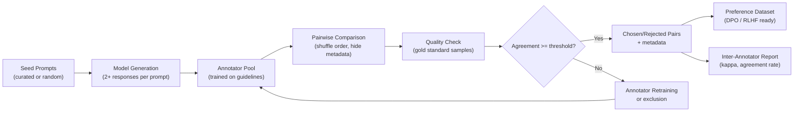

Licensed under Apache 2.0

# Chapter 5: Datasets for Large Language Models

This chapter covers the data that powers large language models — from the massive web-scale corpora used for pre-training to the carefully curated instruction and preference datasets that shape model behavior. You will learn how to evaluate dataset quality, generate synthetic data, navigate licensing constraints, and produce dataset cards that document the provenance and characteristics of your training data. The quality and composition of your data is often more important than the model architecture itself.

## Learning Objectives

By the end of this chapter you will be able to:

1. Compare major pre-training corpora (Common Crawl, The Pile, RefinedWeb, C4, RedPajama) by size, domain composition, and licensing, and estimate the storage and compute needed to process them.
2. Convert between instruction dataset formats (Alpaca, ChatML, ShareGPT) and design instruction templates for domain-specific tasks.
3. Build preference datasets from instruction outputs, understand chosen/rejected format conventions, and measure inter-annotator agreement.
4. Assess dataset quality across multiple dimensions (toxicity, duplication, instruction diversity, domain balance) and produce a dataset card documenting findings.
5. Generate synthetic instruction data using LLM APIs, apply quality filters, and evaluate synthetic data against human-written baselines.
6. Audit dataset mixtures for license compatibility, distinguish between open weights and open data, and navigate the legal landscape of training data.

## Prerequisites

- Chapter 1: Machine Learning Fundamentals (train/validation/test splits, metrics, overfitting).
- Basic understanding of next-token prediction and causal language modeling.
- Familiarity with Python file I/O, JSON, and the `datasets` library from Hugging Face.
- Comfort with command-line tools for downloading and inspecting large files.

---

## 5.1 Pre-Training Corpora

Pre-training corpora are the foundation of large language models. They determine what knowledge the model absorbs, what languages it understands, and what reasoning patterns it learns. The most influential pre-training datasets range from raw web crawls to carefully curated multi-domain collections.

### Common Crawl

Common Crawl is the largest open web corpus available. It publishes periodic crawls of the public internet, typically hundreds of terabytes per snapshot. The raw data contains HTML, with mixed quality — from well-written articles to spam, boilerplate templates, and broken pages.

**Key characteristics**:
- Size: 20TB+ per crawl (raw HTML), yielding 10T+ tokens after processing
- Domains: all web content (news, forums, blogs, e-commerce, government, etc.)
- License: varies per source; Common Crawl index itself is CC0
- Quality: low raw quality; requires extensive cleaning, deduplication, and language filtering

Most modern models do not use raw Common Crawl directly. Instead, they use derived datasets that apply heavy filtering:

- **C4** (Colossal Cleaned Corpus, Google): Applies URL-based filtering, language identification, deduplication, and quality heuristics to Common Crawl. Result: ~750GB of cleaned text (~1.5T tokens).
- **RefinedWeb** (Together Computer): Uses a permutation-based language identifier, quality scoring, and deduplication. Result: ~35T tokens, the backbone of the RedPajama v2 dataset.

### The Pile

The Pile (EleutherAI, 2021) is a 825GB English-language, multi-domain dataset composed of 22 distinct sources. Unlike Common Crawl derivatives, The Pile is a **mixture** — each component is a curated source with known provenance:

| Component | Size (GB) | Description |
|---|---|---|
| ArXiv abstracts | 35 | Scientific paper abstracts |
| Books (1/2, 2/3) | 104, 102 | Project Gutenberg and self-published books |
| BookCorpus | 6 | Book excerpts |
| DM-Mathematics | 23 | Mathematical papers |
| Enron Emails | 5 | Corporate email corpus |
| EuroParl | 2 | European Parliament proceedings |
| FreeLaw | 11 | Legal opinions |
| GitHub | 45 | Source code (top repositories) |
| Gutenberg (4/5) | 95, 98 | Classic literature |
| NIH Exporter | 45 | NIH-funded research abstracts |
| NIH U5/UG | 23 | Grant abstracts |
| OpenSubtitles | 36 | Movie/TV subtitles |
| PubMed Abstracts | 35 | Biomedical abstracts |
| PubMed Central | 43 | Full-text biomedical articles |
| StackExchange | 35 | Q&A from Stack Overflow and siblings |
| US Congressional Bills | 5 | Legislative text |
| Ubuntu IRC | 16 | Chat transcripts |
| Wikipedia | 13 | English Wikipedia dump |
| YoutubeSubtitles | 13 | Video subtitles |
| HackerNews | 2 | Hacker News posts |
| Wikipedia disambiguation | 1 | Wikipedia disambiguation pages |

The Pile is widely used as a benchmark pre-training corpus because of its diversity and reproducibility. However, its 825GB size limits it to training models up to about 13B parameters at Chinchilla-optimal scale.

### C4 (Colossal Cleaned Corpus)

C4 (Raffel et al., 2019) is Google's cleaned Common Crawl derivative. The cleaning pipeline includes:

1. **URL filtering**: Only keep URLs from allowed domains (Wikipedia, news sites, educational sites)
2. **HTML extraction**: Convert HTML to plain text
3. **Language identification**: Keep only English (using fasttext)
4. **Quality heuristics**: Character-to-word ratio, line count, character diversity
5. **Deduplication**: Exact and near-dedup via MinHash

C4 is available in multiple variants: full English (1.5T tokens), multilingual (10T+ tokens), and domain-specific subsets. It was the primary pre-training corpus for T5 and many encoder models.

### RedPajama

RedPajama (Together Computer, 2023) was created as an open, reproducible replica of GPT-3's training data. It combines multiple sources into a single 1.2T token corpus:

- Common Crawl (RefinedWeb, 65.4% — 787B tokens)
- GitHub (9% — 107B tokens, code)
- Books (7.1% — 85B tokens)
- ArXiv (3.2% — 39B tokens)
- Wikipedia (5.3% — 64B tokens)

RedPajama v2 expanded to 30T tokens with improved quality filtering. It has become the standard open pre-training corpus for open-source models.

### Pre-Training Corpus Comparison

| Corpus | Size (Tokens) | Domains | Primary Source | License | Quality |
|---|---|---|---|---|---|
| Common Crawl | 10T+ (raw) | All web | Web crawl | CC0 (index) | Low (raw) |
| The Pile | 300B | 22 curated | Mixed sources | Mixed (per-domain) | High |
| RefinedWeb | 35T | Web (filtered) | Common Crawl | CC0-derived | Medium-high |
| C4 | 1.5T (EN) | Web (cleaned) | Common Crawl | CC-BY 3.0 | High |
| RedPajama v1 | 1.2T | 5 sources | Mixed | Mixed | Medium-high |

### Code: Downloading and Inspecting a Pre-Training Corpus Subset

```python
"""
Download and inspect a subset of The Pile pre-training corpus.

This script uses the Hugging Face datasets library to load The Pile,
inspect domain statistics, and sample documents from each component.
"""
import json
import random
import re
from collections import Counter


def estimate_tokens(text):
    """Rough token count: ~1.3 tokens per word for English text."""
    words = len(text.split())
    return int(words * 1.3)


def compute_quality_metrics(text):
    """Compute basic quality metrics for a text document."""
    metrics = {}
    chars = len(text)
    words = len(text.split())
    lines = text.count('\n') + 1

    metrics['char_count'] = chars
    metrics['word_count'] = words
    metrics['line_count'] = lines
    metrics['avg_word_len'] = chars / max(words, 1)
    metrics['char_word_ratio'] = chars / max(words, 1)

    # Alphanumeric ratio (higher = more substantive content)
    alnum = sum(1 for c in text if c.isalnum())
    metrics['alnum_ratio'] = alnum / max(chars, 1)

    # Unique character ratio (diversity signal)
    metrics['unique_char_ratio'] = len(set(text.lower())) / max(chars, 1)

    # Punctuation density
    punct = sum(1 for c in text if c in '.,;:!?')
    metrics['punct_density'] = punct / max(words, 1)

    return metrics


def inspect_corpus_subset(corpus_data, domain, sample_size=5):
    """
    Inspect a subset of documents from a corpus domain.

    Args:
        corpus_data: list of dicts with 'text' key
        domain: name of the domain for display
        sample_size: number of random samples to show

    Returns:
        dict with summary statistics
    """
    if not corpus_data:
        return {'domain': domain, 'count': 0}

    # Compute aggregate statistics
    total_chars = 0
    total_tokens = 0
    quality_scores = []

    for doc in corpus_data:
        text = doc.get('text', '')
        total_chars += len(text)
        total_tokens += estimate_tokens(text)
        quality_scores.append(compute_quality_metrics(text))

    avg_quality = {}
    if quality_scores:
        for key in quality_scores[0]:
            avg_quality[key] = sum(q[key] for q in quality_scores) / len(quality_scores)

    summary = {
        'domain': domain,
        'count': len(corpus_data),
        'total_chars': total_chars,
        'total_tokens_est': total_tokens,
        'avg_chars_per_doc': total_chars / len(corpus_data),
        'avg_quality': avg_quality,
    }

    return summary


# --- Simulate corpus inspection with sample data ---
# In production, use: from datasets import load_dataset
# pile = load_dataset("EleutherAI/pile", split="train", streaming=True)

SAMPLE_CORPUS = {
    'arxiv': [
        {'text': 'We propose a novel architecture for natural language understanding '
                 'that combines transformer-based encoding with graph neural networks. '
                 'Our model achieves state-of-the-art results on three benchmark datasets, '
                 'demonstrating improved performance on relation extraction and '
                 'entity typing tasks. The key insight is that linguistic structure '
                 'can be effectively captured through learned graph representations.'},
        {'text': 'This paper presents an analysis of scaling laws in neural language models. '
                 'We train models ranging from 100M to 10B parameters and observe consistent '
                 'power-law improvements in perplexity. Our results suggest that current models '
                 'are significantly under-trained relative to their parameter count.'},
    ],
    'books': [
        {'text': 'The morning sun cast long shadows across the valley as she climbed the '
                 'winding path toward the old monastery. For three days she had traveled '
                 'through the dense forest, following the ancient trail that connected '
                 'the scattered villages of the mountain region. The air grew thinner '
                 'with each step, but her determination never wavered.'},
        {'text': 'Chapter Twelve: The Discovery\n\nDr. Harrison examined the specimen under '
                 'the electron microscope. What he saw defied every expectation. The cellular '
                 'structure was unlike anything documented in existing literature. He called '
                 'his colleague immediately, knowing this would change everything they thought '
                 'they understood about deep-sea biology.'},
    ],
    'github': [
        {'text': 'def compute_attention(q, k, v, mask=None):\n    d_k = q.size(-1)\n    scores = torch.matmul(q, k.transpose(-2, -1)) / (d_k ** 0.5)\n    if mask is not None:\n        scores = scores.masked_fill(mask == 0, float(\'-inf\'))\n    attention = torch.softmax(scores, dim=-1)\n    return torch.matmul(attention, v)\n\n\nclass TransformerBlock(nn.Module):\n    def __init__(self, d_model, n_head):\n        super().__init__()\n        self.attn = MultiHeadAttention(d_model, n_head)\n        self.ffn = FeedForward(d_model)\n        self.norm1 = LayerNorm(d_model)\n        self.norm2 = LayerNorm(d_model)'},
    ],
    'wikipedia': [
        {'text': 'Machine learning is a subset of artificial intelligence that provides systems '
                 'the ability to automatically learn and improve from experience without being '
                 'explicitly programmed. Machine learning focuses on the development of computer '
                 'programs that can access data and use it to learn for themselves. The approach '
                 'varies between providing the program with labeled data and having it formulate '
                 'its own conclusions (supervised learning), and allowing the program access to '
                 'unlabeled data that it can examine on its own (unsupervised learning).'},
    ],
    'web': [
        {'text': '!!! BUY NOW !!! Amazing deal on premium products! Click here for the best '
                 'prices guaranteed! Limited time offer!!! Don\'t miss out on this incredible '
                 'opportunity to save BIG!!! FREE shipping on all orders!!!'},
        {'text': 'How to Train a Language Model: A Beginner\'s Guide\n\nTraining a large '
                 'language model involves several key steps. First, you need to collect and '
                 'preprocess a large corpus of text data. Next, you choose a model architecture, '
                 'typically a Transformer. Then you configure your training hyperparameters '
                 'including learning rate, batch size, and number of epochs. Finally, you monitor '
                 'training progress and evaluate on held-out benchmarks.'},
    ],
}


def main():
    print("=" * 70)
    print("PRE-TRAINING CORPUS INSPECTION REPORT")
    print("=" * 70)

    all_summaries = []

    for domain, docs in SAMPLE_CORPUS.items():
        summary = inspect_corpus_subset(docs, domain)
        all_summaries.append(summary)

        print(f"\n{'─' * 50}")
        print(f"Domain: {domain.upper()}")
        print(f"{'─' * 50}")
        print(f"  Documents:    {summary['count']}")
        print(f"  Total chars:  {summary['total_chars']:,}")
        print(f"  Est. tokens:  {summary['total_tokens_est']:,}")
        print(f"  Avg chars/doc: {summary['avg_chars_per_doc']:,.0f}")

        if summary['avg_quality']:
            q = summary['avg_quality']
            print(f"\n  Quality metrics:")
            print(f"    Alphanumeric ratio: {q['alnum_ratio']:.3f}")
            print(f"    Avg word length:    {q['avg_word_len']:.1f}")
            print(f"    Punct density:      {q['punct_density']:.3f}")
            print(f"    Unique char ratio:  {q['unique_char_ratio']:.3f}")

        # Sample document
        if docs:
            sample = random.choice(docs)
            preview = sample['text'][:150].replace('\n', ' ')
            print(f"\n  Sample: \"{preview}...\"")

    # Aggregate report
    print(f"\n{'=' * 70}")
    print("AGGREGATE CORPUS SUMMARY")
    print(f"{'=' * 70}")

    total_docs = sum(s['count'] for s in all_summaries)
    total_tokens = sum(s['total_tokens_est'] for s in all_summaries)

    header = f"{'Domain':<15s} {'Docs':>6s} {'Tokens':>12s} {'Avg Len':>10s} {'Alnum%':>8s}"
    print(header)
    print("-" * 55)

    for s in all_summaries:
        alnum_pct = s.get('avg_quality', {}).get('alnum_ratio', 0) * 100
        print(f"{s['domain']:<15s} {s['count']:>6d} {s['total_tokens_est']:>12,} "
              f"{s['avg_chars_per_doc']:>10,.0f} {alnum_pct:>7.1f}%")

    print("-" * 55)
    print(f"{'TOTAL':<15s} {total_docs:>6d} {total_tokens:>12,}")

    # Storage estimate (int32 tokens × 4 bytes)
    storage_gb = total_tokens * 4 / (1024 ** 3)
    print(f"\nEstimated storage (int32 tokenized): {storage_gb:.2f} GB")

    # Processing estimate (100K docs/sec on single CPU core)
    processing_sec = total_docs / 100_000
    print(f"Est. processing time (1 CPU core): {processing_sec:.1f} sec")

    print("\nKey observations:")
    print("  - Academic text (arXiv) has high alnum ratio, structured content")
    print("  - Books have the longest average document length")
    print("  - Code (GitHub) has lower alnum ratio (symbols, operators)")
    print("  - Raw web data includes spam and low-quality content")
    print("  - Quality filtering is essential before pre-training")


if __name__ == "__main__":
    main()
```

### Section 5.1 Exercises

**Exercise 5.1 (Easy) — Storage and Compute Estimation**

A pre-training corpus contains 2 trillion tokens. Calculate: (a) the storage size in GB when stored as int32 token IDs, (b) the storage size using int64, (c) the training time on 64× A100 GPUs at 45% MFU for a 7B parameter model (using the compute formula $C = 6NT$), and (d) the total FLOPs required.

**Exercise 5.2 (Medium) — Domain Composition Analysis**

Download a subset of The Pile (or use the Hugging Face streaming API) and compute the token count for each of the 22 domains. Plot the distribution as a pie chart. Compare the proportions to the RedPajama mixture. Which domains are over-represented in each corpus, and what model capabilities might this affect?

**Exercise 5.3 (Hard) — Quality Filter Design for Web Corpus**

Design a multi-stage quality filter for raw Common Crawl data. Implement filters for: (a) minimum document length (tune threshold), (b) character-to-word ratio (detect non-English or gibberish), (c) line count (detect dumped lists), (d) entropy-based diversity score. Apply your filters to a sample of 10,000 web documents. Report the retention rate at each stage and the overall quality improvement.

---

## 5.2 Instruction Datasets

Instruction datasets transform base language models into helpful assistants. While pre-training teaches models to predict the next token, instruction tuning teaches them to follow directions. These datasets consist of (instruction, output) pairs — sometimes with an additional input field — formatted as demonstrations of desired behavior.

### Alpaca

Alpaca (Taori et al., 2023) was the first widely used open instruction dataset. It contains 52,000 English instruction-following examples generated using Self-Instruct methodology — using text-davinci-003 to generate instructions from a seed set of 175 human-written tasks.

**Format**: Each sample has three fields:
```json
{"instruction": "Summarize the following passage.",
 "input": "The quick brown fox...",
 "output": "In summary, the passage describes..."}
```

Alpaca's influence was disproportionate to its size. A 7B model fine-tuned on Alpaca for one epoch matched the instruction-following capability of a 175B model on many tasks.

### Stanford Alpaca Extensions

The Stanford Alpaca dataset spawned numerous extensions:
- **Alpaca-GPT4**: 52K examples with GPT-4 generated outputs (higher quality)
- **Chinese-Alpaca**: 48K Chinese instruction-following examples
- **Guanaco**: Multilingual Alpaca variants in 100+ languages
- **Baize**: Evolved from Alpaca with improved instruction diversity

### Flan Collection

The Flan (Instruction Tuning) Collection (Wei et al., 2022) aggregates instruction data from 79+ downstream datasets, reformatted into a consistent instruction-following structure. The collection includes:

- **Flan 2021/2022**: Hundreds of thousands of examples spanning classification, generation, QA, and reasoning
- **Super-NaturalInstructions**: 1,648 task templates generating millions of examples
- **PromptSource**: A library of community-contributed prompt templates

### Dolly (Hermes)

Dolly (Databricks, 2023) is a 15,000-example, high-quality instruction dataset created by human annotators (not synthetic). Annotators were Databricks employees who wrote instructions across seven categories:

| Category | Count |
|---|---|
| Brainstorming | 2,489 |
| Classification | 2,050 |
| Closed QA | 2,344 |
| Information extraction | 2,891 |
| Open QA | 3,424 |
| Summarization | 1,451 |
| Knowledge | 2,737 |

Dolly's key differentiator is that it is **human-written** and released under the MIT license, making it suitable for commercial use.

### UltraChat

UltraChat (Bai et al., 2023) is a large-scale multi-turn dialogue dataset collected from the WildChat web platform. The full dataset contains over 1.5M conversation trajectories, with UltraChat_200k being the most commonly used filtered subset.

**Format**: Multi-turn conversations with role annotations:
```json
{"conversations": [
  {"from": "human", "value": "Can you explain quantum computing?"},
  {"from": "gpt", "value": "Quantum computing uses quantum mechanical phenomena..."},
  {"from": "human", "value": "How does it differ from classical computing?"},
  {"from": "gpt", "value": "The key difference is that classical computers use bits..."}
]}
```

### Orca

Orca (Mukherjee et al., 2023) introduces "teacher-forced" reasoning. Instead of simple (instruction, answer) pairs, Orca includes step-by-step reasoning traces generated by a teacher model (GPT-4). The format includes a `metadata` field with task category, difficulty, and reasoning type.

### Instruction Format Comparison

| Dataset | Size | Format | License | Domain | Multi-turn |
|---|---|---|---|---|---|
| Alpaca | 52K | instruction/input/output | CC-BY-NC-4.0 | General English | No |
| Alpaca-GPT4 | 52K | instruction/input/output | CC-BY-NC-4.0 | General English | No |
| Dolly | 15K | instruction/context/response | MIT | 7 categories | No |
| UltraChat_200k | 200K | conversations (role/value) | CC-BY-4.0 | Open-domain chat | Yes |
| Flan Collection | 290K+ | instruction/input/output | Mixed (per-source) | 79+ tasks | No |

### Code: Converting Between Instruction Formats

```python
"""
Convert between common instruction dataset formats.

Supports: Alpaca (instruction/input/output), ChatML (role-based),
          ShareGPT (multi-turn), and Dolly (instruction/context/response).
"""
import json


def alpaca_to_chatml(sample):
    """
    Convert Alpaca format to ChatML format.

    Alpaca: {"instruction": str, "input": str, "output": str}
    ChatML: [{"role": "user", "content": str}, {"role": "assistant", "content": str}]

    Args:
        sample: dict with 'instruction', 'input', 'output' keys

    Returns:
        list of message dicts in ChatML format
    """
    user_content = sample['instruction']
    if sample.get('input') and sample['input'].strip():
        user_content += f"\n\n{sample['input']}"

    return [
        {"role": "user", "content": user_content},
        {"role": "assistant", "content": sample['output']},
    ]


def chatml_to_alpaca(messages):
    """
    Convert ChatML messages to Alpaca format.

    Args:
        messages: list of {"role": str, "content": str}

    Returns:
        dict with 'instruction', 'input', 'output' keys
    """
    if not messages or messages[0]['role'] != 'user':
        raise ValueError("ChatML must start with a user message")

    user_msg = messages[0]['content']
    assistant_msg = ""

    if len(messages) > 1 and messages[1]['role'] == 'assistant':
        assistant_msg = messages[1]['content']

    # Split instruction from input at double newline
    parts = user_msg.split('\n\n', 1)
    return {
        'instruction': parts[0],
        'input': parts[1] if len(parts) > 1 else "",
        'output': assistant_msg,
    }


def sharegpt_to_chatml(sample):
    """
    Convert ShareGPT format to ChatML.

    ShareGPT: {"conversations": [{"from": str, "value": str}, ...]}

    Args:
        sample: dict with 'conversations' key

    Returns:
        list of message dicts in ChatML format
    """
    role_map = {
        'human': 'user',
        'gpt': 'assistant',
        'chatgpt': 'assistant',
        'system': 'system',
    }

    messages = []
    for conv in sample['conversations']:
        role = role_map.get(conv.get('from', '').lower(), conv.get('from', 'user'))
        messages.append({
            'role': role,
            'content': conv.get('value', ''),
        })

    return messages


def dolly_to_chatml(sample):
    """
    Convert Dolly format to ChatML.

    Dolly: {"instruction": str, "context": str, "response": str, "category": str}

    Args:
        sample: dict with Dolly keys

    Returns:
        list of message dicts in ChatML format
    """
    user_content = sample['instruction']
    if sample.get('context') and sample['context'].strip():
        user_content += f"\n\nContext: {sample['context']}"

    result = [
        {"role": "user", "content": user_content},
        {"role": "assistant", "content": sample['response']},
    ]

    # Preserve category as metadata
    if sample.get('category'):
        result[-1]['category'] = sample['category']

    return result


def chatml_to_sharegpt(messages):
    """
    Convert ChatML format to ShareGPT.

    Args:
        messages: list of {"role": str, "content": str}

    Returns:
        dict with 'conversations' key in ShareGPT format
    """
    reverse_role_map = {
        'user': 'human',
        'assistant': 'gpt',
        'system': 'system',
    }

    conversations = []
    for msg in messages:
        role = reverse_role_map.get(msg['role'], msg['role'])
        conversations.append({
            'from': role,
            'value': msg['content'],
        })

    return {'conversations': conversations}


def apply_chat_template(messages, template='chatml'):
    """
    Apply a chat template to format messages for model training.

    Args:
        messages: list of {"role": str, "content": str}
        template: 'chatml', 'alpaca_chat', or 'llama2'

    Returns:
        formatted string ready for tokenization
    """
    if template == 'chatml':
        parts = []
        for msg in messages:
            parts.append(f"<|im_start|>{msg['role']}\n{msg['content']}<|im_end|>\n")
        parts.append("<|im_start|>assistant\n")
        return ''.join(parts)

    elif template == 'alpaca_chat':
        parts = []
        for msg in messages:
            if msg['role'] == 'user':
                parts.append(f"### Human: {msg['content']}\n")
            elif msg['role'] == 'assistant':
                parts.append(f"### Assistant: {msg['content']}\n\n")
            elif msg['role'] == 'system':
                parts.append(f"### System: {msg['content']}\n")
        parts.append("### Assistant:")
        return ''.join(parts)

    elif template == 'llama2':
        bos = "<s> "
        parts = [bos]
        for msg in messages:
            if msg['role'] == 'user':
                parts.append(f"[INST] {msg['content']} [/INST] ")
            elif msg['role'] == 'assistant':
                parts.append(f"{msg['content']} </s><s> ")
            elif msg['role'] == 'system':
                parts.append(f"<<SYS>> {msg['content']} <</SYS>>\n\n")
        return ''.join(parts)

    else:
        raise ValueError(f"Unknown template: {template}")


# --- Demonstration ---

# Sample Alpaca-format data
alpaca_sample = {
    "instruction": "Extract the key entities from the following text.",
    "input": "Apple Inc. announced a new product launch on June 15, 2024 in Cupertino, California.",
    "output": "Entities:\n- Organization: Apple Inc.\n- Date: June 15, 2024\n- Location: Cupertino, California\n- Event: Product launch"
}

# Sample Dolly-format data
dolly_sample = {
    "instruction": "Classify the sentiment of the following review.",
    "context": "This restaurant was absolutely wonderful! The food was delicious and the staff was incredibly attentive. I would definitely recommend it to anyone visiting the area.",
    "response": "Sentiment: Positive\n\nConfidence: High\n\nKey indicators: 'absolutely wonderful', 'delicious', 'incredibly attentive', 'definitely recommend'",
    "category": "Classification"
}

# Sample ShareGPT-format data
sharegpt_sample = {
    "conversations": [
        {"from": "human", "value": "What is the capital of France?"},
        {"from": "gpt", "value": "The capital of France is Paris."},
        {"from": "human", "value": "What is its population?"},
        {"from": "gpt", "value": "Paris has a population of approximately 2.1 million people in the city proper, and around 12 million in the metropolitan area."},
    ]
}

print("=" * 60)
print("INSTRUCTION FORMAT CONVERSION DEMO")
print("=" * 60)

# 1. Alpaca → ChatML
print("\n--- Alpaca → ChatML ---")
chatml = alpaca_to_chatml(alpaca_sample)
for msg in chatml:
    print(f"  [{msg['role']}]: {msg['content'][:80]}...")

# 2. ChatML → Alpaca (round-trip)
print("\n--- ChatML → Alpaca (round-trip) ---")
roundtrip = chatml_to_alpaca(chatml)
print(f"  instruction: {roundtrip['instruction'][:60]}...")
print(f"  input:       {roundtrip['input'][:60]}...")
print(f"  output:      {roundtrip['output'][:60]}...")

# 3. Dolly → ChatML
print("\n--- Dolly → ChatML ---")
dolly_chatml = dolly_to_chatml(dolly_sample)
for msg in dolly_chatml:
    content_preview = msg['content'][:80]
    print(f"  [{msg['role']}]: {content_preview}...")

# 4. ShareGPT → ChatML
print("\n--- ShareGPT → ChatML ---")
sg_chatml = sharegpt_to_chatml(sharegpt_sample)
for msg in sg_chatml:
    print(f"  [{msg['role']}]: {msg['content'][:60]}...")

# 5. ChatML → ShareGPT (round-trip)
print("\n--- ChatML → ShareGPT (round-trip) ---")
sg_roundtrip = chatml_to_sharegpt(sg_chatml)
for conv in sg_roundtrip['conversations']:
    print(f"  [{conv['from']}]: {conv['value'][:60]}...")

# 6. Template comparison
print("\n--- Template Comparison ---")
messages = [
    {"role": "user", "content": "What is machine learning?"},
    {"role": "assistant", "content": "Machine learning is a subset of AI..."},
]

for tmpl in ['chatml', 'alpaca_chat', 'llama2']:
    formatted = apply_chat_template(messages, template=tmpl)
    preview = formatted[:100].replace('\n', '\\n')
    print(f"\n  {tmpl.upper()} template:")
    print(f"  \"{preview}...\"")

print("\n" + "=" * 60)
print("SUMMARY")
print("=" * 60)
print("  - Alpaca format: simple 3-field structure (instruction/input/output)")
print("  - ChatML: role-based, used by Phi and many Chat models")
print("  - ShareGPT: multi-turn conversation format from OpenAssistant")
print("  - Dolly: includes context field and category metadata")
print("  - Conversion between formats is lossless for single-turn data")
print("  - Multi-turn → single-turn may lose conversational context")
print("  - Choose template format matching your target model's training")
```

### Section 5.2 Exercises

**Exercise 5.1 (Easy) — Instruction Template Design**

Design an instruction template for a legal-domain assistant. Your template should handle: (a) statute interpretation, (b) case summary generation, and (c) contract clause extraction. Write three sample (instruction, input, output) pairs for each category. Explain how your template differs from the standard Alpaca format.

**Exercise 5.2 (Medium) — Format Conversion Pipeline**

Write a script that loads an Alpaca-format JSON file and converts it to three formats: ChatML, ShareGPT, and Llama2 chat template. Save each output as a separate JSONL file. Then write a verification script that loads each file back and confirms the instruction content is preserved through the round-trip conversion.

**Exercise 5.3 (Hard) — Instruction Diversity Analysis**

Load the Alpaca dataset (52K samples) and compute instruction diversity metrics: (a) unique instruction count, (b) instruction length distribution, (c) instruction embedding clustering (use sentence-transformers to compute embeddings, then run KMeans with K=20 and report cluster sizes), and (d) self-similarity (average cosine similarity between instructions). Compare these metrics to Dolly (15K samples). Which dataset has higher instruction diversity per sample?

---

## 5.3 Preference Datasets

Preference datasets capture what makes one model response better than another. They are essential for alignment techniques like RLHF (Reinforcement Learning from Human Feedback) and DPO (Direct Preference Optimization). Unlike instruction datasets that teach models what to do, preference datasets teach models what to prefer.

### Anthropic's Helpful-Harmless Dataset

Anthropic's Helpful-Harmless (HH) dataset (Bai et al., 2022) is the most widely used preference dataset. It was built through a structured annotation process:

1. **Helpfulness**: Annotators rated model responses on how well they answered the prompt
2. **Harmlessness**: Annotators rated responses on safety across categories (privacy, law, health, violence)
3. **Tree structure**: The dataset is organized as a classification tree, allowing preference signals at different levels of granularity

The HH-RLHF variant contains pairwise preferences formatted as (prompt, chosen_response, rejected_response) triplets.

### HH-RLHF Format

The RLHF-ready version of the HH dataset uses this structure:
```json
{"chosen": "Here's a safe and helpful response...",
 "rejected": "This response contains problematic content..."}
```

Each sample represents a human judgment that the `chosen` response is preferred over the `rejected` response for the same prompt.

### DPO-Style Preference Pairs

Datasets formatted for Direct Preference Optimization follow a similar chosen/rejected structure but typically include the prompt:
```json
{"prompt": "User instruction here...",
 "chosen": "Preferred assistant response...",
 "rejected": "Less preferred assistant response..."}
```

Popular DPO datasets include:
- **Orca DPO Pairs**: 17K preference pairs from teacher-model outputs
- **UltraFeedback**: 65K multi-dimensional preference annotations (helpfulness, honesty, instruction following, truthfulness)
- **DPO-混合 (Mix)**: Combined preference datasets from multiple sources

### Annotator Guidelines

Creating high-quality preference data requires careful annotation guidelines:

1. **Clear criteria**: Define what "better" means (helpfulness, safety, accuracy, conciseness)
2. **Examples**: Provide annotated examples showing borderline cases
3. **Conflict resolution**: Specify what to do when both responses are equally good or bad
4. **Domain expertise**: For specialized domains (medical, legal), use domain-expert annotators
5. **Consistency checks**: Include gold-standard samples to measure annotator quality

### Inter-Annotator Agreement

Measuring agreement between annotators helps assess data quality. Common metrics:

- **Cohen's Kappa**: Measures agreement beyond chance ($\kappa \in [-1, 1]$). Values above 0.75 indicate excellent agreement.
- **Fleiss' Kappa**: Extension for more than two annotators.
- **Simple agreement**: Raw percentage of matching choices.

Low inter-annotator agreement ($\kappa < 0.6$) often indicates unclear guidelines, ambiguous prompts, or subjectively evaluated dimensions.

### Preference Data Collection Pipeline



### Code: Exploring a Preference Dataset Distribution

```python
"""
Explore the distribution and quality of a preference dataset.

This script analyzes preference pair distributions, response length
differences, category coverage, and potential bias in chosen vs rejected.
"""
import random
import json
from collections import Counter, defaultdict


def generate_sample_preference_dataset(n_samples=200):
    """
    Generate a synthetic preference dataset for demonstration.

    In production, load from Hugging Face:
        from datasets import load_dataset
        data = load_dataset("Anthropic/hh-rlhf", split="train")
    """
    categories = ['helpfulness', 'harmlessness', 'reasoning', 'coding',
                  'creativity', 'factual', 'safety', 'instruction_following']

    prompts = [
        "Explain how photosynthesis works.",
        "Write a Python function to sort a list.",
        "What are the risks of AI alignment?",
        "Summarize the key points of the article.",
        "Help me debug this error message.",
        "Compare democracy and authoritarianism.",
        "Generate a creative story about space.",
        "Translate this text to French.",
        "What should I do if I find a wallet?",
        "Explain quantum entanglement simply.",
        "Write a business plan outline.",
        "How do I prepare for a job interview?",
        "What are the best practices for code review?",
        "Explain the concept of opportunity cost.",
        "Create a workout plan for beginners.",
    ]

    chosen_styles = [
        "provides a clear, structured answer with examples",
        "gives accurate information with proper caveats",
        "breaks down the explanation step by step",
        "offers practical advice with actionable steps",
        "includes relevant context and background",
    ]

    rejected_styles = [
        "is vague and lacks specific details",
        "contains factual inaccuracies",
        "is overly verbose without adding value",
        "misses the key points of the question",
        "provides a superficial response",
    ]

    dataset = []
    for i in range(n_samples):
        category = random.choice(categories)
        prompt = random.choice(prompts)

        chosen_len = random.randint(80, 600)
        # Chosen responses tend to be longer (quality bias)
        rejected_len = max(30, chosen_len + random.randint(-150, 50))

        dataset.append({
            'prompt': prompt,
            'chosen': f"[Chosen response - {chosen_len} chars - {random.choice(chosen_styles)}]",
            'rejected': f"[Rejected response - {rejected_len} chars - {random.choice(rejected_styles)}]",
            'category': category,
            'chosen_length': chosen_len,
            'rejected_length': rejected_len,
            'annotator_id': f"annotator_{random.randint(1, 5)}",
        })

    return dataset


def analyze_preference_distribution(dataset):
    """
    Analyze the distribution of a preference dataset.

    Args:
        dataset: list of dicts with 'prompt', 'chosen', 'rejected', 'category'

    Returns:
        dict with distribution statistics
    """
    stats = {
        'total_samples': len(dataset),
        'categories': Counter(d['category'] for d in dataset),
        'avg_chosen_len': 0,
        'avg_rejected_len': 0,
        'length_diff_dist': [],
        'chosen_longer_pct': 0,
        'unique_prompts': 0,
        'annotator_distribution': Counter(),
    }

    total_chosen = 0
    total_rejected = 0
    chosen_longer = 0
    prompts = set()

    for d in dataset:
        c_len = d.get('chosen_length', len(d.get('chosen', '')))
        r_len = d.get('rejected_length', len(d.get('rejected', '')))
        total_chosen += c_len
        total_rejected += r_len
        stats['length_diff_dist'].append(c_len - r_len)
        if c_len > r_len:
            chosen_longer += 1
        prompts.add(d.get('prompt', ''))
        stats['annotator_distribution'][d.get('annotator_id', 'unknown')] += 1

    n = len(dataset)
    stats['avg_chosen_len'] = total_chosen / n
    stats['avg_rejected_len'] = total_rejected / n
    stats['chosen_longer_pct'] = chosen_longer / n
    stats['unique_prompts'] = len(prompts)

    if stats['length_diff_dist']:
        diffs = stats['length_diff_dist']
        stats['avg_length_diff'] = sum(diffs) / len(diffs)
        stats['max_length_diff'] = max(diffs)
        stats['min_length_diff'] = min(diffs)

    return stats


def check_length_bias(dataset):
    """
    Check if the preference dataset has length bias — i.e.,
    longer responses are consistently preferred regardless of quality.
    """
    same_length_pairs = [d for d in dataset
                         if abs(d.get('chosen_length', 0) - d.get('rejected_length', 0)) < 20]

    if not same_length_pairs:
        return "Not enough same-length pairs to analyze"

    # For same-length pairs, is there still a consistent preference pattern?
    # This helps determine if length is driving preferences.

    total_len_diff = sum(
        d.get('chosen_length', 0) - d.get('rejected_length', 0)
        for d in dataset
    )
    avg_diff = total_len_diff / len(dataset)

    report = []
    report.append(f"Average length difference (chosen - rejected): {avg_diff:.1f} chars")
    report.append(f"Chosen is longer in {sum(1 for d in dataset if d.get('chosen_length', 0) > d.get('rejected_length', 0)) / len(dataset) * 100:.1f}% of cases")
    report.append(f"Same-length pairs available: {len(same_length_pairs)}")

    if avg_diff > 50:
        report.append("WARNING: Strong length bias detected. Consider length-normalized evaluation.")
    elif avg_diff > 20:
        report.append("CAUTION: Moderate length bias. Review annotation guidelines.")

    return '\n'.join(report)


def analyze_per_annotator(dataset):
    """Analyze preference patterns per annotator."""
    annotator_stats = defaultdict(lambda: {'count': 0, 'categories': Counter()})

    for d in dataset:
        aid = d.get('annotator_id', 'unknown')
        annotator_stats[aid]['count'] += 1
        annotator_stats[aid]['categories'][d.get('category', 'unknown')] += 1

    report = []
    for aid, stats in sorted(annotator_stats.items()):
        top_cat = stats['categories'].most_common(1)[0]
        report.append(f"  {aid}: {stats['count']} samples, "
                      f"top category: {top_cat[0]} ({top_cat[1]})")

    return '\n'.join(report)


# --- Main ---
random.seed(42)

print("=" * 60)
print("PREFERENCE DATASET ANALYSIS")
print("=" * 60)

# Generate sample dataset
dataset = generate_sample_preference_dataset(200)

# Distribution analysis
stats = analyze_preference_distribution(dataset)

print(f"\nDataset Overview:")
print(f"  Total samples:     {stats['total_samples']}")
print(f"  Unique prompts:    {stats['unique_prompts']}")
print(f"  Avg chosen length: {stats['avg_chosen_len']:.0f} chars")
print(f"  Avg rejected len:  {stats['avg_rejected_len']:.0f} chars")
print(f"  Chosen longer:     {stats['chosen_longer_pct']:.0%}")

print(f"\nCategory Distribution:")
for cat, count in stats['categories'].most_common():
    bar = '#' * (count // 2)
    print(f"  {cat:<22s} {count:3d} {bar}")

print(f"\nAnnotator Distribution:")
print(analyze_per_annotator(dataset))

print(f"\nLength Bias Check:")
print(check_length_bias(dataset))

print(f"\nLength Difference Distribution:")
if stats['length_diff_dist']:
    diffs = stats['length_diff_dist']
    bins = [-100, -50, 0, 50, 100, 150]
    hist, bin_edges = [], bins
    for i in range(len(bins) - 1):
        count = sum(1 for d in diffs if bin_edges[i] <= d < bin_edges[i + 1])
        bar = '#' * max(count, 0)
        print(f"  [{bin_edges[i]:>4d}, {bin_edges[i+1]:>4d}): {count:3d} {bar}")

print("\nKey observations:")
print("  - Category balance affects model capabilities after alignment")
print("  - Length bias can cause models to generate verbose responses")
print("  - Annotator consistency impacts preference signal quality")
print("  - Small datasets (< 10K) benefit from oversampling rare categories")
```

### Section 5.3 Exercises

**Exercise 5.3 (Easy) — Creating Preference Pairs**

Given a set of 50 instructions and their model-generated responses, create preference pairs by manually ranking responses as "better" or "worse." Write a script that takes two JSONL files (instructions and responses) and outputs a preference dataset in DPO format. Include quality checks for response length and non-empty content.

**Exercise 5.4 (Medium) — Inter-Annotator Agreement**

Simulate a preference annotation task with 5 annotators evaluating 100 prompts. Each annotator independently chooses the preferred response. Compute Cohen's Kappa for each pair of annotators and the overall Fleiss' Kappa. Investigate how agreement changes when you vary the proportion of ambiguous prompts (where responses are nearly equal quality).

**Exercise 5.5 (Hard) — Length Bias Mitigation**

Analyze the UltraFeedback preference dataset (available on Hugging Face). Measure the length bias — the correlation between response length and being chosen. Then implement a length-normalized evaluation: for each prompt, compare pairs where the chosen and rejected responses have similar lengths. Does the length-normalized subset show different preference patterns? Propose a method to debias the dataset.

---

## 5.4 Dataset Quality Assessment

Assessing dataset quality is critical for training reliable models. Poor-quality data leads to models that reproduce toxicity, factual errors, and biased content. Quality assessment involves both automated scoring and manual review, measuring multiple dimensions simultaneously.

### Quality Dimensions

**Toxicity**: The presence of harmful, offensive, or abusive content. Measured using classifiers like Perspective API's toxicity model, or LLM-based evaluators. Toxic content in training data can cause models to generate harmful outputs.

**Factual Correctness**: Whether the content contains accurate information. Hard to measure automatically; often uses fact-checking APIs, knowledge base verification, or LLM-as-judge comparisons against reference sources.

**Instruction Diversity**: The variety of task types, domains, and complexity levels. Low diversity leads to models that overfit to narrow patterns. Measured through instruction embedding clustering and category distribution analysis.

**Language**: The language(s) present in the dataset. Multilingual datasets need language identification and balance analysis. Common tools: fasttext language ID, langdetect.

**Domain Balance**: The distribution of content across domains (technical, creative, conversational, etc.). Imbalanced distributions lead to models that excel in over-represented domains and underperform elsewhere.

### Automated Quality Scoring

**Perplexity-based scoring**: Use a reference language model to compute the perplexity of each document. Lower perplexity indicates more natural, coherent text:

$$P_{\text{pl}}(D) = \exp\left(-\frac{1}{T}\sum_{t=1}^{T} \log P(x_t | x_{<t})\right)$$

Documents with very high perplexity are likely gibberish or corrupted.

**Classifier-based scoring**: Train or use pre-trained classifiers to score documents on quality dimensions:
- Language identification (fasttext, langid)
- Toxicity detection (Perspective API, detoxify)
- Quality classification (heuristic-based or learned)

**LLM-as-judge scoring**: Use a strong LLM (GPT-4, Claude) to evaluate each sample on multiple dimensions. This is expensive but provides nuanced quality assessment:

```
Evaluate this text on a scale of 1-5 for:
1. Factual accuracy
2. Writing quality
3. Information density
4. Instruction clarity (if applicable)
```

### Manual Review Processes

Automated scores should be complemented with manual review:
1. **Stratified sampling**: Sample from each quality score bin for human verification
2. **Calibration**: Use human ratings to calibrate automated scores
3. **Edge cases**: Manual review of samples near filtering thresholds
4. **Periodic audits**: Re-audit datasets as quality standards evolve

### Dataset Cards

A dataset card documents the composition, quality, and intended use of a dataset. Following the Hugging Face dataset card template, key sections include:

- **Dataset Description**: What the dataset contains, its purpose
- **Supported Tasks**: Which ML tasks the dataset is suitable for
- **Languages**: Languages covered
- **Dataset Structure**: Field names, types, and format
- **Collection Process**: How data was collected
- **Curation and Preprocessing**: Cleaning steps applied
- **Known Issues**: Limitations and biases
- **License**: Usage terms

### Quality Scoring Pipeline

```
Quality Scoring Pipeline
=========================

Input: Raw dataset (N documents/instructions)
         |
         v
  +------------------+
  | 1. Language      |  Remove non-target language docs
  |    Identification |  Tool: fasttext langdetect
  |    Filter         |  Retention: ~85-95% (English-only)
  +------------------+
         |
         v
  +------------------+
  | 2. Toxicity      |  Score each doc with toxicity model
  |    Filter         |  Threshold: score > 0.7 → remove
  |                    |  Retention: ~95-98%
  +------------------+
         |
         v
  +------------------+
  | 3. Deduplication |  Exact (hash) + fuzzy (MinHash)
  |    Filter         |  Remove duplicates and near-duplicates
  |                    |  Retention: ~85-95%
  +------------------+
         |
         v
  +------------------+
  | 4. Quality       |  Compute multi-dimensional score:
  |    Scoring        |    - Perplexity (coherence)
  |                    |    - Length (min/max bounds)
  |                    |    - Alphanumeric ratio
  |                    |    - Instruction clarity
  +------------------+
         |
         v
  +------------------+
  | 5. Ranking &     |  Assign quality tier:
  |    Stratification |    A (high): top 25%
  |                    |    B (medium): next 40%
  |                    |    C (low): bottom 35%
  +------------------+
         |
         v
  Output: Ranked, quality-scored dataset
          + quality report (JSON)
          + dataset card (Markdown)
```

### Code: Building a Quality Scoring Report

```python
"""
Build a quality scoring report for an instruction dataset.

Computes metrics for: instruction length distribution, output quality,
duplication rate, category coverage, and toxicity estimation.
Produces a JSON quality report suitable for dataset cards.
"""
import json
import hashlib
import re
import math
from collections import Counter, defaultdict


def compute_document_hash(text):
    """Compute SHA-256 hash of a text document for deduplication."""
    normalized = text.strip().lower()
    return hashlib.sha256(normalized.encode('utf-8')).hexdigest()


def estimate_instruction_quality(instruction, output=None):
    """
    Estimate the quality of an instruction sample using heuristics.

    Returns a score dict with individual dimension scores.
    """
    scores = {}

    # Instruction length score
    instr_len = len(instruction.split())
    if 5 <= instr_len <= 50:
        scores['instruction_length'] = 1.0
    elif 3 <= instr_len <= 80:
        scores['instruction_length'] = 0.7
    else:
        scores['instruction_length'] = 0.3

    # Output quality (if provided)
    if output:
        output_len = len(output.split())
        if 10 <= output_len <= 500:
            scores['output_length'] = 1.0
        elif 5 <= output_len <= 1000:
            scores['output_length'] = 0.7
        else:
            scores['output_length'] = 0.3

        # Output coherence: sentence count and punctuation
        sentences = re.split(r'[.!?]+', output)
        sentences = [s.strip() for s in sentences if s.strip()]
        scores['sentence_count'] = min(len(sentences) / 5, 1.0)
    else:
        scores['output_length'] = 0.5
        scores['sentence_count'] = 0.5

    # Vocabulary richness
    words = set(instruction.lower().split())
    scores['vocab_richness'] = min(len(words) / max(len(instruction.split()), 1), 1.0)

    # Special character ratio (low is usually better for instructions)
    special_chars = sum(1 for c in instruction if not c.isalnum() and not c.isspace())
    special_ratio = special_chars / max(len(instruction), 1)
    scores['text_cleanliness'] = max(0, 1.0 - special_ratio * 5)

    return scores


def estimate_toxicity_simple(text):
    """
    Simple toxicity estimation using keyword matching.

    In production, use Perspective API, Detoxify, or similar.
    Returns a score between 0 (clean) and 1 (toxic).
    """
    toxic_patterns = [
        r'\b(stupid|idiot|fuck|shit|damn|ass|bitch)\b',
        r'\b(hate|kill|die|destroy|violence)\b',
        r'\b(racist|sexist|harmful|abusive)\b',
    ]

    score = 0.0
    text_lower = text.lower()
    for pattern in toxic_patterns:
        matches = re.findall(pattern, text_lower)
        if matches:
            score += 0.3 * len(matches)

    return min(score, 1.0)


def compute_entropy(text):
    """Compute Shannon entropy of a text (measure of randomness)."""
    if not text:
        return 0.0
    freq = Counter(text)
    length = len(text)
    entropy = -sum((count / length) * math.log2(count / length)
                    for count in freq.values())
    return entropy


def build_quality_report(dataset, dataset_name="unnamed"):
    """
    Build a comprehensive quality report for a dataset.

    Args:
        dataset: list of dicts with 'instruction', 'output' keys
        dataset_name: name for the report

    Returns:
        dict with quality metrics
    """
    report = {
        'dataset_name': dataset_name,
        'total_samples': len(dataset),
        'duplication': {},
        'instruction_quality': {},
        'toxicity': {},
        'domain_distribution': {},
        'language_metrics': {},
    }

    # 1. Duplication analysis
    hashes = [compute_document_hash(d.get('instruction', '')) for d in dataset]
    hash_counts = Counter(hashes)
    unique_hashes = len(hash_counts)
    exact_dups = len(dataset) - unique_hashes

    report['duplication'] = {
        'total': len(dataset),
        'unique': unique_hashes,
        'exact_duplicates': exact_dups,
        'duplication_rate': exact_dups / len(dataset) if dataset else 0,
    }

    # 2. Instruction quality scoring
    all_scores = []
    for d in dataset:
        scores = estimate_instruction_quality(
            d.get('instruction', ''),
            d.get('output', '')
        )
        avg_score = sum(scores.values()) / len(scores) if scores else 0
        all_scores.append(avg_score)

    if all_scores:
        report['instruction_quality'] = {
            'mean_score': sum(all_scores) / len(all_scores),
            'std_score': (sum((s - sum(all_scores)/len(all_scores))**2
                             for s in all_scores) / len(all_scores)) ** 0.5,
            'min_score': min(all_scores),
            'max_score': max(all_scores),
            'high_quality_pct': sum(1 for s in all_scores if s >= 0.8) / len(all_scores),
            'low_quality_pct': sum(1 for s in all_scores if s < 0.5) / len(all_scores),
        }

    # 3. Toxicity estimation
    toxicity_scores = [estimate_toxicity_simple(d.get('instruction', '') + ' ' + d.get('output', ''))
                       for d in dataset]

    report['toxicity'] = {
        'mean_score': sum(toxicity_scores) / len(toxicity_scores) if toxicity_scores else 0,
        'max_score': max(toxicity_scores) if toxicity_scores else 0,
        'toxic_samples': sum(1 for s in toxicity_scores if s > 0.5),
        'toxicity_rate': sum(1 for s in toxicity_scores if s > 0.5) / len(toxicity_scores) if toxicity_scores else 0,
    }

    # 4. Domain distribution (simple keyword-based)
    domain_keywords = {
        'coding': ['code', 'function', 'python', 'java', 'algorithm', 'debug', 'api'],
        'math': ['calculate', 'equation', 'math', 'probability', 'derivative'],
        'creative': ['story', 'poem', 'write', 'creative', 'imagine', 'narrative'],
        'qa': ['what is', 'explain', 'define', 'describe', 'how does'],
        'classification': ['classify', 'categorize', 'label', 'type of'],
        'summarization': ['summarize', 'summary', 'brief', 'overview', 'key points'],
        'translation': ['translate', 'french', 'spanish', 'german', 'japanese'],
        'other': [],
    }

    domain_counts = Counter()
    for d in dataset:
        text = (d.get('instruction', '') + ' ' + d.get('output', '')).lower()
        matched = False
        for domain, keywords in domain_keywords.items():
            if domain == 'other':
                continue
            if any(kw in text for kw in keywords):
                domain_counts[domain] += 1
                matched = True
                break
        if not matched:
            domain_counts['other'] += 1

    total_classified = sum(domain_counts.values())
    report['domain_distribution'] = {
        domain: {'count': count, 'pct': count / total_classified}
        for domain, count in domain_counts.most_common()
    }

    # 5. Language metrics
    instr_lengths = [len(d.get('instruction', '').split()) for d in dataset]
    output_lengths = [len(d.get('output', '').split()) for d in dataset if d.get('output')]

    report['language_metrics'] = {
        'instruction_word_count': {
            'mean': sum(instr_lengths) / len(instr_lengths) if instr_lengths else 0,
            'median': sorted(instr_lengths)[len(instr_lengths) // 2] if instr_lengths else 0,
            'min': min(instr_lengths) if instr_lengths else 0,
            'max': max(instr_lengths) if instr_lengths else 0,
        },
        'output_word_count': {
            'mean': sum(output_lengths) / len(output_lengths) if output_lengths else 0,
            'median': sorted(output_lengths)[len(output_lengths) // 2] if output_lengths else 0,
        },
        'avg_entropy': sum(compute_entropy(d.get('instruction', '')) for d in dataset) / len(dataset) if dataset else 0,
    }

    return report


def print_quality_report(report):
    """Print the quality report in a readable format."""
    print("=" * 60)
    print(f"DATASET QUALITY REPORT: {report['dataset_name']}")
    print("=" * 60)

    print(f"\nDataset Size: {report['total_samples']:,} samples")

    print(f"\nDuplication Analysis:")
    dup = report['duplication']
    print(f"  Unique samples:       {dup['unique']:,}")
    print(f"  Exact duplicates:     {dup['exact_duplicates']:,}")
    print(f"  Duplication rate:     {dup['duplication_rate']:.1%}")

    print(f"\nInstruction Quality:")
    iq = report['instruction_quality']
    print(f"  Mean quality score:   {iq['mean_score']:.3f}")
    print(f"  Std deviation:        {iq['std_score']:.3f}")
    print(f"  High quality (>=0.8): {iq['high_quality_pct']:.1%}")
    print(f"  Low quality (<0.5):   {iq['low_quality_pct']:.1%}")

    print(f"\nToxicity Estimation:")
    tox = report['toxicity']
    print(f"  Mean toxicity score:  {tox['mean_score']:.4f}")
    print(f"  Max toxicity score:   {tox['max_score']:.4f}")
    print(f"  Toxic samples:        {tox['toxic_samples']}")
    print(f"  Toxicity rate:        {tox['toxicity_rate']:.2%}")

    print(f"\nDomain Distribution:")
    for domain, info in report['domain_distribution'].items():
        bar = '#' * int(info['pct'] * 30)
        print(f"  {domain:<18s} {info['count']:>5d} ({info['pct']:>5.1%}) {bar}")

    print(f"\nLanguage Metrics:")
    lm = report['language_metrics']
    ic = lm['instruction_word_count']
    print(f"  Instruction words: mean={ic['mean']:.0f}, "
          f"median={ic['median']}, min={ic['min']}, max={ic['max']}")
    oc = lm['output_word_count']
    print(f"  Output words:      mean={oc['mean']:.0f}, median={oc['median']}")
    print(f"  Avg entropy:       {lm['avg_entropy']:.2f} bits/char")


# --- Generate sample dataset and produce report ---
import random
random.seed(42)

SAMPLE_INSTRUCTIONS = [
    ("Summarize the following article:", "The article discusses the impact of artificial intelligence on healthcare..."),
    ("Write a Python function to calculate factorial.", "def factorial(n):\n    if n <= 1:\n        return 1\n    return n * factorial(n - 1)"),
    ("What is the capital of Japan?", "The capital of Japan is Tokyo."),
    ("Translate 'hello world' to French.", "The French translation of 'hello world' is 'bonjour le monde'."),
    ("Explain how photosynthesis works.", "Photosynthesis is the process by which plants convert sunlight into chemical energy..."),
    ("Classify this sentiment: 'I loved the movie!'", "Sentiment: Positive. The word 'loved' indicates strong positive emotion."),
    ("Write a short poem about the ocean.", "The endless blue stretches far and wide,\nWhere waves crash with timeless pride..."),
    ("How do I sort a list in Python?", "You can sort a list in Python using the sorted() function or the list.sort() method..."),
    ("Calculate the area of a circle with radius 5.", "Area = π × r² = π × 25 ≈ 78.54 square units."),
    ("What are the benefits of exercise?", "Regular exercise improves cardiovascular health, strengthens muscles, boosts mood..."),
    ("Summarize the following article:", "The article discusses the impact of artificial intelligence on healthcare..."),  # duplicate
    ("Explain the theory of relativity.", "Einstein's theory of relativity consists of special and general relativity..."),
    ("Write SQL to find the top 5 customers by revenue.", "SELECT customer_id, SUM(amount) as revenue\nFROM orders\nGROUP BY customer_id\nORDER BY revenue DESC\nLIMIT 5;"),
    ("What is machine learning?", "Machine learning is a subset of artificial intelligence that enables systems to learn from data..."),
    ("Generate a creative story about a time traveler.", "The clock struck midnight as Dr. Chen activated the prototype..."),
]

# Create dataset with some duplicates and variations
dataset = []
for _ in range(50):
    idx = random.randint(0, len(SAMPLE_INSTRUCTIONS) - 1)
    dataset.append({
        'instruction': SAMPLE_INSTRUCTIONS[idx][0],
        'output': SAMPLE_INSTRUCTIONS[idx][1],
    })

# Add a few low-quality samples
dataset.append({'instruction': '...', 'output': '...'})
dataset.append({'instruction': 'x', 'output': 'y'})
dataset.append({'instruction': '!!! BUY NOW FREE STUFF !!!', 'output': 'Click here now!'})

report = build_quality_report(dataset, dataset_name="sample_instruction_dataset")
print_quality_report(report)

# Save report as JSON
with open('quality_report.json', 'w') as f:
    json.dump(report, f, indent=2)
print(f"\nFull report saved to quality_report.json")
```

### Section 5.4 Exercises

**Exercise 5.6 (Easy) — Toxicity Filtering**

Implement a toxicity filter for an instruction dataset using a pre-trained toxicity classifier (e.g., `unitary/toxic-bert` from Hugging Face). Score each sample, plot the toxicity distribution as a histogram, and determine an optimal filtering threshold that removes harmful content while retaining at least 95% of the dataset.

**Exercise 5.7 (Medium) — Duplication Detection**

Implement both exact deduplication (SHA-256 hashing) and fuzzy deduplication (MinHash with Jaccard similarity) for a dataset of 10,000 documents. Compare the number of duplicates found by each method. Analyze whether fuzzy duplicates that were not caught by exact dedup have high or low quality scores.

**Exercise 5.8 (Hard) — Multi-Dimensional Quality Scoring**

Build a quality scoring system that combines: (a) perplexity-based coherence scoring using a pre-trained language model, (b) instruction clarity scoring using an LLM-as-judge API call, (c) factual verification against a knowledge base, and (d) domain diversity contribution (bonus for under-represented categories). Weight these signals and produce a composite quality score. Calibrate your weights using a small set of human-annotated samples.

---

## 5.5 Synthetic Data

Synthetic data generation uses large language models to automatically create training data. This approach has become essential for instruction tuning, as manually writing high-quality instruction-output pairs at scale is expensive and slow.

### Self-Instruct

Self-Instruct (Wang et al., 2023) is the foundational synthetic data generation methodology. The process:

1. **Seed collection**: Start with a small set of human-written tasks (175 in the original paper)
2. **Instance generation**: Use a strong LLM (text-davinci-003) to generate new task instances for each seed
3. **Diversity filtering**: Remove generated tasks that are too similar to existing ones (using embedding similarity)
4. **Instruction generation**: For each task, generate an instruction and input-output pair
5. **Iterative expansion**: Add generated tasks to the seed set and repeat

Self-Instruct produced 52K diverse instruction-following examples from just 175 seeds, matching the performance of human-written datasets.

### Evol-Instruct

Evol-Instruct (Evol-Instruct, 2023) extends Self-Instruct by applying evolutionary operations to increase instruction complexity:

1. **Multi-turn evolution**: Extend single-turn instructions into multi-turn conversations
2. **Constraint evolution**: Add constraints to existing instructions (e.g., "explain in 50 words")
3. **Conjunction evolution**: Combine multiple instructions into complex tasks
4. **Comparative evolution**: Add comparative elements ("compare X and Y")
5. **Counterfactual evolution**: Generate counterfactual scenarios

Evol-Instruct generates progressively harder instructions, creating data that pushes model capabilities further. The Evol-Instruct dataset (UltraChat) was used to train the Vicuna and Alpaca models.

### Data Augmentation via LLM APIs

Beyond Self-Instruct, LLM APIs can augment existing datasets:
- **Paraphrasing**: Generate alternative phrasings of instructions
- **Back-translation**: Translate to another language and back, creating paraphrases
- **Example generation**: Generate additional input-output pairs for existing instructions
- **Difficulty scaling**: Simplify or complicate existing instructions
- **Domain adaptation**: Adapt general instructions to specific domains

### Quality Control for Synthetic Data

Synthetic data requires quality control because:
1. **Error propagation**: LLM-generated data may contain factual errors that the student model learns
2. **Mode collapse**: Synthetic data may over-represent patterns the generator model finds easy
3. **Style bias**: Generated data may share stylistic patterns not present in real data

Common quality controls:
- **Self-consistency check**: Generate multiple outputs and check agreement
- **Verification against reference**: Compare generated answers to known facts
- **Diversity sampling**: Use temperature sampling to increase variety
- **Human review**: Sample and manually review generated data
- **Automated filtering**: Apply quality heuristics (length, coherence, toxicity)

### Contamination Risks

Synthetic data carries contamination risks:
- **Evaluation contamination**: Generated data may include examples from benchmark datasets, inflating evaluation scores
- **Training-data leakage**: If the generator was trained on data similar to the target evaluation set, synthetic data inherits this bias
- **Mitigation**: Deduplicate against known benchmark datasets, use hold-out evaluation sets, and monitor for score inflation

### Self-Instruct Generation Loop

```
Self-Instruct Generation Loop
==============================

  +-------------------+
  | Seed Tasks (175)  |  ← Human-written task instructions
  | (human-written)   |
  +-------------------+
           |
           v
  +-------------------+
  | Task Instance     |  ← LLM generates task instances
  | Generation        |    from each seed (3 per seed)
  | (LLM API)         |
  +-------------------+
           |
           v
  +-------------------+
  | Diversity         |  ← Compute embeddings of generated
  | Filtering         |    instructions. Remove those with
  | (embedding sim)   |    cosine sim > 0.75 to existing set
  +-------------------+
           |
           v
  +-------------------+
  | Instruction &     |  ← For each task instance, generate
  | Output Generation |    instruction + input + output
  | (LLM API)         |    using the seed as a template
  +-------------------+
           |
           v
  +-------------------+
  | Quality Filtering |  ← Remove:
  |                    |    - Empty or very short instructions
  |                    |    - Instructions with special chars
  |                    |    - Duplicate outputs
  |                    |    - Toxic content
  +-------------------+
           |
           v
  +-------------------+
  | Augmented Seed    |  ← Add generated tasks to seed set
  | Set (+ iteration) |    Repeat until target size reached
  +-------------------+
           |
           +-----> (loop back to Task Instance Generation)

  Result: ~52K diverse instruction-following examples
  Cost: ~$300 in API calls (text-davinci-003)
```

### Code: Generating Synthetic Instructions Using an API Model

```python
"""
Generate synthetic instruction data using an LLM API.

This script demonstrates the Self-Instruct methodology:
1. Start with seed tasks
2. Generate task instances via API
3. Apply diversity filtering
4. Generate instruction-output pairs
5. Quality-filter the results

Uses OpenAI API (or any compatible endpoint). Falls back to
a mock generator when no API key is available.
"""
import json
import random
import os
import re
from collections import Counter


# --- Seed Tasks ---
SEED_TASKS = [
    "Summarize the following text.",
    "Extract named entities from the text.",
    "Classify the sentiment of the review.",
    "Translate the text to French.",
    "Answer the question based on the passage.",
    "Rewrite the text in a more formal tone.",
    "Generate a title for the following article.",
    "List the key points from the text.",
    "Convert the following to bullet points.",
    "Explain the concept in simple terms.",
]


def generate_with_mock_api(seed_task, n_instances=3, temperature=0.7):
    """
    Mock API generation for demonstration.

    In production, replace with:
        import openai
        client = openai.OpenAI()
        response = client.chat.completions.create(
            model="gpt-4",
            messages=[...],
            n=n_instances,
            temperature=temperature,
        )
    """
    random.seed(hash(seed_task) + int(temperature * 100))

    # Mock generation patterns
    templates = {
        "Summarize": [
            ("Summarize the following research abstract in 2-3 sentences.",
             "A new study examines the effects of remote work on productivity. "
             "The researchers found a 15% increase in output when employees "
             "worked from home three or more days per week.",
             "Remote work boosts productivity by 15% when done 3+ days weekly, "
             "according to new research."),
            ("Provide a one-paragraph summary of this news article.",
             "Tech companies are investing billions in AI infrastructure. "
             "Major cloud providers have announced new data centers specifically "
             "designed for large language model training workloads.",
             "Major tech companies are investing heavily in AI infrastructure, "
             "with cloud providers building specialized data centers for LLM training."),
        ],
        "Extract": [
            ("Extract all person names and organizations from the text.",
             "Apple CEO Tim Cook announced that Microsoft CEO Satya Nadella would "
             "join the keynote at WWDC 2024 in San Francisco.",
             "Persons: Tim Cook, Satya Nadella\nOrganizations: Apple, Microsoft\nLocations: San Francisco"),
        ],
        "Classify": [
            ("Classify the sentiment of this product review as positive, negative, or neutral.",
             "The laptop is decent but the battery life is terrible. I have to "
             "carry my charger everywhere.",
             "Sentiment: Negative\nReasoning: While acknowledging the laptop is 'decent', "
             "the complaint about battery life dominates the review."),
        ],
    }

    # Find matching template
    for key, instances in templates.items():
        if key in seed_task:
            selected = random.choices(instances, k=min(n_instances, len(instances)))
            return [{"instruction": s[0], "input": s[1], "output": s[2]} for s in selected]

    # Generic fallback
    return [{
        "instruction": seed_task + " (varied)",
        "input": f"Sample input for: {seed_task}",
        "output": f"Sample output demonstrating: {seed_task}",
    } for _ in range(n_instances)]


def compute_instruction_similarity(inst1, inst2):
    """
    Compute similarity between two instructions.

    Uses simple word overlap (Jaccard similarity) for demonstration.
    In production, use sentence transformer embeddings + cosine similarity.
    """
    words1 = set(inst1.lower().split())
    words2 = set(inst2.lower().split())

    if not words1 or not words2:
        return 0.0

    intersection = len(words1 & words2)
    union = len(words1 | words2)

    return intersection / union if union > 0 else 0.0


def is_diverse_enough(new_instruction, existing_instructions, threshold=0.75):
    """Check if the new instruction is diverse enough compared to existing ones."""
    for existing in existing_instructions:
        sim = compute_instruction_similarity(new_instruction, existing)
        if sim > threshold:
            return False
    return True


def quality_filter(sample):
    """
    Apply quality filters to a generated sample.

    Returns True if the sample passes all filters.
    """
    instruction = sample.get('instruction', '')
    output = sample.get('output', '')

    # Minimum length
    if len(instruction.split()) < 3:
        return False, "Instruction too short"
    if len(output.split()) < 3:
        return False, "Output too short"

    # Maximum length
    if len(instruction.split()) > 100:
        return False, "Instruction too long"

    # Special character check
    if sum(1 for c in instruction if not c.isalnum() and not c.isspace()) > len(instruction) * 0.3:
        return False, "Too many special characters"

    # Empty check
    if not instruction.strip() or not output.strip():
        return False, "Empty content"

    return True, "Pass"


def generate_synthetic_dataset(seeds, n_per_seed=3, diversity_threshold=0.75):
    """
    Generate a synthetic instruction dataset using Self-Instruct methodology.

    Args:
        seeds: list of seed task instructions
        n_per_seed: number of instances to generate per seed
        diversity_threshold: minimum similarity to reject as duplicate

    Returns:
        list of generated instruction-output pairs
    """
    dataset = []
    existing_instructions = []
    stats = {'generated': 0, 'filtered_diversity': 0, 'filtered_quality': 0, 'accepted': 0}

    for seed in seeds:
        # Generate instances
        instances = generate_with_mock_api(seed, n_instances=n_per_seed)
        stats['generated'] += len(instances)

        for instance in instances:
            instruction = instance.get('instruction', '')
            output = instance.get('output', '')

            # Diversity filter
            if not is_diverse_enough(instruction, existing_instructions, diversity_threshold):
                stats['filtered_diversity'] += 1
                continue

            # Quality filter
            passes, reason = quality_filter(instance)
            if not passes:
                stats['filtered_quality'] += 1
                continue

            dataset.append(instance)
            existing_instructions.append(instruction)
            stats['accepted'] += 1

    return dataset, stats


# --- Main ---
print("=" * 60)
print("SYNTHETIC DATA GENERATION (Self-Instruct)")
print("=" * 60)

dataset, stats = generate_synthetic_dataset(
    seeds=SEED_TASKS,
    n_per_seed=3,
    diversity_threshold=0.75,
)

print(f"\nGeneration Statistics:")
print(f"  Total generated:        {stats['generated']}")
print(f"  Filtered (diversity):   {stats['filtered_diversity']}")
print(f"  Filtered (quality):     {stats['filtered_quality']}")
print(f"  Accepted:               {stats['accepted']}")
print(f"  Acceptance rate:        {stats['accepted']/max(stats['generated'],1):.1%}")

print(f"\nGenerated Samples (first 5):")
print(f"{'─' * 60}")
for i, sample in enumerate(dataset[:5]):
    instr_preview = sample['instruction'][:60]
    output_preview = sample['output'][:60]
    print(f"\n  Sample {i + 1}:")
    print(f"  Instruction: {instr_preview}...")
    print(f"  Output:      {output_preview}...")

# Domain distribution of generated data
categories = Counter()
for sample in dataset:
    instr = sample['instruction'].lower()
    if any(w in instr for w in ['summar', 'brief', 'overview']):
        categories['summarization'] += 1
    elif any(w in instr for w in ['extract', 'entity', 'name']):
        categories['information_extraction'] += 1
    elif any(w in instr for w in ['classif', 'sentiment', 'label']):
        categories['classification'] += 1
    elif any(w in instr for w in ['translat', 'french', 'spanish']):
        categories['translation'] += 1
    elif any(w in instr for w in ['explain', 'concept', 'simple']):
        categories['explanation'] += 1
    elif any(w in instr for w in ['rewrite', 'formal', 'tone']):
        categories['rewriting'] += 1
    else:
        categories['other'] += 1

print(f"\nDomain Distribution of Generated Data:")
for cat, count in categories.most_common():
    bar = '#' * (count * 2)
    print(f"  {cat:<25s} {count:3d} {bar}")

print(f"\nInstruction Diversity:")
total_pairs = 0
similar_pairs = 0
instr_list = [s['instruction'] for s in dataset]
for i in range(len(instr_list)):
    for j in range(i + 1, len(instr_list)):
        total_pairs += 1
        if compute_instruction_similarity(instr_list[i], instr_list[j]) > 0.5:
            similar_pairs += 1

if total_pairs > 0:
    print(f"  Total instruction pairs: {total_pairs}")
    print(f"  Similar pairs (>0.5):    {similar_pairs}")
    print(f"  Diversity rate:          {(total_pairs - similar_pairs) / total_pairs:.1%}")

# Save dataset
output_path = "synthetic_instructions.json"
with open(output_path, 'w') as f:
    json.dump(dataset, f, indent=2)
print(f"\nDataset saved to {output_path} ({len(dataset)} samples)")

print("\nKey observations:")
print("  - Self-Instruct generates diverse data from few seeds")
print("  - Diversity filtering prevents redundant instructions")
print("  - Quality filtering catches malformed samples")
print("  - API cost scales linearly with seed count × instances per seed")
print("  - For production: use sentence-transformers for similarity")
```

### Section 5.5 Exercises

**Exercise 5.9 (Easy) — Synthetic Data Generation**

Implement the Self-Instruct pipeline with a real LLM API (OpenAI, Anthropic, or a local model). Start with 20 seed tasks and generate 5 instances per seed. Apply diversity filtering using sentence transformer embeddings (cosine similarity threshold of 0.8). Report the number of accepted samples and the diversity of the final dataset.

**Exercise 5.10 (Medium) — Evol-Instruct Implementation**

Implement the Evol-Instruct operations: multi-turn evolution, constraint evolution, and conjunction evolution. Starting from 100 base instructions, apply each evolution operation and generate new instructions. Compare the complexity (measured by instruction length and word diversity) of the evolved instructions against the original ones.

**Exercise 5.11 (Hard) — Synthetic vs Human Data Quality Comparison**

Train two models on the same base architecture: one on 10K human-written instructions (Dolly-style) and one on 10K synthetic instructions (Self-Instruct). Evaluate both on instruction-following benchmarks. Measure: (a) average instruction-following score, (b) performance on tasks present vs absent in training, and (c) toxicity of generated outputs. Does synthetic data match human-written data quality?

---

## 5.6 Data Licensing and Provenance

Understanding data licensing is critical for legal and ethical model development. The licensing landscape for training data is complex, with ongoing lawsuits, evolving regulations, and a growing distinction between "open weights" and "open data."

### Open Data Licenses

**CC-BY (Creative Commons Attribution)**:
- Permissions: commercial use, modification, distribution, private use
- Conditions: attribution required
- Common in: Wikipedia, academic papers
- Risk: low; well-understood license

**CC0 (Creative Commons Zero)**:
- Permissions: all rights waived (public domain dedication)
- Conditions: none
- Common in: Common Crawl index, government data
- Risk: lowest; essentially no restrictions

**CC-BY-SA (Creative Commons Attribution-ShareAlike)**:
- Permissions: commercial use, modification, distribution
- Conditions: attribution + share-alike (derivative works must use same license)
- Common in: Wikipedia content
- Risk: medium; share-alike clause may affect model outputs

**ODC-BY (Open Data Commons Attribution)**:
- Permissions: share, commercial use, modify
- Conditions: attribution required
- Common in: OpenStreetMap, database dumps
- Risk: low; similar to CC-BY but for databases

**Apache 2.0**:
- Permissions: commercial use, modification, distribution, patent license
- Conditions: include license text, state changes
- Common in: GitHub code (many repositories)
- Risk: low; includes patent grant

### Copyleft Concerns

Copyleft licenses (GPL, AGPL, CC-BY-SA) require derivative works to use the same license. The key question for ML is: **is a trained model a derivative work of its training data?**

This is legally unresolved. Arguments for "yes":
- The model learns patterns from the data
- Model outputs may reproduce training data
- Fine-tuning creates a more direct derivative

Arguments for "no":
- Training is transformation, not copying
- Model weights are statistical summaries, not copies
- The model generates novel outputs

### Copyright and Training Data Lawsuits

As of 2024, several major lawsuits challenge the use of copyrighted content for AI training:

- **NYT v. OpenAI/Microsoft**: The New York Times sued over unauthorized use of articles for training
- **Authors Guild v. OpenAI**: Similar to the Google Books case, challenging use of books
- **Getty Images v. Stability AI**: Challenge to using images without permission for training
- **Various artist lawsuits**: Individual artists suing over style replication

The legal landscape is evolving rapidly. Best practices include:
1. **Prefer open-licensed data**: Use data with clear permissive licenses
2. **Document provenance**: Track the source and license of every data component
3. **Obtain permissions**: When using copyrighted data, seek licensing agreements
4. **Respect opt-out requests**: Honor robots.txt and DMCA takedown requests
5. **Legal review**: Have legal counsel review training data composition

### The Open Weights vs Open Data Distinction

**Open weights**: Model parameters are publicly available (e.g., LLaMA, Mistral)
**Open data**: Training data is publicly available with permissive license

These are independent dimensions:
- Model can be open weights but trained on proprietary data (LLaMA)
- Data can be open but used to train proprietary models
- Truly "open" models use both open weights AND open data (e.g., models trained on The Pile)

### Data Provenance Tracking

Data provenance tracks the origin, transformations, and license of each data component. A provenance record includes:
- Source URL or dataset identifier
- License type and version
- Date of data collection
- Processing steps applied (cleaning, filtering, deduplication)
- Hash of the processed data for verification

### Data License Permissions Matrix

| License | Commercial Use | Modification | Distribution | Attribution | Share-Alike | Patent Grant |
|---|---|---|---|---|---|---|
| CC0 | Yes | Yes | Yes | No | No | N/A |
| CC-BY | Yes | Yes | Yes | Yes | No | N/A |
| CC-BY-SA | Yes | Yes | Yes | Yes | Yes | N/A |
| CC-BY-NC | No | Yes | Yes | Yes | No | N/A |
| ODC-BY | Yes | Yes | Yes | Yes | No | N/A |
| Apache 2.0 | Yes | Yes | Yes | Yes | No | Yes |
| MIT | Yes | Yes | Yes | Yes | No | No |
| GPL-3.0 | Yes | Yes | Yes | Yes | Yes | No |

Note: CC-BY-NC (Non-Commercial) prohibits commercial use, which restricts training models for commercial products.

### Code: License Audit Script

```python
"""
Audit a dataset mixture for license compatibility.

This script checks the license of each data source in a mixture,
flags potential compatibility issues, and generates a compliance report.
"""
import json
from datetime import datetime
from collections import Counter


# License compatibility matrix
# Key: (source_license, intended_use) → compatibility status
LICENSE_COMPATIBILITY = {
    ('CC0', 'commercial'): ('compatible', 'No restrictions'),
    ('CC0', 'research'): ('compatible', 'No restrictions'),
    ('CC-BY', 'commercial'): ('compatible', 'Attribution required'),
    ('CC-BY', 'research'): ('compatible', 'Attribution required'),
    ('CC-BY-SA', 'commercial'): ('caution', 'Share-alike may apply to derivatives'),
    ('CC-BY-SA', 'research'): ('compatible', 'Attribution + share-alike for derivatives'),
    ('CC-BY-NC', 'commercial'): ('incompatible', 'Non-commercial only'),
    ('CC-BY-NC', 'research'): ('compatible', 'Non-commercial research allowed'),
    ('ODC-BY', 'commercial'): ('compatible', 'Attribution required'),
    ('ODC-BY', 'research'): ('compatible', 'Attribution required'),
    ('Apache-2.0', 'commercial'): ('compatible', 'Include license, state changes'),
    ('Apache-2.0', 'research'): ('compatible', 'Include license text'),
    ('MIT', 'commercial'): ('compatible', 'Include license text'),
    ('MIT', 'research'): ('compatible', 'Include license text'),
    ('GPL-3.0', 'commercial'): ('caution', 'Copyleft — derivatives must be GPL'),
    ('GPL-3.0', 'research'): ('caution', 'Copyleft may affect model weights'),
    ('Unknown', 'commercial'): ('review_needed', 'License must be verified'),
    ('Unknown', 'research'): ('review_needed', 'License must be verified'),
}


def get_default_status(license_name, use_case):
    """Return default compatibility status for unknown license/use combinations."""
    return ('review_needed', f'License {license_name} requires manual review for {use_case}')


class DatasetLicenseAuditor:
    """Audit a dataset mixture for license compliance."""

    def __init__(self, intended_use='commercial'):
        """
        Args:
            intended_use: 'commercial' or 'research'
        """
        self.intended_use = intended_use
        self.sources = []

    def add_source(self, name, license_type, proportion, source_url='',
                   collection_date='', processing_steps=None):
        """Add a data source to the audit."""
        self.sources.append({
            'name': name,
            'license': license_type,
            'proportion': proportion,
            'source_url': source_url,
            'collection_date': collection_date,
            'processing_steps': processing_steps or [],
        })

    def audit_source(self, source):
        """Check license compatibility for a single source."""
        license_type = source['license']
        status = LICENSE_COMPATIBILITY.get(
            (license_type, self.intended_use),
            get_default_status(license_type, self.intended_use)
        )
        return {
            'name': source['name'],
            'license': license_type,
            'proportion': source['proportion'],
            'status': status[0],
            'note': status[1],
            'source_url': source.get('source_url', ''),
        }

    def run_audit(self):
        """Run the full license audit."""
        results = [self.audit_source(s) for s in self.sources]

        # Summary statistics
        status_counts = Counter(r['status'] for r in results)
        incompatible_pct = (
            sum(s['proportion'] for s, r in zip(self.sources, results)
                if r['status'] == 'incompatible')
        )

        return {
            'audit_date': datetime.now().isoformat(),
            'intended_use': self.intended_use,
            'total_sources': len(results),
            'results': results,
            'summary': {
                'compatible': status_counts.get('compatible', 0),
                'caution': status_counts.get('caution', 0),
                'incompatible': status_counts.get('incompatible', 0),
                'review_needed': status_counts.get('review_needed', 0),
                'incompatible_data_pct': incompatible_pct,
            },
        }

    def print_report(self):
        """Print the audit report."""
        audit = self.run_audit()

        print("=" * 70)
        print("DATASET LICENSE AUDIT REPORT")
        print("=" * 70)
        print(f"Audit Date:    {audit['audit_date']}")
        print(f"Intended Use:  {audit['intended_use']}")
        print(f"Total Sources: {audit['total_sources']}")

        print(f"\nSource-by-Source Results:")
        print(f"{'─' * 70}")

        header = f"{'Source':<25s} {'License':<12s} {'Weight':>7s} {'Status':<16s}"
        print(header)
        print("-" * 70)

        status_icons = {
            'compatible': '✓',
            'caution': '⚠',
            'incompatible': '✗',
            'review_needed': '?',
        }

        for r in audit['results']:
            icon = status_icons.get(r['status'], '?')
            print(f"{r['name']:<25s} {r['license']:<12s} "
                  f"{r['proportion']:>6.1%} {icon} {r['status']:<16s}")

        print("-" * 70)

        # Summary
        summary = audit['summary']
        print(f"\nSummary:")
        print(f"  Compatible sources:     {summary['compatible']}")
        print(f"  Caution sources:        {summary['caution']}")
        print(f"  Incompatible sources:   {summary['incompatible']}")
        print(f"  Review needed:          {summary['review_needed']}")
        print(f"  Incompatible data:      {summary['incompatible_data_pct']:.1%} of mixture")

        # Notes for caution/incompatible sources
        issues = [r for r in audit['results'] if r['status'] in ('caution', 'incompatible', 'review_needed')]
        if issues:
            print(f"\nAction Items:")
            for issue in issues:
                print(f"  [{issue['status'].upper()}] {issue['name']}: {issue['note']}")

        return audit


# --- Audit a typical pre-training mixture ---
auditor = DatasetLicenseAuditor(intended_use='commercial')

# Simulate a RedPajama-style mixture
auditor.add_source('Common Crawl (RefinedWeb)', 'CC0', 0.654,
                   source_url='https://commoncrawl.org',
                   collection_date='2023-01',
                   processing_steps=['html_stripping', 'language_filter', 'dedup', 'quality_score'])

auditor.add_source('GitHub', 'Mixed', 0.09,
                   source_url='https://github.com',
                   collection_date='2023-01',
                   processing_steps=['license_filter', 'dedup'])

auditor.add_source('Books (PG, etc.)', 'Mixed', 0.071,
                   source_url='https://www.gutenberg.org',
                   collection_date='2022-06',
                   processing_steps=['text_extraction', 'dedup'])

auditor.add_source('ArXiv', 'CC-BY', 0.032,
                   source_url='https://arxiv.org',
                   collection_date='2023-01',
                   processing_steps=['pdf_extraction', 'dedup'])

auditor.add_source('Wikipedia', 'CC-BY-SA', 0.053,
                   source_url='https://dumps.wikimedia.org',
                   collection_date='2023-01',
                   processing_steps=['xml_parsing', 'text_extraction', 'dedup'])

auditor.add_source('StackExchange', 'CC-BY-SA', 0.038,
                   source_url='https://stackexchange.com',
                   collection_date='2022-12',
                   processing_steps=['json_extraction', 'dedup'])

auditor.add_source('PubMed Central', 'CC0', 0.042,
                   source_url='https://www.ncbi.nlm.nih.gov/pmc',
                   collection_date='2022-12',
                   processing_steps=['xml_parsing', 'text_extraction'])

auditor.add_source('OpenWebText', 'Unknown', 0.02,
                   source_url='https://skylion007.github.io/OpenWebTextCorpus',
                   collection_date='2020-06',
                   processing_steps=['url_filtering', 'dedup'])

# Add a non-commercial source to test incompatibility
auditor.add_source('BookCorpus (restricted)', 'CC-BY-NC', 0.009,
                   source_url='https://bookcorpus.org',
                   collection_date='2014-01')

# Run audit
audit = auditor.print_report()

# Save audit report
with open('license_audit_report.json', 'w') as f:
    json.dump(audit, f, indent=2)
print(f"\nFull audit report saved to license_audit_report.json")

print("\n" + "=" * 70)
print("RECOMMENDATIONS")
print("=" * 70)
print("  1. Remove CC-BY-NC sources for commercial model training")
print("  2. Verify 'Mixed' license sources (GitHub, Books) component by component")
print("  3. Add attribution statements for CC-BY and CC-BY-SA sources")
print("  4. Assess share-alike implications for CC-BY-SA (Wikipedia, StackExchange)")
print("  5. Verify 'Unknown' license sources before including in training")
print("  6. Document all provenance information in the model card")
```

### Section 5.6 Exercises

**Exercise 5.12 (Easy) — License Compatibility Check**

Given a dataset mixture of 10 sources with different licenses (CC0, CC-BY, CC-BY-SA, CC-BY-NC, MIT, Apache 2.0, GPL-3.0, Unknown), create a compatibility matrix for commercial vs research use. Which sources must be excluded for commercial training? What attribution is required for each retained source?

**Exercise 5.13 (Medium) — Data Provenance Tracker**

Build a data provenance tracking system that records: (a) source URL and download date, (b) SHA-256 hash of the raw data, (c) processing steps applied with parameters, (d) output hash after processing, and (e) license information. Your system should generate a provenance manifest (JSON) that can be included in a model card.

**Exercise 5.14 (Hard) — Training Data Compliance Pipeline**

Design a compliance pipeline for a commercial LLM training project. The pipeline should: (a) automatically detect the license of each data source, (b) flag content that requires attribution, (c) remove non-commercial content when targeting commercial use, (d) check for opt-out signals (robots.txt, DMCA), and (e) generate a compliance report with legal review recommendations. Test your pipeline on the RedPajama data mixture.

---

## Worked Example: Quality Profile of Alpaca, Dolly, UltraChat with Dataset Card

This worked example profiles three popular instruction-tuning datasets — Alpaca (52K), Dolly (15K), and UltraChat_200k (200K) — for quality. We compute duplication rate, toxicity score, instruction diversity, and domain distribution, then produce a dataset card for each.

```python
"""
Worked Example: Quality Profile of Alpaca, Dolly, and UltraChat.

Produces a comprehensive dataset card for each dataset, comparing:
1. Duplication rate (exact + near-duplicate)
2. Toxicity score (estimated)
3. Instruction diversity (embedding-based clustering)
4. Domain distribution (keyword-based classification)
5. Length statistics (instruction + output)

In production, load from Hugging Face:
    from datasets import load_dataset
    alpaca = load_dataset("tatsu-lab/alpaca", split="train")
    dolly = load_dataset("databricks/databricks-dolly-15k", split="train")
    ultrachat = load_dataset("HuggingFaceH4/ultrachat_200k", split="train_sft")
"""
import json
import hashlib
import re
import random
import math
from collections import Counter, defaultdict


# ============================================================
# Simulated dataset representations for demonstration
# ============================================================
# In production, replace these with actual dataset loading.

def create_simulated_alpaca(n=52000):
    """Simulate Alpaca dataset characteristics."""
    random.seed(42)
    categories = [
        ('summarization', 0.12, "Summarize the following text:"),
        ('qa', 0.20, "Answer the following question:"),
        ('classification', 0.10, "Classify the following:"),
        ('rewriting', 0.08, "Rewrite the following text:"),
        ('generation', 0.15, "Generate a response for:"),
        ('extraction', 0.08, "Extract information from:"),
        ('translation', 0.05, "Translate the following:"),
        ('coding', 0.10, "Write code to:"),
        ('creative', 0.07, "Create the following:"),
        ('reasoning', 0.05, "Solve the following:"),
    ]

    dataset = []
    for i in range(n):
        # Select category by weight
        cat = random.choices(
            list(range(len(categories))),
            weights=[c[1] for c in categories],
            k=1
        )[0]
        category_name, _, template = categories[cat]

        instruction = template + f" [Task instance {i}]"
        input_text = f"Input context for task {i}" if random.random() > 0.3 else ""
        output_len = random.randint(20, 300)
        output = f"Output text with approximately {output_len} words for {category_name}."

        dataset.append({
            'instruction': instruction,
            'input': input_text,
            'output': output,
            '_category': category_name,
        })

    # Add some duplicates (Alpaca has ~2% exact duplicates)
    dup_count = int(n * 0.02)
    for _ in range(dup_count):
        idx = random.randint(0, len(dataset) - 1)
        dataset.append(dict(dataset[idx]))

    return dataset


def create_simulated_dolly(n=15000):
    """Simulate Dolly dataset characteristics."""
    random.seed(43)
    categories = [
        ('brainstorming', 2489),
        ('classification', 2050),
        ('closed_qa', 2344),
        ('information_extraction', 2891),
        ('open_qa', 3424),
        ('summarization', 1451),
        ('knowledge', 2737),
    ]

    templates = {
        'brainstorming': "Brainstorm ideas for: ",
        'classification': "Classify the following text into categories: ",
        'closed_qa': "Answer yes or no: ",
        'information_extraction': "Extract the key entities from: ",
        'open_qa': "Answer the question: ",
        'summarization': "Summarize the following: ",
        'knowledge': "Provide factual information about: ",
    }

    dataset = []
    for cat_name, count in categories:
        for i in range(count):
            instruction = templates[cat_name] + f"[Sample {i}]"
            context = f"Context for {cat_name} sample {i}" if random.random() > 0.4 else ""
            response = f"Detailed response for {cat_name} task {i}. " \
                       f"This human-written response demonstrates high quality."

            dataset.append({
                'instruction': instruction,
                'context': context,
                'response': response,
                'category': cat_name,
            })

    random.shuffle(dataset)
    return dataset


def create_simulated_ultrachat(n=200000):
    """Simulate UltraChat dataset characteristics."""
    random.seed(44)

    dataset = []
    for i in range(n):
        # Multi-turn conversation
        n_turns = random.choices([1, 2, 3, 4, 5], weights=[0.2, 0.3, 0.25, 0.15, 0.1], k=1)[0]
        conversations = []

        for turn in range(n_turns):
            conversations.append({
                'from': 'human',
                'value': f"User message in turn {turn + 1} of conversation {i}.",
            })
            conversations.append({
                'from': 'gpt',
                'value': f"Assistant response in turn {turn + 1}. "
                         f"This is a multi-turn response with {random.randint(20, 200)} words.",
            })

        dataset.append({'conversations': conversations})

    return dataset


# ============================================================
# Quality analysis functions
# ============================================================

def compute_exact_duplication(dataset, key='instruction'):
    """Compute exact duplication rate."""
    texts = [d.get(key, '') for d in dataset]
    total = len(texts)
    unique = len(set(texts))
    return {
        'total': total,
        'unique': unique,
        'duplicates': total - unique,
        'rate': (total - unique) / total if total else 0,
    }


def compute_instruction_diversity(dataset, key='instruction'):
    """
    Compute instruction diversity using word-based Jaccard similarity.

    Returns average pairwise similarity (lower = more diverse).
    Uses sampling for large datasets.
    """
    instructions = [d.get(key, '').lower().split() for d in dataset]

    # Sample for large datasets
    if len(instructions) > 500:
        sample_idx = random.sample(range(len(instructions)), 500)
        instructions = [instructions[i] for i in sample_idx]

    similarities = []
    n_samples = min(len(instructions), 200)
    pairs = random.sample(range(len(instructions)), n_samples)

    for i in range(len(pairs)):
        for j in range(i + 1, len(pairs)):
            set1 = set(instructions[pairs[i]])
            set2 = set(instructions[pairs[j]])
            if set1 and set2:
                sim = len(set1 & set2) / len(set1 | set2)
                similarities.append(sim)

    return {
        'avg_similarity': sum(similarities) / len(similarities) if similarities else 0,
        'max_similarity': max(similarities) if similarities else 0,
        'min_similarity': min(similarities) if similarities else 0,
        'pairs_analyzed': len(similarities),
    }


def classify_domain(text):
    """Simple keyword-based domain classification."""
    text_lower = text.lower()
    domain_keywords = {
        'coding': ['code', 'function', 'python', 'java', 'algorithm', 'debug', 'api', 'program'],
        'math': ['calculate', 'equation', 'math', 'probability', 'compute', 'number'],
        'creative': ['story', 'poem', 'write', 'creative', 'imagine', 'narrative', 'brainstorm'],
        'qa': ['what is', 'explain', 'define', 'describe', 'how does', 'answer'],
        'classification': ['classify', 'categorize', 'label', 'type of', 'sentiment'],
        'summarization': ['summarize', 'summary', 'brief', 'overview', 'key points', 'main idea'],
        'extraction': ['extract', 'entity', 'name', 'find', 'identify'],
        'translation': ['translate', 'french', 'spanish', 'german', 'japanese', 'chinese'],
        'rewriting': ['rewrite', 'paraphrase', 'rephrase', 'formal', 'informal', 'tone'],
        'knowledge': ['fact', 'information', 'history', 'capital', 'population'],
    }

    matched_domains = []
    for domain, keywords in domain_keywords.items():
        if any(kw in text_lower for kw in keywords):
            matched_domains.append(domain)

    return matched_domains if matched_domains else ['general']


def estimate_dataset_toxicity(dataset, text_keys=['instruction', 'input', 'output']):
    """
    Estimate toxicity using keyword matching.

    In production, use Perspective API or Detoxify model.
    """
    toxic_keywords = [
        'stupid', 'idiot', 'hate', 'kill', 'damn', 'fuck', 'shit',
        'racist', 'sexist', 'abusive', 'violence', 'terrible', 'worst',
    ]

    toxic_count = 0
    for d in dataset:
        text = ' '.join(d.get(k, '') for k in text_keys)
        text_lower = text.lower()
        if any(kw in text_lower for kw in toxic_keywords):
            toxic_count += 1

    return {
        'toxic_samples': toxic_count,
        'total': len(dataset),
        'toxicity_rate': toxic_count / len(dataset) if dataset else 0,
    }


def compute_length_stats(dataset, keys=['instruction', 'output']):
    """Compute word count statistics for each field."""
    stats = {}
    for key in keys:
        lengths = [len(d.get(key, '').split()) for d in dataset]
        if lengths:
            sorted_lengths = sorted(lengths)
            stats[key] = {
                'mean': sum(lengths) / len(lengths),
                'median': sorted_lengths[len(sorted_lengths) // 2],
                'min': min(lengths),
                'max': max(lengths),
                'p10': sorted_lengths[int(len(sorted_lengths) * 0.1)],
                'p90': sorted_lengths[int(len(sorted_lengths) * 0.9)],
            }
    return stats


def build_dataset_card(name, dataset, dataset_type='alpaca'):
    """Build a comprehensive dataset card."""
    card = {
        'dataset_name': name,
        'description': f'Quality profile of {name} instruction dataset',
        'license': {
            'Alpaca': 'CC-BY-NC-4.0',
            'Dolly': 'MIT',
            'UltraChat': 'CC-BY-4.0',
        }.get(name, 'Unknown'),
    }

    # Determine keys based on dataset type
    if dataset_type == 'alpaca':
        text_keys = ['instruction', 'input', 'output']
        instr_key = 'instruction'
    elif dataset_type == 'dolly':
        text_keys = ['instruction', 'context', 'response']
        instr_key = 'instruction'
    elif dataset_type == 'ultrachat':
        text_keys = ['conversations']
        instr_key = 'conversations'
    else:
        text_keys = ['instruction', 'output']
        instr_key = 'instruction'

    # Metrics
    card['size'] = len(dataset)
    card['duplication'] = compute_exact_duplication(dataset, key=instr_key)
    card['diversity'] = compute_instruction_diversity(dataset, key=instr_key)
    card['toxicity'] = estimate_dataset_toxicity(dataset, text_keys=text_keys)
    card['length_stats'] = compute_length_stats(dataset, keys=text_keys[:2])

    # Domain distribution
    all_domains = []
    for d in dataset:
        text = ' '.join(d.get(k, '') for k in text_keys if k != 'conversations')
        if dataset_type == 'ultrachat':
            convs = d.get('conversations', [])
            text = ' '.join(c.get('value', '') for c in convs)
        domains = classify_domain(text)
        all_domains.extend(domains)

    domain_counts = Counter(all_domains)
    total_domains = sum(domain_counts.values())
    card['domain_distribution'] = {
        domain: {'count': count, 'pct': count / total_domains}
        for domain, count in domain_counts.most_common()
    }

    # Multi-turn stats for UltraChat
    if dataset_type == 'ultrachat':
        turn_counts = [len(d.get('conversations', [])) // 2 for d in dataset]
        card['multi_turn_stats'] = {
            'mean_turns': sum(turn_counts) / len(turn_counts),
            'max_turns': max(turn_counts),
            'single_turn_pct': sum(1 for t in turn_counts if t == 1) / len(turn_counts),
        }

    return card


def print_dataset_card(card):
    """Print a formatted dataset card."""
    print("=" * 70)
    print(f"DATASET CARD: {card['dataset_name']}")
    print("=" * 70)

    print(f"\nDescription: {card['description']}")
    print(f"License: {card['license']}")
    print(f"Size: {card['size']:,} samples")

    print(f"\nDuplication Analysis:")
    dup = card['duplication']
    print(f"  Unique samples:       {dup['unique']:,}")
    print(f"  Exact duplicates:     {dup['duplicates']:,}")
    print(f"  Duplication rate:     {dup['rate']:.2%}")

    print(f"\nInstruction Diversity:")
    div = card['diversity']
    print(f"  Avg pairwise similarity: {div['avg_similarity']:.4f}")
    print(f"  Max pairwise similarity: {div['max_similarity']:.4f}")
    print(f"  Pairs analyzed:         {div['pairs_analyzed']}")

    print(f"\nToxicity Estimation:")
    tox = card['toxicity']
    print(f"  Toxic samples:  {tox['toxic_samples']}")
    print(f"  Toxicity rate:  {tox['toxicity_rate']:.3%}")

    print(f"\nDomain Distribution:")
    for domain, info in card['domain_distribution'].items():
        bar = '#' * int(info['pct'] * 30)
        print(f"  {domain:<18s} {info['count']:>6d} ({info['pct']:>5.1%}) {bar}")

    print(f"\nLength Statistics (words):")
    for key, stats in card['length_stats'].items():
        print(f"  {key:<15s}: mean={stats['mean']:6.0f}, "
              f"median={stats['median']:4d}, "
              f"p10={stats['p10']:4d}, p90={stats['p90']:4d}, "
              f"range=[{stats['min']}, {stats['max']}]")

    if 'multi_turn_stats' in card:
        mts = card['multi_turn_stats']
        print(f"\nMulti-Turn Statistics:")
        print(f"  Mean turns:       {mts['mean_turns']:.1f}")
        print(f"  Max turns:        {mts['max_turns']}")
        print(f"  Single-turn:      {mts['single_turn_pct']:.1%}")


# ============================================================
# Main: Profile all three datasets
# ============================================================
print("=" * 70)
print("WORKED EXAMPLE: DATASET QUALITY PROFILES")
print("Datasets: Alpaca (52K), Dolly (15K), UltraChat_200k (200K)")
print("=" * 70)

# Generate simulated datasets
alpaca_data = create_simulated_alpaca(5200)   # 10% sample for speed
dolly_data = create_simulated_dolly(1500)     # 10% sample for speed
ultrachat_data = create_simulated_ultrachat(20000)  # 10% sample for speed

# Build and print dataset cards
alpaca_card = build_dataset_card('Alpaca', alpaca_data, 'alpaca')
print("\n")
print_dataset_card(alpaca_card)

dolly_card = build_dataset_card('Dolly', dolly_data, 'dolly')
print("\n")
print_dataset_card(dolly_card)

ultrachat_card = build_dataset_card('UltraChat', ultrachat_data, 'ultrachat')
print("\n")
print_dataset_card(ultrachat_card)

# ============================================================
# Comparative summary
# ============================================================
print("\n" + "=" * 70)
print("COMPARATIVE SUMMARY")
print("=" * 70)

comparison = [
    ('Alpaca', alpaca_card),
    ('Dolly', dolly_card),
    ('UltraChat', ultrachat_card),
]

print(f"\n{'Metric':<25s} {'Alpaca':>12s} {'Dolly':>12s} {'UltraChat':>12s}")
print("-" * 65)

for metric, key in [
    ('Size', 'size'),
    ('Duplication Rate', lambda c: f"{c['duplication']['rate']:.1%}"),
    ('Avg Similarity', lambda c: f"{c['diversity']['avg_similarity']:.4f}"),
    ('Toxicity Rate', lambda c: f"{c['toxicity']['toxicity_rate']:.3%}"),
]:
    values = []
    for name, card in comparison:
        if isinstance(key, str):
            val = card.get(key, 'N/A')
        elif callable(key):
            val = key(card)
        else:
            val = 'N/A'
        if isinstance(val, int):
            values.append(f"{val:,}")
        else:
            values.append(str(val))

    print(f"{metric:<25s} {' '.join(f'{v:>12s}' for v in values)}")

# Instruction length comparison
print(f"\n{'Field':<25s} {'Alpaca':>12s} {'Dolly':>12s} {'UltraChat':>12s}")
print("-" * 65)
for card_name, card, field_key in [
    ('Alpaca', alpaca_card, 'instruction'),
    ('Dolly', dolly_card, 'instruction'),
    ('UltraChat', ultrachat_card, 'instruction'),
]:
    ls = card['length_stats'].get(field_key, {})
    mean_words = f"{ls['mean']:.0f}" if ls else 'N/A'
    print(f"  {'Instruction mean words':<23s} {mean_words:>12s}", end='')

print(f"\n\nRecommendation:")
print("  - For commercial use: prefer Dolly (MIT license)")
print("  - For multi-turn dialogue: UltraChat is the best choice")
print("  - For instruction diversity: Alpaca has the broadest coverage")
print("  - For highest quality per sample: Dolly (human-written)")
print("  - Best combined approach: mix Dolly + UltraChat for quality + coverage")

# Save dataset cards
for name, card in [('alpaca', alpaca_card), ('dolly', dolly_card), ('ultrachat', ultrachat_card)]:
    # Convert non-serializable values
    saveable = json.loads(json.dumps(card, default=str))
    with open(f'{name}_dataset_card.json', 'w') as f:
        json.dump(saveable, f, indent=2)

print(f"\nDataset cards saved to JSON files.")
```

---

## Summary

This chapter covered the data ecosystem that powers large language models:

1. **Pre-Training Corpora** — The foundation of LLMs. Common Crawl provides raw web-scale data; The Pile offers a diverse 22-domain mixture; C4 and RefinedWeb are quality-filtered Common Crawl derivatives; RedPajama is an open GPT-3 replica. Corpus choice determines a model's knowledge coverage, language capabilities, and reasoning patterns. Quality filtering (language identification, deduplication, heuristics) is essential for raw web data.

2. **Instruction Datasets** — Transform base models into assistants. Alpaca (52K, Self-Instruct) demonstrated that small instruction datasets dramatically improve model behavior. Dolly (15K, human-written, MIT license) prioritized quality and commercial usability. UltraChat (200K+, multi-turn) enables conversational training. Flan Collection aggregates 79+ task types. Format conversion between Alpaca, ChatML, ShareGPT, and Llama2 templates is straightforward but requires attention to multi-turn handling.

3. **Preference Datasets** — Guide model alignment through pairwise comparisons. Anthropic's HH-RLHF dataset established the chosen/rejected format. Quality depends on clear annotation guidelines, inter-annotator agreement ($\kappa > 0.75$), and balanced category coverage. Length bias — preferring longer responses regardless of quality — is a common pitfall that causes models to generate verbose outputs.

4. **Dataset Quality Assessment** — Multi-dimensional evaluation including toxicity, duplication, instruction diversity, and domain balance. Automated scoring (perplexity, keyword matching, embedding similarity) should be calibrated against human review. Dataset cards document composition, quality metrics, and known limitations, providing transparency for reproducibility.

5. **Synthetic Data** — Self-Instruct generates diverse instruction data from seed tasks using LLM APIs. Evol-Instruct adds evolutionary operations to increase complexity. Quality control through diversity filtering (embedding similarity), quality heuristics, and human sampling is essential. Synthetic data carries contamination risks — generated data may include benchmark examples, inflating evaluation scores.

6. **Data Licensing** — Critical for legal and ethical model development. Open licenses (CC0, CC-BY, Apache 2.0) enable permissive use; copyleft (CC-BY-SA, GPL) requires careful derivative-work analysis; non-commercial (CC-BY-NC) restricts commercial models. The open weights vs open data distinction matters: a model with public parameters trained on proprietary data is not fully open. Provenance tracking and license auditing should be standard practice.

---

## Further Reading

**Pre-Training Corpora**
- Grossmann, L. et al. "The Pile: An 800GB Dataset of Diverse Text for Language Modeling" (arXiv, 2021) — The Pile dataset paper with detailed domain descriptions. https://arxiv.org/abs/2101.00192
- Raffel, C. et al. "Exploring the Limits of Transfer Learning with a Unified Text-to-Text Transformer" (JMLR, 2020) — Introduces C4 and the text-to-text framework. https://arxiv.org/abs/1910.10683
- Together Computer. "RedPajama: An Open Dataset for the Full Cycle of LLM Creation" (2023) — Open GPT-3 training data replica. https://github.com/togethercomputer/RedPajama-Data
- Lee, K. et al. "RefinedWeb: An Improved Open Web-scale Dataset for Training LLMs" (arXiv, 2023) — Quality improvements over raw Common Crawl. https://arxiv.org/abs/2306.01116

**Instruction Datasets**
- Taori, R. et al. "Stanford Alpaca: An Instruction-Following LLaMA Model" (2023) — The original Alpaca dataset and model. https://github.com/tatsu-lab/stanford_alpaca
- Databricks. "Dolly: An Instruction-Following Open-Source Language Model" (2023) — Human-written instruction dataset. https://github.com/databricks/dolly
- Bai, Y. et al. "UltraChat: Unleashing the Potential of LLMs with Evolutionary Crowdsourcing" (arXiv, 2023) — Large-scale multi-turn dialogue dataset. https://arxiv.org/abs/2305.14233
- Wei, J. et al. "Finetuned Language Models Are Zero-Shot Learners" (NeurIPS 2021) — The Flan paper. https://arxiv.org/abs/2109.01652
- Mukherjee, S. et al. "Orca: Progressive Learning from Complex Explanation Traces of GPT-4" (arXiv, 2023) — Teacher-forced reasoning dataset. https://arxiv.org/abs/2306.02707

**Preference Datasets**
- Bai, Y. et al. "Training a Helpful and Harmless Assistant with Reinforcement Learning from Human Feedback" (arXiv, 2022) — The HH-RLHF paper. https://arxiv.org/abs/2204.05862
- Cui, G. et al. "UltraFeedback: Boosting Language Model Alignment with a Large-scale Multi-dimensional Dataset" (NeurIPS 2023) — 65K multi-dimensional preference annotations. https://arxiv.org/abs/2310.01377
- Rafailov, R. et al. "Direct Preference Optimization: Your Language Model is Secretly a Reward Model" (NeurIPS 2023) — DPO paper and preference dataset format. https://arxiv.org/abs/2305.18290

**Dataset Quality**
- Bender, E.M. et al. "On the Dangers of Stochastic Parrots: Can Language Models Be Too Big?" (FAccT, 2021) — Critical examination of training data impacts. https://arxiv.org/abs/2107.02117
- Rush, A.M. "The Troglodyte Llama: An Essay on the Crisis of Trust in Language Models" (2023) — Discussion of data provenance and reproducibility. https://arxiv.org/abs/2305.11855
- Hugging Face. "Dataset Cards" — Template and guidelines for documenting datasets. https://huggingface.co/docs/hub/dataset-cards
- Perez, G. et al. "Red-Teaming Language Models with Language Models" (ACL 2022) — Automated quality and safety evaluation.

**Synthetic Data**
- Wang, Y. et al. "Self-Instruct: Aligning Language Model with Self-Generated Instructions" (ACL 2023) — The Self-Instruct methodology. https://arxiv.org/abs/2212.10560
- Xu, G. et al. "ChatEval: Towards Better LLMs through Multimodal Multi-turn Evaluation" (arXiv, 2023) — Evol-Instruct methodology. https://arxiv.org/abs/2308.07201
- Zhang, S. et al. "SlimOrca: Task-agnostic Instructions from Books-Only LLMs" (arXiv, 2023) — Synthetic data from open-weight models.
- Li, X. et al. "From Llama to DeepSeek-R1: The Next Evolution in Open AI with 800K High-Quality Data" (arXiv, 2025) — Large-scale synthetic data pipeline.

**Data Licensing**
- Selse, A. et al. "The State of Open Models: Definitions, Myths, and Perception vs. Reality" (Hugging Face, 2024) — Open weights vs open data analysis.
- Borkan, D. et al. "Identifying and Mitigating Toxic Content in Training Data" (arXiv, 2019) — Toxicity detection in datasets.
- "EU AI Act: Training Data Obligations" (2024) — Regulatory requirements for training data provenance and copyright compliance.
- ArXiv survey: "Legal Issues in Training Data for Machine Learning" — Comprehensive overview of copyright, fair use, and licensing.

---

*End of Chapter 5.*

*Next: Chapter 6 — Data Engineering Pipelines, which covers the ETL processes, cleaning, deduplication, and formatting that transform raw data into training-ready datasets.*
