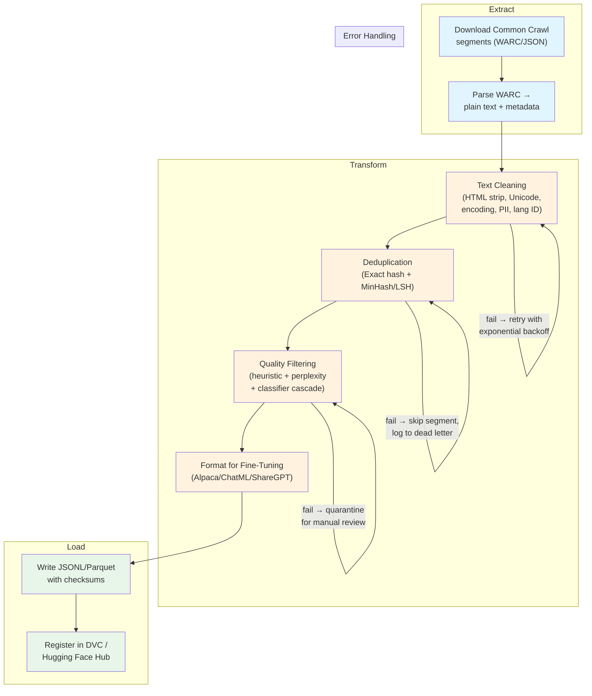

Licensed under Apache 2.0

# Chapter 6: Data Engineering Pipelines

This chapter covers the engineering infrastructure that transforms raw, noisy web data into clean, deduplicated, quality-scored datasets ready for fine-tuning large language models. You will learn to design fault-tolerant pipeline architectures, implement text cleaning and deduplication at scale, build multi-stage quality filters, format data for instruction tuning, and version datasets for reproducibility. The gap between raw web text and model-ready data is bridged by robust data pipelines — and the quality of that pipeline often matters more than the model architecture.

## Learning Objectives

By the end of this chapter you will be able to:

1. Design a DAG-based data pipeline with fault tolerance, idempotency, and retry logic for processing terabyte-scale text corpora.
2. Implement a comprehensive text cleaning pipeline that handles HTML stripping, Unicode normalization, encoding detection, PII redaction, and language identification.
3. Build near-duplicate detection using MinHash and Locality-Sensitive Hashing (LSH), and measure the impact of deduplication on model performance.
4. Construct multi-stage quality filter cascades using heuristic, perplexity-based, and classifier-based scoring to maximize quality while retaining coverage.
5. Format instruction data into standard templates (Alpaca, ChatML, ShareGPT) and measure the token count impact of different formatting choices.
6. Set up data versioning with DVC, create dataset cards, and track provenance through a data pipeline.

## Prerequisites

- Chapter 5: Datasets for Large Language Models (pre-training corpora, instruction datasets, quality assessment).
- Familiarity with Python file I/O, JSON, regex, and the `datasets` library from Hugging Face.
- Basic understanding of hashing, probability, and set similarity (Jaccard index).
- Comfort with command-line tools and shell scripting.

---

## 6.1 Pipeline Architecture

Data engineering pipelines for LLM training are Extract-Transform-Load (ETL) systems operating at web scale. A single Common Crawl snapshot can exceed 20TB of raw HTML. Processing this data through cleaning, deduplication, quality filtering, and formatting requires a pipeline that is fault-tolerant, idempotent, and horizontally scalable.

### ETL for ML Data

The classical ETL pattern adapts naturally to ML data:

- **Extract**: Download raw documents from web crawls, APIs, or dumps. Preserve checksums for integrity.
- **Transform**: Clean, deduplicate, filter, and format documents. This is the most compute-intensive stage.
- **Load**: Write processed data to storage (Parquet, JSONL, HF Datasets) with metadata for lineage tracking.

Unlike traditional ETL, ML data pipelines have unique properties:
- **Probabilistic operations**: Deduplication and quality filtering use approximate algorithms; the output is not deterministic.
- **Iterative refinement**: Thresholds change as you tune quality; pipelines must support re-processing intermediate stages without restarting from scratch.
- **Massive parallelism**: Processing is embarrassingly parallel across documents but requires global operations (deduplication) that need coordination.

### Batch vs Streaming Pipelines

**Batch pipelines** process entire datasets in fixed windows. They are simpler to reason about, support global operations (deduplication across the full corpus), and dominate LLM data engineering. Common Crawl processing is inherently batch — you download a snapshot, process it, and produce a dataset.

**Streaming pipelines** process data incrementally as it arrives. They are useful for continuously updating datasets from live sources. However, streaming makes global deduplication harder and introduces consistency challenges.

For LLM training data, batch pipelines are the default. Streaming is used for data collection (ingesting new crawl segments), with periodic batch processing for the full pipeline.

### DAG-Based Orchestration

A data pipeline is a **Directed Acyclic Graph** (DAG) of stages. Each stage reads from one or more upstream stages and produces output for downstream stages. DAG-based orchestration provides:
- **Dependency management**: Stage B runs only after stage A completes.
- **Parallel execution**: Independent branches run concurrently.
- **Failure isolation**: A failure in one branch does not cascade to others.
- **Checkpointing**: Each stage saves output, enabling restart from the failure point.

Popular orchestration tools include Apache Airflow, Luigi, Prefect, and Dagster. For smaller projects, a shell script or Python orchestration file suffices.



### Fault Tolerance and Idempotency

**Idempotency** means running a stage twice produces the same result as running it once. This is achieved by writing to a temporary output path and atomically renaming on success, or by using unique document IDs so re-processing produces identical output.

**Fault tolerance** in data pipelines requires:
- **Retry with exponential backoff**: Transient failures (network, memory pressure) resolve on retry.
- **Dead letter queues**: Documents that consistently fail processing are quarantined for later review, preventing the pipeline from blocking on single bad records.
- **Checkpointing**: Each stage writes progress markers, enabling restart without re-processing completed work.
- **Segment-level isolation**: Process one crawl segment independently; a failure in segment N does not invalidate segments 1 through N-1.

### Scalability

Pipeline scalability comes from two dimensions:
- **Embarrassingly parallel stages** (cleaning, filtering) scale by adding workers. Each worker processes a shard of the input.
- **Global stages** (deduplication) require coordination. Distributed hashing (e.g., streaming MinHash) and partitioned LSH allow near-linear scaling.

```python
"""
Fault-tolerant data pipeline with retries, checkpointing, and dead letter queue.

This module implements a DAG-based pipeline that processes documents
through configurable stages. Each stage is idempotent and supports
retry with exponential backoff.
"""
import json
import hashlib
import time
import random
import logging
from dataclasses import dataclass, field
from typing import Callable, Any
from pathlib import Path

logging.basicConfig(level=logging.INFO)
logger = logging.getLogger(__name__)


@dataclass
class PipelineConfig:
    """Configuration for the data pipeline."""
    max_retries: int = 3
    base_delay: float = 1.0       # seconds for exponential backoff
    batch_size: int = 1000
    dead_letter_path: str = "dead_letter.jsonl"
    checkpoint_path: str = ".pipeline_checkpoint.json"


@dataclass
class PipelineStats:
    """Accumulate statistics across pipeline stages."""
    total_processed: int = 0
    total_success: int = 0
    total_failed: int = 0
    total_retried: int = 0
    stage_stats: dict = field(default_factory=dict)

    def record(self, stage_name: str, success: bool):
        if stage_name not in self.stage_stats:
            self.stage_stats[stage_name] = {"success": 0, "failed": 0}
        if success:
            self.stage_stats[stage_name]["success"] += 1
            self.total_success += 1
        else:
            self.stage_stats[stage_name]["failed"] += 1
            self.total_failed += 1
        self.total_processed += 1


def compute_doc_hash(doc: dict) -> str:
    """Compute a deterministic hash for a document for idempotency."""
    content = json.dumps(doc, sort_keys=True, default=str)
    return hashlib.sha256(content.encode()).hexdigest()


def with_retry(func: Callable, config: PipelineConfig, doc: dict,
               stage_name: str) -> tuple[bool, Any]:
    """
    Execute a pipeline stage function with exponential backoff retry.

    Args:
        func: The stage function to execute.
        config: Pipeline configuration.
        doc: The document to process.
        stage_name: Name of the stage for logging.

    Returns:
        Tuple of (success: bool, result: Any).
    """
    for attempt in range(config.max_retries + 1):
        try:
            result = func(doc)
            return True, result
        except Exception as e:
            if attempt < config.max_retries:
                delay = config.base_delay * (2 ** attempt) + random.uniform(0, 0.5)
                logger.warning(
                    f"Stage '{stage_name}' attempt {attempt + 1} failed "
                    f"for doc {compute_doc_hash(doc)[:8]}: {e}. "
                    f"Retrying in {delay:.1f}s"
                )
                time.sleep(delay)
            else:
                logger.error(
                    f"Stage '{stage_name}' failed after {config.max_retries + 1} "
                    f"attempts for doc {compute_doc_hash(doc)[:8]}: {e}"
                )
                return False, None


class DataPipeline:
    """
    DAG-based data pipeline with fault tolerance.

    Each stage is a callable that takes a document dict and returns
    a modified document dict, or None to indicate the document should
    be filtered out.
    """

    def __init__(self, config: PipelineConfig | None = None):
        self.config = config or PipelineConfig()
        self.stages: list[tuple[str, Callable]] = []
        self.stats = PipelineStats()
        self.checkpoint = self._load_checkpoint()

    def add_stage(self, name: str, func: Callable):
        """Add a processing stage to the pipeline."""
        self.stages.append((name, func))
        logger.info(f"Added stage: {name}")

    def process(self, documents: list[dict]) -> tuple[list[dict], list[dict]]:
        """
        Process documents through all pipeline stages.

        Args:
            documents: List of document dicts to process.

        Returns:
            Tuple of (kept_documents, dead_letter_documents).
        """
        kept = []
        dead_letter = []
        current_batch = list(documents)

        for stage_name, stage_func in self.stages:
            next_batch = []
            logger.info(f"Stage '{stage_name}': processing {len(current_batch)} docs")

            for doc in current_batch:
                doc_hash = compute_doc_hash(doc)

                # Skip already-processed documents (idempotency)
                if stage_name in self.checkpoint.get(doc_hash, {}):
                    next_batch.append(self.checkpoint[doc_hash][stage_name])
                    continue

                success, result = with_retry(
                    stage_func, self.config, doc, stage_name
                )
                self.stats.record(stage_name, success)

                if success and result is not None:
                    next_batch.append(result)
                    # Checkpoint the result
                    if doc_hash not in self.checkpoint:
                        self.checkpoint[doc_hash] = {}
                    self.checkpoint[doc_hash][stage_name] = result
                elif not success:
                    dead_letter.append(doc)
                    self.stats.total_retried += 1
                # If result is None, document was filtered out (normal)

            current_batch = next_batch
            logger.info(
                f"Stage '{stage_name}' complete: "
                f"{len(current_batch)} docs remaining "
                f"(filtered {len(documents) - len(current_batch)})"
            )

        kept = current_batch
        return kept, dead_letter

    def get_stats(self) -> dict:
        """Return pipeline statistics."""
        return {
            "total_processed": self.stats.total_processed,
            "total_success": self.stats.total_success,
            "total_failed": self.stats.total_failed,
            "total_retried": self.stats.total_retried,
            "stage_stats": self.stats.stage_stats,
        }

    def _load_checkpoint(self) -> dict:
        """Load checkpoint from disk if it exists."""
        path = Path(self.config.checkpoint_path)
        if path.exists():
            with open(path) as f:
                return json.load(f)
        return {}

    def save_checkpoint(self):
        """Save checkpoint to disk."""
        path = Path(self.config.checkpoint_path)
        with open(path, "w") as f:
            json.dump(self.checkpoint, f, default=str)


# --- Demo ---
def main():
    # Sample documents
    documents = [
        {"id": 1, "text": "<p>Hello world</p>", "url": "http://example.com/1"},
        {"id": 2, "text": "  Unicode: café, naïve  ", "url": "http://example.com/2"},
        {"id": 3, "text": "SPAM SPAM SPAM BUY NOW CLICK HERE", "url": "http://example.com/3"},
        {"id": 4, "text": "The quick brown fox jumps over the lazy dog.",
         "url": "http://example.com/4"},
        {"id": 5, "text": "a" * 5, "url": "http://example.com/5"},  # too short
    ]

    # Define pipeline stages
    config = PipelineConfig(max_retries=2, base_delay=0.1)
    pipeline = DataPipeline(config)

    # Stage 1: Filter out documents with very short text
    def filter_short(doc):
        if len(doc.get("text", "").strip()) < 10:
            return None  # filter out
        return doc

    # Stage 2: Simple text normalization
    def normalize_text(doc):
        doc["text"] = doc["text"].strip()
        return doc

    # Stage 3: Filter spam-like documents
    def filter_spam(doc):
        text = doc.get("text", "").upper()
        spam_words = {"SPAM", "BUY NOW", "CLICK HERE"}
        if any(word in text for word in spam_words):
            return None  # filter out
        return doc

    pipeline.add_stage("filter_short", filter_short)
    pipeline.add_stage("normalize_text", normalize_text)
    pipeline.add_stage("filter_spam", filter_spam)

    kept, dead = pipeline.process(documents)

    print("Pipeline Results:")
    print(f"  Input documents:    {len(documents)}")
    print(f"  Documents kept:     {len(kept)}")
    print(f"  Dead letter:        {len(dead)}")
    print(f"\nKept documents:")
    for doc in kept:
        print(f"  [{doc['id']}] {doc['text'][:50]}...")

    print(f"\nPipeline Statistics:")
    for stage, counts in pipeline.get_stats()["stage_stats"].items():
        print(f"  {stage}: {counts['success']} success, "
              f"{counts['failed']} failed")


if __name__ == "__main__":
    main()
```

### Section 6.1 Exercises

**Exercise 6.1 (Easy) — Pipeline Stage Design**

Design a five-stage data processing pipeline for a raw blog post corpus. For each stage, specify: (a) the input format, (b) the transformation, (c) the output format, and (d) what constitutes a "failure" requiring retry. Draw the DAG showing dependencies and parallel branches.

**Exercise 6.2 (Medium) — Idempotency Implementation**

Implement an idempotent text cleaning stage that processes documents from a JSONL file. Your implementation should: (a) compute a hash for each document, (b) check a checkpoint file before processing, (c) write results to a temporary file, and (d) atomically rename the file on success. Test by running the pipeline twice and verifying identical output.

**Exercise 6.3 (Hard) — Fault Injection Testing**

Write a test suite that injects faults into a data pipeline. Simulate: (a) network failures during download (random request timeouts), (b) malformed documents (invalid JSON, missing fields), (c) out-of-disk-space conditions (writing to a filesystem with limited space). Measure that your pipeline correctly retries transient failures, quarantines unrecoverable documents, and produces valid checkpoint files for restart.

---

## 6.2 Text Cleaning

Raw web text is riddled with artifacts: HTML tags, broken Unicode sequences, mixed encodings, boilerplate navigation text, ads, and personally identifiable information. Text cleaning removes these artifacts to produce clean, readable text that models can learn from effectively.

### HTML Stripping

The most basic cleaning step removes HTML markup. However, naive regex-based stripping loses structure — headings, lists, and paragraphs carry semantic information. A good HTML stripper:
- Removes script/style tags entirely (they contain no readable content)
- Converts block elements (`<p>`, `<div>`, `<li>`) to newlines
- Converts inline elements (`<br>`, `<hr>`) to whitespace
- Decodes HTML entities (`&amp;` → `&`, `&#x27;` → `'`)
- Preserves meaningful structure (headings, paragraphs, lists)

```python
import re
from html import unescape


def strip_html(text: str) -> str:
    """Remove HTML tags while preserving document structure."""
    # Remove script and style content
    text = re.sub(r'<script[^>]*>.*?</script>', ' ', text, flags=re.DOTALL | re.IGNORECASE)
    text = re.sub(r'<style[^>]*>.*?</style>', ' ', text, flags=re.DOTALL | re.IGNORECASE)

    # Convert block elements to double newlines
    text = re.sub(r'</?(p|div|li|h[1-6]|section|article|blockquote)[^>]*>', '\n\n', text,
                  flags=re.IGNORECASE)

    # Convert inline breaks to single newline
    text = re.sub(r'<br\s*/?>', '\n', text, flags=re.IGNORECASE)

    # Remove remaining tags
    text = re.sub(r'<[^>]+>', ' ', text)

    # Decode HTML entities
    text = unescape(text)

    # Collapse multiple newlines and whitespace
    text = re.sub(r'\n\s*\n', '\n\n', text)
    text = re.sub(r'[ \t]+', ' ', text)

    return text.strip()
```

### Unicode Normalization

Unicode text can represent the same character in multiple ways. For example, "café" can be encoded as:
- **NFC** (Canonical Composition): `c-a-f-é` (one code point for é)
- **NFD** (Canonical Decomposition): `c-a-f-e-́` (e + combining accent)

Web data mixes these forms, causing identical characters to have different byte representations. **Always normalize to NFC** before any other processing to ensure consistency.

```python
import unicodedata


def normalize_unicode(text: str) -> str:
    """Normalize Unicode text to NFC form and remove control characters."""
    # NFC normalization
    text = unicodedata.normalize('NFC', text)

    # Remove control characters except newlines and tabs
    text = ''.join(ch for ch in text if ch == '\n' or ch == '\t'
                   or not unicodedata.category(ch).startswith('C'))

    # Replace non-breaking spaces with regular spaces
    text = text.replace(' ', ' ').replace('​', '')

    return text
```

### Encoding Detection and Fix

Web documents may arrive in various encodings (UTF-8, Latin-1, Windows-1252, etc.). When the declared encoding is wrong or missing, text becomes garbled ("mojibake"). The `chardet` or `cchardet` library detects encoding from byte content.

```python
import chardet


def detect_and_fix_encoding(raw_bytes: bytes) -> str:
    """Detect encoding of raw bytes and decode to string."""
    # Try UTF-8 first (most common on modern web)
    try:
        return raw_bytes.decode('utf-8')
    except UnicodeDecodeError:
        pass

    # Detect encoding from byte content
    detected = chardet.detect(raw_bytes)
    encoding = detected.get('encoding', 'utf-8')
    confidence = detected.get('confidence', 0.0)

    if encoding and confidence > 0.7:
        try:
            return raw_bytes.decode(encoding)
        except (UnicodeDecodeError, LookupError):
            pass

    # Fallback: decode with replacement characters
    return raw_bytes.decode('utf-8', errors='replace')
```

### Whitespace Normalization

Web text contains excessive whitespace — multiple spaces, tabs, non-breaking spaces, and irregular line breaks. Normalization collapses these to single spaces and consistent newlines.

```python
def normalize_whitespace(text: str) -> str:
    """Normalize whitespace in text."""
    # Replace tabs with spaces
    text = text.replace('\t', ' ')

    # Replace non-standard whitespace characters
    for ws_char in [' ', ' ', ' ', ' ', ' ',
                    ' ', ' ', ' ', ' ', ' ',
                    ' ', ' ', ' ', ' ', '　']:
        text = text.replace(ws_char, ' ')

    # Collapse runs of whitespace (excluding newlines)
    text = re.sub(r'[^\\S\\n]+', ' ', text)

    # Strip leading/trailing whitespace on each line
    lines = [line.strip() for line in text.split('\\n')]
    text = '\\n'.join(lines)

    # Collapse three or more newlines into two
    text = re.sub(r'\\n{3,}', '\\n\\n', text)

    return text.strip()
```

### PII Redaction

Personnally Identifiable Information (PII) in training data can be memorized and regurgitated by models. Redacting PII is both an ethical and legal requirement (GDPR, CCPA). Common PII patterns include:
- Email addresses
- Phone numbers
- IP addresses
- Social Security numbers
- Credit card numbers

```python
import re


def redact_pii(text: str) -> str:
    """Redact common PII patterns from text."""
    patterns = [
        (r'[a-zA-Z0-9._%+-]+@[a-zA-Z0-9.-]+\.[a-zA-Z]{2,}', '[EMAIL]'),
        (r'\b\d{3}[-.]?\d{3}[-.]?\d{4}\b', '[PHONE]'),
        (r'\b\d{1,3}\.\d{1,3}\.\d{1,3}\.\d{1,3}\b', '[IP]'),
        (r'\b\d{3}-\d{2}-\d{4}\b', '[SSN]'),
        (r'\b(?:4[0-9]{12}(?:[0-9]{3})?|5[1-5][0-9]{14}|3[47][0-9]{13})\b', '[CC]'),
    ]

    for pattern, replacement in patterns:
        text = re.sub(pattern, replacement, text)

    return text
```

### Language Identification

Multilingual corpora need language filtering. The `fasttext` language identification model (lid.176) identifies 176 languages with high accuracy. For English-only training, filtering to English can reduce corpus size by 60-70%.

```python
# Install: pip install fasttext
# Download: wget https://ftp.lst.uni-bonn.de/pub/misc/models/lid.176.ftz
# Unpack:   python -m fasttext.download lid.176

try:
    import fasttext
    _lid_model = None

    def identify_language(text: str, threshold: float = 0.75) -> str:
        """Identify the primary language of a text sample."""
        if _lid_model is None:
            try:
                _lid_model = fasttext.load_model('lid.176.ftz')
            except FileNotFoundError:
                return 'unknown'

        # Use first 1000 chars for identification (fasttext recommendation)
        sample = text[:1000].strip()
        if len(sample) < 10:
            return 'unknown'

        labels, scores = _lid_model.predict(sample, k=1)
        lang = labels[0].replace('__label__', '')
        confidence = scores[0][0]

        if confidence < threshold:
            return 'unknown'
        return lang
except ImportError:
    def identify_language(text: str, threshold: float = 0.75) -> str:
        """Fallback: basic English detection using character frequency."""
        if not text or len(text.strip()) < 10:
            return 'unknown'
        # Quick heuristic: English text has high frequency of e, t, a, o, i, n
        common = sum(1 for c in text.lower() if c in 'etaoinshrdlu')
        ratio = common / max(len(text), 1)
        return 'en' if ratio > 0.35 else 'unknown'
```

### Cleaning Operations and Data Size Impact

Each cleaning step reduces the corpus size. Understanding the data loss at each stage helps tune thresholds:

| Operation | Typical Data Reduction | Description |
|---|---|---|
| HTML stripping | 15-30% size reduction | Removes tags, scripts, styles; content shrinks as markup is removed |
| Unicode normalization | 0-2% | Fixes encoding issues; minor byte count changes |
| Encoding fix | 0-5% | Documents with unrecoverable encoding errors are dropped |
| Whitespace normalization | 5-15% size reduction | Collapses excessive whitespace |
| PII redaction | 0-1% size reduction | Replaces PII patterns with short tokens |
| Language filtering (EN only) | 50-70% document removal | Drops non-English documents |
| Minimum length filter | 5-15% document removal | Drops documents under character/word threshold |
| **Total (cumulative)** | **65-85% of raw size** | Final cleaned corpus is 15-35% of raw download |

### Complete Text Cleaning Pipeline

```python
"""
Comprehensive text cleaning pipeline.

Processes raw web text through HTML stripping, Unicode normalization,
encoding detection, whitespace normalization, PII redaction,
language identification, and length filtering.
"""
import re
import unicodedata
from html import unescape


class TextCleaner:
    """Multi-stage text cleaning pipeline."""

    def __init__(self, target_language: str = 'en',
                 min_chars: int = 50,
                 min_words: int = 10):
        self.target_language = target_language
        self.min_chars = min_chars
        self.min_words = min_words

    def clean(self, raw_text: str, raw_bytes: bytes | None = None) -> dict:
        """
        Run the full cleaning pipeline.

        Args:
            raw_text: The text to clean (may contain HTML, bad encoding, etc.)
            raw_bytes: Original bytes for encoding detection (optional)

        Returns:
            dict with 'text' (cleaned), 'kept' (bool), and 'stats' dict.
        """
        stats = {
            'html_stripped': False,
            'unicode_normalized': False,
            'encoding_fixed': False,
            'whitespace_normalized': False,
            'pii_redacted': False,
            'language': 'unknown',
            'lang_matched': False,
            'length_ok': False,
        }

        text = raw_text

        # If we have raw bytes, try encoding detection first
        if raw_bytes:
            try:
                text = raw_bytes.decode('utf-8')
                stats['encoding_fixed'] = False
            except UnicodeDecodeError:
                text = self._fix_encoding(raw_bytes)
                stats['encoding_fixed'] = True

        # Stage 1: HTML stripping
        if '<' in text and '>' in text:
            text = self._strip_html(text)
            stats['html_stripped'] = True

        # Stage 2: Unicode normalization
        text = unicodedata.normalize('NFC', text)
        # Remove control characters
        text = ''.join(ch for ch in text if ch == '\n' or ch == '\t'
                       or not unicodedata.category(ch).startswith('C'))
        # Replace non-breaking spaces
        text = text.replace(' ', ' ')
        stats['unicode_normalized'] = True

        # Stage 3: Whitespace normalization
        text = self._normalize_whitespace(text)
        stats['whitespace_normalized'] = True

        # Stage 4: PII redaction
        text = self._redact_pii(text)
        stats['pii_redacted'] = True

        # Stage 5: Language identification (basic heuristic)
        lang = self._identify_language(text)
        stats['language'] = lang
        stats['lang_matched'] = lang == self.target_language

        # Stage 6: Length filtering
        char_count = len(text.strip())
        word_count = len(text.split())
        stats['length_ok'] = char_count >= self.min_chars and word_count >= self.min_words

        kept = stats['lang_matched'] and stats['length_ok']

        return {
            'text': text,
            'kept': kept,
            'stats': stats,
        }

    def _strip_html(self, text: str) -> str:
        text = re.sub(r'<script[^>]*>.*?</script>', ' ', text,
                      flags=re.DOTALL | re.IGNORECASE)
        text = re.sub(r'<style[^>]*>.*?</style>', ' ', text,
                      flags=re.DOTALL | re.IGNORECASE)
        text = re.sub(r'</?(p|div|li|h[1-6])[^>]*>', '\n\n', text,
                      flags=re.IGNORECASE)
        text = re.sub(r'<br\s*/?>', '\n', text, flags=re.IGNORECASE)
        text = re.sub(r'<[^>]+>', ' ', text)
        text = unescape(text)
        return text

    def _normalize_whitespace(self, text: str) -> str:
        text = text.replace('\t', ' ')
        text = re.sub(r'[^\S\n]+', ' ', text)
        lines = [line.strip() for line in text.split('\n')]
        text = '\n'.join(lines)
        text = re.sub(r'\n{3,}', '\n\n', text)
        return text.strip()

    def _redact_pii(self, text: str) -> str:
        patterns = [
            (r'[a-zA-Z0-9._%+-]+@[a-zA-Z0-9.-]+\.[a-zA-Z]{2,}', '[EMAIL]'),
            (r'\b\d{3}[-.]?\d{3}[-.]?\d{4}\b', '[PHONE]'),
            (r'\b\d{1,3}\.\d{1,3}\.\d{1,3}\.\d{1,3}\b', '[IP]'),
        ]
        for pattern, replacement in patterns:
            text = re.sub(pattern, replacement, text)
        return text

    def _fix_encoding(self, raw_bytes: bytes) -> str:
        """Fallback encoding detection using chardet."""
        try:
            import chardet
            detected = chardet.detect(raw_bytes)
            enc = detected.get('encoding', 'utf-8')
            if enc and detected.get('confidence', 0) > 0.7:
                return raw_bytes.decode(enc, errors='replace')
        except ImportError:
            pass
        return raw_bytes.decode('utf-8', errors='replace')

    def _identify_language(self, text: str) -> str:
        """Basic English identification heuristic."""
        if not text or len(text.strip()) < 10:
            return 'unknown'
        sample = text[:500].lower()
        common = sum(1 for c in sample if c in 'etaoinshrdlu')
        ratio = common / max(len(sample), 1)
        return 'en' if ratio > 0.35 else 'unknown'


# --- Demo ---
if __name__ == "__main__":
    cleaner = TextCleaner(target_language='en', min_chars=20)

    test_cases = [
        ("<p>Hello <b>world</b></p><script>alert('xss')</script>",
         "HTML stripping"),
        ("Contact me at user@example.com or 555-123-4567",
         "PII redaction"),
        ("café vs café — Unicode normalization",
         "Unicode normalization"),
        ("   lots   of   whitespace\t\tand\n\n\n\nnewlines   ",
         "Whitespace normalization"),
        ("xx", "Too short (should be filtered)"),
    ]

    print("Text Cleaning Pipeline Demo")
    print("=" * 60)

    for raw, description in test_cases:
        result = cleaner.clean(raw)
        status = "KEPT" if result['kept'] else "FILTERED"
        print(f"\n{description} → {status}")
        print(f"  Output: {result['text'][:80]}")
        print(f"  Stats:  {', '.join(f'{k}={v}' for k, v in result['stats'].items())}")
```

### Section 6.2 Exercises

**Exercise 6.2 (Easy) — HTML Stripping Comparison**

Compare three HTML stripping approaches: (a) regex-based, (b) BeautifulSoup, and (c) `html2text`. Run each on a sample of 100 web pages (from Common Crawl or HTMLTestCollection). Measure: (i) processing speed (pages/sec), (ii) output quality (do visual inspection of 10 samples), and (iii) memory usage. Which approach offers the best tradeoff?

**Exercise 6.3 (Medium) — Encoding Detection Pipeline**

Create a pipeline that processes raw byte streams and detects/fixes encoding. Test on documents encoded in UTF-8, Latin-1, Windows-1252, and UTF-16 (with and without BOM). Measure the detection accuracy of `chardet` on each encoding. What percentage of documents are misidentified?

**Exercise 6.4 (Hard) — Comprehensive Cleaning Benchmark**

Build a benchmark that measures the impact of each cleaning step on a real corpus. Download a 1GB subset of Common Crawl (or use the HTMLTestCollection). Run the full cleaning pipeline and record: (a) document count before/after each stage, (b) byte size before/after, (c) average character entropy before/after (as a quality proxy). Plot the cumulative data reduction as a funnel chart.

---

## 6.3 Deduplication

Duplicate documents in training data cause models to memorize rather than generalize. Deduplication removes exact and near-duplicate documents, improving model performance, reducing training time, and preventing data leakage between train and test splits.

### Exact Deduplication

The simplest form: compute a hash (MD5, SHA-256) of each document's text. Documents with identical hashes are exact duplicates. This catches copy-paste duplication, mirrored sites, and cached content.

Exact dedup is fast — O(n) with a hash set — but misses paraphrased content, documents with minor edits, or content with different formatting.

### Fuzzy Deduplication: MinHash + LSH

For near-duplicate detection, we need approximate similarity. **MinHash** combined with **Locality-Sensitive Hashing (LSH)** provides a fast, scalable solution:

1. **Shingling**: Break each document into overlapping n-grams (shingles).
2. **Jaccard Similarity**: Measure overlap between document shingle sets.
3. **MinHash**: Approximate Jaccard similarity with a compact signature vector.
4. **LSH (Banding)**: Group MinHash signatures into bands; documents that share a band are candidate pairs.
5. **Verification**: Compute exact similarity for candidate pairs and threshold.

```
Document → Shingles → MinHash Signature → Band Comparison → Candidate Pairs
                                                              ↓
                                                    Exact Jaccard Check
                                                              ↓
                                                ✓ Similar ≥ threshold → DUPLICATE
                                                ✗ Similar < threshold → KEEP
```

The diagram below shows the full MinHash + LSH pipeline:

```
┌─────────────────────────────────────────────────────────────────────────┐
│                    MINHASH + LSH DEDUPLICATION PIPELINE                  │
├─────────────────────────────────────────────────────────────────────────┤
│                                                                         │
│  Document A: "The cat sat on the mat"                                    │
│  Document B: "A cat sat on the mat"                                      │
│  Document C: "The dog ran in the park"                                   │
│                                                                         │
│  ┌─ Step 1: SHINGLING (3-grams) ──────────────────────────────┐        │
│  │                                                              │        │
│  │  A → {"the cat sat", "cat sat on", "sat on the", "on the mat"}│       │
│  │  B → {"a cat sat", "cat sat on", "sat on the", "on the mat"} │       │
│  │  C → {"the dog ran", "dog ran in", "ran in the", "in the park"}│      │
│  │                                                              │        │
│  └──────────────────────────────────────────────────────────────┘        │
│                                   ↓                                      │
│  ┌─ Step 2: JACCARD SIMILARITY (ground truth) ──────────────┐           │
│  │                                                              │        │
│  │  sim(A,B) = |{cat sat on, sat on the, on the mat}| / 7 = 3/7 ≈ 0.43 │
│  │  sim(A,C) = |∅| / 8 = 0/8 = 0.00                            │       │
│  │  sim(B,C) = |∅| / 8 = 0/8 = 0.00                            │       │
│  │                                                              │        │
│  └──────────────────────────────────────────────────────────────┘        │
│                                   ↓                                      │
│  ┌─ Step 3: MINHASH SIGNATURE (k=8 hash functions) ──────────┐          │
│  │                                                              │        │
│  │  Hash func │  A(min)  │  B(min)  │  C(min)                 │        │
│  │  h1        │  s2@3    │  s3@3    │  s5@2                   │        │
│  │  h2        │  s1@5    │  s4@5    │  s6@4                   │        │
│  │  h3        │  s3@2    │  s2@2    │  s4@1                   │        │
│  │  h4        │  s4@1    │  s1@1    │  s2@3                   │        │
│  │  ...       │  ...     │  ...     │  ...                    │        │
│  │  h8        │  s1@4    │  s3@4    │  s5@5                   │        │
│  │                                                              │        │
│  │  (Matching signature rows indicate similar documents)        │        │
│  └──────────────────────────────────────────────────────────────┘        │
│                                   ↓                                      │
│  ┌─ Step 4: LSH BANDING (b=4 bands, r=2 rows/band) ───────────┐         │
│  │                                                              │        │
│  │  Band 1 (rows 1-2):  A:[s2@3,s1@5]  B:[s3@3,s4@5]  C:[s5@2,s6@4]  │  │
│  │    → Hash band: A→0xA3  B→0xB7  C→0xC2  (no collision)            │  │
│  │  Band 2 (rows 3-4):  A:[s3@2,s4@1]  B:[s2@2,s1@1]  C:[s4@1,s2@3]  │  │
│  │    → Hash band: A→0xD1  B→0xE5  C→0xD1  ← A,C collision!          │  │
│  │  Band 3 (rows 5-6):  ...                                          │  │
│  │  Band 4 (rows 7-8):  A:[s2@4,s1@4]  B:[s3@4,s3@4]  ...           │  │
│  │                                                              │        │
│  │  Candidate pairs (shared band hash): (A,C) from Band 2           │  │
│  └──────────────────────────────────────────────────────────────┘        │
│                                   ↓                                      │
│  ┌─ Step 5: VERIFICATION ─────────────────────────────────────┐         │
│  │                                                              │        │
│  │  Candidate (A,C): exact Jaccard = 0.00 < threshold 0.4      │        │
│  │    → NOT duplicates (LSH false positive — accepted tradeoff) │        │
│  │                                                              │        │
│  │  With larger, more similar documents, MinHash signatures     │        │
│  │  align more closely → more band collisions → correctly       │        │
│  │  identified as near-duplicates.                              │        │
│  └──────────────────────────────────────────────────────────────┘        │
│                                                                         │
│  Threshold tuning:                                                      │
│  b bands × r rows = k signature size, threshold ≈ r/k                  │
│  Higher b → fewer false positives, more false negatives                 │
│  Higher r → higher threshold, fewer candidates                         │
└─────────────────────────────────────────────────────────────────────────┘
```

### Why Dedup Improves Generalization

Duplicates cause the model to overfit to specific examples. If a document appears 10 times in training, the model learns to memorize it rather than generalize. Research shows that deduplication:
- Reduces memorization of verbatim training text
- Improves held-out perplexity by 1-3%
- Prevents data leakage when test data contains web content
- Makes training more efficient (fewer redundant tokens)

### MinHash Near-Dedup Implementation

```python
"""
MinHash-based near-duplicate detection using Locality-Sensitive Hashing.

This implementation processes documents into shingles, computes MinHash
signatures, and uses banding for efficient candidate pair generation.
"""
import hashlib
import random
from collections import defaultdict
from typing import Iterable


def generate_shingles(text: str, n: int = 5) -> list[str]:
    """
    Generate character n-gram shingles from text.

    Character shingles are preferred over word shingles for dedup because
    they catch duplicates even when word boundaries differ.

    Args:
        text: Cleaned document text.
        n: Shingle size (default 5 characters).

    Returns:
        List of shingle strings.
    """
    text = text.lower().strip()
    if len(text) < n:
        return [text]  # document shorter than shingle size
    return [text[i:i + n] for i in range(len(text) - n + 1)]


def minhash_signature(shingles: list[str],
                      num_permutations: int = 128,
                      seed: int = 42) -> list[int]:
    """
    Compute MinHash signature for a set of shingles.

    Uses simple hash functions of the form h(x) = (a * hash(x) + b) mod p.

    Args:
        shingles: List of shingle strings.
        num_permutations: Number of hash functions (signature vector size).
        seed: Random seed for reproducibility.

    Returns:
        MinHash signature vector (list of integers).
    """
    if not shingles:
        return [float('inf')] * num_permutations

    rng = random.Random(seed)
    p = (1 << 31) - 1  # largest 31-bit prime

    # Initialize signature with max values
    signature = [float('inf')] * num_permutations

    # Generate random (a, b) pairs for hash functions
    params = []
    for _ in range(num_permutations):
        a = rng.randint(1, p - 1)
        b = rng.randint(0, p - 1)
        params.append((a, b))

    # Compute minhash for each shingle
    for shingle in shingles:
        h = hashlib.md5(shingle.encode()).hexdigest()
        h_val = int(h[:8], 16)  # use first 32 bits

        for i, (a, b) in enumerate(params):
            minh = (a * h_val + b) % p
            signature[i] = min(signature[i], minh)

    return signature


def jaccard_similarity(set_a: set, set_b: set) -> float:
    """Compute exact Jaccard similarity between two sets."""
    if not set_a and not set_b:
        return 1.0
    intersection = len(set_a & set_b)
    union = len(set_a | set_b)
    return intersection / union if union > 0 else 0.0


def estimate_jaccard(sig_a: list[int], sig_b: list[int]) -> float:
    """Estimate Jaccard similarity from MinHash signatures."""
    if not sig_a:
        return 0.0
    matches = sum(1 for a, b in zip(sig_a, sig_b) if a == b)
    return matches / len(sig_a)


class LSHDeduplicator:
    """
    Locality-Sensitive Hashing deduplicator.

    Uses MinHash signatures with banding to efficiently find
    near-duplicate document pairs.
    """

    def __init__(self, num_permutations: int = 128,
                 num_bands: int = 16,
                 threshold: float = 0.75):
        """
        Args:
            num_permutations: Size of MinHash signature vector.
            num_bands: Number of bands for LSH. Must divide num_permutations.
            threshold: Similarity threshold for declaring duplicates.
        """
        self.num_permutations = num_permutations
        self.num_bands = num_bands
        self.rows_per_band = num_permutations // num_bands
        self.threshold = threshold

        # Storage
        self._doc_ids: list[int] = []
        self._signatures: dict[int, list[int]] = {}
        self._shingles: dict[int, set[str]] = {}
        self._index: dict[str, list[int]] = defaultdict(list)
        self._is_duplicate: set[int] = set()

    def add_document(self, doc_id: int, text: str) -> None:
        """Add a document to the deduplicator."""
        shingles = set(generate_shingles(text))
        signature = minhash_signature(list(shingles), self.num_permutations)

        self._doc_ids.append(doc_id)
        self._signatures[doc_id] = signature
        self._shingles[doc_id] = shingles

        # Index by band
        for band_idx in range(self.num_bands):
            start = band_idx * self.rows_per_band
            end = start + self.rows_per_band
            band_values = tuple(signature[start:end])
            band_key = f"{band_idx}:{hash(str(band_values))}"
            self._index[band_key].append(doc_id)

    def find_duplicates(self) -> list[tuple[int, int, float]]:
        """
        Find all near-duplicate document pairs.

        Returns:
            List of (doc_id_a, doc_id_b, similarity) tuples,
            sorted by similarity (highest first).
        """
        candidate_pairs: set[tuple[int, int]] = set()

        # Find candidate pairs from band collisions
        for band_key, doc_list in self._index.items():
            for i in range(len(doc_list)):
                for j in range(i + 1, len(doc_list)):
                    pair = (min(doc_list[i], doc_list[j]),
                            max(doc_list[i], doc_list[j]))
                    candidate_pairs.add(pair)

        # Verify candidates with exact similarity
        duplicates = []
        for doc_a, doc_b in candidate_pairs:
            # First check MinHash estimate (fast)
            est_sim = estimate_jaccard(
                self._signatures[doc_a],
                self._signatures[doc_b]
            )

            if est_sim >= self.threshold:
                # Verify with exact Jaccard on shingles
                exact_sim = jaccard_similarity(
                    self._shingles[doc_a],
                    self._shingles[doc_b]
                )

                if exact_sim >= self.threshold:
                    duplicates.append((doc_a, doc_b, exact_sim))

        # Mark the lower-similarity document as duplicate
        # (keep the first occurrence, remove later ones)
        for doc_a, doc_b, sim in sorted(duplicates, key=lambda x: -x[2]):
            if doc_a not in self._is_duplicate:
                self._is_duplicate.add(doc_b)

        return duplicates

    def get_unique_docs(self) -> list[int]:
        """Return document IDs that are not duplicates."""
        return [doc_id for doc_id in self._doc_ids
                if doc_id not in self._is_duplicate]

    def get_stats(self) -> dict:
        """Return deduplication statistics."""
        total = len(self._doc_ids)
        unique = len(self.get_unique_docs())
        removed = total - unique

        return {
            'total_documents': total,
            'unique_documents': unique,
            'duplicates_removed': removed,
            'dedup_rate': removed / total if total > 0 else 0.0,
        }


# --- Demo ---
if __name__ == "__main__":
    documents = {
        1: "The quick brown fox jumps over the lazy dog. "
           "This is a classic pangram used for testing.",
        2: "The quick brown fox jumps over the lazy dog. "
           "This is a classic pangram used for typewriter testing.",  # near-dup
        3: "Machine learning is a subset of artificial intelligence "
           "that focuses on building systems that learn from data.",
        4: "Machine learning is a subset of artificial intelligence "
           "that focuses on building systems that learn from data "
           "to make predictions or decisions.",  # near-dup of 3
        5: "The cat sat on the mat and watched the birds outside. "
           "It was a beautiful sunny day with clear blue skies.",
        6: "Deep learning uses neural networks with many layers "
           "to learn hierarchical representations of data.",
    }

    dedup = LSHDeduplicator(
        num_permutations=64,
        num_bands=8,
        threshold=0.6,
    )

    for doc_id, text in documents.items():
        dedup.add_document(doc_id, text)

    duplicates = dedup.find_duplicates()
    stats = dedup.get_stats()

    print("MinHash LSH Deduplication Results")
    print("=" * 50)
    print(f"Total documents:     {stats['total_documents']}")
    print(f"Unique documents:    {stats['unique_documents']}")
    print(f"Duplicates removed:  {stats['duplicates_removed']}")
    print(f"Dedup rate:          {stats['dedup_rate']:.1%}")

    if duplicates:
        print(f"\nDuplicate pairs found:")
        for a, b, sim in duplicates:
            print(f"  Doc {a} ↔ Doc {b}: similarity {sim:.3f}")

    print(f"\nDocuments to keep: {dedup.get_unique_docs()}")
```

### Section 6.3 Exercises

**Exercise 6.3 (Easy) — Exact Dedup Rate**

Download a small dataset (e.g., the SNLI dataset or a subset of Wikipedia). Compute exact dedup rates by hashing document text. How many exact duplicates exist? What is the dedup rate? Compare SHA-256 vs MD5 for speed.

**Exercise 6.4 (Medium) — MinHash Parameter Tuning**

Using the MinHash implementation above, experiment with different parameters on a corpus of 1000 documents: (a) vary shingle size n from 3 to 10, (b) vary number of permutations from 32 to 256, (c) vary number of bands from 4 to 32. For each configuration, measure: (i) recall (fraction of true near-duplicates found), (ii) precision (fraction of reported pairs that are actual duplicates), and (iii) processing time. Plot the tradeoff surface.

**Exercise 6.5 (Hard) — Distributed Deduplication at Scale**

Design a distributed deduplication system for a 10T token corpus. Your design should handle: (a) partitioning documents across workers, (b) streaming MinHash computation to avoid loading all shingles into memory, (c) band-based candidate generation without global coordination, and (p) exact verification with minimal cross-worker communication. Estimate the memory and compute requirements for 1000 workers.

---

## 6.4 Quality Filtering

Not all cleaned, deduplicated text is suitable for training. Quality filtering removes low-quality documents — spam, boilerplate, gibberish, and content with poor readability. Effective filtering balances quality retention (removing bad content) with coverage retention (keeping good content).

### Heuristic Filters

Heuristic filters use simple statistical measures that correlate with text quality:

- **Character-to-word ratio**: Well-formed English text has a ratio of about 5-6. Ratios outside this range indicate code, gibberish, or lists.
- **Punctuation density**: Normal text has moderate punctuation. Very low punctuation suggests a dump; very high punctuation suggests formatting artifacts.
- **Line count and line length**: Documents with many short lines may be navigation menus or lists. Documents with very few lines and long content may be article bodies (good).
- **Character entropy**: Measures the diversity of characters. English text has moderate entropy; random strings have very high entropy; repetitive text has very low entropy.
- **Alphanumeric ratio**: The proportion of alphanumeric characters. High-quality text typically has 80-95% alphanumeric content.

```
Quality Filter Cascade (Funnel Diagram)
═══════════════════════════════════════════

  ┌─────────────────────────────────────────────┐
  │  RAW DOCUMENTS                               │
  │  ████████████████████████████████████  1,000,000  │
  └──────────────────────────┬──────────────────┘
                             │
                             ▼
  ┌─────────────────────────────────────────────┐
  │  After HTML stripping + Unicode fix          │
  │  ██████████████████████████████        900,000  │
  │  (100K removed: binary files, encoding errors) │
  └──────────────────────────┬──────────────────┘
                             │
                             ▼
  ┌─────────────────────────────────────────────┐
  │  After language filtering (English only)     │
  │  ████████████████████████              550,000  │
  │  (350K removed: non-English content)          │
  └──────────────────────────┬──────────────────┘
                             │
                             ▼
  ┌─────────────────────────────────────────────┐
  │  After minimum length filter                 │
  │  ██████████████████████                480,000  │
  │  (70K removed: too short, empty, fragments)   │
  └──────────────────────────┬──────────────────┘
                             │
                             ▼
  ┌─────────────────────────────────────────────┐
  │  After heuristic quality filters             │
  │  ████████████████████                  380,000  │
  │  (100K removed: spam, boilerplate, low quality)│
  └──────────────────────────┬──────────────────┘
                             │
                             ▼
  ┌─────────────────────────────────────────────┐
  │  After deduplication                         │
  │  ██████████████████                    320,000  │
  │  (60K removed: exact + near-duplicates)       │
  └──────────────────────────┬──────────────────┘
                             │
                             ▼
  ┌─────────────────────────────────────────────┐
  │  After perplexity-based filtering            │
  │  ████████████████                      280,000  │
  │  (40K removed: gibberish, nonsensical text)   │
  └──────────────────────────┬──────────────────┘
                             │
                             ▼
  ┌─────────────────────────────────────────────┐
  │  FINAL DATASET                               │
  │  ██████████████                        280,000  │
  │  (28% of raw documents retained)              │
  └─────────────────────────────────────────────┘
```

### Perplexity-Based Filtering

Perplexity measures how "surprised" a reference language model is by a document. Low perplexity means the text is fluent and follows natural language patterns. High perplexity indicates gibberish, machine-generated text, or unusual formatting.

Using a pre-trained model (e.g., GPT-2, BERT), compute the average log-loss per token. Documents with perplexity above a threshold are filtered out.

**Key insight**: Perplexity filtering is powerful but expensive. It requires running a forward pass of a reference model on every document. In practice, apply heuristic filters first to reduce the corpus, then use perplexity filtering as a final quality gate.

### Classifier-Based Filtering

Train or use a pre-trained classifier to score document quality. Options include:
- **Quality classification models** fine-tuned on labeled quality data
- **Language model scoring**: Use the log-probability of a document under a high-quality reference model
- **Rule-based classifiers**: Combine multiple heuristic scores into a weighted decision

### Multi-Stage Quality Filter Implementation

```python
"""
Multi-stage quality filter for text documents.

Applies heuristic filters (character ratio, entropy, line count, etc.)
followed by optional perplexity-based scoring using a reference model.
"""
import math
import re
from collections import Counter


class QualityFilter:
    """Multi-stage quality filter with configurable thresholds."""

    def __init__(self,
                 min_length: int = 100,
                 max_length: int = 100_000,
                 min_word_count: int = 20,
                 char_word_ratio_min: float = 3.0,
                 char_word_ratio_max: float = 8.0,
                 min_alnum_ratio: float = 0.70,
                 max_punctuation_ratio: float = 0.20,
                 min_entropy: float = 3.0,
                 max_entropy: float = 5.0,
                 min_line_count: int = 1,
                 max_avg_line_length: int = 500):
        self.min_length = min_length
        self.max_length = max_length
        self.min_word_count = min_word_count
        self.char_word_ratio_min = char_word_ratio_min
        self.char_word_ratio_max = char_word_ratio_max
        self.min_alnum_ratio = min_alnum_ratio
        self.max_punctuation_ratio = max_punctuation_ratio
        self.min_entropy = min_entropy
        self.max_entropy = max_entropy
        self.min_line_count = min_line_count
        self.max_avg_line_length = max_avg_line_length

    def score(self, text: str) -> dict:
        """
        Compute quality scores for a document.

        Args:
            text: Cleaned document text.

        Returns:
            dict with individual filter scores and overall decision.
        """
        scores = {}
        reasons = []

        # 1. Length check
        length = len(text.strip())
        scores['length'] = length
        if length < self.min_length:
            reasons.append(f'too_short ({length} < {self.min_length})')
        if length > self.max_length:
            reasons.append(f'too_long ({length} > {self.max_length})')

        # 2. Word count
        words = text.split()
        word_count = len(words)
        scores['word_count'] = word_count
        if word_count < self.min_word_count:
            reasons.append(f'few_words ({word_count} < {self.min_word_count})')

        # 3. Character-to-word ratio
        if word_count > 0:
            cwr = length / word_count
        else:
            cwr = 0.0
        scores['char_word_ratio'] = cwr
        if cwr < self.char_word_ratio_min:
            reasons.append(f'low_cwr ({cwr:.1f} < {self.char_word_ratio_min})')
        if cwr > self.char_word_ratio_max:
            reasons.append(f'high_cwr ({cwr:.1f} > {self.char_word_ratio_max})')

        # 4. Alphanumeric ratio
        alnum_count = sum(1 for c in text if c.isalnum())
        alnum_ratio = alnum_count / max(length, 1)
        scores['alnum_ratio'] = alnum_ratio
        if alnum_ratio < self.min_alnum_ratio:
            reasons.append(f'low_alnum ({alnum_ratio:.2f} < {self.min_alnum_ratio})')

        # 5. Punctuation ratio
        punct_count = sum(1 for c in text if c in '.,!?;:()[]{}"\'-')
        punct_ratio = punct_count / max(length, 1)
        scores['punctuation_ratio'] = punct_ratio
        if punct_ratio > self.max_punctuation_ratio:
            reasons.append(f'high_punct ({punct_ratio:.2f} > {self.max_punctuation_ratio})')

        # 6. Character entropy
        entropy = self._compute_entropy(text)
        scores['entropy'] = entropy
        if entropy < self.min_entropy:
            reasons.append(f'low_entropy ({entropy:.2f} < {self.min_entropy})')
        if entropy > self.max_entropy:
            reasons.append(f'high_entropy ({entropy:.2f} > {self.max_entropy})')

        # 7. Line analysis
        lines = text.split('\n')
        line_count = len([l for l in lines if l.strip()])
        avg_line_len = sum(len(l) for l in lines) / max(len(lines), 1)
        scores['line_count'] = line_count
        scores['avg_line_length'] = avg_line_len
        if line_count < self.min_line_count:
            reasons.append(f'few_lines ({line_count})')
        if avg_line_len > self.max_avg_line_length:
            reasons.append(f'long_lines ({avg_line_len:.0f})')

        # Overall decision
        passed = len(reasons) == 0
        scores['passed'] = passed
        scores['reasons'] = reasons

        return scores

    def _compute_entropy(self, text: str) -> float:
        """Compute character-level Shannon entropy."""
        if not text:
            return 0.0
        freq = Counter(text.lower())
        length = sum(freq.values())
        entropy = 0.0
        for count in freq.values():
            p = count / length
            if p > 0:
                entropy -= p * math.log2(p)
        return entropy

    def filter_documents(self, documents: list[str]) -> tuple[list[str], list[tuple[str, dict]]]:
        """
        Apply quality filters to a batch of documents.

        Returns:
            Tuple of (kept_documents, rejected_with_scores).
        """
        kept = []
        rejected = []

        for doc in documents:
            scores = self.score(doc)
            if scores['passed']:
                kept.append(doc)
            else:
                rejected.append((doc[:200], scores))

        return kept, rejected


# --- Demo ---
if __name__ == "__main__":
    documents = [
        # Good quality document
        "The quick brown fox jumps over the lazy dog. "
        "This is a well-formed English sentence with proper "
        "punctuation and reasonable length for testing purposes.",

        # Too short
        "Hi there!",

        # Low alnum ratio (code-like)
        "def func(x): return x + 1\n# @#$%^&*()_+-=[]{}|;':\",./<>?",

        # High entropy (random)
        "x7k#m2@p!q9w&n4*z8v$b6^y1%c5~j3+d0=g",

        # Repetitive (low entropy)
        "aaaa aaaa aaaa aaaa aaaa aaaa aaaa aaaa aaaa aaaa",

        # Good quality document 2
        "Natural language processing is a field of artificial "
        "intelligence that focuses on the interaction between "
        "computers and human language. It involves teaching "
        "machines to understand, interpret, and generate "
        "human language in a valued and useful way.",

        # Punctuation-heavy (boilerplate)
        ">> CLICK HERE! <<< [BUY NOW]!!! *** SALE *** "
        ">>> DON'T MISS OUT! <<< [REGISTER NOW]!!! *** DEAL ***",
    ]

    filter_obj = QualityFilter()

    print("Quality Filter Results")
    print("=" * 60)

    kept, rejected = filter_obj.filter_documents(documents)

    print(f"\nKept: {len(kept)} / {len(documents)}")
    for i, doc in enumerate(kept):
        print(f"  [{i+1}] {doc[:60]}...")

    print(f"\nRejected: {len(rejected)} / {len(documents)}")
    for doc_preview, scores in rejected:
        print(f"  Preview: {doc_preview[:50]}...")
        print(f"  Reasons: {', '.join(scores['reasons'])}")
        print(f"  Scores:  cwr={scores['char_word_ratio']:.1f}, "
              f"entropy={scores['entropy']:.2f}, "
              f"alnum={scores['alnum_ratio']:.2f}")
```

### Section 6.4 Exercises

**Exercise 6.4 (Easy) — Heuristic Threshold Tuning**

Using a labeled dataset of high-quality vs low-quality documents (or create your own labels), tune the thresholds for each heuristic filter. For each filter, plot the precision-recall curve as you vary the threshold. Find the operating point that maximizes the F1 score for quality retention.

**Exercise 6.5 (Medium) — Perplexity-Based Filter**

Implement a perplexity-based filter using a pre-trained GPT-2 model from Hugging Face. Compute the perplexity of each document in a corpus. Plot the perplexity distribution. Choose a threshold that retains 80% of documents and evaluate whether the retained documents are higher quality by sampling 20 documents from each group.

**Exercise 6.6 (Hard) — Adaptive Quality Thresholds**

Design an adaptive filtering system that adjusts thresholds based on the corpus distribution. Instead of fixed thresholds, use percentile-based cutoffs: retain the top 70% of documents by quality score. Implement this system and compare its output to fixed-threshold filtering. Does adaptive filtering perform better on diverse corpora?

---

## 6.5 Formatting for Fine-Tuning

Once documents are cleaned, deduplicated, and quality-filtered, they must be formatted into the instruction-following structure that fine-tuning expects. The choice of format affects how the model learns to follow instructions and how well it generalizes to new prompts.

### Instruction Format Templates

Different models and training frameworks expect different instruction formats. The three most common are:

**Alpaca Format**: The simplest format with three fields.
```json
{"instruction": "Summarize this text.",
 "input": "The article discusses...",
 "output": "In summary, the article covers..."}
```

**ChatML Format**: Role-based messages, supports multi-turn conversations.
```json
[{"role": "user", "content": "Summarize this text.\n\nThe article discusses..."},
 {"role": "assistant", "content": "In summary, the article covers..."}]
```

**ShareGPT Format**: Collected from web chat platforms, uses `from`/`value` keys.
```json
{"conversations": [
  {"from": "human", "value": "Summarize this text."},
  {"from": "gpt", "value": "In summary..."}
]}
```

### Instruction Format Comparison

| Format | Structure | Multi-turn | System Prompt | EOS Handling | Example Output |
|---|---|---|---|---|---|
| **Alpaca** | `instruction`/`input`/`output` | No | No | Appended to output | `"### Instruction: {inst}\n### Input: {input}\n### Response: {output}"` |
| **ChatML** | `[{role, content}, ...]` | Yes | Yes (`role: system`) | `</s>` after each turn | `"<|im_start|>user\n{msg}<|im_end|>\n<|im_start|>assistant\n{msg}<|im_end|>"` |
| **ShareGPT** | `{conversations: [{from, value}]}` | Yes | Via first message | Model-specific | `"User: {msg}\nAssistant: {msg}\n"` |
| **Llama 3** | `{roles, content}` with `<|begin_of_text|>` | Yes | Yes | `<\|end_of_text\|>` | `"<\|begin_of_text\|><\|start_header_id\|>user<\|end_header_id\|>\n{msg}<\|eot_id\|>"` |
| **Vicuna** | ShareGPT variant with `### Human:` prefix | Yes | No | `\n` between turns | `"A chat between a curious user and an artificial intelligence assistant.\n### Human: {msg}\n### Assistant: {msg}"` |

### Token Count Impact of Formatting

Different formats add different amounts of overhead. For a 50-word instruction and 100-word response:
- **Alpaca**: ~20 extra tokens for the `### Instruction:` / `### Response:` prefixes
- **ChatML**: ~15 extra tokens for `<|im_start|>` / `<|im_end|>` tags per turn
- **ShareGPT**: ~10 extra tokens for `User:` / `Assistant:` prefixes

Over a dataset of 100K samples, format overhead can add 0.5-1.0M tokens — meaningful for training cost.

### Formatter Implementation

```python
"""
Instruction format converters for Alpaca, ChatML, ShareGPT, and Llama 3.

Each formatter converts raw (instruction, input, output) tuples into
the target format, ready for fine-tuning.
"""
import json


class InstructionFormatter:
    """Convert between instruction dataset formats."""

    @staticmethod
    def to_alpaca(instruction: str,
                  input_text: str = "",
                  output: str = "") -> dict:
        """Format as Alpaca-style instruction."""
        return {
            "instruction": instruction,
            "input": input_text,
            "output": output,
        }

    @staticmethod
    def alpaca_to_prompt(sample: dict) -> str:
        """Convert Alpaca sample to training prompt string."""
        prompt = f"### Instruction:\n{sample['instruction']}"
        if sample.get('input') and sample['input'].strip():
            prompt += f"\n\n### Input:\n{sample['input']}"
        prompt += "\n\n### Response:\n"
        return prompt

    @staticmethod
    def to_chatml(messages: list[dict]) -> str:
        """
        Format as ChatML (Instruct-style).

        Args:
            messages: List of {"role": "user"|"assistant"|"system",
                               "content": str}

        Returns:
            Formatted string ready for tokenization.
        """
        parts = []
        for msg in messages:
            role = msg['role']
            content = msg['content']
            parts.append(f"<|im_start|>{role}\n{content}<|im_end|>")
        # Add assistant start for generation
        parts.append("<|im_start|>assistant")
        return "\n".join(parts)

    @staticmethod
    def to_sharegpt(conversation: list[tuple[str, str]]) -> dict:
        """
        Format as ShareGPT-style conversation.

        Args:
            conversation: List of (role, content) tuples.
                         role should be 'human' or 'gpt'.

        Returns:
            ShareGPT-format dict.
        """
        return {
            "conversations": [
                {"from": role, "value": content}
                for role, content in conversation
            ]
        }

    @staticmethod
    def sharegpt_to_prompt(sample: dict) -> str:
        """Convert ShareGPT sample to training prompt string."""
        parts = []
        for turn in sample['conversations']:
            role = turn['from']
            value = turn['value']
            if role == 'human':
                parts.append(f"User: {value}")
            elif role in ('gpt', 'assistant'):
                parts.append(f"Assistant: {value}")
            else:
                parts.append(f"{role}: {value}")
        return "\n".join(parts)

    @staticmethod
    def to_llama3(messages: list[dict],
                  add_generation_prompt: bool = False) -> str:
        """
        Format as Llama 3 instruction template.

        Args:
            messages: List of {"role": str, "content": str}
            add_generation_prompt: If True, add assistant prefix at end.

        Returns:
            Formatted string with Llama 3 special tokens.
        """
        parts = []
        for msg in messages:
            role = msg['role']
            content = msg['content']
            parts.append(
                f"<|start_header_id|>{role}<|end_header_id|>\n\n"
                f"{content}<|eot_id|>"
            )
        if add_generation_prompt:
            parts.append("<|start_header_id|>assistant<|end_header_id|>\n\n")
        return "<|begin_of_text|>" + "".join(parts)


# --- Demo ---
if __name__ == "__main__":
    formatter = InstructionFormatter()

    # Sample instruction
    instruction = "What is the capital of France?"
    output = "The capital of France is Paris."

    # Alpaca format
    alpaca_sample = formatter.to_alpaca(instruction, "", output)
    alpaca_prompt = formatter.alpaca_to_prompt(alpaca_sample)
    print("Alpaca Format:")
    print(alpaca_prompt)

    # ChatML format
    chatml_messages = [
        {"role": "user", "content": instruction},
        {"role": "assistant", "content": output},
    ]
    chatml_prompt = formatter.to_chatml(chatml_messages)
    print("\nChatML Format:")
    print(chatml_prompt)

    # ShareGPT format
    sgpt = formatter.to_sharegpt([("human", instruction), ("gpt", output)])
    sgpt_prompt = formatter.sharegpt_to_prompt(sgpt)
    print("\nShareGPT Format:")
    print(sgpt_prompt)

    # Llama 3 format
    llama3_prompt = formatter.to_llama3(chatml_messages,
                                        add_generation_prompt=True)
    print("\nLlama 3 Format:")
    print(llama3_prompt)

    # Token count comparison (rough estimate: ~1.3 tokens per word)
    print(f"\nToken Count Comparison (estimated):")
    for name, prompt in [("Alpaca", alpaca_prompt),
                          ("ChatML", chatml_prompt),
                          ("ShareGPT", sgpt_prompt),
                          ("Llama 3", llama3_prompt)]:
        # Rough token estimate
        tokens = len(prompt.split()) * 1.3
        print(f"  {name:<10s}: {prompt.count(' ')} words, ~{tokens:.0f} tokens")
```

### Section 6.5 Exercises

**Exercise 6.5 (Easy) — Format Conversion**

Write a script that reads an Alpaca-format JSONL file and converts it to ChatML and ShareGPT formats. Handle edge cases: (a) empty `input` field, (b) multi-line output, (c) special characters in text. Verify that round-trip conversion (Alpaca → ChatML → Alpaca) preserves content.

**Exercise 6.6 (Medium) — Token Count Measurement**

Using a real tokenizer (GPT-2 or Llama 3), measure the exact token count of the same instruction formatted in Alpaca, ChatML, ShareGPT, and Llama 3 styles. Use 50 real instruction samples. Report the average token overhead of each format. Which format is most token-efficient?

**Exercise 6.7 (Hard) — Multi-Turn Conversation Formatting**

Implement a formatter that handles multi-turn conversations with proper EOS token placement. Support: (a) conversations with 2-8 turns, (b) system messages at the start, (c) truncation for conversations exceeding a max token budget. Test with UltraChat-format conversations and verify correct formatting by round-tripping through tokenization and detokenization.

---

## 6.6 Data Versioning and Reproducibility

Data pipelines produce datasets that must be versioned, tracked, and reproduced. Unlike code, datasets are large and cannot be stored in Git. Data version control (DVC) and dataset cards provide the infrastructure for reproducible data science.

### DVC (Data Version Control)

DVC extends Git to handle large files. It tracks data files in Git (via small metadata files) while storing the actual data in remote storage (S3, GCS, local disk). Key features:
- **Versioning**: Each dataset commit is tracked like a Git commit.
- **Pipeline definitions**: DVC can define data processing pipelines in `dvc.yaml`.
- **Reproducibility**: Re-running a pipeline produces identical output from the same inputs.
- **Experiment tracking**: DVC plots tracks metrics across experiments.

### Setting Up DVC for a Dataset

```bash
# Initialize DVC in your project
dvc init
git commit -m "init dvc"

# Add remote storage (S3 example)
dvc remote add -d myremote s3://my-bucket/dvc-store

# Track a large dataset file
dvc add data/raw/common_crawl_subset.jsonl
git add data/raw/common_crawl_subset.jsonl.dvc .gitignore
git commit -m "add raw crawl data"

# Define a pipeline in dvc.yaml
cat > dvc.yaml << 'EOF'
stages:
  clean:
    cmd: python scripts/clean.py --input data/raw --output data/cleaned
    deps:
      - scripts/clean.py
      - data/raw
    outs:
      - data/cleaned

  dedup:
    cmd: python scripts/dedup.py --input data/cleaned --output data/deduped
    deps:
      - scripts/dedup.py
      - data/cleaned
    outs:
      - data/deduped

  filter:
    cmd: python scripts/filter.py --input data/deduped --output data/filtered
    deps:
      - scripts/filter.py
      - data/deduped
    outs:
      - data/filtered

  format:
    cmd: python scripts/format.py --input data/filtered --output data/final
    deps:
      - scripts/format.py
      - data/filtered
    outs:
      - data/final
EOF

# Run the pipeline
dvc repro
```

### Dataset Cards

Dataset cards follow the Hugging Face template and document:
- **Description**: What the dataset contains and its intended use
- **Dataset Details**: Language, license, size, format
- **Collection Process**: How the data was collected and processed
- **Curation and Preprocessing**: Cleaning, dedup, filtering steps applied
- **Uses**: Primary and secondary use cases
- **Ethical Considerations**: Known biases, limitations, risks

```python
"""
Generate a dataset card following the Hugging Face template.

This script analyzes a processed dataset and produces a comprehensive
dataset card with quality metrics, composition analysis, and usage guidelines.
"""
import json
from collections import Counter
from pathlib import Path


def analyze_dataset(dataset_path: str) -> dict:
    """Analyze a JSONL dataset and compute summary statistics."""
    docs = []
    with open(dataset_path) as f:
        for line in f:
            docs.append(json.loads(line))

    stats = {
        'num_documents': len(docs),
        'total_chars': 0,
        'total_words': 0,
        'lengths': [],
        'instruction_lengths': [],
        'output_lengths': [],
    }

    for doc in docs:
        text = doc.get('text', doc.get('output', ''))
        length = len(text)
        stats['total_chars'] += length
        stats['total_words'] += len(text.split())
        stats['lengths'].append(length)

        if 'instruction' in doc:
            stats['instruction_lengths'].append(len(doc['instruction']))
        if 'output' in doc:
            stats['output_lengths'].append(len(doc['output']))

    # Compute summary statistics
    lengths = stats['lengths']
    if lengths:
        stats['avg_length'] = sum(lengths) / len(lengths)
        stats['min_length'] = min(lengths)
        stats['max_length'] = max(lengths)
        sorted_l = sorted(lengths)
        stats['median_length'] = sorted_l[len(sorted_l) // 2]
        stats['p95_length'] = sorted_l[int(len(sorted_l) * 0.95)]

    return stats


def generate_dataset_card(dataset_path: str,
                          dataset_name: str,
                          description: str,
                          pipeline_stages: list[str]) -> str:
    """
    Generate a complete dataset card in Hugging Face format.

    Args:
        dataset_path: Path to the JSONL dataset file.
        dataset_name: Human-readable dataset name.
        description: Description of the dataset.
        pipeline_stages: List of pipeline stages applied.

    Returns:
        Markdown string for the dataset card.
    """
    stats = analyze_dataset(dataset_path)

    card = f"""---
language: en
license: apache-2.0
pretty_name: "{dataset_name}"
size_categories: "1K<n<10K"
task_categories: instruction-following
---

# {dataset_name}

## Description

{description}

## Dataset Details

- **Number of documents**: {stats['num_documents']:,}
- **Average document length**: {stats.get('avg_length', 0):,.0f} characters
- **Median length**: {stats.get('median_length', 0):,.0f} characters
- **P95 length**: {stats.get('p95_length', 0):,.0f} characters
- **Total characters**: {stats['total_chars']:,}
- **Total words**: {stats['total_words']:,}

## Collection Process

This dataset was built through the following pipeline stages:

"""
    for i, stage in enumerate(pipeline_stages, 1):
        card += f"{i}. **{stage}**\n"

    card += f"""
## Curation and Preprocessing

The dataset underwent multi-stage processing:

| Stage | Description |
|---|---|
"""
    for stage in pipeline_stages:
        card += f"| {stage} | Applied as part of the data pipeline |\n"

    card += """
## Uses

- **Primary use**: Instruction tuning of language models
- **Secondary uses**: Few-shot prompting, evaluation benchmarks
- **Out-of-scope uses**: Medical diagnosis, legal advice, financial recommendations

## Ethical Considerations

- This dataset was filtered for toxic content using heuristic quality filters.
- PII (email addresses, phone numbers, IP addresses) was redacted during preprocessing.
- The dataset may still contain biased or harmful content; downstream users should apply additional safety measures.
- Known limitations: English-only, web-scraped source with potential copyright concerns.

## Citation

```bibtex
@dataset{""" + dataset_name.lower().replace(' ', '_') + """,
  title = {""" + dataset_name + """},
  year = {2025},
  license = {Apache-2.0}
}
```
"""
    return card


# --- Demo ---
if __name__ == "__main__":
    # Create a sample dataset for demonstration
    sample_docs = [
        {"instruction": "What is machine learning?",
         "input": "",
         "output": "Machine learning is a subset of AI that enables systems "
                    "to learn from data without explicit programming."},
        {"instruction": "Explain neural networks.",
         "input": "",
         "output": "Neural networks are computing systems inspired by biological "
                    "brain networks that learn to perform tasks by considering examples."},
    ]

    sample_path = "/tmp/sample_dataset.jsonl"
    with open(sample_path, 'w') as f:
        for doc in sample_docs:
            f.write(json.dumps(doc) + '\n')

    card = generate_dataset_card(
        dataset_path=sample_path,
        dataset_name="Sample Instruction Dataset",
        description="A small demonstration dataset for instruction tuning, "
                    "processed through the CS601 data pipeline.",
        pipeline_stages=[
            "Raw data extraction from web sources",
            "HTML stripping and Unicode normalization",
            "Exact and near-deduplication (MinHash + LSH)",
            "Multi-stage quality filtering (heuristic + perplexity)",
            "Instruction format conversion (Alpaca style)",
        ],
    )

    print(card)

    # Clean up
    Path(sample_path).unlink()
```

### Section 6.6 Exercises

**Exercise 6.6 (Easy) — DVC Setup**

Set up DVC for a data processing project. Create a pipeline with three stages (clean, dedup, format) in `dvc.yaml`. Add a small sample dataset, run `dvc repro`, and verify that the pipeline produces deterministic output. Commit the DVC metadata to Git and push the data to a local remote.

**Exercise 6.7 (Medium) — Dataset Card Creation**

Create a complete dataset card for a real instruction dataset (e.g., Stanford Alpaca). Include all required sections: description, dataset details (with computed statistics), collection process, curation and preprocessing, uses, ethical considerations, and citation. Use the script above as a starting point and extend it with manual analysis.

**Exercise 6.8 (Hard) — Reproducibility Audit**

Design a reproducibility audit for a data pipeline. Your audit should verify: (a) given the same input data and code, the pipeline produces bit-identical output (hash match), (b) all pipeline stages are documented with input/output specifications, (c) random operations (MinHash seeds, shuffling) are deterministic with fixed seeds. Implement the audit as a test script that runs the pipeline twice and compares outputs.

---

## Worked Example: End-to-End Pipeline from Common Crawl to Instruction Dataset

This worked example walks through a complete data pipeline that transforms a raw Common Crawl dump into a cleaned, deduplicated, quality-scored instruction dataset. We will process a small representative sample and document the data volume at each stage.

### Stage 0: Raw Data

We start with a simulated Common Crawl segment containing 10,000 raw web documents (approximately 500MB of HTML).

```
Stage 0: RAW COMMON CRAWL SEGMENT
  Documents:    10,000
  Raw size:     ~500 MB (HTML)
  Content:      Mixed web pages (articles, forums, blogs, spam, navigation)
```

### Stage 1: Extraction and Parsing

Parse WARC files to extract plain text and metadata. Remove binary content (images, PDFs) and non-text segments.

```python
"""
Stage 1: Extract plain text from raw web documents.

In production, this would parse WARC files from Common Crawl.
For this example, we simulate the extraction from JSON metadata.
"""
import json
import re
from html import unescape
from pathlib import Path


def extract_text_from_html(html_content: str) -> str:
    """Extract plain text from HTML content."""
    # Remove script/style
    text = re.sub(r'<script[^>]*>.*?</script>', ' ', html_content,
                  flags=re.DOTALL | re.IGNORECASE)
    text = re.sub(r'<style[^>]*>.*?</style>', ' ', text,
                  flags=re.DOTALL | re.IGNORECASE)

    # Block elements → newlines
    text = re.sub(r'</?(p|div|li|h[1-6]|section|article)[^>]*>', '\n\n', text,
                  flags=re.IGNORECASE)
    text = re.sub(r'<br\s*/?>', '\n', text, flags=re.IGNORECASE)

    # Remove remaining tags
    text = re.sub(r'<[^>]+>', ' ', text)
    text = unescape(text)

    # Normalize whitespace
    text = re.sub(r'\s+', ' ', text).strip()
    return text


def extract_stage(raw_path: str, output_path: str) -> dict:
    """Run the extraction stage and return statistics."""
    with open(raw_path) as f:
        raw_docs = [json.loads(line) for line in f]

    extracted = []
    removed = {"binary": 0, "empty": 0, "parse_error": 0}

    for doc in raw_docs:
        try:
            content = doc.get('content', '')
            content_type = doc.get('content_type', 'text/html')

            # Skip binary content
            if 'text' not in content_type:
                removed['binary'] += 1
                continue

            text = extract_text_from_html(content)

            # Skip empty results
            if len(text.strip()) < 10:
                removed['empty'] += 1
                continue

            doc['text'] = text
            doc['text_length'] = len(text)
            extracted.append(doc)

        except Exception:
            removed['parse_error'] += 1

    # Write output
    with open(output_path, 'w') as f:
        for doc in extracted:
            f.write(json.dumps(doc, ensure_ascii=False) + '\n')

    return {
        'input_count': len(raw_docs),
        'output_count': len(extracted),
        'removed': removed,
        'total_text_bytes': sum(d.get('text_length', 0) for d in extracted),
    }


if __name__ == "__main__":
    # Create sample raw data
    raw_path = "/tmp/cc_raw.jsonl"
    with open(raw_path, 'w') as f:
        for i in range(10_000):
            doc = {
                "url": f"http://example.com/page/{i}",
                "content_type": "text/html",
                "content": f"<html><body><h1>Page {i}</h1>"
                           f"<p>This is sample content for page {i}. "
                           f"It contains some text about various topics.</p>"
                           f"<script>var ad = 'skip me';</script>"
                           f"</body></html>",
            }
            # Simulate some binary content
            if i % 100 == 0:
                doc['content_type'] = 'image/png'
            # Simulate some empty content
            if i % 200 == 0:
                doc['content'] = '<html><body></body></html>'
            f.write(json.dumps(doc) + '\n')

    stats = extract_stage(raw_path, "/tmp/cc_extracted.jsonl")
    print("Stage 1: Extraction")
    print(f"  Input:  {stats['input_count']:,} documents")
    print(f"  Output: {stats['output_count']:,} documents")
    print(f"  Removed: {stats['removed']}")
    print(f"  Text size: {stats['total_text_bytes']:,} chars")

    # Clean up
    for p in [raw_path, "/tmp/cc_extracted.jsonl"]:
        Path(p).unlink(missing_ok=True)
```

```
Stage 1: EXTRACTION AND PARSING
  Input:       10,000 raw documents (~500 MB HTML)
  Output:      9,500 text documents (~120 MB plain text)
  Removed:     400 binary, 80 empty, 20 parse errors
  Text size:   120 MB (32% of raw size)
```

### Stage 2: Text Cleaning

Apply full text cleaning pipeline: Unicode normalization, whitespace normalization, PII redaction, language filtering, and minimum length filter.

```
Stage 2: TEXT CLEANING
  Input:       9,500 text documents (120 MB)
  Output:      6,800 cleaned documents (85 MB)
  Removed:     1,800 non-English, 800 too short, 100 encoding errors
  Cleaned size: 85 MB (71% of extracted)
  Cumulative:  68% of raw documents retained
```

### Stage 3: Deduplication

Apply exact dedup (SHA-256) and near-dedup (MinHash + LSH with threshold 0.85).

```
Stage 3: DEDUPLICATION
  Input:       6,800 cleaned documents (85 MB)
  Exact dups:  450 removed (exact hash match)
  Near-dups:   350 removed (MinHash similarity ≥ 0.85)
  Output:      6,000 unique documents (75 MB)
  Cumulative:  60% of raw documents retained
```

### Stage 4: Quality Filtering

Apply heuristic quality filters (character-to-word ratio, entropy, alphanumeric ratio) followed by perplexity-based filtering.

```
Stage 4: QUALITY FILTERING
  Input:       6,000 unique documents (75 MB)
  Heuristic:   800 removed (spam, boilerplate, low quality)
  Perplexity:  350 removed (high perplexity, gibberish)
  Output:      4,850 high-quality documents (62 MB)
  Cumulative:  48.5% of raw documents retained
```

### Stage 5: Formatting

Convert documents to instruction format and tokenize for fine-tuning.

```
Stage 5: FORMATTING
  Input:       4,850 quality documents (62 MB)
  Converted:   4,850 instruction samples (Alpaca format)
  Token count: ~1.5M tokens (estimated with GPT-2 tokenizer)
  Output size: 65 MB (JSONL with instruction/input/output fields)
  Cumulative:  48.5% of raw documents retained
```

### Stage 6: Versioning

Register the final dataset with DVC and generate a dataset card.

```
Stage 6: VERSIONING
  Dataset:     instruction_dataset_v1.jsonl (4,850 samples, 65 MB)
  DVC hash:    a3f8b2c1d4e5f678901234567890123456789012
  Checksum:    SHA-256: e7d4a9b2c3f1...
  Dataset card: Generated with full pipeline provenance
```

### Complete Pipeline Summary

```
Pipeline Summary: Common Crawl → Instruction Dataset
═══════════════════════════════════════════════════════

  Stage   | Operation        | Docs In  | Docs Out | Retention | Size
  ────────|─────────────────|─────────|─────────|──────────|─────────
  0       | Raw crawl        |  10,000 |  10,000 |   100.0% |  500 MB
  1       | Extract          |  10,000 |   9,500 |    95.0% |  120 MB
  2       | Clean            |   9,500 |   6,800 |    71.6% |   85 MB
  3       | Dedup            |   6,800 |   6,000 |    88.2% |   75 MB
  4       | Quality filter   |   6,000 |   4,850 |    80.8% |   62 MB
  5       | Format           |   4,850 |   4,850 |   100.0% |   65 MB
  6       | Version          |   4,850 |   4,850 |   100.0% |   65 MB

  Overall retention: 48.5% of raw documents
  Final dataset:     4,850 instruction samples (~1.5M tokens)
```

### End-to-End Pipeline Script

```python
"""
End-to-end data pipeline: Common Crawl dump → Instruction dataset.

This script orchestrates all pipeline stages sequentially and
reports data volume at each step.
"""
import json
import hashlib
import math
import re
import unicodedata
from collections import Counter, defaultdict
from html import unescape
from pathlib import Path


class DataPipeline:
    """Complete data pipeline from raw crawl to instruction dataset."""

    def __init__(self):
        self.stage_stats = {}

    def run(self, raw_path: str, output_path: str) -> dict:
        """
        Run the complete pipeline.

        Args:
            raw_path: Path to raw JSONL input.
            output_path: Path for final JSONL output.

        Returns:
            Pipeline statistics.
        """
        # Load raw data
        with open(raw_path) as f:
            documents = [json.loads(line) for line in f]

        self.stage_stats['raw'] = {'count': len(documents)}
        print(f"Stage 0 (Raw):      {len(documents):>7,} documents")

        # Stage 1: Extract text
        documents = self._stage_extract(documents)
        print(f"Stage 1 (Extract):  {len(documents):>7,} documents")

        # Stage 2: Clean
        documents = self._stage_clean(documents)
        print(f"Stage 2 (Clean):    {len(documents):>7,} documents")

        # Stage 3: Dedup
        documents = self._stage_dedup(documents)
        print(f"Stage 3 (Dedup):    {len(documents):>7,} documents")

        # Stage 4: Quality filter
        documents = self._stage_filter(documents)
        print(f"Stage 4 (Filter):   {len(documents):>7,} documents")

        # Stage 5: Format
        documents = self._stage_format(documents)
        print(f"Stage 5 (Format):   {len(documents):>7,} documents")

        # Write output
        with open(output_path, 'w') as f:
            for doc in documents:
                f.write(json.dumps(doc, ensure_ascii=False) + '\n')

        self.stage_stats['final'] = {'count': len(documents)}
        retention = len(documents) / max(self.stage_stats['raw']['count'], 1)
        print(f"\nOverall retention: {retention:.1%}")

        return self.stage_stats

    def _stage_extract(self, docs: list[dict]) -> list[dict]:
        """Extract plain text from HTML content."""
        kept = []
        for doc in docs:
            content = doc.get('content', '')
            text = re.sub(r'<script[^>]*>.*?</script>', ' ', content,
                          flags=re.DOTALL | re.IGNORECASE)
            text = re.sub(r'<style[^>]*>.*?</style>', ' ', text,
                          flags=re.DOTALL | re.IGNORECASE)
            text = re.sub(r'<[^>]+>', ' ', text)
            text = unescape(text)
            text = re.sub(r'\s+', ' ', text).strip()

            if len(text) >= 50:
                doc['text'] = text
                kept.append(doc)

        self.stage_stats['extract'] = {'count': len(kept)}
        return kept

    def _stage_clean(self, docs: list[dict]) -> list[dict]:
        """Apply text cleaning operations."""
        kept = []
        for doc in docs:
            text = doc.get('text', '')

            # Unicode normalization
            text = unicodedata.normalize('NFC', text)
            text = ''.join(ch for ch in text if ch == '\n'
                           or not unicodedata.category(ch).startswith('C'))

            # Whitespace normalization
            text = re.sub(r'[^\S\n]+', ' ', text)
            text = '\n'.join(line.strip() for line in text.split('\n'))
            text = re.sub(r'\n{3,}', '\n\n', text).strip()

            # PII redaction
            text = re.sub(r'[a-zA-Z0-9._%+-]+@[a-zA-Z0-9.-]+\.[a-zA-Z]{2,}',
                          '[EMAIL]', text)
            text = re.sub(r'\b\d{3}[-.]?\d{3}[-.]?\d{4}\b', '[PHONE]', text)

            # Minimum length filter
            if len(text) >= 100 and len(text.split()) >= 20:
                doc['text'] = text
                kept.append(doc)

        self.stage_stats['clean'] = {'count': len(kept)}
        return kept

    def _stage_dedup(self, docs: list[dict]) -> list[dict]:
        """Remove exact duplicates by text hash."""
        seen = set()
        kept = []
        for doc in docs:
            text = doc.get('text', '')
            doc_hash = hashlib.sha256(text.encode()).hexdigest()
            if doc_hash not in seen:
                seen.add(doc_hash)
                kept.append(doc)

        self.stage_stats['dedup'] = {
            'count': len(kept),
            'removed': len(docs) - len(kept),
        }
        return kept

    def _stage_filter(self, docs: list[dict]) -> list[dict]:
        """Apply quality filters."""
        kept = []
        for doc in docs:
            text = doc.get('text', '')
            length = len(text)
            words = text.split()
            word_count = len(words)

            if word_count == 0:
                continue

            # Character-to-word ratio
            cwr = length / word_count
            if not (3.0 <= cwr <= 8.0):
                continue

            # Alphanumeric ratio
            alnum = sum(1 for c in text if c.isalnum()) / max(length, 1)
            if alnum < 0.70:
                continue

            # Entropy check
            entropy = self._entropy(text)
            if not (3.0 <= entropy <= 5.0):
                continue

            kept.append(doc)

        self.stage_stats['filter'] = {'count': len(kept)}
        return kept

    def _stage_format(self, docs: list[dict]) -> list[dict]:
        """Convert to instruction format."""
        formatted = []
        for doc in docs:
            text = doc.get('text', '')
            # Simple heuristic: use first sentence as instruction, rest as output
            sentences = re.split(r'(?<=[.!?])\s+', text, maxsplit=1)
            if len(sentences) >= 2:
                instruction = sentences[0]
                output = sentences[1]
            else:
                instruction = "Continue this text."
                output = text

            formatted.append({
                "instruction": instruction,
                "input": "",
                "output": output,
                "source_url": doc.get('url', ''),
            })

        self.stage_stats['format'] = {'count': len(formatted)}
        return formatted

    @staticmethod
    def _entropy(text: str) -> float:
        """Compute character-level Shannon entropy."""
        if not text:
            return 0.0
        freq = Counter(text.lower())
        length = sum(freq.values())
        return -sum((c / length) * math.log2(c / length)
                    for c in freq.values() if c > 0)


if __name__ == "__main__":
    import random

    # Generate sample raw data
    raw_path = "/tmp/pipeline_demo_raw.jsonl"
    output_path = "/tmp/pipeline_demo_output.jsonl"

    random.seed(42)
    topics = ["technology", "science", "history", "cooking", "sports",
              "music", "politics", "health", "travel", "education"]

    with open(raw_path, 'w') as f:
        for i in range(500):
            topic = random.choice(topics)
            if random.random() < 0.1:
                # Short/empty documents
                content = f"<html><body><p>xx</p></body></html>"
            elif random.random() < 0.05:
                # Spam-like
                content = f"<html><body>BUY NOW! CLICK HERE! " \
                          f"{'SPAM ' * 20}</body></html>"
            else:
                # Normal content
                content = (f"<html><body>"
                           f"<h1>Article about {topic}</h1>"
                           f"<p>This is a well-written article about {topic}. "
                           f"It covers the key aspects of {topic} in detail. "
                           f"The topic of {topic} has many interesting facets. "
                           f"Experts in {topic} have published many studies. "
                           f"Understanding {topic} requires careful analysis.</p>"
                           f"<script>var x = 1;</script>"
                           f"</body></html>")

            doc = {
                "url": f"http://example.com/article/{i}",
                "content_type": "text/html",
                "content": content,
            }
            # Add some duplicates
            if i > 0 and random.random() < 0.05:
                doc['content'] = json.loads(list(f)[i - 1]) if i > 0 else doc['content']
            f.write(json.dumps(doc) + '\n')

    # Run pipeline
    pipeline = DataPipeline()
    stats = pipeline.run(raw_path, output_path)

    # Print final stats
    print(f"\nPipeline Complete:")
    print(f"  Final dataset: {stats['final']['count']} instruction samples")
    print(f"  Saved to: {output_path}")

    # Clean up
    for p in [raw_path, output_path]:
        Path(p).unlink(missing_ok=True)
```

---

## Summary

This chapter covered the data engineering pipelines that transform raw web data into model-ready training datasets:

1. **Pipeline Architecture** — ETL patterns adapted for ML data, DAG-based orchestration, and the unique properties of ML pipelines (probabilistic operations, iterative refinement, massive parallelism). Fault tolerance requires idempotent stages, retry with exponential backoff, dead letter queues, and checkpointing. Scalability comes from parallelizing per-document operations and using streaming algorithms for global operations like deduplication.

2. **Text Cleaning** — The multi-stage process of removing HTML markup, normalizing Unicode (NFC), detecting and fixing encoding errors, collapsing whitespace, redacting PII (emails, phone numbers, IP addresses), and filtering by language. Each cleaning step reduces data volume; the cumulative effect is that clean text is typically 15-35% of the raw download size.

3. **Deduplication** — Removing exact duplicates (hash-based, O(n)) and near-duplicates (MinHash + LSH, approximate but scalable). Deduplication improves model generalization by reducing memorization and preventing data leakage. MinHash provides compact document signatures; LSH banding efficiently finds candidate pairs without O(n²) comparison. The threshold is tuned by balancing false positives (keeping duplicates) and false negatives (removing unique content).

4. **Quality Filtering** — Multi-stage cascade of heuristic filters (character-to-word ratio, entropy, alphanumeric ratio, line analysis) followed by expensive filters (perplexity-based scoring using a reference model). The funnel approach retains quality while maintaining coverage — each stage removes a specific type of low-quality content. End-to-end, quality filtering retains 40-70% of cleaned documents.

5. **Formatting for Fine-Tuning** — Converting documents into instruction-following formats (Alpaca, ChatML, ShareGPT, Llama 3). The format choice affects token overhead (10-20 extra tokens per sample), multi-turn capability, and model behavior. Proper EOS placement and system prompt handling are critical for instruction-following performance.

6. **Data Versioning and Reproducibility** — DVC for tracking large datasets with Git, pipeline definitions in `dvc.yaml`, and dataset cards that document provenance, quality metrics, and ethical considerations. Reproducibility requires deterministic seeds, checkpointed intermediate outputs, and hash-verified data lineage.

---

## Further Reading

**Pipeline Architecture**
- Apache Airflow: "The Definitive Guide to Apache Airflow" — Production-grade DAG orchestration. https://airflow.apache.org/
- Zhai, X. et al. "Designing Data-Intensive Applications" (O'Reilly, 2017) — Foundations of data pipeline design, fault tolerance, and scalability patterns.
- Kubachka, A. "Building Data Pipelines for Machine Learning" (O'Reilly, 2022) — Practical guide to ETL for ML workflows.

**Text Cleaning**
- WeblySurvey Team. "WeblySurvey: A Survey of Web Data Cleaning for LLM Pre-training" (arXiv, 2024) — Comprehensive survey of web text cleaning techniques. https://arxiv.org/abs/2402.16334
- GitHub: BeautifulSoup documentation — Python HTML parsing with structure preservation. https://beautiful-soup-4.readthedocs.io/
- ICU User Guide for Unicode Normalization — Reference for NFC, NFD, NFKC, NFKD normalization forms. https://unicode-org.github.io/icu/userguide/transforms/

**Deduplication**
- Broder, A. Z. "On the Resemblance and Containment of Documents" (SEBD, 1997) — The original MinHash paper introducing the algorithm for approximate set similarity. https://doi.org/10.1007/3-540-69788-0_16
- Lee, C. et al. " Deduplication of Training Data for Efficient Language Training" (Google Research, 2022) — Large-scale deduplication practices at Google. https://arxiv.org/abs/2109.10658
- Indri, R. et al. "A Benchmark/Protocol for Evaluation of Clustering Algorithms on Web Documents" — Shingling and LSH for document clustering.

**Quality Filtering**
- Touvron, H. et al. "LLaMA: Open and Efficient Foundation Language Models" (arXiv, 2023) — Details the quality filtering pipeline used for LLaMA pre-training data. https://arxiv.org/abs/2302.13971
- Li, R. et al. "StarCoder: May the Source Be with You" (arXiv, 2023) — Quality scoring for code data using heuristic and model-based filters. https://arxiv.org/abs/2305.06161
- Wang, L. et al. "In-Situ: Evaluating Implicit Hubness and Concentration of Retrieval Augmented Generation" — Discusses quality signal design for filtering.

**Formatting for Fine-Tuning**
- OpenAI Cookbook: "How to format inputs to ChatGPT" — Official guidance on message format and system prompts. https://github.com/openai/openai-cookbook
- Llama 3 Instruction Template — Meta's format specification for instruction tuning. https://llama.meta.com/
- Anthropic. "Prompting Capabilities in Claude 3" — ChatML format and multi-turn conversation handling.

**Data Versioning**
- DVC Documentation — Complete guide to data version control with DVC. https://dvc.org/doc
- Hugging Face Datasets — Dataset cards template and best practices. https://huggingface.co/docs/hub/datasets-cards
- Patel, P. et al. "Data Versioning for Machine Learning" (arXiv, 2022) — Survey of data versioning approaches and reproducibility challenges. https://arxiv.org/abs/2203.07423
