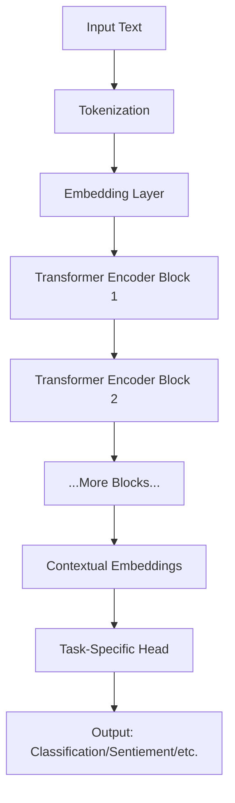

# 1.1 Encoder-only Models (BERT)

## Version 1: The Peer Perspective

Hey there! So, you're diving into the world of LLMs. If you've used ChatGPT, you've seen what these models can do. But before we get into the "generative" part (the part that writes essays), we need to talk about the foundation: the **Encoder**.

Think of an Encoder as the "Understanding" part of a brain. If you give me a sentence and ask, "What is the vibe of this text?" or "Does this sentence imply the user is happy?", you aren't asking me to generate new text; you're asking me to *understand* the text you already gave me. That's exactly what Encoder-only models do.

The most famous example here is **BERT** (Bidirectional Encoder Representations from Transformers). 

Now, let's break down that mouthful of a name.

### What does "Bidirectional" actually mean?
Imagine you're reading a sentence. Usually, we read left-to-right. But imagine if you could see the whole sentence at once—the words before and the words after a specific word—all at the same time. 

> "Context is the key. In NLP, context refers to the surrounding words that help determine the meaning of a specific token."

In older models, they read text linearly. BERT changed the game by looking at the entire sequence simultaneously. This is "Bidirectional" processing. It allows the model to understand that the word "bank" in "river bank" means something totally different than "bank account" because it looks at the words on *both* sides.

### How it Works: The "Fill-in-the-Blanks" Game
To train BERT, the researchers didn't ask it to predict the next word. Instead, they played a game called **Masked Language Modeling (MLM)**.

They would take a sentence, hide (mask) some of the words, and ask BERT to guess what they were.

**Example:**
`The [MASK] sat on the mat.` $\rightarrow$ BERT guesses: `cat`

By doing this millions of times, BERT learned how words relate to each other in a deep, structural way.

### The Architecture
If we visualize the flow, it looks like this:

Each "Encoder Block" uses something called **Self-Attention** (which we'll dive into in Chapter 2). Essentially, it's the model asking, "Which other words in this sentence are important for me to understand this specific word?"

### When should you use this?
Since BERT is designed to *understand* rather than *generate*, it's your go-to for:
- **Sentiment Analysis:** "Is this review positive or negative?"
- **Named Entity Recognition (NER):** "Which words in this sentence are names of people or cities?"
- **Question Answering:** "Where in this paragraph is the answer to the user's question?"

If you need a model to write a poem, BERT is the wrong tool. But if you need a model to analyze 10,000 legal documents and categorize them, BERT is your best friend.

---

## Version 2: Technical Summary

### Encoder-only Architecture
Encoder-only models, exemplified by BERT (Bidirectional Encoder Representations from Transformers), are designed for discriminative tasks rather than generative ones. These models utilize the Transformer Encoder stack, omitting the Decoder component. The primary objective is to generate high-dimensional, contextualized vector representations (embeddings) of the input sequence.

### BERT Technical Specification
BERT employs a non-autoregressive architecture, processing the entire input sequence in parallel. This enables bidirectional context acquisition, where the representation of a token is conditioned on both its left and right contexts.

**Key Training Objectives:**
1. **Masked Language Modeling (MLM):** A denoising objective where $15\%$ of the input tokens are randomly masked. The model is trained to predict the original tokens based on the surrounding context, forcing the model to learn deep bidirectional representations.
2. **Next Sentence Prediction (NSP):** A binary classification task where the model predicts whether sentence B follows sentence A. This encourages the model to understand coherence and relationships between sentences.

### Computational Flow
$\text{Input} \rightarrow \text{Tokenization} \rightarrow \text{Embedding (Token + Segment + Position)} \rightarrow \text{Transformer Encoder Blocks} \rightarrow \text{Contextualized Output}$.

### Applications
Encoder-only architectures are optimal for:
- **Natural Language Inference (NLI)**
- **Sequence Classification**
- **Token-level Classification (e.g., POS tagging, NER)**
- **Extractive Question Answering**