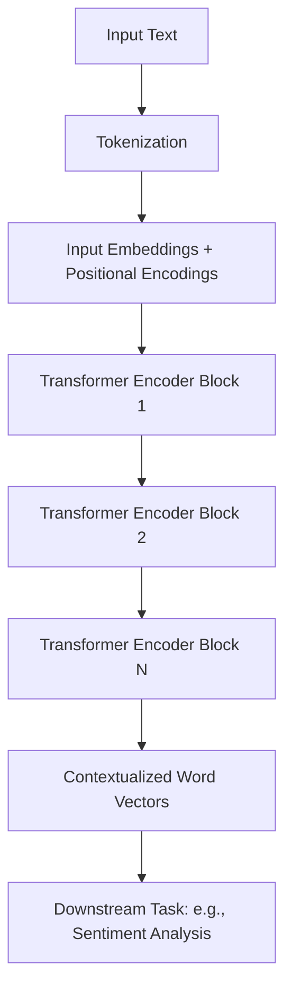

# 1.1 Encoder-only Models (BERT)

## Version 1: A Peer's Guide to Encoder-only Models

Hey there! Welcome to the first section of our deep dive into LLM architectures. If you're just starting out, don't worry—we're going to take this step-by-step. Before we jump in, make sure you're comfortable with basic linear algebra (especially matrix multiplication) and how arrays work, as that's the bedrock of everything we'll discuss here.

So, let's talk about **Encoder-only models**, and the most famous example: **BERT**.

To understand BERT, we first need to understand what "encoding" actually means in the context of NLP (Natural Language Processing). Imagine you have a sentence. To a computer, words are just strings of characters, which aren't very useful for math. Encoding is the process of turning those words into a set of numbers (vectors) that capture the *meaning* of the word based on the context around it.

> "Context" in NLP refers to the surrounding words that help determine the meaning of a specific word. For example, in "The bank of the river" and "The bank granted the loan," the word 'bank' has two entirely different meanings. Context is what allows the model to distinguish between them.

### What makes BERT "Bidirectional"?

Most early models read text linearly—either left-to-right or right-to-left. But language doesn't always work that way. Often, the meaning of a word depends on what comes *after* it as much as what comes *before* it. 

BERT (Bidirectional Encoder Representations from Transformers) changed the game by looking at the entire sequence of words simultaneously. Instead of reading in one direction, it uses a "bidirectional" approach. It's like reading a whole sentence at once rather than scanning it with a magnifying glass from left to right.

### How BERT Learns: The Magic of MLM

Since BERT doesn't have a "target" word to predict (like GPT, which predicts the next word), how does it actually learn? It uses a clever trick called **Masked Language Modeling (MLM)**.

Imagine I give you a sentence with some words blacked out:
"The capital of [MASK] is Paris."

Your brain immediately knows the missing word is "France" because you have context from both the left ("The capital of") and the right ("is Paris"). BERT does exactly this. During training, we hide (mask) a random percentage of the words in a sentence and challenge the model to predict what they were. 

**The process looks like this:**
1. **Input:** "The [MASK] sat on the mat."
2. **Processing:** The Encoder looks at "The", "sat on the mat", and the position of the mask.
3. **Prediction:** The model predicts "cat" (or "dog").

### The Architecture at a Glance

In a BERT model, the "Encoder" is essentially a stack of Transformer blocks. Each block uses **Self-Attention** to weigh the importance of every other word in the sentence when calculating the representation of a single word.

### When should you use an Encoder-only model?

You'll want to reach for BERT (or its cousins like RoBERTa) when you need to *understand* text rather than *generate* it. Because BERT sees the whole sentence at once, it's incredibly good at:
- **Sentiment Analysis:** Is this review positive or negative?
- **Named Entity Recognition (NER):** Which words in this sentence are names of people or locations?
- **Question Answering:** Where in this paragraph is the answer to the user's question?

If you want to write a story or a chat bot, BERT isn't your tool—you'll want a Decoder-only model for that. But for extracting meaning? BERT is the gold standard.

---

## Version 2: Technical Summary

### Encoder-only Architectures (BERT)

Encoder-only models, exemplified by BERT (Bidirectional Encoder Representations from Transformers), are designed to produce high-dimensional contextualized embeddings of input sequences. Unlike autoregressive models, encoder-only architectures utilize a non-causal masking strategy, allowing each token to attend to all other tokens in the sequence regardless of position.

#### Architecture and Objective
The core architecture consists of a stack of Transformer encoders. Each layer employs multi-head self-attention and point-wise feed-forward networks. The primary training objective is **Masked Language Modeling (MLM)**, where approximately 15% of the input tokens are replaced with a `[MASK]` token. The model is then optimized to predict the original identity of the masked tokens using a cross-entropy loss function.

#### Key Mechanisms
1. **Bidirectionality:** By removing the causal mask found in decoders, the model computes representations based on the entire input context $\mathbf{X}$. For a token $i$, the representation $\mathbf{h}_i$ is a function of $\mathbf{X}_{1 \dots n}$.
2. **Next Sentence Prediction (NSP):** Original BERT incorporated a binary classification task to predict whether sentence B follows sentence A, enhancing the model's ability to capture inter-sentence coherence.
3. **Representation:** The output is a sequence of vectors $\mathbf{H} \in \mathbb{R}^{n \times d}$, where $n$ is the sequence length and $d$ is the embedding dimension. A special `[CLS]` token is typically prepended to the sequence, and its final hidden state is used as the aggregate representation for sequence-level classification.

#### Applications
Encoder-only models are optimized for NLU (Natural Language Understanding) tasks:
- **Token-level tasks:** NER, Part-of-Speech tagging.
- **Sequence-level tasks:** Sentiment analysis, Natural Language Inference (NLI).
- **Extractive QA:** Identifying the start and end indices of a span within a document.