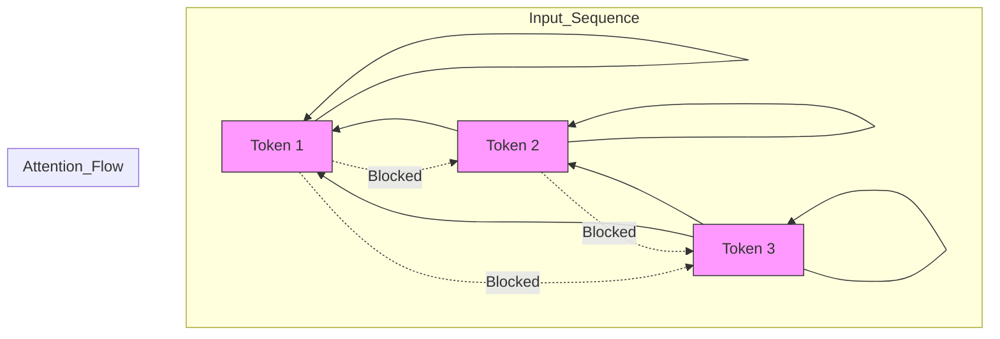

# 1.2 Decoder-only Models (GPT)

## Version 1: Peer-to-Peer Guide

Hey! Let's talk about Decoder-only models. If you've used ChatGPT, Claude, or Llama, you've interacted with this architecture. While the previous section on Encoder-only models showed us how to "understand" text, Decoder-only models are built for one primary purpose: **generation**.

If you're feeling a bit rusty on the math, don't worry. As long as you remember the basics of linear algebra (specifically matrix multiplication), you'll be fine. If any specific term feels obscure, I'll give you a quick summary.

### The Core Concept: Autoregression

At its heart, a Decoder-only model is an "autoregressive" engine. This is a fancy way of saying the model predicts the next part of a sequence based on all the parts that came before it.

Imagine you are writing a story. You don't write the whole book in one go; you write one word, then you look at what you've written, and you decide what the next word should be. You repeat this process over and over.

> **Autoregression:** A process where the model's previous outputs are fed back into the model as inputs to generate the next output. In LLMs, this means the token predicted at step $t$ becomes part of the input sequence for step $t+1$.

### How the Architecture Works

A Decoder-only model consists of a stack of identical layers. Each layer has two main components: a **Masked Multi-Head Attention** block and a **Feed-Forward Network (FFN)**.

#### 1. Masked Multi-Head Attention
In a standard Transformer, "attention" allows a token to look at every other token in the sequence to understand context. But in a generative model, we have a problem: we can't let the model "see the future." If the model is trying to predict the 4th word in a sentence, it shouldn't be allowed to look at the 5th word.

To fix this, we use a **Causal Mask**. 

Think of it like a sliding window. As the model processes the sequence, the mask blocks out everything to the right of the current token. 

**Visualizing the Causal Mask:**

In this diagram, you can see that Token 1 only attends to itself. Token 2 attends to Token 1 and itself. Token 3 attends to 1, 2, and itself. This unidirectional flow ensures the model remains "causal."

#### 2. The Feed-Forward Network (FFN)
After the attention block has figured out *which* other tokens are important, the FFN processes that information. Think of the attention block as the "context gatherer" and the FFN as the "knowledge processor." The FFN consists of two linear transformations with a non-linear activation function (like ReLU or GELU) in between. This is where the model's "factual knowledge" is largely stored.

#### 3. The Output: Predicting the Token
Once the data passes through all the layers, it reaches the final linear layer and a **Softmax** function.

> **Softmax:** A mathematical function that takes a vector of raw scores (logits) and transforms them into probabilities that sum to 1. It highlights the most likely candidate while suppressing others.

The model looks at the probability distribution across its entire vocabulary (e.g., 50,000 possible tokens) and picks one. That token is then appended to the input, and the whole process starts over again.

### Summary Comparison

To keep it simple, here is how this differs from the Encoder you saw earlier:

| Feature | Encoder-only (BERT) | Decoder-only (GPT) |
| :--- | :--- | :--- |
| **Attention** | Bidirectional (sees everything) | Unidirectional (sees the past) |
| **Primary Goal** | Understanding / Classification | Text Generation |
| **Processing** | Parallel (whole sequence at once) | Autoregressive (one token at a time) |
| **Analogy** | A student reading a page to summarize it | A storyteller writing a book word-by-word |

---

## Version 2: Technical Summary

### Decoder-only Architecture
The Decoder-only architecture, as implemented in the GPT (Generative Pre-trained Transformer) series, is a stack of $L$ transformer layers designed for causal language modeling (CLM). Unlike the original Transformer's decoder, which included an encoder-decoder attention cross-attention layer, the Decoder-only variant removes this component, relying solely on masked self-attention.

### Causal Language Modeling (CLM)
The objective function for Decoder-only models is the minimization of negative log-likelihood of the next token given the previous sequence:
$$\mathcal{L} = -\sum_{i=1}^{n} \log P(x_i | x_{<i}, \theta)$$
where $x_{<i}$ denotes the sequence of tokens preceding position $i$.

### Masked Self-Attention Mechanism
To prevent information leakage from future tokens, a causal mask $M$ is applied to the attention scores. The attention mechanism is defined as:
$$\text{Attention}(Q, K, V) = \text{softmax}\left(\frac{QK^T}{\sqrt{d_k}} + M\right)V$$
The mask $M$ is a matrix where $M_{ij} = 0$ for $i \ge j$ and $M_{ij} = -\infty$ for $i < j$. This ensures that the softmax output for positions $j > i$ is zero, effectively constraining the receptive field to the prefix.

### Architectural Components
1. **Layer Normalization:** Typically applied as Pre-Norm (before the attention and FFN blocks) to improve gradient stability during training.
2. **Feed-Forward Network (FFN):** A position-wise MLP consisting of two linear layers:
   $$\text{FFN}(x) = \max(0, xW_1 + b_1)W_2 + b_2$$
3. **Linear Output Layer:** A final linear projection from the model dimension $d_{model}$ to the vocabulary size $V$, followed by a softmax operation to produce the token probability distribution.

### Computational Complexity
The computational complexity of the self-attention mechanism is $O(n^2 \cdot d)$, where $n$ is the sequence length and $d$ is the embedding dimension. This quadratic scaling with respect to sequence length is the primary bottleneck for long-context window generation.