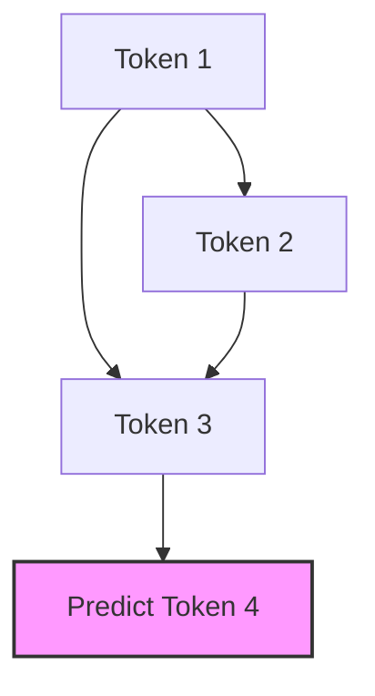

# 1.2 Decoder-only Models (GPT)

## Version 1: Peer-to-Peer Guide

Hey! So, you've probably heard of GPT (Generative Pre-trained Transformer) a million times, but let's actually look under the hood at what a "Decoder-only" model is and why it's the engine behind almost every AI chatbot you use today.

If you're coming from the Encoder-only models we talked about in the previous section, you know that those models are great at understanding a whole sentence at once. But if you want to *generate* text—like writing a poem or coding a script—you need a different approach. That's where the Decoder-only architecture comes in.

### The Big Idea: The "Next-Token" Game

Imagine you're reading a sentence, but someone has put a piece of cardboard over everything to the right of the word you're currently reading. You can see everything that happened in the past, but you have no idea what's coming next. Your only job is to guess the very next word.

That is exactly how a Decoder-only model works. It is designed for **Causal Language Modeling**. "Causal" is just a fancy way of saying that the output depends only on previous inputs.

> **Quick Refresh: Tokenization**
> Since models can't read letters, we break text into "tokens" (chunks of characters, words, or sub-words). Think of tokens as the "alphabet" the model actually understands.

### How It Actually Works: Masked Self-Attention

The secret sauce here is something called **Masked Self-Attention**. 

In a standard Transformer, every word looks at every other word. But if we did that during generation, the model would "cheat"—it would see the answer it's trying to predict! To prevent this, we use a mask.

Imagine the attention matrix as a grid. For a Decoder, we zero out the top-right half of that grid. This forces the model to only attend to tokens that came *before* the current one.

**Visualizing the Mask:**

In this flow, Token 3 can "see" Token 1 and 2, but Token 1 cannot see Token 3. This unidirectional flow is what makes the model "generative."

### Why does this matter?

Because the model is trained on this "next-token prediction" task across billions of pages of the internet, it doesn't just learn grammar—it learns a world model. By predicting the next token in a physics textbook, it learns physics. By predicting the next token in a Python script, it learns to code.

If you're feeling stuck, remember that the core difference is simple:
- **Encoder:** "What does this whole sequence mean?" (Bidirectional)
- **Decoder:** "Given what I've seen so far, what comes next?" (Unidirectional)

---

## Version 2: Technical Summary

### Decoder-only Architecture Overview
Decoder-only models, exemplified by the GPT (Generative Pre-trained Transformer) family, are autoregressive language models designed primarily for generative tasks. Unlike bidirectional encoders, decoder-only architectures utilize a unidirectional attention mechanism to ensure that the prediction for a given token depends solely on the preceding sequence.

### Causal Language Modeling (CLM)
The primary objective of a decoder-only model is to maximize the likelihood of the next token in a sequence. Mathematically, for a sequence $x = (x_1, x_2, ..., x_n)$, the model estimates the conditional probability:

$$P(x_i | x_1, ..., x_{i-1})$$

This process is termed **Autoregressive Generation**, where the model's own previous outputs are fed back as inputs for subsequent tokens.

### Masked Self-Attention Mechanism
To enforce causality, decoder-only models implement **Causal Masking**. During the self-attention computation, a mask matrix $M$ is applied to the scaled dot-product attention:

$$\text{Attention}(Q, K, V) = \text{softmax}\left(\frac{QK^T}{\sqrt{d_k}} + M\right)V$$

Where $M$ contains $-\infty$ for all positions $j > i$ and $0$ otherwise. This effectively prevents the attention mechanism from attending to future tokens, ensuring the model remains causal.

### Key Architectural Characteristics
- **Unidirectional Flow:** Information propagates from left to right.
- **KV Caching:** To optimize inference, the Key ($K$) and Value ($V$) tensors for previous tokens are cached, eliminating the need to recompute them for each new token generated.
- **Scaling Laws:** These models exhibit emergent properties (e.g., in-context learning) as a function of parameter count, dataset size, and compute budget, following predictable power-law distributions.