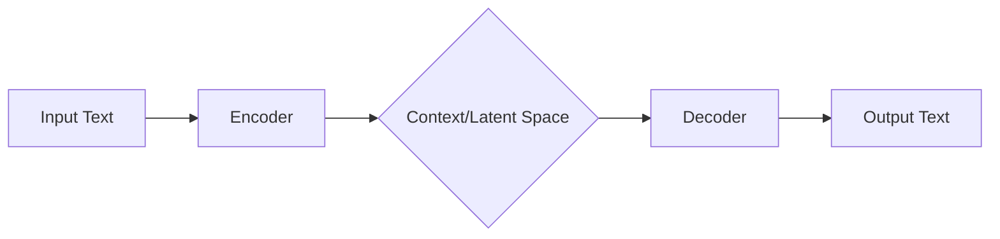

# 1.3 Encoder-Decoder Models (T5)

## Version 1: Peer-to-Peer Guide

Hey! So, we've already looked at Encoder-only models (like BERT) which are great at understanding text, and Decoder-only models (like GPT) which are absolute beasts at generating it. But what happens when you need to do both? That's where the **Encoder-Decoder architecture** comes in.

Think of this architecture as a translation bridge. If you've ever used a translation app, this is basically what's happening under the hood. You have one part of the model that focuses entirely on "digesting" the input, and another part that focuses on "constructing" the output.

### How it Works: The Bridge Analogy

Imagine you're translating a book from English to French. You wouldn't start writing the French version word-by-word while you're still reading the English sentence; you'd read the whole sentence, get the "gist" or the meaning of it, and then write the French translation.

That's exactly how the Encoder-Decoder works:

1.  **The Encoder:** This is the "understanding" phase. It reads the entire input sequence. Because it can look at the whole sentence at once (using bi-directional attention), it creates a rich, mathematical representation of the meaning.
2.  **The Bridge (Context):** The Encoder passes this "meaning" (a set of vectors) over to the Decoder.
3.  **The Decoder:** This is the "generation" phase. It takes that "meaning" and starts generating the output sequence, one token at a time, just like GPT does.

Here is a high-level look at the flow:

Wait, if you've forgotten what I mean by "attention," here is a quick refresher:
> **Attention** is a mechanism that allows the model to focus on specific parts of the input that are most relevant to the current word being processed. In an Encoder-Decoder, "Cross-Attention" is the magic that lets the Decoder look back at the Encoder's notes to make sure it's translating the right word.

### Enter T5: The "Text-to-Text" Philosophy

One of the most famous examples of this is **T5 (Text-to-Text Transfer Transformer)**. The creators of T5 had a really cool idea: what if we treated *every* NLP task as a text-to-text problem?

Instead of having different "heads" for classification, summarization, or translation, T5 just uses text for everything.
- **Summarization:** Input: "summarize: [Long Article]" $\rightarrow$ Output: "[Short Summary]"
- **Translation:** Input: "translate English to German: [English Text]" $\rightarrow$ Output: "[German Text]"
- **Classification:** Input: "sentiment: [Review]" $\rightarrow$ Output: "positive"

By framing everything as "Text-In, Text-Out," T5 can use the same loss function and the same architecture for completely different tasks. It's a beautifully simple way to handle a huge variety of problems.

***

## Version 2: Technical Summary

**Encoder-Decoder Architecture (seq2seq)**

The Encoder-Decoder architecture, most prominently implemented in the T5 (Text-to-Text Transfer Transformer) model, is designed for sequence-to-sequence (seq2seq) tasks where the input and output sequences may differ in length.

### Architectural Components
1.  **Encoder:** A stack of Transformer blocks utilizing bi-directional self-attention. The encoder processes the source sequence $X$ to produce a sequence of continuous representations (hidden states) $H = \{h_1, h_2, ..., h_n\}$.
2.  **Decoder:** A stack of Transformer blocks utilizing masked self-attention (causal) and cross-attention. The decoder generates the target sequence $Y$ autoregressively.
3.  **Cross-Attention Mechanism:** The decoder performs attention over the encoder's output $H$. This allows the decoder to condition the generation of each target token $y_t$ on the entire encoded context of the source sequence.

### T5 Framework
T5 adopts a "Text-to-Text" framework, unifying all NLP tasks into a single format. Every task is cast as a mapping from a text string to a text string. This unification allows for a single model to be pre-trained on a diverse set of objectives (e.g., span-corruption, translation, and sentiment analysis) using a shared objective function.

### Mathematical Objective
The model is trained to maximize the conditional likelihood of the target sequence given the source sequence:
$$\mathcal{L} = \sum_{t=1}^{T} \log P(y_t | y_{<t}, X; \theta)$$
Where $X$ is the input sequence, $y_{<t}$ represents the tokens generated by the decoder prior to time $t$, and $\theta$ represents the model parameters.