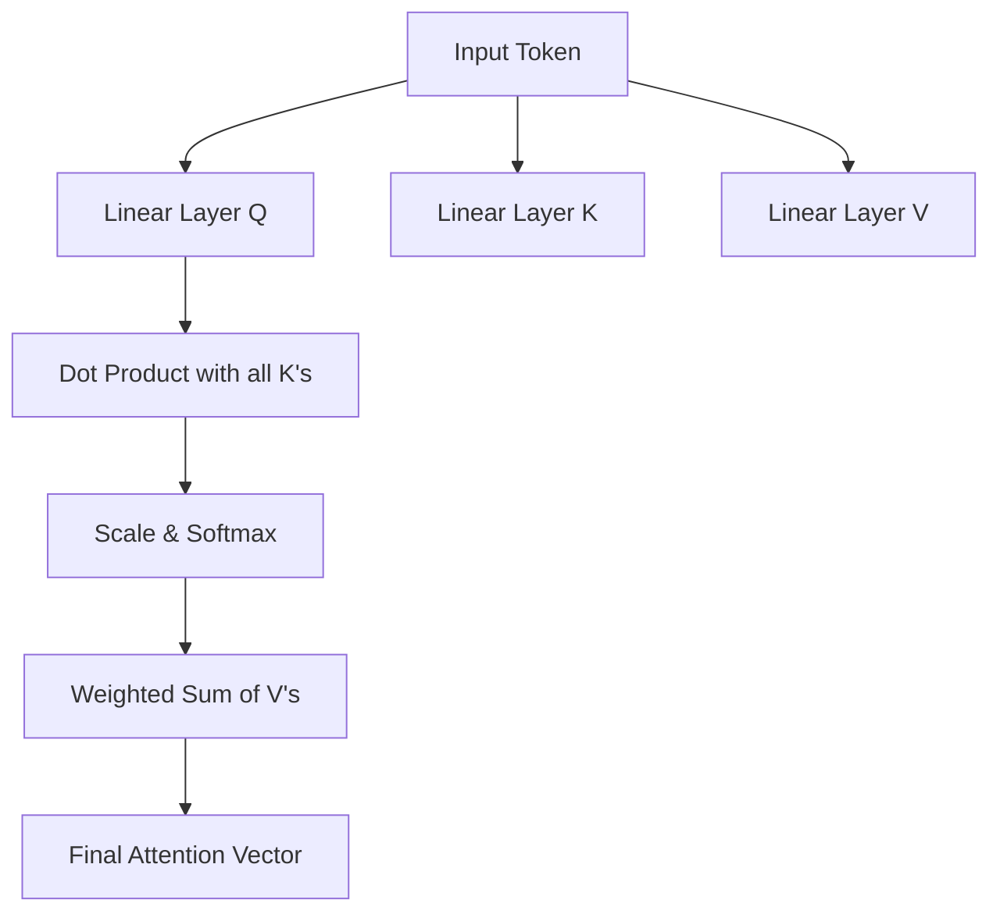

# 2.1 The Mechanics of Self-Attention

## Peer-to-Peer Guide

Hey! So, let's dive into self-attention. If you're coming into this without knowing what "attention" means in the context of AI, don't worry—it's actually a very intuitive concept once you strip away the math.

Think about how you're reading this sentence. Your brain isn't giving equal importance to every single word. You're focusing on the most important words to understand the context. For example, in the sentence *"The animal didn't cross the street because it was too tired,"* your brain knows that "it" refers to the "animal," not the "street." Self-attention is basically the mechanism that allows a model to do exactly that: determine which other words in a sequence are most relevant to the word it's currently processing.

Before we get into the weeds, you'll need a quick refresher on a couple of things:
> **Embeddings:** These are just lists of numbers (vectors) that represent the "meaning" of a word. Similar words have similar numbers.
> **Dot Product:** A way to multiply two vectors to get a single number. The higher the number, the more "aligned" or similar the two vectors are.

### How It Actually Works: Q, K, and V

To make this happen, the model assigns three different roles to every single word (token) in the sentence. We call these the **Query**, the **Key**, and the **Value**. I like to think of this like a filing system or a search engine.

1.  **The Query (Q):** This is what the word is "looking for." It's like saying, *"I am the word 'it'. Who in this sentence provides context for me?"*
2.  **The Key (K):** This is like a label on a file. Every word has a key that says, *"Here is what I offer to anyone looking for context."*
3.  **The Value (V):** This is the actual information the word holds. Once we find a match between a Query and a Key, we extract the Value.

### The Process Step-by-Step

Here is the workflow the model follows for every word:

1.  **Score the Relationship:** The model takes the **Query** of the current word and does a dot product with the **Keys** of every other word in the sentence. This gives us a "score" for how much attention should be paid to each word.
2.  **Scale and Normalize:** These scores can get huge, which makes the math unstable. So, we divide by the square root of the dimension of the keys (Scaling). Then, we run the results through a **Softmax** function. 
    > **Softmax:** A function that turns a list of numbers into probabilities that add up to 1.0 (100%).
3.  **Weight the Values:** Finally, we multiply these probabilities by the **Values** of the words. If a word had a high attention score, its Value will be heavily represented in the final output.

### Visualizing the Flow

By the end of this, the model has a new vector for the word "it" that isn't just the embedding for "it," but a blended representation that includes the most important context from the rest of the sentence (like "animal").

---

## Technical Summary

**Self-Attention** is a differentiable mechanism that computes a weighted representation of an input sequence by relating different positions of the same sequence. 

### Mathematical Formulation
Given an input sequence of embeddings $X \in \mathbb{R}^{n \times d}$, the mechanism projects $X$ into three distinct spaces using learned weight matrices $W^Q, W^K, W^V \in \mathbb{R}^{d \times d_k}$:
- $Q = XW^Q$ (Queries)
- $K = XW^K$ (Keys)
- $V = XW^V$ (Values)

The attention output is computed as the weighted sum of the values, where the weights are determined by the scaled dot-product of the queries and keys:

$$\text{Attention}(Q, K, V) = \text{softmax}\left(\frac{QK^T}{\sqrt{d_k}}\right)V$$

### Component Analysis
1.  **Score Calculation:** The term $QK^T$ computes the pairwise similarity between all queries and keys in the sequence.
2.  **Scaling Factor:** Division by $\sqrt{d_k}$ prevents the dot products from growing too large in magnitude, which would otherwise push the softmax function into regions with extremely small gradients.
3.  **Normalization:** The $\text{softmax}$ operation ensures that the attention weights $\alpha_{ij}$ are non-negative and $\sum_j \alpha_{ij} = 1$.
4.  **Aggregation:** The resulting probability matrix is multiplied by $V$ to produce the final context-aware representation.

**Complexity:** The time and space complexity of self-attention is $O(n^2 \cdot d)$, where $n$ is the sequence length and $d$ is the embedding dimension.