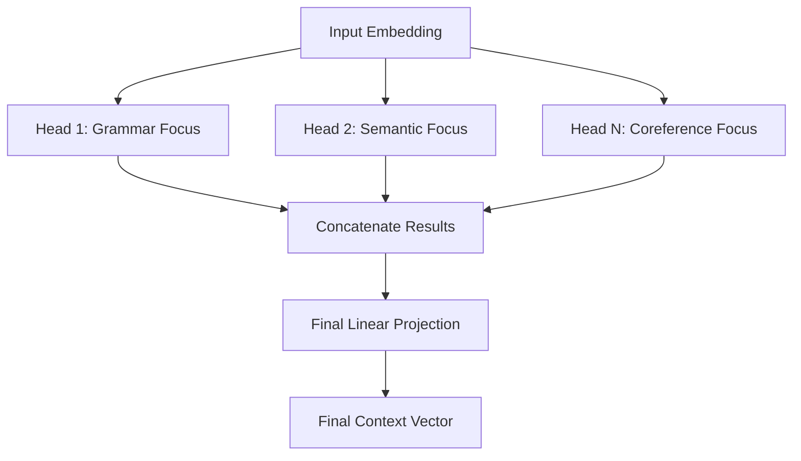

# 2.2 Multi-Head Attention

## Peer-to-Peer Guide

If we stop at self-attention, we're basically letting the model look at the sentence through a single lens. While that's powerful, it's limiting. Imagine you're analyzing a complex legal contract. You wouldn't just read it once; you'd read it once to understand the general intent, once to check for specific dates, and once to ensure the terminology is consistent. You're effectively using different "modes" of attention.

Multi-Head Attention (MHA) is how Transformers do this. Instead of having one giant attention mechanism, the model splits the work across several smaller ones, which we call **Heads**.

Each head is essentially a complete self-attention engine (with its own $Q$, $K$, and $V$ matrices) that can learn to focus on different things. For example, in the sentence *"The robot quickly painted the wall red,"* one head might focus on the relationship between "robot" and "painted" (the actor and the action), while another head might focus on "wall" and "red" (the object and its attribute).

### How the "Splitting" Works

You might be wondering: *"Does this mean the model becomes 8x or 12x larger?"* Not exactly. To keep the computation efficient, we don't just duplicate the attention mechanism. Instead, we project the original embeddings into smaller dimensions.

If our model has an embedding size of 512 and we use 8 heads, we don't do 8 full-sized attention operations. Instead, we split that 512-dimension vector into 8 smaller vectors of 64 dimensions each. 

Here is the breakdown of the workflow:
1.  **Split:** The input is projected into $h$ sets of $Q, K, \text{ and } V$ matrices.
2.  **Parallel Process:** Each head performs self-attention independently on its smaller slice of the data.
3.  **Concatenate:** Once all heads are done, the model glues all the resulting vectors back together.
4.  **Project:** Since we just glued a bunch of vectors together, we run them through one final linear layer (a matrix multiplication) to blend the information from all heads into a single, cohesive representation.

### Visualizing Multi-Head Attention

By using MHA, the model isn't just calculating "how much" attention to pay, but "what kind" of attention. It allows the Transformer to simultaneously capture multiple layers of meaning—syntactic, semantic, and relational—all in a single pass.

---

## Technical Summary

**Multi-Head Attention (MHA)** is an extension of the scaled dot-product attention mechanism that allows the model to jointly attend to information from different representation subspaces at different positions.

### Mathematical Formulation

MHA projects the queries, keys, and values $h$ times with different, learned linear projections. For each head $i \in \{1, \dots, h\}$, the attention is computed as:

$$\text{head}_i = \text{Attention}(QW^Q_i, KW^K_i, VW^V_i)$$

where $W^Q_i, W^K_i, W^V_i \in \mathbb{R}^{d \times d_k}$ are weight matrices, and $d_k = d/h$ is the reduced dimension per head.

The outputs of all heads are concatenated and projected through a final weight matrix $W^O \in \mathbb{R}^{hd \times d}$:

$$\text{MultiHead}(Q, K, V) = \text{Concat}(\text{head}_1, \dots, \text{head}_h)W^O$$

### Architectural Analysis

1.  **Subspace Specialization:** By employing multiple heads, the model avoids the "averaging" effect of single-head attention. Each head can specialize in different types of dependencies (e.g., long-range vs. short-range dependencies).
2.  **Dimensionality Invariance:** Since each head operates on a dimension $d_k = d/h$, the total computational cost is asymptotically similar to single-head attention with dimension $d$, provided the projections are implemented efficiently as a single large matrix multiplication.
3.  **Linear Integration:** The final projection $W^O$ is critical as it allows the model to learn how to weigh the contributions of different heads.

**Complexity:** The time complexity remains $O(n^2 \cdot d)$, where $n$ is the sequence length and $d$ is the model dimension.