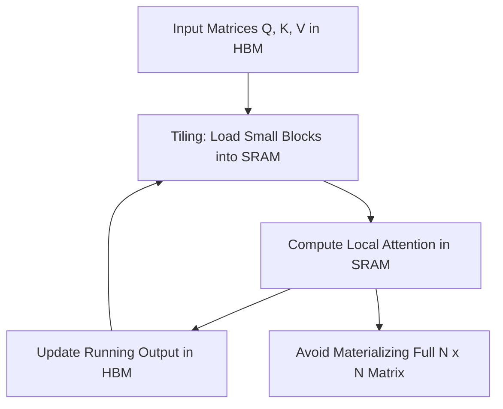

# 2.3 FlashAttention and Computational Efficiency

## Version 1: The Peer Perspective

Hey! So, if you've been following along with the previous sections, you know that Attention is the "secret sauce" that makes Transformers work. We've seen how Self-Attention (Section 2.1) and Multi-Head Attention (Section 2.2) allow a model to focus on different parts of a sequence. But there's a massive problem we haven't talked about: the "Quadratic Wall."

As we increase the length of the input sequence (let's call it $n$), the amount of memory and time we need to compute attention grows by $n^2$. If you double your input, you don't double the work—you quadruple it. For a model trying to read a whole book, this is a nightmare.

For a while, the industry thought the problem was just "raw compute"—that we needed faster GPUs. But it turns out the bottleneck isn't how fast the GPU can *calculate*; it's how fast the GPU can *move data*.

> **HBM (High Bandwidth Memory):** This is the main memory on your GPU. It's huge, but moving data from HBM to the actual processing cores (SRAM) is slow. Imagine HBM as a giant warehouse and SRAM as your desk. You can work fast at your desk, but if you have to keep walking back to the warehouse for every single piece of paper, you're wasting most of your time walking.

This is where **FlashAttention** comes in. Instead of calculating the attention matrix in one giant, memory-heavy step, FlashAttention uses a technique called **Tiling**.

Think of it like this: instead of trying to lay out the entire $n \times n$ attention matrix on the desk (which would require a desk the size of a football field for long sequences), FlashAttention breaks the matrix into small, manageable blocks. It loads a small block into the SRAM, does the math, and then updates the final result without ever needing to store the full intermediate matrix in the HBM.

Here is a high-level look at how the data flows:

Another clever trick FlashAttention uses is **Recomputation**. Normally, in deep learning, we store all the intermediate results from the forward pass to use them during the backward pass (the part where the model actually learns). For attention, that intermediate matrix is huge. FlashAttention says, "It's actually faster to just calculate the attention again during the backward pass than it is to store that giant matrix in memory and read it back later."

By reducing the number of times the GPU has to "walk to the warehouse" (HBM), FlashAttention allows us to:
1. **Train models much faster.**
2. **Use significantly less memory.**
3. **Handle much longer context windows** (meaning the model can "remember" more of the document).

If you're coming from a background in standard linear algebra, this might feel like "cheating" because we're changing the implementation, not the math. But in the world of LLMs, the implementation *is* the performance.

***

## Version 2: Technical Summary

**FlashAttention** is an IO-aware exact attention algorithm designed to accelerate the computation of the attention mechanism by reducing the memory traffic between High Bandwidth Memory (HBM) and on-chip SRAM.

### Computational Bottleneck
Standard attention implementations materialize the full $n \times n$ attention matrix, resulting in $O(n^2)$ time and space complexity. The primary bottleneck is not the Floating Point Operations per Second (FLOPS) but the memory bandwidth (IO-bound), specifically the repeated read/write operations of the attention matrix between HBM and SRAM.

### Key Optimizations
1. **Tiling:** FlashAttention employs tiling to decompose the attention computation into smaller blocks. By computing the softmax in a partitioned manner and updating the output incrementally, the algorithm avoids materializing the large $n \times n$ intermediate attention matrix in HBM.
2. **Online Softmax:** To handle the normalization requirement of softmax across tiles, FlashAttention uses an online softmax approach, maintaining running statistics (max values and sums) to ensure mathematical equivalence to the standard softmax.
3. **Recomputation:** To optimize the backward pass, FlashAttention does not store the intermediate attention matrix. Instead, it recomputes the necessary values during the backward pass, trading a small increase in compute for a significant reduction in HBM memory traffic.

### Performance Impact
FlashAttention reduces the memory complexity from $O(n^2)$ to $O(n)$ (excluding the final output). This leads to substantial increases in training throughput and enables the scaling of context windows to significantly larger sizes without the exponential memory overhead associated with vanilla attention.