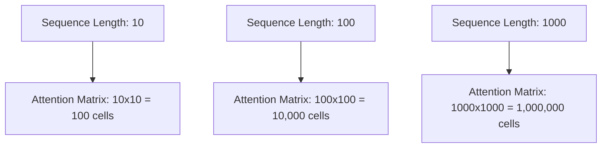

# Section 4: Attention Complexity and Bottlenecks

## Peer-to-Peer Version

Hey there! So, we've spent the last few sections talking about how attention actually works—the queries, the keys, the values, and that magic "softmax" that tells the model what to focus on. It feels like magic, right? But as we scale these models up to handle entire books or massive codebases, we run into a very real, very expensive wall: **Complexity**.

When I first started looking into this, I thought, "Sure, if we have more memory, we can just handle longer sequences." But it's not a linear problem. It's a quadratic one.

Let's break down what that actually means. In a standard self-attention layer, every single token in your input sequence has to "look" at every other token to determine its context. If you have a sequence of 10 tokens, each token does 10 comparisons. That's 100 operations. If you double that to 20 tokens, you don't just double the work—you quadruple it. Now you have 400 operations.

> **Quadratic Complexity**: In computational terms, if an algorithm has quadratic complexity, the time or space required to complete the task grows proportionally to the square of the input size ($n^2$). If the input doubles, the cost increases by four times.

If you're coming from a background in linear algebra, think of this as the cost of the matrix multiplication between your Query ($Q$) and Key ($K$) matrices. Since both are based on the sequence length $n$, the resulting attention matrix is $n \times n$. 

Here is a simple way to visualize the growth:

As you can see, the memory required to store this matrix explodes. This is the "Attention Bottleneck." Even if you have an NVIDIA H100 with massive VRAM, you will eventually run out of space because the memory cost grows so fast. Not only are we spending more memory, but we're also spending more compute cycles just to calculate these weights.

This is why we can't just feed a 100,000-token document into a vanilla Transformer. We would need a matrix with 10 billion entries just for one layer! This realization is exactly why researchers developed things like FlashAttention (which we touched on in the previous section)—to find ways to calculate these results without actually materializing the full, massive $n \times n$ matrix in memory.

***

## Technical Summary

### Complexity Analysis
The standard scaled dot-product attention mechanism exhibits quadratic time and space complexity relative to the sequence length $n$. 

**1. Time Complexity:**
The computation of the attention scores involves the multiplication of the Query matrix $Q \in \mathbb{R}^{n \times d}$ and the Key matrix $K \in \mathbb{R}^{n \times d}$, where $d$ is the embedding dimension.
- The product $QK^T$ results in an $n \times n$ matrix.
- The complexity of this operation is $O(n^2 \cdot d)$.
- Subsequent softmax and multiplication with the Value matrix $V \in \mathbb{R}^{n \times d}$ also follow $O(n^2 \cdot d)$.

**2. Space Complexity:**
The intermediate attention weight matrix $A = \text{softmax}(\frac{QK^T}{\sqrt{d}})$ requires $O(n^2)$ space to store the scores before they are applied to the Value matrix.

### Bottlenecks
The primary bottlenecks in the attention mechanism are:
- **Memory Wall:** The $O(n^2)$ space requirement for the attention matrix leads to rapid VRAM exhaustion as sequence length increases, limiting the maximum context window.
- **Compute Bound:** While $d$ is usually constant, the $n^2$ factor dominates the compute cost for long sequences, increasing latency and training time.
- **Memory Bandwidth:** The repeated reading and writing of the large attention matrix between the GPU's Global Memory (HBM) and the on-chip SRAM creates a significant communication bottleneck.