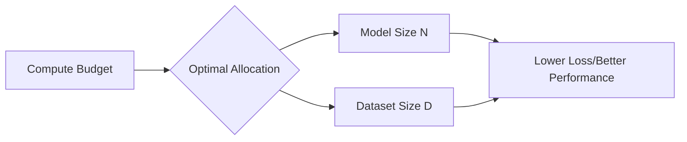

# 3.1 Understanding Scaling Laws

## Version 1: A Peer's Guide to Scaling Laws

Hey! Let's talk about the "physics" of LLMs. If you've ever wondered why companies like OpenAI or Google spend millions of dollars on GPUs to train larger and larger models, it's not just because "bigger is better"—it's because there's a mathematical relationship that predicts exactly how much better a model gets as you scale it.

When we talk about "scaling," we're usually talking about three main levers we can pull:
1. **Model Size ($\text{N}$):** The number of parameters (weights) in the network. More parameters mean the model has more "capacity" to memorize facts and understand complex patterns.
2. **Dataset Size ($\text{D}$):** The number of tokens (words/parts of words) the model sees during training. If you have a massive model but only train it on a tiny dataset, it's like having a genius who has only read one book.
3. **Compute Budget ($\text{C}$):** The total amount of floating-point operations (FLOPs) used for training. This is essentially the "fuel" that powers the training process.

### The Power Law

The most critical discovery in scaling laws is that the model's performance (usually measured by "loss"—how surprised the model is by the next token) follows a **power law**. 

Imagine a graph where the x-axis is the amount of compute we spend, and the y-axis is the loss. If you plot the results, you don't see a straight line; you see a curve that keeps dropping. The magic is that this curve is predictable. If we know the loss for a small model trained on a small dataset, we can predict the loss for a model that is 100x larger.

> "Loss" in LLMs is a measure of how well the model predicts the next token. A lower loss means the model is less "surprised" and more accurate. If the loss is 2.0, the model is doing okay; if it's 1.0, it's significantly better.

### The Chinchilla Optimality

For a long time, people thought the most important thing was just making the model bigger ($\text{N}$). But then came the **Chinchilla study** (by DeepMind). They discovered that most models were actually "under-trained."

They found that for a given compute budget, the best way to use it is to scale the model size and the dataset size **equally**. 

**Here's the a simplified version of the rule:**
To get the best performance, for every 2x increase in model parameters, you should also increase your training tokens by 2x.

If you only increase the model size but keep the dataset small, you'll hit a point of diminishing returns where the model stops improving. This is why newer models (like Llama-3) are trained on trillions of tokens, even if they are smaller than some older, massive models.

### Why does this matter to us?

As a developer or researcher, scaling laws tell you that you don't always need the biggest model possible. If you have a limited compute budget, the scaling laws help you decide: "Should I spend my GPUs on a slightly larger model, or should I spend that same compute on training a smaller model for longer on more data?"

Usually, the answer is: **get more high-quality data**.

---

## Version 2: Technical Summary

### Empirical Scaling Laws for Neural Language Models

The performance of Transformer-based language models is governed by empirical power-law relationships between the final training loss ($\text{L}$) and the scale of the model ($\text{N}$), the size of the dataset ($\text{D}$), and the total training compute ($\text{C}$).

#### 1. The Scaling Law Formula
The loss $\text{L}$ is typically modeled as a sum of power laws:
$$\text{L}(\text{N}, \text{D}) = \text{E} + \frac{\text{A}}{\text{N}^\alpha} + \frac{\text{B}}{\text{D}^\beta}$$
Where:
- $\text{N}$ is the number of parameters.
- $\text{D}$ is the number of training tokens.
- $\text{A, B, E}$ are constants specific to the model architecture and dataset.
- $\alpha$ and $\beta$ are the scaling exponents.

#### 2. Compute-Optimal Training (Chinchilla Scaling)
The Chinchilla study demonstrated that for a fixed compute budget $\text{C} \approx 6\text{N}\text{D}$, the optimal allocation of resources requires scaling $\text{N}$ and $\text{D}$ proportionally. Specifically, the optimal model size $\text{N}^*$ and optimal dataset size $\text{D}^*$ are:
$$\text{N}^* \propto \text{C}^{0.5}, \quad \text{D}^* \propto \text{C}^{0.5}$$
This implies that many early LLMs were over-parameterized and under-trained. To maximize performance for a given compute budget, the number of training tokens should scale linearly with the number of parameters.

#### 3. Implications for Inference
While compute-optimal training minimizes training loss, "over-training" a smaller model (training it on more tokens than the Chinchilla-optimal amount) often results in a model that is more efficient during inference. Smaller models with higher training-token-to-parameter ratios (e.g., $20\text{T}$ tokens for a $7\text{B}$ parameter model) provide a better performance-per-compute trade-off during the deployment phase.