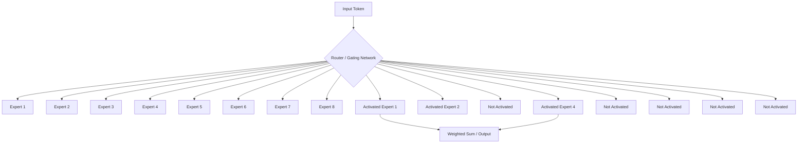

# 3.2 Sparse Activation and Routing

## Version 1: A Peer's Guide to Sparse Activation

Hey! Now that we've seen how scaling laws tell us that we need more parameters and more data, we've hit a wall: **VRAM**.

If you've ever tried to load a massive model on your GPU, you know the struggle. A "dense" model—where every parameter is used for every token—is a memory hog. If you have a 1-trillion parameter model, you need enough VRAM to hold all those weights, and you need to do math for *every single one of them* for every word the model generates.

This is where **Sparse Activation** (and the Mixture of Experts, or MoE) comes in.

### The "Expert" Analogy

Imagine you're running a huge company. You don't want one single person to know everything about law, coding, medicine, and cooking. Instead, you hire a team of **experts**. 

When a task comes in—say, a Python script that needs debugging—you don't call a meeting with all 100 employees. You just route the task to the two or three people who actually know how to code.

**Sparse activation** is exactly that. In an MoE model, the Feed-Forward Networks (FFNs) are replaced by a set of "experts" (which are just smaller FFNs). Instead of one giant FFN, we have 8, 16, or 64 experts.

### How the Router Works

The "magic" that makes this work is the **Router** (or the Gating Network). The router is a small, trainable neural network that looks at the token and decides: "Which expert is best for this?"

**The process looks like this:**
1. **Token arrives:** The token "Python" arrives at the MoE layer.
2. **Router's Decision:** The router calculates a score for each expert. It might say: "Expert 1 (Coding) is 80% likely to be the best, and Expert 4 (Logic) is 20% likely."
3. **Top-K Selection:** The model selects the top $K$ experts (usually $K=1$ or $K=2$).
4. **Execution:** Only those $K$ experts process the token. The other experts just sit idle.

> "Top-K" is a common term in AI. It just means "the $K$ best." If $K=2$, the model picks the two experts with the highest scores from the router.

### Why is this a big deal?

This is the "cheat code" for scaling. Because we only activate a few experts per token, the **computational cost** (the FLOPs) remains low, even though the **total capacity** (the number of parameters) is huge.

We can have a model with 1 trillion parameters, but if only 10 billion are activated per token, the model "feels" like a 10-billion parameter model in terms of speed, but it has the "knowledge" of a 1-trillion parameter model.

---

## Version 2: Technical Summary

### Sparse Activation and MoE Routing

Mixture of Experts (MoE) architectures decouple model capacity (total parameters) from the computational cost per token (active parameters). This is achieved by replacing the dense Feed-Forward Network (FFN) layers with a sparse MoE layer.

#### 1. The Routing Mechanism
The routing process is governed by a gating network $G(\mathbf{x})$, which maps an input token $\mathbf{x}$ to a sparse probability distribution over $N$ experts:
$$\mathbf{y} = \sum_{i=1}^{k} G(\mathbf{x})_i \text{Expert}_i(\mathbf{x})$$
Where:
- $G(\mathbf{x})$ is the gating function, typically a linear projection $\mathbf{W}_g \mathbf{x}$ followed by a Softmax.
- $k$ is the number of active experts (Top-K).
- $\text{Expert}_i$ is a standalone FFN.

#### 2. Load Balancing and Auxiliary Loss
A critical challenge in sparse models is **expert collapse**, where the router consistently selects the same few experts, leaving others untrained. To prevent this, a **load balancing loss** (auxiliary loss) is added to the total loss function:
$$\mathcal{L}_{total} = \mathcal{L}_{task} + \lambda \mathcal{L}_{bal}$$
$\mathcal{L}_{bal}$ encourages the router to distribute tokens across all experts evenly.

#### 3. Computational Efficiency
In a dense model, the compute cost is $\mathcal{O}(\text{N})$. In a sparse MoE model, the compute cost is $\mathcal{O}(k \cdot \text{size of one expert})$, where $k \ll N$. This allows for massive increases in model capacity without a proportional increase in inference latency or training FLOPs.