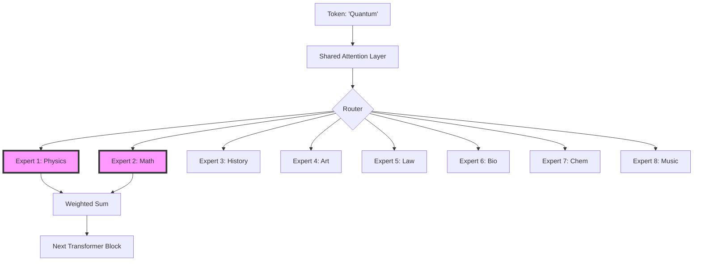

# 3.3 Case Study: Mixtral Architecture

## Version 1: A Peer's Guide to Mixtral

Alright, let's look at a real-world example. You've probably heard of **Mixtral 8x7B**. When you first see that name, you might think, "Is it 8 times 7 billion parameters? That's 56 billion parameters!" 

The answer is: **Yes and no.**

Mixtral is a "Sparse Mixture of Experts" model. While it has roughly 47 billion total parameters, it doesn't use all of them for every token. In fact, for any single word it processes, it only activates a small fraction of its total brain.

### The "8x7B" Secret

In a standard "dense" model, every token goes through every single parameter. But Mixtral is designed differently. It keeps the "shared" parts of the model—like the Attention layers (which handle how words relate to each other)—dense, but it turns the Feed-Forward Networks (the parts that store facts and knowledge) into experts.

In Mixtral 8x7B:
1. There are **8 experts** in each MoE layer.
2. The router picks the **Top-2 experts** for every token.
3. Because it only uses 2 out of 8 experts per token, the number of "active parameters" is much lower than the total 47B.

**Why do this?**
It's like having a team of 8 specialists. If the model is processing a sentence about "Quantum Physics," the router sends the token to the "Science" expert and the "Math" expert. If it's processing a "Python script," it sends it to the "Coding" expert and the "Logic" expert.

The result? Mixtral 8x7B performs as well as (or better than) much larger dense models (like Llama 2 70B) while being significantly faster and cheaper to run during inference.

### How it differs from a "Dense" Model

If you compared Mixtral to a dense 7B model, Mixtral is obviously smarter because it has way more total knowledge stored in its 8 experts. But if you compared it to a dense 47B model, Mixtral is much faster because it only does the math for a fraction of those parameters per token.

---

## Version 2: Technical Summary

### Mixtral 8x7B Architectural Analysis

Mixtral 8x7B is a sparse Mixture-of-Experts (MoE) model that demonstrates the efficiency of decoupling total parameter capacity from per-token compute requirements.

#### 1. Parameter Distribution
Mixtral utilizes a shared-attention architecture. While the self-attention mechanisms are dense (shared across all tokens), the Feed-Forward Networks (FFNs) are partitioned into $N=8$ independent experts. 
- **Total Parameters:** $\approx 46.7\text{B}$.
- **Active Parameters:** Per token, only 2 experts are activated, resulting in significantly lower FLOPs per token compared to a dense model of equivalent total size.

#### 2. Top-2 Routing Strategy
The model employs a Top-2 gating mechanism. For each token $x$, the router computes weights for all 8 experts and selects the two with the highest probability:
$$\mathbf{y} = \sum_{i=1}^{2} w_i \text{Expert}_i(x)$$
This redundancy (using 2 experts instead of 1) improves training stability and allows the model to blend knowledge from multiple specialized sub-networks.

#### 3. Performance Characteristics
Mixtral exhibits a "best of both worlds" performance profile:
- **Knowledge Capacity:** The total parameter count allows it to store a vast amount of factual information, comparable to dense models in the $70\text{B}+$ range.
- **Inference Throughput:** Because the active parameter count is low, the tokens-per-second (TPS) is closer to that of a $12\text{B}-20\text{B}$ dense model.
- **VRAM Requirement:** Despite low compute costs, the full $46.7\text{B}$ parameters must reside in VRAM for inference, making the memory footprint the primary bottleneck rather than compute.